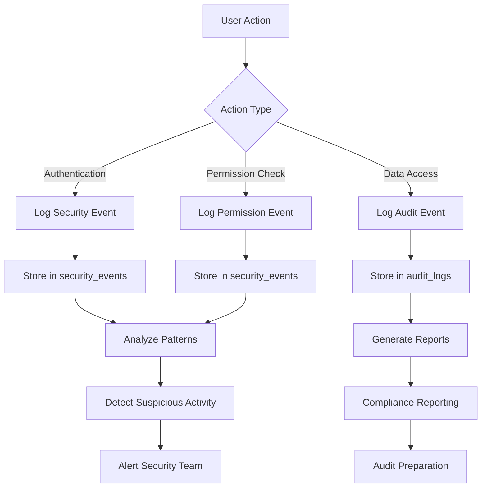
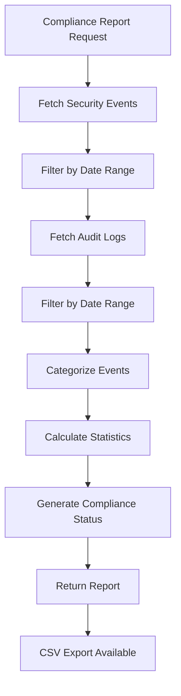

# Audit Logs API

<cite>
**Referenced Files in This Document**   
- [security.ts](file://src/lib/security.ts#L353-L420)
- [security_audit.ts](file://convex/security_audit.ts#L232-L240)
- [page.tsx](file://src/app/(dashboard)/denetim-kayitlari/page.tsx#L49-L65)
- [schema.ts](file://convex/schema.ts#L687-L721)
</cite>

## Table of Contents

1. [Introduction](#introduction)
2. [API Endpoint](#api-endpoint)
3. [Audit Log Structure](#audit-log-structure)
4. [Filtering Parameters](#filtering-parameters)
5. [Security Monitoring Integration](#security-monitoring-integration)
6. [Compliance Reporting](#compliance-reporting)
7. [Usage Examples](#usage-examples)
8. [Pagination and Performance](#pagination-and-performance)
9. [Error Handling](#error-handling)
10. [Conclusion](#conclusion)

## Introduction

The Audit Logs API provides comprehensive security and system activity monitoring for the application. This documentation details the GET /api/audit-logs endpoint, which enables retrieval of audit log entries with advanced filtering capabilities. The system is designed to meet strict compliance requirements including KVKK and GDPR, with immutable logs stored for 7 years. Audit logs capture critical system events, user actions, and security-related activities, providing essential visibility for security monitoring, incident investigation, and compliance auditing.

## API Endpoint

The GET /api/audit-logs endpoint retrieves audit log entries with support for filtering by various parameters including user, event type, date range, and severity level. The endpoint returns paginated results with metadata about the total count and current page. The API is integrated with the Convex backend and leverages the audit_logs collection for persistent storage of audit records.

**Section sources**

- [security.ts](file://src/lib/security.ts#L353-L420)
- [security_audit.ts](file://convex/security_audit.ts#L232-L240)

## Audit Log Structure

Audit log entries contain comprehensive information about system activities and security events. Each log entry includes the following fields:

| Field      | Type   | Description                                             |
| ---------- | ------ | ------------------------------------------------------- |
| id         | string | Unique identifier for the audit log entry               |
| userId     | string | ID of the user who performed the action                 |
| action     | string | Type of action performed (CREATE, UPDATE, DELETE, VIEW) |
| resource   | string | Type of resource affected by the action                 |
| resourceId | string | ID of the specific resource affected                    |
| changes    | object | Details of changes made, with before and after states   |
| ipAddress  | string | IP address from which the action was performed          |
| userAgent  | string | User agent string identifying the client device/browser |
| timestamp  | Date   | Timestamp when the action occurred                      |
| status     | string | Status of the action (success or failure)               |
| error      | string | Error message if the action failed                      |

The audit log structure is defined in the AuditLog interface and is used consistently across the application for logging system activities.

**Section sources**

- [security.ts](file://src/lib/security.ts#L353-L365)
- [page.tsx](<file://src/app/(dashboard)/denetim-kayitlari/page.tsx#L49-L65>)

## Filtering Parameters

The GET /api/audit-logs endpoint supports multiple filtering parameters to enable targeted retrieval of audit log entries:

| Parameter | Type   | Description                              | Example Values                       |
| --------- | ------ | ---------------------------------------- | ------------------------------------ |
| user      | string | Filter logs by user ID                   | "user_123"                           |
| eventType | string | Filter by event type                     | "login_attempt", "permission_denied" |
| severity  | string | Filter by severity level                 | "low", "medium", "high", "critical"  |
| startDate | string | Filter logs from this date (ISO format)  | "2023-01-01T00:00:00Z"               |
| endDate   | string | Filter logs up to this date (ISO format) | "2023-12-31T23:59:59Z"               |
| action    | string | Filter by action type                    | "CREATE", "UPDATE", "DELETE", "VIEW" |
| resource  | string | Filter by resource type                  | "user", "beneficiary", "donation"    |
| limit     | number | Maximum number of records to return      | 50, 100, 200                         |

These filtering parameters enable precise querying of audit logs for specific use cases such as security investigations, compliance audits, and operational monitoring.

**Section sources**

- [security_audit.ts](file://convex/security_audit.ts#L40-L70)
- [page.tsx](<file://src/app/(dashboard)/denetim-kayitlari/page.tsx#L77-L87>)

## Security Monitoring Integration

The audit logging system is tightly integrated with the application's security monitoring capabilities. Security events are logged to the security_events collection with detailed information including event type, user ID, IP address, user agent, and severity level. The system supports detection of suspicious activities such as multiple failed login attempts, access from multiple IP addresses, and repeated permission denials.

The security monitoring system uses the following event types:

- login_attempt
- login_success
- login_failure
- logout
- permission_denied
- suspicious_activity
- password_change
- 2fa_enabled
- 2fa_disabled
- data_access
- data_modification

Each security event is assigned a severity level (low, medium, high, critical) based on its potential impact, enabling prioritized response to security incidents.



**Diagram sources **

- [security_audit.ts](file://convex/security_audit.ts#L4-L37)
- [schema.ts](file://convex/schema.ts#L687-L721)

**Section sources**

- [security_audit.ts](file://convex/security_audit.ts#L4-L37)
- [schema.ts](file://convex/schema.ts#L687-L721)

## Compliance Reporting

The audit logging system supports comprehensive compliance reporting for regulatory requirements including KVKK and GDPR. The generateComplianceReport function creates detailed reports that include summary statistics, event breakdowns, and compliance status. The system ensures that all critical operations are logged and retained for 7 years as required by KVKK.

Compliance reports include:

- Total security events and audit logs in the specified period
- Count of critical and high-severity events
- Breakdown of events by type
- Compliance status for KVKK and GDPR
- Data retention period (7 years)

The system also provides CSV export functionality for audit logs, enabling offline analysis and reporting to regulatory bodies.



**Diagram sources **

- [security_audit.ts](file://convex/security_audit.ts#L214-L272)

**Section sources**

- [security_audit.ts](file://convex/security_audit.ts#L214-L272)
- [page.tsx](<file://src/app/(dashboard)/denetim-kayitlari/page.tsx#L171-L192>)

## Usage Examples

### Querying Failed Login Attempts

To retrieve failed login attempts for security investigation:

```http
GET /api/audit-logs?eventType=login_failure&severity=high&startDate=2023-01-01T00:00:00Z&endDate=2023-01-31T23:59:59Z
```

This query returns all high-severity login failure events from January 2023, which can be analyzed to detect potential brute force attacks or account compromise attempts.

### Tracking User Permission Changes

To monitor changes to user permissions:

```http
GET /api/audit-logs?resource=user&action=UPDATE&changes.permissions=true
```

This query identifies all updates to user records where permissions were modified, helping track privilege escalation and ensure least privilege principles.

### Generating Security Incident Reports

To create a comprehensive security incident report for a specific period:

```http
GET /api/audit-logs?severity=critical&startDate=2023-06-01T00:00:00Z&endDate=2023-06-30T23:59:59Z
```

This query retrieves all critical severity events from June 2023, which can be used to generate incident reports for security review and compliance purposes.

**Section sources**

- [security_audit.ts](file://convex/security_audit.ts#L40-L70)
- [page.tsx](<file://src/app/(dashboard)/denetim-kayitlari/page.tsx#L77-L87>)

## Pagination and Performance

The audit logs API implements pagination to handle large datasets efficiently. By default, the endpoint returns 100 records per page, with a configurable limit parameter to adjust the page size. The system uses Convex query optimization with appropriate indexes on the audit_logs collection to ensure fast retrieval of log entries.

For optimal performance when querying large datasets:

- Use specific date ranges to limit the search scope
- Apply filters to narrow down results
- Use appropriate limit values based on use case
- Leverage client-side caching for frequently accessed data

The frontend implementation uses React Query for efficient data fetching and caching, reducing the number of API calls and improving user experience.

**Section sources**

- [security.ts](file://src/lib/security.ts#L407-L415)
- [page.tsx](<file://src/app/(dashboard)/denetim-kayitlari/page.tsx#L77-L87>)

## Error Handling

The audit logs API includes comprehensive error handling for invalid filter parameters and other issues. When invalid parameters are provided, the API returns appropriate HTTP status codes and error messages to help clients correct their requests.

Common error scenarios and responses:

- Invalid date format: Returns 400 Bad Request with details about the expected format
- Invalid severity level: Returns 400 Bad Request with valid options
- Invalid action type: Returns 400 Bad Request with valid action types
- Database query failure: Returns 500 Internal Server Error with generic message

The system also includes client-side validation and error handling to provide user-friendly feedback when filtering operations fail.

**Section sources**

- [page.tsx](<file://src/app/(dashboard)/denetim-kayitlari/page.tsx#L89-L93>)
- [security.ts](file://src/lib/security.ts#L394-L405)

## Conclusion

The Audit Logs API provides a robust foundation for security monitoring, compliance reporting, and operational auditing. By capturing detailed information about system activities and security events, the API enables organizations to maintain accountability, detect suspicious activities, and meet regulatory requirements. The flexible filtering capabilities, integration with security monitoring systems, and support for compliance reporting make this API a critical component of the application's security architecture.
