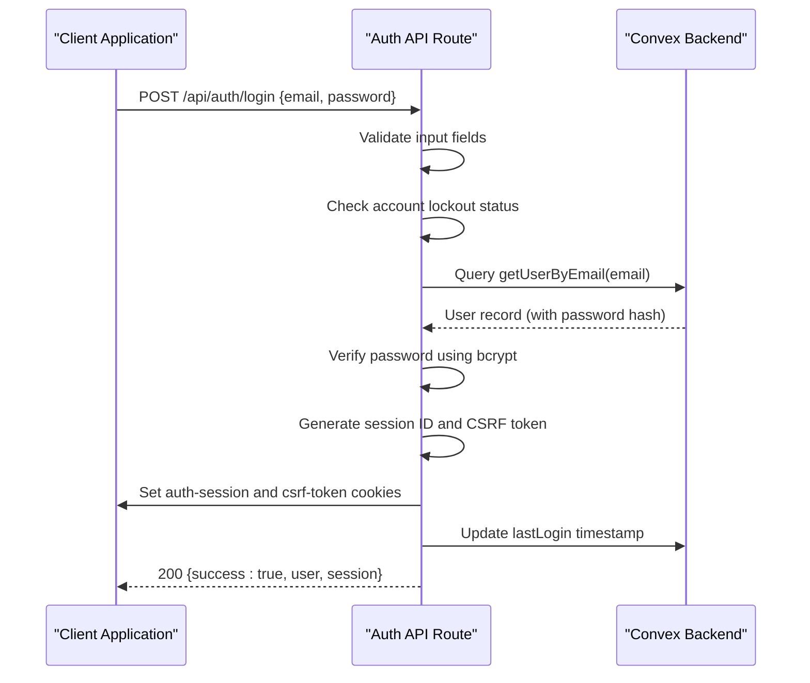
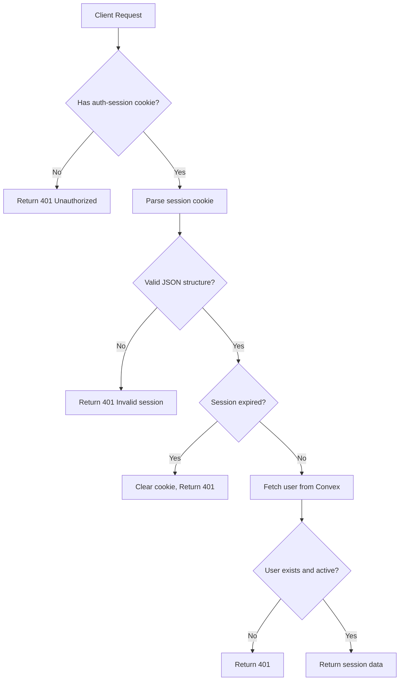
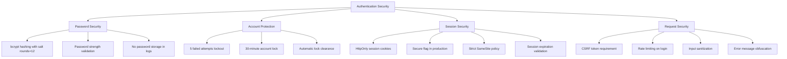

# Authentication API

<cite>
**Referenced Files in This Document**   
- [login/route.ts](file://src/app/api/auth/login/route.ts)
- [session/route.ts](file://src/app/api/auth/session/route.ts)
- [logout/route.ts](file://src/app/api/auth/logout/route.ts)
- [dev-login/route.ts](file://src/app/api/auth/dev-login/route.ts)
- [session.ts](file://src/lib/auth/session.ts)
- [password.ts](file://src/lib/auth/password.ts)
- [account-lockout.ts](file://src/lib/auth/account-lockout.ts)
- [auth.ts](file://convex/auth.ts)
- [auth.ts](file://src/types/auth.ts)
</cite>

## Table of Contents

1. [Introduction](#introduction)
2. [Authentication Endpoints](#authentication-endpoints)
   - [POST /api/auth/login](#post-apiauthlogin)
   - [GET /api/auth/session](#get-apiauthsession)
   - [POST /api/auth/logout](#post-apiauthlogout)
   - [GET /api/auth/dev-login](#get-apiauthdev-login)
3. [Authentication Flow](#authentication-flow)
4. [Session Management](#session-management)
5. [Security Considerations](#security-considerations)
6. [Error Handling](#error-handling)
7. [Role-Based Access Control](#role-based-access-control)
8. [Examples](#examples)

## Introduction

The Kafkasder-panel application implements a secure authentication system using Next.js API routes, Convex backend, and secure session management. This document details the authentication API endpoints, their request/response formats, security mechanisms, and integration patterns. The system supports CSRF protection, rate limiting, account lockout, and role-based access control.

## Authentication Endpoints

### POST /api/auth/login

Authenticates a user with email and password credentials and establishes a session.

**Request Body Schema**

```json
{
  "email": "string",
  "password": "string",
  "rememberMe": "boolean (optional)"
}
```

**Success Response (200)**

```json
{
  "success": true,
  "data": {
    "user": {
      "id": "string",
      "email": "string",
      "name": "string",
      "role": "string",
      "permissions": ["string"],
      "isActive": "boolean",
      "createdAt": "string",
      "updatedAt": "string",
      "phone": "string",
      "labels": ["string"]
    },
    "session": {
      "sessionId": "string",
      "expire": "string (ISO date)"
    }
  }
}
```

**Failure Responses**

- **400 Bad Request**: Missing email or password
- **401 Unauthorized**: Invalid credentials
- **403 Forbidden**: Inactive account
- **429 Too Many Requests**: Account temporarily locked

**Security Requirements**

- CSRF token required for subsequent requests
- Rate limiting applied (5 attempts per 15 minutes)
- Account lockout after 5 failed attempts (30-minute lock)
- Secure, HttpOnly cookies for session management

**Section sources**

- [login/route.ts](file://src/app/api/auth/login/route.ts#L17-L231)
- [account-lockout.ts](file://src/lib/auth/account-lockout.ts#L19-L24)
- [password.ts](file://src/lib/auth/password.ts#L19-L20)

### GET /api/auth/session

Retrieves the current user session information for client-side authentication state initialization.

**Success Response (200)**

```json
{
  "success": true,
  "data": {
    "userId": "string",
    "expiresAt": "string (ISO date)"
  }
}
```

**Failure Responses**

- **401 Unauthorized**: No active session or expired session

**Security Requirements**

- Validates session cookie expiration
- Returns minimal session data (no sensitive tokens)
- Automatic cleanup of expired sessions

**Section sources**

- [session/route.ts](file://src/app/api/auth/session/route.ts#L6-L64)
- [session.ts](file://src/lib/auth/session.ts#L8-L22)

### POST /api/auth/logout

Terminates the current user session by clearing authentication cookies.

**Success Response (200)**

```json
{
  "success": true,
  "message": "Successfully logged out"
}
```

**Security Requirements**

- Clears both session and CSRF tokens
- Sets cookies with maxAge=0 to expire immediately
- Graceful error handling to ensure logout completion

**Section sources**

- [logout/route.ts](file://src/app/api/auth/logout/route.ts#L6-L73)

### GET /api/auth/dev-login

Development-only endpoint to create a mock authentication session for testing purposes.

**Query Parameters**

- `user`: Mock user identifier (e.g., mock-admin-1, mock-manager-1)
- `redirect`: Optional URL to redirect after login

**Allowed Mock Users**

- mock-admin-1, mock-admin-2: Full administrative privileges
- mock-manager-1: Manager-level access
- mock-member-1: Member-level access
- mock-viewer-1: Viewer-only access

**Security Notes**

- Returns 404 in production environments
- Only available when NODE_ENV is not 'production'
- 24-hour session duration

**Section sources**

- [dev-login/route.ts](file://src/app/api/auth/dev-login/route.ts#L7-L98)

## Authentication Flow

The authentication process follows a secure flow integrating Next.js API routes with Convex backend services.



**Diagram sources**

- [login/route.ts](file://src/app/api/auth/login/route.ts#L23-L231)
- [auth.ts](file://convex/auth.ts#L34-L48)

## Session Management

The application uses secure cookie-based session management with server-side validation.



**Session Cookie Properties**

- Name: `auth-session`
- HttpOnly: true (not accessible via JavaScript)
- Secure: true (HTTPS only in production)
- SameSite: strict
- Max-Age: 24 hours (7 days if rememberMe)

**Section sources**

- [session.ts](file://src/lib/auth/session.ts#L8-L22)
- [session/route.ts](file://src/app/api/auth/session/route.ts#L9-L64)

## Security Considerations

The authentication system implements multiple security layers to protect against common threats.



**Diagram sources**

- [password.ts](file://src/lib/auth/password.ts#L8-L10)
- [account-lockout.ts](file://src/lib/auth/account-lockout.ts#L19-L24)
- [login/route.ts](file://src/app/api/auth/login/route.ts#L149-L170)

## Error Handling

The authentication API implements comprehensive error handling with appropriate HTTP status codes and user-friendly messages.

**Error Response Format**

```json
{
  "success": false,
  "error": "string",
  "locked": "boolean (optional)",
  "remainingSeconds": "number (optional)",
  "remainingAttempts": "number (optional)"
}
```

**Error Types and Codes**
| HTTP Status | Error Type | Response Properties | Description |
|-------------|------------|-------------------|-------------|
| 400 | Validation Error | error | Missing email or password |
| 401 | Authentication Failed | error, remainingAttempts | Invalid credentials |
| 403 | Forbidden | error | Inactive account |
| 429 | Rate Limited | error, locked, remainingSeconds | Account temporarily locked |
| 500 | Server Error | error | Unexpected server error |

**Logging Strategy**

- All authentication events are logged with relevant context
- Sensitive data (full email) is masked in logs
- Success and failure events are distinguished
- Endpoint and method are included in log context

**Section sources**

- [login/route.ts](file://src/app/api/auth/login/route.ts#L33-L57)
- [login/route.ts](file://src/app/api/auth/login/route.ts#L209-L228)

## Role-Based Access Control

The system implements role-based access control with permission propagation from Convex backend.

```mermaid
classDiagram
class AuthSession {
+string sessionId
+string userId
+string expire
}
class SessionUser {
+string id
+string email
+string name
+string role
+PermissionValue[] permissions
+boolean isActive
+string[] labels
}
class PermissionValue {
<<enumeration>>
BENEFICIARIES
AID_APPLICATIONS
DONATIONS
MESSAGES
USERS_MANAGE
REPORTS
FINANCE
SETTINGS
}
class RoleHierarchy {
<<enumeration>>
VIEWER
MEMBER
MANAGER
ADMIN
}
AuthSession --> SessionUser : "resolves to"
SessionUser --> PermissionValue : "has"
SessionUser --> RoleHierarchy : "has"
note right of SessionUser
Permissions are determined by :
1. Explicit user permissions
2. Role-based fallback rules
3. Special permission overrides
end note
```

**Permission Logic**

- ADMIN/BAŞKAN roles receive all module permissions and user management
- Explicit user permissions take precedence over role-based defaults
- Development mock users have predefined permission sets
- Permissions are validated on each request

**Section sources**

- [session.ts](file://src/lib/auth/session.ts#L76-L184)
- [auth.ts](file://convex/auth.ts#L9-L27)

## Examples

### Successful Authentication

```http
POST /api/auth/login HTTP/1.1
Content-Type: application/json

{
  "email": "admin@test.com",
  "password": "securePassword123",
  "rememberMe": true
}

HTTP/1.1 200 OK
Set-Cookie: auth-session=...; HttpOnly; Secure; SameSite=Strict
Set-Cookie: csrf-token=...; Secure; SameSite=Strict

{
  "success": true,
  "data": {
    "user": {
      "id": "user_123",
      "email": "admin@test.com",
      "name": "Dernek Başkanı",
      "role": "Dernek Başkanı",
      "permissions": ["BENEFICIARIES", "AID_APPLICATIONS", "..."],
      "isActive": true
    },
    "session": {
      "sessionId": "session_123",
      "expire": "2024-01-01T00:00:00.000Z"
    }
  }
}
```

### Failed Authentication (Invalid Credentials)

```http
POST /api/auth/login HTTP/1.1
Content-Type: application/json

{
  "email": "invalid@test.com",
  "password": "wrongpassword"
}

HTTP/1.1 401 Unauthorized

{
  "success": false,
  "error": "Invalid email or password",
  "remainingAttempts": 4
}
```

### Account Lockout

```http
POST /api/auth/login HTTP/1.1
Content-Type: application/json

{
  "email": "locked@test.com",
  "password": "wrongpassword"
}

HTTP/1.1 429 Too Many Requests

{
  "success": false,
  "error": "Account temporarily locked. 30 minutes remaining.",
  "locked": true,
  "remainingSeconds": 1745
}
```

### Development Login

```http
GET /api/auth/dev-login?user=mock-admin-1&redirect=/genel HTTP/1.1

HTTP/1.1 302 Found
Location: /genel
Set-Cookie: auth-session=...; HttpOnly; SameSite=Strict
Set-Cookie: csrf-token=...; SameSite=Strict
```

**Section sources**

- [login/route.ts](file://src/app/api/auth/login/route.ts#L198-L207)
- [dev-login/route.ts](file://src/app/api/auth/dev-login/route.ts#L84-L86)
