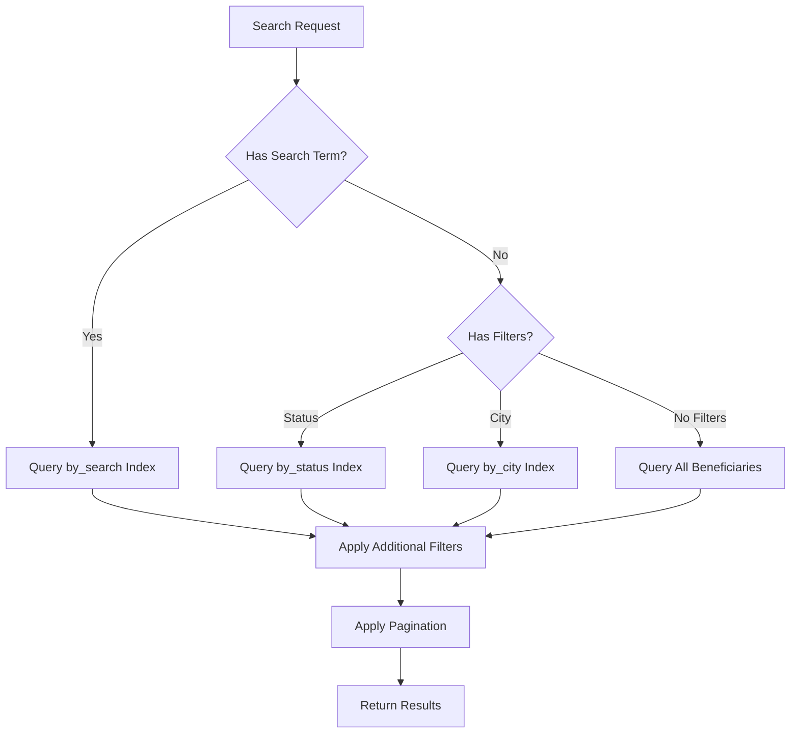

# Beneficiary Management API

<cite>
**Referenced Files in This Document**   
- [beneficiaries.ts](file://convex/beneficiaries.ts)
- [beneficiary.ts](file://src/types/beneficiary.ts)
- [beneficiary.ts](file://src/lib/validations/beneficiary.ts)
- [route.ts](file://src/app/api/beneficiaries/route.ts)
- [route.ts](file://src/app/api/beneficiaries/[id]/route.ts)
</cite>

## Table of Contents

1. [Introduction](#introduction)
2. [API Endpoints](#api-endpoints)
3. [Data Validation Rules](#data-validation-rules)
4. [Status Transitions](#status-transitions)
5. [Integration with Document Management](#integration-with-document-management)
6. [Search Functionality](#search-functionality)
7. [Error Handling](#error-handling)
8. [Common Operations](#common-operations)
9. [Request Payload Examples](#request-payload-examples)

## Introduction

The Beneficiary Management API provides comprehensive functionality for managing beneficiary records within the Kafkasder system. This API enables organizations to create, retrieve, update, and manage beneficiary information including personal details, family information, financial status, and health information. The system supports full CRUD operations with robust validation, search capabilities, and integration with document management systems.

**Section sources**

- [beneficiaries.ts](file://convex/beneficiaries.ts#L1-L229)
- [beneficiary.ts](file://src/types/beneficiary.ts#L1-L560)

## API Endpoints

### GET /api/beneficiaries

Retrieves a paginated list of beneficiaries with optional filtering, sorting, and search capabilities.

**Parameters**

- `limit` (number, optional): Number of records to return (default: 50)
- `skip` (number, optional): Number of records to skip for pagination
- `status` (string, optional): Filter by beneficiary status (TASLAK, AKTIF, PASIF, SILINDI)
- `city` (string, optional): Filter by city
- `search` (string, optional): Search term for full-text search on beneficiary name

**Response**

```json
{
  "success": true,
  "data": [
    {
      "id": "string",
      "name": "string",
      "tc_no": "string",
      "phone": "string",
      "address": "string",
      "city": "string",
      "status": "TASLAK | AKTIF | PASIF | SILINDI",
      "family_size": 1,
      "createdAt": "string",
      "updatedAt": "string"
    }
  ],
  "total": 0,
  "message": "string"
}
```

**Section sources**

- [beneficiaries.ts](file://convex/beneficiaries.ts#L6-L60)
- [route.ts](file://src/app/api/beneficiaries/route.ts#L81-L121)

### POST /api/beneficiaries

Creates a new beneficiary record with comprehensive personal, family, financial, and health information.

**Request Body**
The request body must contain all required fields and can include optional fields for complete beneficiary information.

**Response**

```json
{
  "success": true,
  "data": {
    "id": "string",
    "_creationTime": 1234567890
  },
  "message": "Beneficiary created successfully"
}
```

**Section sources**

- [beneficiaries.ts](file://convex/beneficiaries.ts#L89-L169)
- [route.ts](file://src/app/api/beneficiaries/route.ts#L124-L242)

### GET /api/beneficiaries/[id]

Retrieves detailed information about a specific beneficiary by ID.

**Parameters**

- `id` (path parameter): The unique identifier of the beneficiary

**Response**

```json
{
  "success": true,
  "data": {
    "id": "string",
    "name": "string",
    "tc_no": "string",
    "phone": "string",
    "email": "string",
    "birth_date": "string",
    "gender": "string",
    "nationality": "string",
    "religion": "string",
    "marital_status": "string",
    "address": "string",
    "city": "string",
    "district": "string",
    "neighborhood": "string",
    "family_size": 1,
    "children_count": 0,
    "orphan_children_count": 0,
    "elderly_count": 0,
    "disabled_count": 0,
    "income_level": "string",
    "income_source": "string",
    "has_debt": false,
    "housing_type": "string",
    "has_vehicle": false,
    "health_status": "string",
    "has_chronic_illness": false,
    "chronic_illness_detail": "string",
    "has_disability": false,
    "disability_detail": "string",
    "has_health_insurance": false,
    "regular_medication": "string",
    "education_level": "string",
    "occupation": "string",
    "employment_status": "string",
    "aid_type": "string",
    "totalAidAmount": 0,
    "aid_duration": "string",
    "priority": "string",
    "reference_name": "string",
    "reference_phone": "string",
    "reference_relation": "string",
    "application_source": "string",
    "notes": "string",
    "previous_aid": false,
    "other_organization_aid": false,
    "emergency": false,
    "contact_preference": "string",
    "status": "TASLAK | AKTIF | PASIF | SILINDI",
    "approval_status": "pending | approved | rejected",
    "approved_by": "string",
    "approved_at": "string",
    "createdAt": "string",
    "updatedAt": "string",
    "createdBy": "string",
    "updatedBy": "string"
  }
}
```

**Section sources**

- [beneficiaries.ts](file://convex/beneficiaries.ts#L63-L68)
- [route.ts](file://src/app/api/beneficiaries/[id]/route.ts#L71-L96)

### PUT /api/beneficiaries/[id]

Updates an existing beneficiary record with new information.

**Parameters**

- `id` (path parameter): The unique identifier of the beneficiary to update

**Request Body**
Partial beneficiary object with fields to update.

**Response**

```json
{
  "success": true,
  "data": {
    "id": "string",
    "name": "string",
    "tc_no": "string",
    "status": "TASLAK | AKTIF | PASIF | SILINDI",
    "updatedAt": "string"
  },
  "message": "Beneficiary updated successfully"
}
```

**Section sources**

- [beneficiaries.ts](file://convex/beneficiaries.ts#L172-L214)
- [route.ts](file://src/app/api/beneficiaries/[id]/route.ts#L117-L145)

## Data Validation Rules

### Required Fields

The following fields are required when creating a new beneficiary:

- `name`: Full name (minimum 2 characters)
- `tc_no`: TC identification number (11 digits, valid format)
- `phone`: Phone number (valid Turkish format)
- `address`: Address (minimum 10 characters)
- `city`: City of residence

### TC Number Validation

The TC identification number must:

- Be exactly 11 digits long
- Contain only numeric characters
- Pass the official Turkish government validation algorithm
- Not start with zero

### Personal Information Validation

- Name fields must be at least 2 characters and contain only letters and spaces
- Email must be in valid email format if provided
- Phone number must follow Turkish mobile format (05XX XXX XX XX)
- Date fields must be valid dates in the past

### Financial and Family Information

- Family size must be at least 1
- Income level must be one of the predefined categories
- All count fields (children, elderly, disabled) must be non-negative integers

**Section sources**

- [beneficiary.ts](file://src/lib/validations/beneficiary.ts#L37-L393)
- [route.ts](file://src/app/api/beneficiaries/route.ts#L42-L77)
- [route.ts](file://src/app/api/beneficiaries/[id]/route.ts#L11-L68)

## Status Transitions

Beneficiaries can have one of four status values that represent their lifecycle in the system:

### Status Values

- **TASLAK**: Draft status - Beneficiary record is being created or edited
- **AKTIF**: Active status - Beneficiary is eligible for assistance
- **PASIF**: Inactive status - Beneficiary is temporarily not receiving assistance
- **SILINDI**: Deleted status - Beneficiary record has been archived

### Transition Rules

- Records are created with status "TASLAK" by default
- Status can be updated to "AKTIF" when the beneficiary is approved
- "AKTIF" beneficiaries can be set to "PASIF" when assistance is paused
- Records can be marked as "SILINDI" to archive them without permanent deletion
- Status transitions are logged in the audit trail

**Section sources**

- [beneficiary.ts](file://src/types/beneficiary.ts#L169-L174)
- [beneficiaries.ts](file://convex/beneficiaries.ts#L138-L142)

## Integration with Document Management

The Beneficiary Management system integrates with the document management module to associate files with beneficiary records.

### Document Association

- Each beneficiary can have multiple documents attached
- Documents are stored in the Convex storage system
- Document metadata is linked to the beneficiary record
- Access to documents follows the same permission model as beneficiary records

### File Types Supported

- Identity documents (TC Kimlik, passport, etc.)
- Medical reports and health records
- Financial statements and income verification
- Family registration documents
- Application forms and consent forms

### Security Considerations

- All document access is authenticated and authorized
- Sensitive documents are encrypted at rest
- Document access is logged in the audit trail
- Users can only access documents for beneficiaries they have permission to view

**Section sources**

- [beneficiaries.ts](file://convex/beneficiaries.ts#L1-L229)
- [documents.ts](file://convex/documents.ts#L1-L200)

## Search Functionality

The API supports advanced search capabilities using Convex search indexes.

### Search Parameters

- **Text Search**: Full-text search on beneficiary name using `search` parameter
- **Filtering**: Filter results by status, city, or other attributes
- **Pagination**: Control result size and offset with `limit` and `skip` parameters
- **Combined Filters**: Apply multiple filters simultaneously

### Search Index

The system uses a Convex search index named "by_search" on the beneficiaries collection, specifically targeting the "name" field for efficient text search operations.

### Performance Considerations

- Search results are limited to 50 items by default
- Additional filtering is applied after the initial search query
- The system prioritizes search relevance while maintaining performance
- Complex queries are optimized through proper indexing



**Diagram sources**

- [beneficiaries.ts](file://convex/beneficiaries.ts#L18-L22)
- [beneficiaries.ts](file://convex/beneficiaries.ts#L24-L35)

**Section sources**

- [beneficiaries.ts](file://convex/beneficiaries.ts#L6-L60)

## Error Handling

### Common Error Responses

- **400 Bad Request**: Invalid input data or missing required fields
- **404 Not Found**: Beneficiary with specified ID does not exist
- **409 Conflict**: Duplicate TC identification number
- **422 Unprocessable Entity**: Data validation failed
- **500 Internal Server Error**: Server-side processing error

### Duplicate TC Number Handling

When attempting to create a beneficiary with a TC number that already exists in the system, the API returns a 409 Conflict status with the message "Beneficiary with this TC number already exists".

### Validation Error Structure

```json
{
  "success": false,
  "error": "Validation error",
  "details": [
    "Ad Soyad en az 2 karakter olmalıdır",
    "TC Kimlik No 11 haneli olmalıdır",
    "Geçerli bir telefon numarası giriniz"
  ]
}
```

### Error Logging

All API errors are logged with relevant context including:

- Endpoint URL
- HTTP method
- Beneficiary ID (when applicable)
- Timestamp
- User information (when authenticated)

**Section sources**

- [beneficiaries.ts](file://convex/beneficiaries.ts#L153-L163)
- [route.ts](file://src/app/api/beneficiaries/route.ts#L228-L234)
- [route.ts](file://src/app/api/beneficiaries/[id]/route.ts#L158-L163)

## Common Operations

### Creating a New Beneficiary

1. Collect all required beneficiary information
2. Validate TC identification number format
3. Check for existing beneficiary with same TC number
4. Submit POST request with complete payload
5. Handle success or error response appropriately

### Updating Beneficiary Information

1. Retrieve existing beneficiary record
2. Modify required fields
3. Validate changes (especially TC number if changed)
4. Submit PUT request with updated fields
5. Confirm successful update

### Searching and Filtering

1. Use query parameters to filter results
2. Apply search term for text-based search
3. Implement pagination for large result sets
4. Combine multiple filters for precise results

### Status Management

1. Retrieve beneficiary record
2. Determine appropriate status transition
3. Update status field accordingly
4. Document reason for status change in notes

**Section sources**

- [beneficiaries.ts](file://convex/beneficiaries.ts#L89-L214)
- [route.ts](file://src/app/api/beneficiaries/route.ts#L124-L242)
- [route.ts](file://src/app/api/beneficiaries/[id]/route.ts#L117-L145)

## Request Payload Examples

### Complete Beneficiary Creation Payload

```json
{
  "name": "Ahmet Yılmaz",
  "tc_no": "12345678901",
  "phone": "05551234567",
  "email": "ahmet.yilmaz@example.com",
  "birth_date": "1985-06-15",
  "gender": "ERKEK",
  "nationality": "TURKIYE",
  "religion": "MUSLUMAN",
  "marital_status": "EVLI",
  "address": "Atatürk Mahallesi, Cumhuriyet Caddesi No:45",
  "city": "ISTANBUL",
  "district": "Kadıköy",
  "neighborhood": "Caferağa",
  "family_size": 4,
  "children_count": 2,
  "orphan_children_count": 0,
  "elderly_count": 1,
  "disabled_count": 0,
  "income_level": "3000-5000",
  "income_source": "IS",
  "has_debt": true,
  "housing_type": "EV",
  "has_vehicle": false,
  "health_status": "chronic",
  "has_chronic_illness": true,
  "chronic_illness_detail": "Diyabet",
  "has_disability": false,
  "disability_detail": "",
  "has_health_insurance": true,
  "regular_medication": "Insulin",
  "education_level": "LISE",
  "occupation": "Mühendis",
  "employment_status": "CALISIYOR",
  "aid_type": "Nakit Yardım",
  "totalAidAmount": 2500,
  "aid_duration": "6 ay",
  "priority": "Yüksek",
  "reference_name": "Mehmet Yılmaz",
  "reference_phone": "05559876543",
  "reference_relation": "Kardeş",
  "application_source": "Sosyal Medya",
  "notes": "Aile ekonomik zorluklar yaşıyor",
  "previous_aid": false,
  "other_organization_aid": false,
  "emergency": false,
  "contact_preference": "Telefon",
  "status": "AKTIF",
  "approval_status": "approved",
  "approved_by": "admin_user",
  "approved_at": "2025-01-15T10:30:00Z"
}
```

### Minimal Beneficiary Creation Payload

```json
{
  "name": "Ayşe Demir",
  "tc_no": "98765432109",
  "phone": "05559876543",
  "address": "Merkez Mahallesi, Cumhuriyet Caddesi No:12",
  "city": "ANKARA",
  "district": "Çankaya",
  "neighborhood": "Kavaklıdere",
  "family_size": 1,
  "status": "TASLAK"
}
```

### Beneficiary Update Payload

```json
{
  "status": "AKTIF",
  "phone": "05551112233",
  "notes": "Güncel iletişim bilgisi. Yardım başvurusu onaylandı.",
  "totalAidAmount": 3000,
  "aid_duration": "12 ay"
}
```

**Section sources**

- [beneficiary.ts](file://src/types/beneficiary.ts#L392-L506)
- [beneficiaries.ts](file://convex/beneficiaries.ts#L92-L149)
- [route.ts](file://src/app/api/beneficiaries/route.ts#L151-L202)
