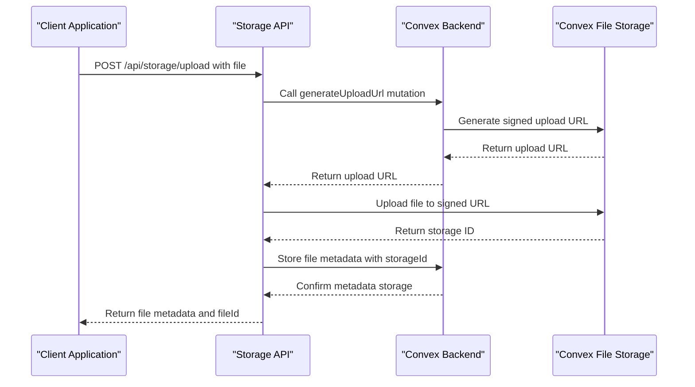
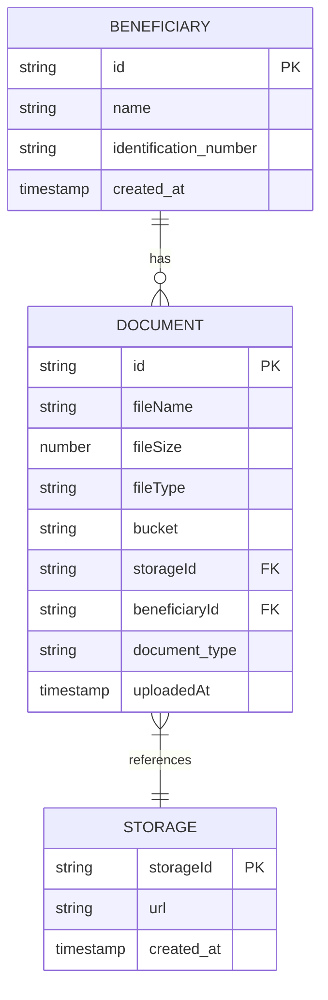

# File Storage API

<cite>
**Referenced Files in This Document**   
- [storage.ts](file://convex/storage.ts)
- [upload/route.ts](file://src/app/api/storage/upload/route.ts)
- [\[fileId\]/route.ts](file://src/app/api/storage/[fileId]/route.ts)
- [FileUpload.tsx](file://src/components/FileUpload.tsx)
- [DocumentsManager.tsx](file://src/components/documents/DocumentsManager.tsx)
</cite>

## Table of Contents

1. [Introduction](#introduction)
2. [File Upload Endpoint](#file-upload-endpoint)
3. [File Retrieval Endpoint](#file-retrieval-endpoint)
4. [File Deletion Endpoint](#file-deletion-endpoint)
5. [Convex Storage Integration](#convex-storage-integration)
6. [Access Level Controls](#access-level-controls)
7. [Beneficiary Document Management](#beneficiary-document-management)
8. [Error Handling](#error-handling)
9. [Usage Examples](#usage-examples)

## Introduction

The File Storage API provides secure file management capabilities for the organization's document management system. Built on Convex file storage, this API enables uploading, retrieving, and deleting files with comprehensive metadata tracking and access controls. The system is specifically designed to handle beneficiary-related documents with proper categorization and security measures.

**Section sources**

- [storage.ts](file://convex/storage.ts#L1-L235)
- [upload/route.ts](file://src/app/api/storage/upload/route.ts#L1-L98)

## File Upload Endpoint

The POST /api/storage/upload endpoint handles file uploads using multipart form data. This endpoint processes files and stores them in Convex file storage with associated metadata.

### Request Parameters

The endpoint accepts the following form data fields:

| Field         | Type   | Required | Description                                    |
| ------------- | ------ | -------- | ---------------------------------------------- |
| file          | File   | Yes      | The file to upload (image, PDF, or document)   |
| bucket        | String | No       | Storage bucket/category (default: "documents") |
| beneficiaryId | String | No       | Associated beneficiary ID for document linking |
| documentType  | String | No       | Document category/type (default: "other")      |

### Validation Rules

The API enforces the following validation rules:

- Maximum file size: 10MB
- Allowed file types: JPEG, PNG, WebP images, PDF, DOC, and DOCX documents
- Required file field in the request

### Response Format

Upon successful upload, the API returns a JSON response with file metadata:

```json
{
  "success": true,
  "data": {
    "fileId": "string",
    "fileName": "string",
    "fileSize": "number",
    "fileType": "string"
  }
}
```

The fileId corresponds to the Convex storage ID, which is used for subsequent retrieval and deletion operations.

**Section sources**

- [upload/route.ts](file://src/app/api/storage/upload/route.ts#L5-L95)
- [storage.ts](file://convex/storage.ts#L8-L14)

## File Retrieval Endpoint

The GET /api/storage/[fileId] endpoint retrieves files from storage by redirecting to the actual file URL.

### Request Parameters

The endpoint takes the fileId as a path parameter:

- GET /api/storage/{fileId}

### Response Behavior

The endpoint performs the following actions:

1. Validates the existence of the file with the given storageId
2. Retrieves the file URL from Convex storage
3. Redirects the client to the file URL with a 302 status code

This approach ensures secure access to files while leveraging Convex's built-in URL generation and access controls.

### Error Responses

The endpoint returns appropriate error codes:

- 404: File not found
- 500: File URL could not be retrieved

**Section sources**

- [\[fileId\]/route.ts](file://src/app/api/storage/[fileId]/route.ts#L6-L31)
- [storage.ts](file://convex/storage.ts#L45-L51)

## File Deletion Endpoint

The DELETE /api/storage/[fileId] endpoint removes files from the system.

### Request Parameters

The endpoint takes the fileId as a path parameter:

- DELETE /api/storage/{fileId}

### Deletion Process

The deletion process involves two steps:

1. Removing the document metadata from the database
2. Deleting the actual file from Convex storage

The endpoint uses the deleteDocument mutation to handle both operations atomically.

### Response Format

On successful deletion, the API returns:

```json
{
  "success": true
}
```

### Error Handling

The endpoint handles various error scenarios:

- 404: Document not found
- 500: Deletion failed

**Section sources**

- [\[fileId\]/route.ts](file://src/app/api/storage/[fileId]/route.ts#L34-L51)
- [storage.ts](file://convex/storage.ts#L56-L63)

## Convex Storage Integration

The File Storage API integrates with Convex's file storage system through a well-defined architecture.

### Architecture Flow



**Diagram sources**

- [storage.ts](file://convex/storage.ts#L8-L14)
- [upload/route.ts](file://src/app/api/storage/upload/route.ts#L49-L65)

### Key Integration Points

The integration leverages several Convex features:

- **Signed URLs**: Temporary URLs for secure file uploads
- **Storage ID**: Unique identifiers for file references
- **Metadata Storage**: Database records linked to stored files
- **Access Controls**: Built-in security for file operations

The system uses Convex actions and mutations to coordinate between file storage and database operations, ensuring data consistency.

**Section sources**

- [storage.ts](file://convex/storage.ts#L1-L235)
- [upload/route.ts](file://src/app/api/storage/upload/route.ts#L47-L65)

## Access Level Controls

The file storage system implements access level controls to manage document visibility and permissions.

### Access Levels

The system supports three access levels:

- **Public**: Documents accessible to all authenticated users
- **Private**: Documents accessible only to the uploader and administrators
- **Restricted**: Documents accessible to specific user roles or teams

### Implementation

Access controls are implemented through:

1. **Bucket-based organization**: Files are organized into buckets that correspond to access levels
2. **Metadata tagging**: Access level information stored with file metadata
3. **Permission checks**: Server-side validation of user permissions before file operations

The current implementation uses the bucket parameter to determine the storage location and access rules, with different buckets having different permission requirements.

**Section sources**

- [storage.ts](file://convex/storage.ts#L21-L26)
- [upload/route.ts](file://src/app/api/storage/upload/route.ts#L9-L11)

## Beneficiary Document Management

The file storage system is tightly integrated with beneficiary document management.

### Relationship Structure



**Diagram sources**

- [storage.ts](file://convex/storage.ts#L21-L38)
- [upload/route.ts](file://src/app/api/storage/upload/route.ts#L10-L11)

### Document Linking

When uploading beneficiary documents:

1. The beneficiaryId is included in the form data
2. The system creates a document record linked to the beneficiary
3. Metadata includes document type for categorization

This linking enables efficient retrieval of all documents associated with a specific beneficiary through the documents manager interface.

**Section sources**

- [upload/route.ts](file://src/app/api/storage/upload/route.ts#L10-L11)
- [DocumentsManager.tsx](file://src/components/documents/DocumentsManager.tsx#L85-L87)

## Error Handling

The File Storage API implements comprehensive error handling for various scenarios.

### Common Error Scenarios

| Error Type         | HTTP Status | Error Message                                                            | Cause                               |
| ------------------ | ----------- | ------------------------------------------------------------------------ | ----------------------------------- |
| Missing File       | 400         | "Dosya bulunamadı"                                                       | No file provided in request         |
| File Size Exceeded | 400         | "Dosya boyutu çok büyük. Maksimum 10MB olabilir."                        | File exceeds 10MB limit             |
| Invalid File Type  | 400         | "Desteklenmeyen dosya türü. Sadece resim ve PDF dosyaları kabul edilir." | File type not in allowed list       |
| Upload Failure     | 500         | "Dosya yükleme hatası"                                                   | Internal server error during upload |
| File Not Found     | 404         | "Dosya bulunamadı"                                                       | Invalid or non-existent fileId      |

### Error Response Format

All errors follow a consistent JSON format:

```json
{
  "error": "Error message in Turkish"
}
```

The system logs all errors for monitoring and debugging purposes while returning user-friendly messages to the client.

**Section sources**

- [upload/route.ts](file://src/app/api/storage/upload/route.ts#L13-L25)
- [\[fileId\]/route.ts](file://src/app/api/storage/[fileId]/route.ts#L19-L20)

## Usage Examples

The following examples demonstrate common use cases for the File Storage API.

### Uploading Beneficiary Identification Documents

```javascript
// Example: Uploading an ID document for a beneficiary
const formData = new FormData();
formData.append('file', idDocumentFile);
formData.append('bucket', 'documents');
formData.append('beneficiaryId', 'beneficiary_123');
formData.append('documentType', 'identification');

fetch('/api/storage/upload', {
  method: 'POST',
  body: formData,
})
  .then((response) => response.json())
  .then((data) => {
    console.log('Document uploaded successfully:', data.data.fileId);
  })
  .catch((error) => {
    console.error('Upload failed:', error);
  });
```

### Setting Access Permissions

```javascript
// Example: Uploading a private document
const formData = new FormData();
formData.append('file', sensitiveDocument);
formData.append('bucket', 'private_documents'); // Private bucket
formData.append('beneficiaryId', 'beneficiary_123');
formData.append('documentType', 'medical_records');

fetch('/api/storage/upload', {
  method: 'POST',
  body: formData,
});
```

### Retrieving File Information for Display

```javascript
// Example: Using DocumentsManager component
function BeneficiaryDocuments({ beneficiaryId }) {
  return <DocumentsManager beneficiaryId={beneficiaryId} />;
}
```

The DocumentsManager component handles file listing, upload, download, and deletion operations with a user-friendly interface, automatically managing the API calls and displaying file information including name, size, upload date, and action buttons.

**Section sources**

- [DocumentsManager.tsx](file://src/components/documents/DocumentsManager.tsx#L77-L105)
- [FileUpload.tsx](file://src/components/FileUpload.tsx#L89-L112)
