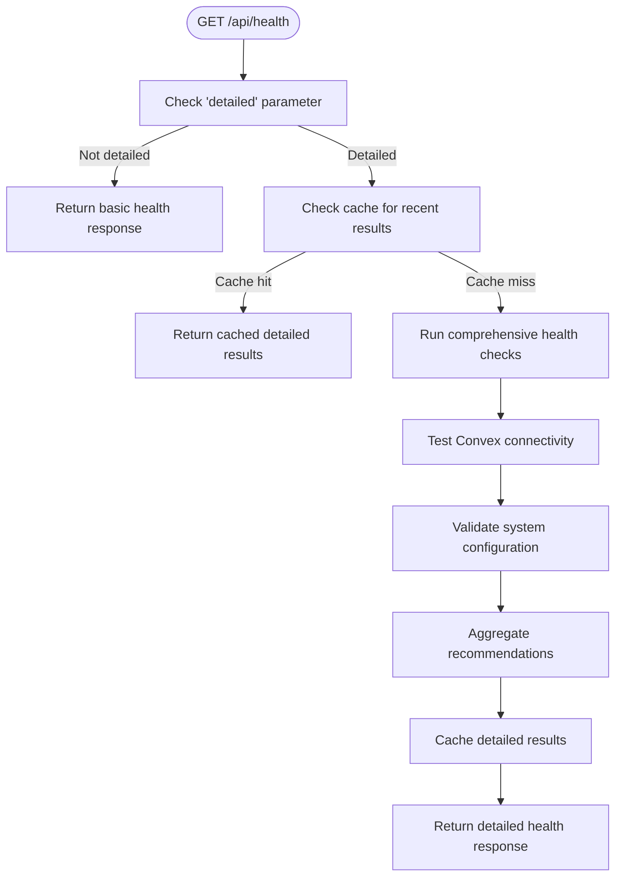
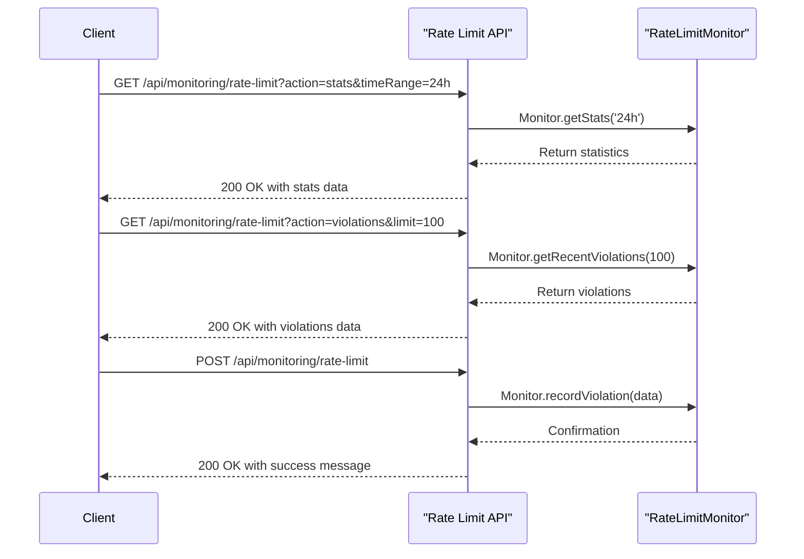
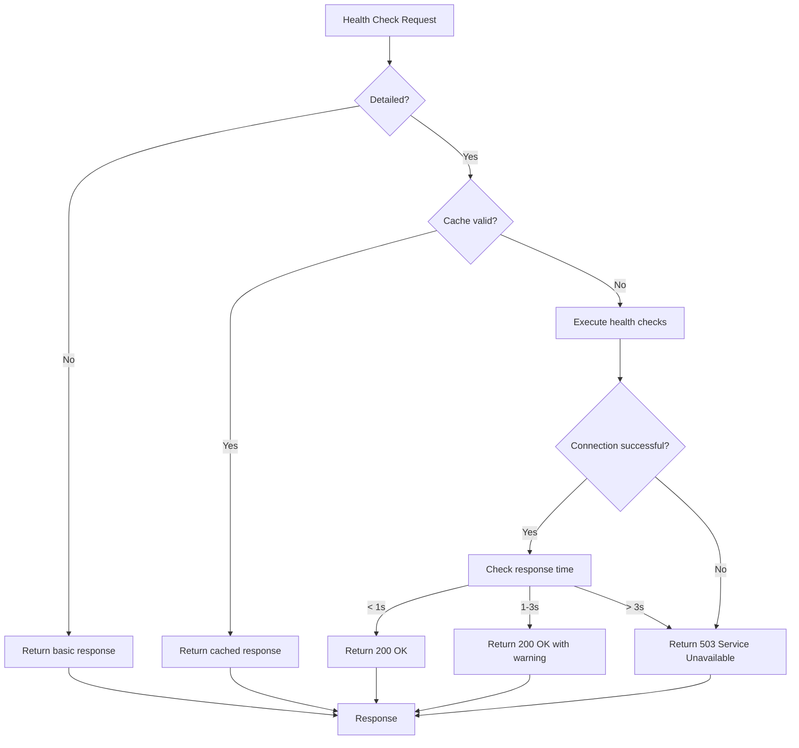
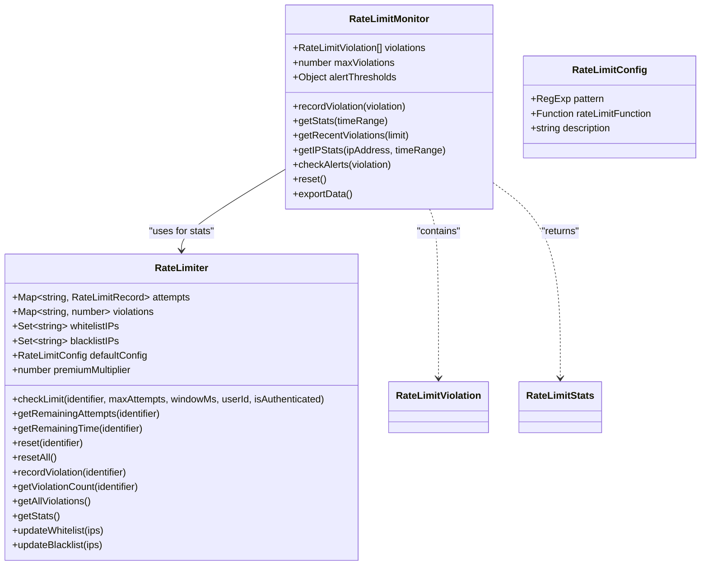
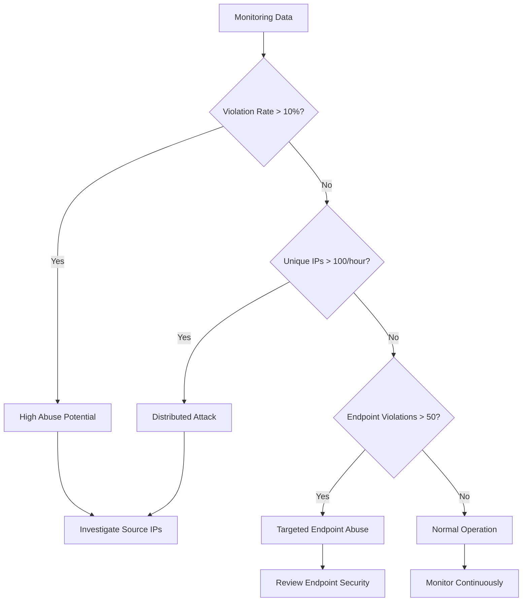

# Health Monitoring API

<cite>
**Referenced Files in This Document**   
- [health\route.ts](file://src/app/api/health/route.ts)
- [monitoring\rate-limit\route.ts](file://src/app/api/monitoring/rate-limit/route.ts)
- [monitoring.ts](file://convex/monitoring.ts)
- [rate-limit-monitor.ts](file://src/lib/rate-limit-monitor.ts)
- [security.ts](file://src/lib/security.ts)
</cite>

## Table of Contents

1. [Introduction](#introduction)
2. [Health Check Endpoint](#health-check-endpoint)
3. [Rate Limit Monitoring Endpoint](#rate-limit-monitoring-endpoint)
4. [System Monitoring Integration](#system-monitoring-integration)
5. [Response Examples](#response-examples)
6. [Performance and Error Handling](#performance-and-error-handling)
7. [Rate Limiting Implementation](#rate-limiting-implementation)
8. [Monitoring Data Interpretation](#monitoring-data-interpretation)

## Introduction

The Health Monitoring API provides endpoints for system health checks and rate limiting statistics. The API enables monitoring of system components including database connectivity, storage availability, and service status. It also provides comprehensive rate limiting monitoring capabilities to detect potential abuse or performance issues. The endpoints are designed to support both operational monitoring and diagnostic troubleshooting.

## Health Check Endpoint

The GET /api/health endpoint performs comprehensive system health checks, validating configuration, connectivity, and service status. The endpoint supports both basic and detailed health checks through the 'detailed' query parameter.

The health check evaluates:

- Backend provider configuration (Convex)
- Convex URL configuration
- Database connectivity through user query test
- System configuration validation

For detailed checks, the endpoint returns comprehensive reports on validation and connectivity, including recommendations for resolving issues. The detailed results are cached for 30 seconds to reduce system load.



**Diagram sources**

- [health\route.ts](file://src/app/api/health/route.ts#L1-L188)

**Section sources**

- [health\route.ts](file://src/app/api/health/rate.ts#L1-L188)

## Rate Limit Monitoring Endpoint

The GET /api/monitoring/rate-limit endpoint provides access to rate limiting statistics and configuration. The endpoint supports multiple actions through the 'action' query parameter, enabling retrieval of different types of monitoring data.

Available actions include:

- stats: Get overall rate limiting statistics for specified time range (1h, 24h, 7d, 30d)
- violations: Get recent rate limit violations with configurable limit
- ip-stats: Get IP-specific statistics with IP address parameter
- export: Export all monitoring data as JSON file
- reset: Reset monitoring data (admin only with Bearer token)

The endpoint also supports POST requests for additional monitoring actions including recording test violations and bulk export of data.



**Diagram sources**

- [monitoring\rate-limit\route.ts](file://src/app/api/monitoring/rate-limit/route.ts#L1-L196)

**Section sources**

- [monitoring\rate-limit\route.ts](file://src/app/api/monitoring/rate-limit/route.ts#L1-L196)

## System Monitoring Integration

The system integrates with monitoring tools through the Convex backend and alerting mechanisms. Health checks are coordinated between frontend and backend components, with the frontend health endpoint calling the backend healthCheck query.

The monitoring system includes:

- Active alert management with createAlert, getActiveAlerts, and acknowledgeAlert mutations
- Error logging and tracking with logError and getErrorLogs functions
- Performance metric collection and analysis
- System statistics dashboard with collection counts and alert status

Alerts are created for various conditions including errors, performance issues, security concerns, and system events. Alerts have severity levels (low, medium, high, critical) and can be acknowledged and resolved through the API.

```mermaid
erDiagram
system_alerts {
string alert_type PK
string severity
string title
string description
any metadata
string created_at
boolean acknowledged
Id users acknowledged_by
string acknowledged_at
boolean resolved
}
error_logs {
Id error_logs PK
string error_type
string error_message
string stack_trace
Id users user_id
any context
string occurred_at
boolean resolved
Id users resolved_by
string resolved_at
string resolution
}
performance_metrics {
Id performance_metrics PK
string metric_type
string metric_name
number value
string unit
any metadata
string recorded_at
}
system_alerts ||--o{ error_logs : "references"
system_alerts }|--|| users : "created_by"
error_logs }|--|| users : "reported_by"
```

**Diagram sources**

- [monitoring.ts](file://convex/monitoring.ts#L1-L354)

**Section sources**

- [monitoring.ts](file://convex/monitoring.ts#L1-L354)

## Response Examples

### Health Check Responses

**Operational State Response (200 OK):**

```json
{
  "ok": true,
  "provider": "convex",
  "convex": {
    "url": true,
    "configured": true
  },
  "timestamp": "2024-01-15T10:30:00.000Z",
  "readyForProduction": true,
  "validation": {
    "summary": {
      "errors": 0,
      "warnings": 0
    },
    "errors": [],
    "warnings": []
  },
  "connectivity": {
    "summary": {
      "overallHealth": 100,
      "passedTests": 1,
      "failedTests": 0
    },
    "tests": [
      {
        "name": "Convex Connection",
        "passed": true,
        "responseTime": 150,
        "message": "Connected in 150ms"
      }
    ],
    "recommendations": []
  },
  "recommendations": []
}
```

**Degraded State Response (503 Service Unavailable):**

```json
{
  "ok": true,
  "provider": "convex",
  "convex": {
    "url": true,
    "configured": true
  },
  "timestamp": "2024-01-15T10:30:00.000Z",
  "readyForProduction": true,
  "validation": {
    "summary": {
      "errors": 0,
      "warnings": 0
    },
    "errors": [],
    "warnings": []
  },
  "connectivity": {
    "summary": {
      "overallHealth": 25,
      "passedTests": 0,
      "failedTests": 1
    },
    "tests": [
      {
        "name": "Convex Connection",
        "passed": false,
        "message": "Connection timeout after 5000ms"
      }
    ],
    "recommendations": ["Convex connection is slow"]
  },
  "recommendations": ["Convex connection is slow"],
  "connectivityError": "Connection timeout after 5000ms"
}
```

### Rate Limit Monitoring Responses

**Statistics Response:**

```json
{
  "success": true,
  "data": {
    "totalRequests": 15000,
    "blockedRequests": 45,
    "violationRate": 0.003,
    "topViolators": [
      {
        "identifier": "192.168.1.100-POST-/api/donations",
        "violations": 15,
        "lastViolation": "2024-01-15T10:25:30.000Z"
      }
    ],
    "endpointStats": [
      {
        "endpoint": "/api/donations",
        "requests": 3000,
        "violations": 15,
        "violationRate": 0.005
      }
    ],
    "activeLimits": 25,
    "whitelistedIPs": 3,
    "blacklistedIPs": 1
  },
  "timestamp": "2024-01-15T10:30:00.000Z"
}
```

**IP Statistics Response:**

```json
{
  "success": true,
  "data": {
    "ip": "192.168.1.100",
    "stats": {
      "violations": [
        {
          "id": "uuid-123",
          "timestamp": "2024-01-15T10:25:30.000Z",
          "identifier": "192.168.1.100-POST-/api/donations",
          "ipAddress": "192.168.1.100",
          "endpoint": "/api/donations",
          "method": "POST",
          "attempts": 101,
          "maxAllowed": 100,
          "windowMs": 900000,
          "isAuthenticated": false,
          "violationType": "limit_exceeded"
        }
      ],
      "totalRequests": 150,
      "violationRate": 0.1
    },
    "timeRange": "24h"
  },
  "timestamp": "2024-01-15T10:30:00.000Z"
}
```

**Section sources**

- [health\route.ts](file://src/app/api/health/route.ts#L1-L188)
- [monitoring\rate-limit\route.ts](file://src/app/api/monitoring/rate-limit/route.ts#L1-L196)

## Performance and Error Handling

The health check endpoint has expected response times of under 1 second for operational systems. The endpoint uses a 30-second cache for detailed checks to prevent excessive load on system resources. Basic health checks (without the 'detailed' parameter) are not cached and respond immediately.

For service dependencies, the health check evaluates Convex connectivity by querying the users collection. If the connection fails or response time exceeds 3 seconds, the system is considered degraded. The endpoint returns a 503 Service Unavailable status code for degraded systems.

Error handling includes:

- Comprehensive error logging with context
- Graceful degradation when dependencies fail
- Detailed error messages in validation reports
- Status code mapping (200 for healthy, 503 for degraded)

The rate limit monitoring endpoint handles errors by returning appropriate HTTP status codes:

- 400 Bad Request for invalid parameters
- 401 Unauthorized for missing or invalid admin tokens
- 500 Internal Server Error for processing failures



**Diagram sources**

- [health\route.ts](file://src/app/api/health/route.ts#L1-L188)

**Section sources**

- [health\route.ts](file://src/app/api/health/route.ts#L1-L188)

## Rate Limiting Implementation

The rate limiting system is implemented using a token bucket algorithm with configurable limits based on endpoint patterns. The implementation is split across multiple components:

- **RateLimiter class**: Core rate limiting logic with in-memory tracking of requests
- **RateLimitMonitor class**: Monitoring and statistics collection for rate limit violations
- **rate-limit-config.ts**: Configuration management for different endpoint rate limits
- **rate-limit.ts**: Middleware for applying rate limits to API routes

Key features of the implementation:

- Whitelist and blacklist support via environment variables
- Configurable default limits (100 requests per 15 minutes)
- Premium multiplier for authenticated users (2.0x by default)
- In-memory storage of request attempts and violations
- Support for skipping rate limiting for whitelisted IPs

The rate limiting is not applied to health check endpoints to prevent self-blocking during monitoring.



**Diagram sources**

- [security.ts](file://src/lib/security.ts#L78-L280)
- [rate-limit-monitor.ts](file://src/lib/rate-limit-monitor.ts#L42-L303)

**Section sources**

- [security.ts](file://src/lib/security.ts#L78-L280)
- [rate-limit-monitor.ts](file://src/lib/rate-limit-monitor.ts#L1-L303)

## Monitoring Data Interpretation

Rate limit monitoring data provides insights into system usage patterns and potential abuse. The data can be interpreted to detect various conditions:

**Normal Operation Indicators:**

- Low violation rate (< 1%)
- Consistent request patterns
- Few unique violating IPs
- Even distribution across endpoints

**Potential Abuse Indicators:**

- High violation rate (> 5%)
- Single IP generating multiple violations
- Concentrated violations on specific endpoints
- Rapid succession of violation attempts

The monitoring system tracks several key metrics:

- Total requests and blocked requests
- Violation rate (percentage of blocked requests)
- Top violators by identifier
- Endpoint-specific violation statistics
- Active rate limits and IP lists

Alert thresholds are configured to detect:

- High violation rates (> 10% in 1 hour)
- Excessive number of violating IPs (> 100 per hour)
- High violation counts on specific endpoints (> 50)

The data can be used to identify:

- Malicious bots or scrapers
- Misconfigured clients
- Performance bottlenecks
- Security threats



**Section sources**

- [rate-limit-monitor.ts](file://src/lib/rate-limit-monitor.ts#L1-L303)
- [security.ts](file://src/lib/security.ts#L78-L280)
