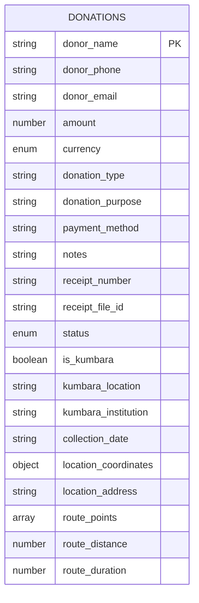
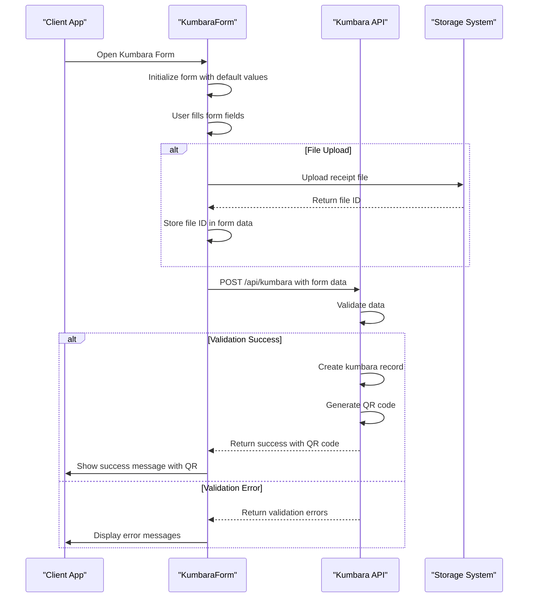

# Kumbara API

<cite>
**Referenced Files in This Document**   
- [kumbara.ts](file://src/lib/validations/kumbara.ts)
- [route.ts](file://src/app/api/kumbara/route.ts)
- [route.ts](file://src/app/api/kumbara/[id]/route.ts)
- [schema.ts](file://convex/schema.ts)
- [KumbaraForm.tsx](file://src/components/kumbara/KumbaraForm.tsx)
- [KumbaraList.tsx](file://src/components/kumbara/KumbaraList.tsx)
</cite>

## Table of Contents

1. [Introduction](#introduction)
2. [API Endpoints](#api-endpoints)
3. [Data Model](#data-model)
4. [Validation Rules](#validation-rules)
5. [Error Handling](#error-handling)
6. [Integration with Donation Transactions](#integration-with-donation-transactions)
7. [Examples](#examples)
8. [Client Implementation](#client-implementation)

## Introduction

The Kumbara API provides endpoints for managing money box (kumbara) donation locations and their collection status. This API enables organizations to register new kumbara locations, retrieve existing records with filtering capabilities, update collection information, and integrate with the broader donation system. The API supports route optimization data submission and automatic donation creation upon collection.

The system is designed to track kumbara donations as a special type of donation within the organization's financial records, with specific fields for location, institution, collection date, and GPS coordinates. The API integrates with the organization's storage system for receipt management and generates QR codes for each registered kumbara.

**Section sources**

- [kumbara.ts](file://src/lib/validations/kumbara.ts#L1-L218)
- [schema.ts](file://convex/schema.ts#L181-L210)

## API Endpoints

### GET /api/kumbara

Retrieves a paginated list of all kumbara locations with their collection status. Supports filtering by location, institution, collection date, currency, and status.

**Query Parameters:**

- `location` (string, optional): Filter by kumbara location
- `status` (string, optional): Filter by status ('pending', 'completed', 'cancelled')
- `currency` (string, optional): Filter by currency ('TRY', 'USD', 'EUR')
- `startDate` (string, optional): Filter by minimum collection date (ISO format)
- `endDate` (string, optional): Filter by maximum collection date (ISO format)
- `search` (string, optional): Search term for donor name, location, institution, or receipt number
- `page` (string, optional): Page number (default: 1)
- `limit` (string, optional): Number of records per page (1-100, default: 20)

**Response:**

```json
{
  "success": true,
  "donations": [
    {
      "_id": "string",
      "donor_name": "string",
      "donor_phone": "string",
      "amount": number,
      "currency": "TRY|USD|EUR",
      "kumbara_location": "string",
      "kumbara_institution": "string",
      "collection_date": "string",
      "status": "pending|completed|cancelled",
      "created_at": "string",
      "receipt_number": "string",
      "location_coordinates": {
        "lat": number,
        "lng": number
      },
      "location_address": "string",
      "route_points": [
        {
          "lat": number,
          "lng": number,
          "address": "string"
        }
      ],
      "route_distance": number,
      "route_duration": number
    }
  ],
  "pagination": {
    "page": number,
    "limit": number,
    "total": number,
    "totalPages": number
  }
}
```

**Section sources**

- [route.ts](file://src/app/api/kumbara/route.ts#L165-L273)

### POST /api/kumbara

Registers a new kumbara location with collection details and optional route planning data.

**Request Body:**

```json
{
  "donor_name": "string",
  "donor_phone": "string",
  "donor_email": "string",
  "amount": number,
  "currency": "TRY|USD|EUR",
  "donation_type": "string",
  "donation_purpose": "string",
  "payment_method": "string",
  "notes": "string",
  "receipt_number": "string",
  "receipt_file_id": "string",
  "status": "pending|completed|cancelled",
  "kumbara_location": "string",
  "kumbara_institution": "string",
  "collection_date": "string",
  "is_kumbara": true,
  "location_coordinates": {
    "lat": number,
    "lng": number
  },
  "location_address": "string",
  "route_points": [
    {
      "lat": number,
      "lng": number,
      "address": "string"
    }
  ],
  "route_distance": number,
  "route_duration": number
}
```

**Response:**

```json
{
  "success": true,
  "data": {
    "id": "string",
    "qr_code": "string"
  },
  "message": "Kumbara donation successfully registered and QR code generated"
}
```

**Section sources**

- [route.ts](file://src/app/api/kumbara/route.ts#L458-L520)

### GET /api/kumbara/[id]

Retrieves detailed information about a specific kumbara location by ID.

**Response:**

```json
{
  "success": true,
  "data": {
    "_id": "string",
    "donor_name": "string",
    "donor_phone": "string",
    "amount": number,
    "currency": "TRY|USD|EUR",
    "kumbara_location": "string",
    "kumbara_institution": "string",
    "collection_date": "string",
    "status": "pending|completed|cancelled",
    "created_at": "string",
    "receipt_number": "string",
    "location_coordinates": {
      "lat": number,
      "lng": number
    },
    "location_address": "string",
    "route_points": [
      {
        "lat": number,
        "lng": number,
        "address": "string"
      }
    ],
    "route_distance": number,
    "route_duration": number
  }
}
```

**Section sources**

- [route.ts](file://src/app/api/kumbara/[id]/route.ts#L45-L84)

### PUT /api/kumbara/[id]

Updates collection information for an existing kumbara location.

**Request Body:**

```json
{
  "amount": number,
  "kumbara_location": "string",
  "kumbara_institution": "string",
  "status": "pending|completed|cancelled"
}
```

**Response:**

```json
{
  "success": true,
  "message": "Kumbara donation successfully updated"
}
```

**Section sources**

- [route.ts](file://src/app/api/kumbara/[id]/route.ts#L91-L145)

## Data Model

The Kumbara API uses a donation-based data model with specific fields for kumbara-related information. All kumbara records are stored as donations with the `is_kumbara` flag set to true.

**Key Fields:**

- `kumbara_location`: The location where the kumbara is placed or collected from
- `kumbara_institution`: The institution or place where the kumbara is located
- `collection_date`: The date when the kumbara was collected
- `location_coordinates`: GPS coordinates of the kumbara location
- `location_address`: The address of the kumbara location
- `route_points`: Array of GPS points defining the collection route
- `route_distance`: Total distance of the collection route in meters
- `route_duration`: Estimated duration of the collection route in seconds

**Database Schema:**



**Diagram sources**

- [schema.ts](file://convex/schema.ts#L168-L210)

## Validation Rules

The Kumbara API implements comprehensive validation rules to ensure data integrity and consistency.

### Required Fields for POST /api/kumbara

- `donor_name`: Minimum 2 characters, maximum 100 characters
- `donor_phone`: Valid Turkish phone number format (5XXXXXXXXX)
- `amount`: Positive number greater than 0
- `currency`: Must be one of 'TRY', 'USD', 'EUR'
- `kumbara_location`: Minimum 2 characters, maximum 100 characters
- `kumbara_institution`: Minimum 2 characters, maximum 200 characters
- `collection_date`: Valid date format
- `receipt_number`: Minimum 3 characters, maximum 50 characters

### GPS Coordinate Validation

- `location_coordinates`: Must contain valid latitude and longitude values
- Latitude must be a number between -90 and 90
- Longitude must be a number between -180 and 180
- Both values must be present and valid for the coordinate to be accepted

### Route Data Validation

- `route_points`: Each point must have valid latitude and longitude
- `route_distance`: Must be a positive number or null
- `route_duration`: Must be a positive number or null

### Duplicate Location Prevention

The system checks for duplicate kumbara locations during registration. A duplicate is identified when:

- The same `kumbara_location` and `kumbara_institution` combination already exists
- The same `receipt_number` is used for another kumbara

**Section sources**

- [kumbara.ts](file://src/lib/validations/kumbara.ts#L5-L77)
- [route.ts](file://src/app/api/kumbara/route.ts#L72-L132)

## Error Handling

The Kumbara API provides detailed error responses to help clients handle validation and system errors.

### Common Error Responses

**400 Bad Request - Validation Error:**

```json
{
  "success": false,
  "error": "Validation error",
  "details": [
    "Donor name must be at least 2 characters",
    "Kumbara location must be at least 2 characters",
    "Invalid coordinate information"
  ]
}
```

**404 Not Found:**

```json
{
  "success": false,
  "error": "Kumbara donation not found"
}
```

**401 Unauthorized:**

```json
{
  "success": false,
  "error": "Authentication required"
}
```

**500 Internal Server Error:**

```json
{
  "success": false,
  "error": "Kumbara donation could not be created"
}
```

### Error Types

- **Validation Errors**: Occur when request data fails validation rules
- **Authentication Errors**: Occur when the user lacks required permissions
- **Resource Not Found**: Occur when attempting to access a non-existent kumbara record
- **System Errors**: Occur due to internal server issues

**Section sources**

- [route.ts](file://src/app/api/kumbara/route.ts#L262-L272)
- [route.ts](file://src/app/api/kumbara/[id]/route.ts#L79-L83)

## Integration with Donation Transactions

The Kumbara API is tightly integrated with the organization's donation transaction system, enabling automatic creation of donation records when kumbara collections are processed.

### Automatic Donation Creation

When a kumbara collection is marked as 'completed', the system automatically:

1. Creates a donation transaction record
2. Links the transaction to the kumbara record
3. Updates the financial records
4. Generates appropriate accounting entries

### QR Code Integration

Each registered kumbara generates a unique QR code containing:

- Kumbara ID
- Location information
- Institution details
- Collection date
- GPS coordinates (if available)
- Address (if available)

The QR code enables quick scanning for collection reporting and status updates.

### Receipt Management

The API integrates with the storage system to manage receipt documents:

- Receipt files can be uploaded during kumbara registration
- Receipts are stored with metadata linking to the kumbara record
- Authorized users can access receipts through the API

**Section sources**

- [route.ts](file://src/app/api/kumbara/route.ts#L482-L489)
- [KumbaraForm.tsx](file://src/components/kumbara/KumbaraForm.tsx#L249-L283)

## Examples

### Kumbara Registration

```json
POST /api/kumbara
Content-Type: application/json

{
  "donor_name": "Ahmet Yılmaz",
  "donor_phone": "5551234567",
  "donor_email": "ahmet@example.com",
  "amount": 500,
  "currency": "TRY",
  "donation_type": "Kumbara",
  "donation_purpose": "Kumbara Bağışı",
  "payment_method": "Nakit",
  "notes": "Yıllık kumbara toplama",
  "receipt_number": "KB-2024-001",
  "status": "pending",
  "kumbara_location": "Ofis Giriş",
  "kumbara_institution": "ABC A.Ş. - Merkez Mah.",
  "collection_date": "2024-12-31",
  "location_coordinates": {
    "lat": 41.0082,
    "lng": 28.9784
  },
  "location_address": "Merkez Mah. No:123",
  "route_points": [
    {
      "lat": 41.0082,
      "lng": 28.9784,
      "address": "Merkez Mah. No:123"
    },
    {
      "lat": 41.0100,
      "lng": 28.9800,
      "address": "Yan Sokak No:45"
    }
  ],
  "route_distance": 1500,
  "route_duration": 1800
}
```

### Collection Reporting

```json
PUT /api/kumbara/donation_123
Content-Type: application/json

{
  "amount": 550,
  "status": "completed"
}
```

### Route Optimization Data Submission

```json
PUT /api/kumbara/donation_123
Content-Type: application/json

{
  "route_points": [
    {
      "lat": 41.0082,
      "lng": 28.9784
    },
    {
      "lat": 41.0090,
      "lng": 28.9790
    },
    {
      "lat": 41.0100,
      "lng": 28.9800
    }
  ],
  "route_distance": 1800,
  "route_duration": 2100
}
```

**Section sources**

- [KumbaraForm.tsx](file://src/components/kumbara/KumbaraForm.tsx#L245-L293)
- [KumbaraList.tsx](file://src/components/kumbara/KumbaraList.tsx#L107-L114)

## Client Implementation

The Kumbara API is designed to work seamlessly with the client-side components provided in the application.

### KumbaraForm Component

The KumbaraForm component provides a user-friendly interface for registering new kumbara locations:

- Validates input fields in real-time
- Shows progress indicator for form completion
- Handles file uploads for receipts
- Submits data to the POST /api/kumbara endpoint
- Displays success messages with QR codes

### KumbaraList Component

The KumbaraList component displays existing kumbara records and enables management:

- Fetches data from GET /api/kumbara with filtering
- Displays kumbara details in a tabular format
- Shows GPS coordinates and route information
- Provides actions for editing, viewing QR codes, and deletion
- Implements pagination for large datasets



**Diagram sources**

- [KumbaraForm.tsx](file://src/components/kumbara/KumbaraForm.tsx#L89-L139)
- [KumbaraList.tsx](file://src/components/kumbara/KumbaraList.tsx#L92-L103)

**Section sources**

- [KumbaraForm.tsx](file://src/components/kumbara/KumbaraForm.tsx#L47-L800)
- [KumbaraList.tsx](file://src/components/kumbara/KumbaraList.tsx#L75-L409)
