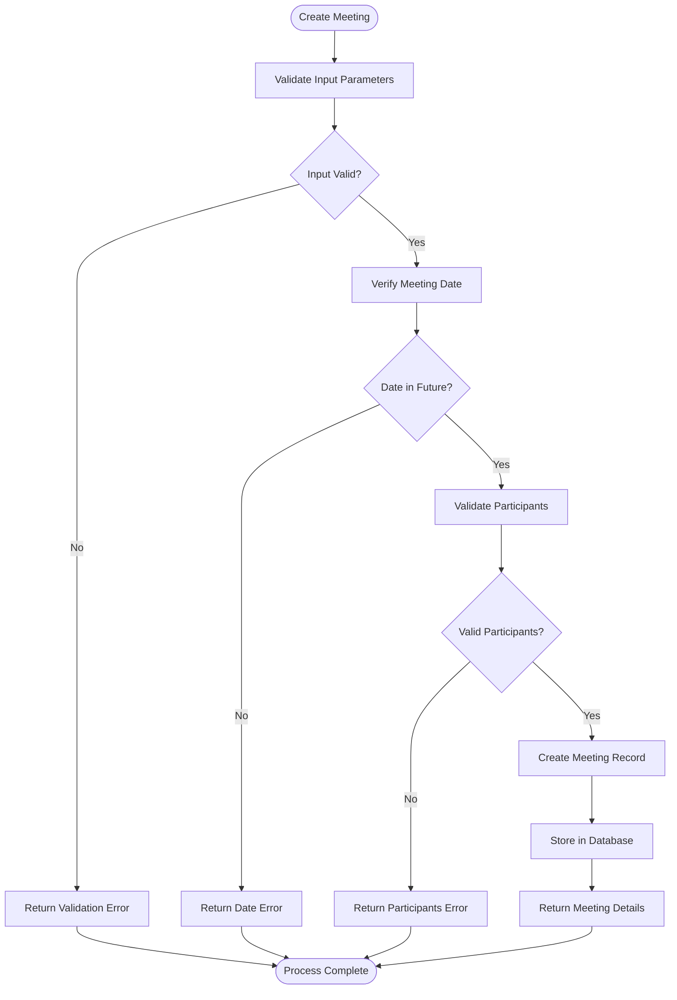
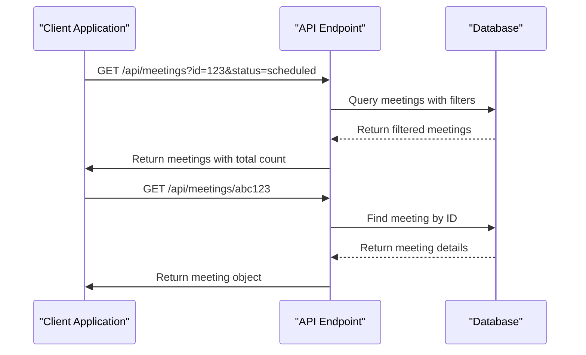
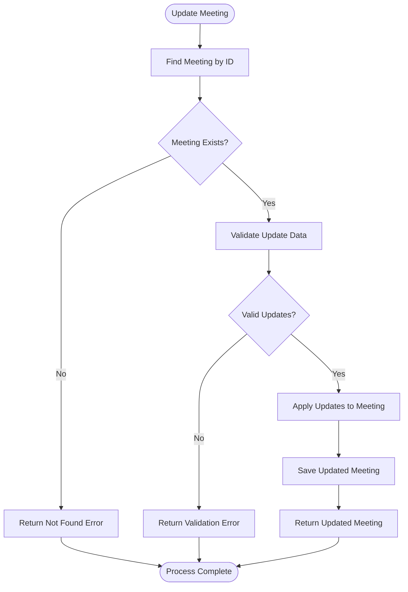
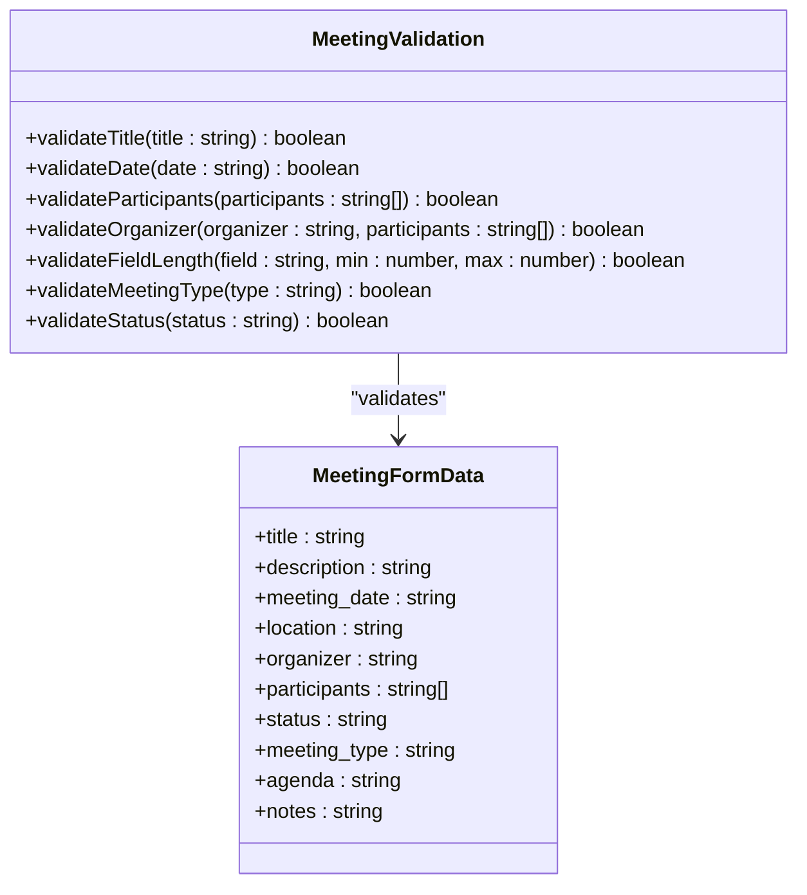
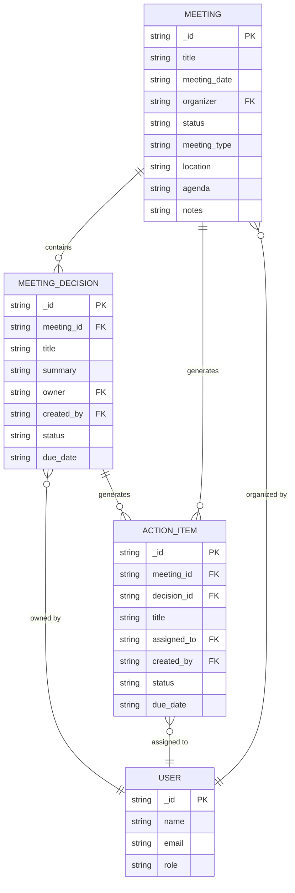
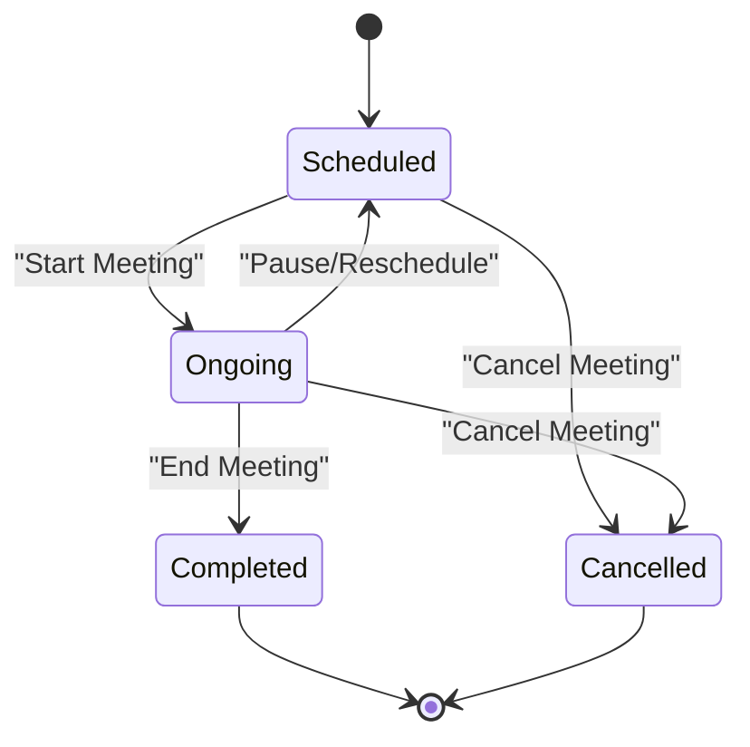

# Meeting Management API

<cite>
**Referenced Files in This Document**   
- [meetings.ts](file://convex/meetings.ts)
- [meeting.ts](file://src/lib/validations/meeting.ts)
- [MeetingForm.tsx](file://src/components/forms/MeetingForm.tsx)
- [meeting_decisions.ts](file://convex/meeting_decisions.ts)
- [meeting_action_items.ts](file://convex/meeting_action_items.ts)
</cite>

## Table of Contents

1. [Introduction](#introduction)
2. [API Endpoints](#api-endpoints)
3. [Meeting Creation](#meeting-creation)
4. [Meeting Retrieval](#meeting-retrieval)
5. [Meeting Updates](#meeting-updates)
6. [Validation Rules](#validation-rules)
7. [Integration with Decisions and Action Items](#integration-with-decisions-and-action-items)
8. [Workflow Examples](#workflow-examples)
9. [Troubleshooting Guide](#troubleshooting-guide)

## Introduction

The Meeting Management API provides comprehensive functionality for managing organizational meetings. This API enables users to create, retrieve, update, and filter meetings with support for various parameters including organizer, status, date range, and meeting type. The system integrates with decision tracking and action item management, creating a complete workflow for meeting lifecycle management. Meetings serve as parent entities for related decisions and tasks, ensuring traceability and accountability.

## API Endpoints

The Meeting Management API exposes the following endpoints:

**GET /api/meetings** - Retrieve a list of meetings with optional filtering by status, organizer, and pagination parameters.

**POST /api/meetings** - Create a new meeting with required fields including title, meeting date, organizer, and participants.

**GET /api/meetings/[id]** - Retrieve detailed information about a specific meeting by its unique identifier.

**PUT /api/meetings/[id]** - Update an existing meeting's details, allowing modification of title, date, participants, status, and other attributes.

**Section sources**

- [meetings.ts](file://convex/meetings.ts#L4-L124)

## Meeting Creation

The POST /api/meetings endpoint allows for the creation of new meetings with comprehensive data requirements.

### Required Fields

When creating a new meeting, the following fields are required:

- **title**: Meeting title (3-200 characters)
- **meeting_date**: Scheduled date and time in ISO format
- **organizer**: ID of the user organizing the meeting
- **participants**: Array of user IDs attending the meeting

### Optional Fields

The following fields can be included in the meeting creation request:

- **description**: Meeting description (up to 2000 characters)
- **location**: Physical or virtual meeting location (up to 200 characters)
- **status**: Initial status (defaults to "scheduled")
- **meeting_type**: Type of meeting (general, committee, board, or other)
- **agenda**: Meeting agenda (up to 2000 characters)
- **notes**: Additional notes (up to 2000 characters)

### Validation Rules for Creation

- Meeting date must be at least 1 hour in the future
- Participants list must contain between 1 and 50 users
- Organizer must be included in the participants list
- Title must be between 3 and 200 characters
- Meeting type must be one of the allowed values

**Diagram sources**

- [meetings.ts](file://convex/meetings.ts#L51-L77)
- [meeting.ts](file://src/lib/validations/meeting.ts#L57-L93)

**Section sources**

- [meetings.ts](file://convex/meetings.ts#L51-L77)
- [meeting.ts](file://src/lib/validations/meeting.ts#L57-L93)

## Meeting Retrieval

The Meeting Management API provides flexible retrieval options for accessing meeting data.

### GET /api/meetings - List Meetings

This endpoint returns a paginated list of meetings with optional filtering parameters.

**Query Parameters:**

- **limit**: Maximum number of results to return (default: 50)
- **skip**: Number of records to skip for pagination
- **status**: Filter by meeting status (scheduled, ongoing, completed, cancelled)
- **organizer**: Filter by organizer ID

The response includes a collection of meeting objects and the total count of matching records.

### GET /api/meetings/[id] - Get Specific Meeting

This endpoint retrieves detailed information about a specific meeting using its unique identifier.

The response includes all meeting details including title, date, location, participants, agenda, notes, and status.

**Diagram sources**

- [meetings.ts](file://convex/meetings.ts#L4-L40)
- [meetings.ts](file://convex/meetings.ts#L43-L48)

**Section sources**

- [meetings.ts](file://convex/meetings.ts#L4-L48)

## Meeting Updates

The PUT /api/meetings/[id] endpoint allows for updating existing meeting details.

### Updateable Fields

The following fields can be modified when updating a meeting:

- **title**: Updated meeting title
- **description**: Updated description
- **meeting_date**: Rescheduled date and time
- **location**: Updated location
- **participants**: Modified participants list
- **status**: Updated status (scheduled, ongoing, completed, cancelled)
- **agenda**: Updated agenda
- **notes**: Additional notes

### Update Process

When updating a meeting, the system performs the following steps:

1. Verify the meeting exists
2. Apply the provided updates to the meeting record
3. Return the updated meeting object

The update operation uses a patch strategy, modifying only the fields provided in the request.

**Diagram sources**

- [meetings.ts](file://convex/meetings.ts#L80-L108)

**Section sources**

- [meetings.ts](file://convex/meetings.ts#L80-L108)

## Validation Rules

The Meeting Management system enforces comprehensive validation rules to ensure data quality and consistency.

### Date and Time Validation

- New meetings must be scheduled at least 1 hour in the future
- Date format must be valid ISO string
- For editing existing meetings, past dates are allowed

### Participants Validation

- Minimum of 1 participant required
- Maximum of 50 participants allowed
- No duplicate participants permitted
- Organizer must be included in the participants list

### Field Length Constraints

- Title: 3-200 characters
- Description: Up to 2000 characters
- Location: Up to 200 characters
- Agenda: Up to 2000 characters
- Notes: Up to 2000 characters

### Required Field Validation

- Title is required
- Meeting date is required
- Organizer is required
- Participants list is required
- Meeting type is required

**Diagram sources**

- [meeting.ts](file://src/lib/validations/meeting.ts#L11-L134)

**Section sources**

- [meeting.ts](file://src/lib/validations/meeting.ts#L11-L134)

## Integration with Decisions and Action Items

Meetings serve as parent entities for related decisions and action items, creating a hierarchical relationship that supports comprehensive meeting follow-up and accountability.

### Meeting Decisions

Each meeting can have multiple associated decisions. The relationship is established through the meeting_id field in the meeting_decisions collection.

**Decision Creation Flow:**

1. Create a meeting
2. Create decisions linked to the meeting ID
3. Assign decision owners and due dates
4. Track decision status (open, in progress, closed)

### Action Items (Tasks)

Action items are created from meeting decisions or directly from meeting discussions. Each action item is linked to a specific meeting through the meeting_id field.

**Action Item Lifecycle:**

- Created during or after the meeting
- Assigned to specific team members
- Tracked through status changes (pending, in progress, completed)
- Notifies administrators when completed

**Diagram sources**

- [meetings.ts](file://convex/meetings.ts)
- [meeting_decisions.ts](file://convex/meeting_decisions.ts)
- [meeting_action_items.ts](file://convex/meeting_action_items.ts)

**Section sources**

- [meeting_decisions.ts](file://convex/meeting_decisions.ts#L50-L76)
- [meeting_action_items.ts](file://convex/meeting_action_items.ts#L53-L93)

## Workflow Examples

This section demonstrates common meeting management workflows.

### Meeting Scheduling Workflow

1. User initiates meeting creation
2. System validates all required fields
3. Meeting is created with status "scheduled"
4. Participants receive notifications
5. Meeting appears in calendars and dashboards

### Participant Management

- Add participants: Include user IDs in the participants array
- Remove participants: Update the meeting with modified participants list
- Ensure organizer is always included in the participants list
- Maximum 50 participants allowed per meeting

### Status Transition Workflow

The meeting status follows a specific lifecycle:

- **Scheduled**: Meeting is planned but not yet started
- **Ongoing**: Meeting is currently in progress (updated from scheduled)
- **Completed**: Meeting has concluded (updated from ongoing)
- **Cancelled**: Meeting was cancelled (can be updated from any status)

Status transitions are validated to ensure logical progression.

**Diagram sources**

- [meetings.ts](file://convex/meetings.ts#L59-L64)
- [MeetingForm.tsx](file://src/components/forms/MeetingForm.tsx#L349-L371)

**Section sources**

- [meetings.ts](file://convex/meetings.ts#L59-L64)
- [MeetingForm.tsx](file://src/components/forms/MeetingForm.tsx#L349-L371)

## Troubleshooting Guide

This section addresses common issues and their solutions when working with the Meeting Management API.

### Common Errors

- **Meeting not found**: Verify the meeting ID exists in the system
- **Invalid date format**: Ensure date is in ISO format (YYYY-MM-DDTHH:MM:SS.sssZ)
- **Participant limit exceeded**: Reduce participants to 50 or fewer
- **Organizer not in participants**: Add the organizer to the participants list
- **Meeting in past**: Schedule new meetings at least 1 hour in the future

### Validation Error Messages

- "Toplantı tarihi geçmişte olamaz" → Meeting date cannot be in the past
- "Toplantı en az 1 saat sonrası için planlanmalıdır" → Meeting must be scheduled at least 1 hour in advance
- "En az bir katılımcı seçilmelidir" → At least one participant must be selected
- "Duplicate katılımcılar var" → Duplicate participants found
- "Düzenleyen katılımcılar arasında olmalıdır" → Organizer must be included in participants

### Debugging Tips

- Check the network tab in browser developer tools for API request/response details
- Verify user authentication and permissions
- Ensure all required fields are included in the request
- Validate date and time formats
- Confirm participant IDs exist in the system

**Section sources**

- [meeting.ts](file://src/lib/validations/meeting.ts#L19-L132)
- [meetings.ts](file://convex/meetings.ts#L103-L104)
