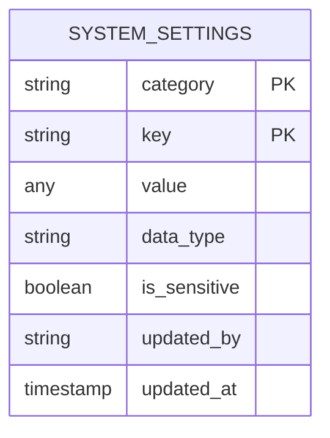

# System Settings API

<cite>
**Referenced Files in This Document**   
- [system_settings.ts](file://convex/system_settings.ts)
- [route.ts](file://src/app/api/settings/route.ts)
- [route.ts](file://src/app/api/settings/[category]/[key]/route.ts)
- [settings.ts](file://src/lib/api/settings.ts)
- [page.tsx](file://src/app/(dashboard)/settings/page.tsx)
</cite>

## Table of Contents

1. [Introduction](#introduction)
2. [API Endpoints](#api-endpoints)
3. [Settings Structure](#settings-structure)
4. [Access Control](#access-control)
5. [Frontend Integration](#frontend-integration)
6. [Error Handling](#error-handling)
7. [Examples](#examples)

## Introduction

The System Settings API provides endpoints for managing application configuration through a hierarchical organization of settings by category and key. The API supports retrieving all settings, accessing specific settings by category and key, and updating settings values. Settings are stored in a database with metadata including data type, sensitivity flag, and audit information. The system supports bulk operations for updating multiple settings at once and includes functionality for resetting settings to defaults.

**Section sources**

- [system_settings.ts](file://convex/system_settings.ts#L1-L50)
- [route.ts](file://src/app/api/settings/route.ts#L1-L47)

## API Endpoints

### GET /api/settings

Retrieves all system settings organized by category. When no category parameter is provided, returns all settings grouped by their categories. The response includes all configuration values across organization, email, notifications, system, security, appearance, integrations, and reports categories.

### GET /api/settings/[category]

Retrieves all settings within a specific category. The category path parameter specifies which group of settings to retrieve. Valid categories include organization, email, notifications, system, security, appearance, integrations, and reports. Returns a JSON object containing all key-value pairs within the specified category.

### GET /api/settings/[category]/[key]

Retrieves the value of a specific setting identified by its category and key. Returns a response containing the setting's category, key, and current value. This endpoint provides granular access to individual configuration parameters.

### PUT /api/settings/[category]/[key]

Updates the value of a specific setting. The request body must contain a JSON object with a "value" field. The API automatically determines the data type (string, number, boolean, object, or array) and updates or creates the setting as needed. Sensitive settings (containing "password", "secret", or "key" in the key name) are flagged for special handling.

### PUT /api/settings

Updates multiple settings across different categories in a single request. The request body should contain a "settings" object with category names as keys and their respective settings objects as values. This bulk operation processes each category's settings individually, making it efficient for updating related configuration groups.

### POST /api/settings/[category]

Updates all settings within a specific category. The request body must include a "settings" object containing key-value pairs to update. This endpoint is optimized for category-level configuration changes and processes each setting individually to minimize conflicts.

### DELETE /api/settings

Resets settings to their default state. When called without parameters, resets all settings. When called with a "category" query parameter, resets only the specified category. The operation is performed in batches to avoid conflicts in concurrent environments.

**Section sources**

- [route.ts](file://src/app/api/settings/route.ts#L1-L128)
- [route.ts](file://src/app/api/settings/[category]/[key]/route.ts#L1-L69)
- [system_settings.ts](file://convex/system_settings.ts#L73-L125)

## Settings Structure

Settings are organized hierarchically by category and key, forming a two-level namespace system. Each setting has associated metadata including data type, sensitivity flag, and audit information.

### Categories

The system supports the following categories:

- **organization**: Organization name, address, contact information, and branding
- **email**: SMTP configuration and email sender settings
- **notifications**: Notification preferences and enabled channels
- **system**: Application-wide system settings
- **security**: Security policies and authentication requirements
- **appearance**: UI appearance and theming options
- **integrations**: Third-party service integrations
- **reports**: Reporting configuration and templates

### Data Types

The system automatically detects and stores the data type of each setting:

- **string**: Text values
- **number**: Numeric values
- **boolean**: True/false values
- **object**: Complex JSON objects
- **array**: Ordered collections

### Sensitivity Detection

Settings with keys containing "password", "secret", or "key" are automatically flagged as sensitive for special handling and security considerations.



**Diagram sources**

- [system_settings.ts](file://convex/system_settings.ts#L73-L125)

**Section sources**

- [system_settings.ts](file://convex/system_settings.ts#L1-L50)
- [settings.ts](file://src/lib/api/settings.ts#L6-L14)

## Access Control

Settings modification is controlled through user roles and permissions. The API accepts an optional "updatedBy" parameter that references a user ID, enabling audit trail functionality. While the API endpoints themselves don't enforce role-based access control, the application layer should restrict access to settings modification based on user roles.

Sensitive settings (those containing authentication credentials) receive special handling through the "is_sensitive" flag, which can be used by the frontend to apply additional security measures such as masking input fields or requiring additional authentication for modification.

The system is designed to work with Convex's security model, where mutations can be protected based on user authentication and authorization rules defined in the application's security configuration.

**Section sources**

- [system_settings.ts](file://convex/system_settings.ts#L163-L167)
- [system_settings.ts](file://convex/system_settings.ts#L116-L117)

## Frontend Integration

The frontend integrates with the System Settings API through a dedicated client class (`SettingsApi`) that provides type-safe methods for all API operations. The client handles HTTP communication, error handling, and response parsing.

The settings page component (`page.tsx`) demonstrates the integration pattern, maintaining a local state of settings that is synchronized with the backend. When users make changes, the component tracks modifications and provides a save mechanism that calls the appropriate API endpoints.

For sensitive settings like session timeout and maximum login attempts, the frontend implements validation rules such as minimum and maximum values to ensure data integrity before submission.

**Section sources**

- [settings.ts](file://src/lib/api/settings.ts#L103-L272)
- [page.tsx](<file://src/app/(dashboard)/settings/page.tsx#L545-L576>)

## Error Handling

The API implements comprehensive error handling for various failure scenarios:

### Client-Side Errors (400 series)

- **400 Bad Request**: Invalid JSON format, missing required fields, or invalid data types
- Specific validation messages include "Kategori ve ayarlar gerekli" (Category and settings required) and "Geçersiz ayarlar formatı" (Invalid settings format)

### Server-Side Errors (500 series)

- **500 Internal Server Error**: Database connectivity issues, unexpected exceptions, or system failures
- Error responses include descriptive messages in Turkish, such as "Ayarlar alınırken hata oluştu" (Error retrieving settings)

### Validation Rules

- Category and key parameters are required and must be non-empty strings
- When updating settings, the value must be provided and cannot be undefined
- Bulk updates require a valid object structure for the settings parameter
- Category names must match predefined values to prevent typos and ensure consistency

The API uses try-catch blocks to capture exceptions and return consistent error responses with appropriate HTTP status codes.

**Section sources**

- [route.ts](file://src/app/api/settings/route.ts#L40-L45)
- [route.ts](file://src/app/api/settings/[category]/[key]/route.ts#L42-L45)
- [route.ts](file://src/app/api/settings/route.ts#L72-L76)

## Examples

### Retrieving All Settings

```http
GET /api/settings HTTP/1.1
```

### Retrieving Settings by Category

```http
GET /api/settings/system HTTP/1.1
```

### Retrieving a Specific Setting

```http
GET /api/settings/system/sessionTimeout HTTP/1.1
```

### Updating a Single Setting

```http
PUT /api/settings/system/sessionTimeout HTTP/1.1
Content-Type: application/json

{
  "value": 60
}
```

### Bulk Updating Settings

```http
PUT /api/settings HTTP/1.1
Content-Type: application/json

{
  "settings": {
    "system": {
      "sessionTimeout": 60,
      "maxLoginAttempts": 5
    },
    "security": {
      "requireTwoFactor": true
    }
  }
}
```

### Updating a Category's Settings

```http
POST /api/settings/email HTTP/1.1
Content-Type: application/json

{
  "settings": {
    "enabled": true,
    "smtpHost": "smtp.example.com",
    "smtpPort": 587
  }
}
```

**Section sources**

- [settings.ts](file://src/lib/api/settings.ts#L199-L222)
- [settings.ts](file://src/lib/api/settings.ts#L227-L246)
- [settings.ts](file://src/lib/api/settings.ts#L172-L194)
