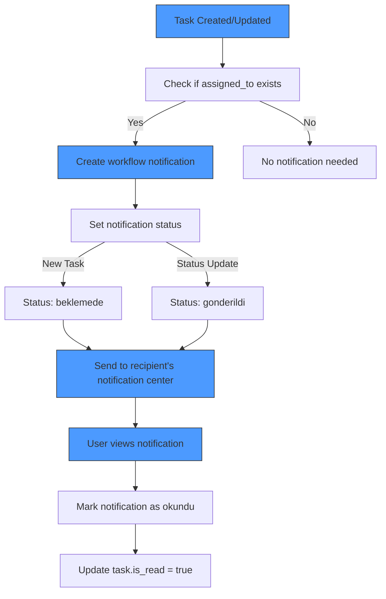

# Task Management API

<cite>
**Referenced Files in This Document**   
- [tasks.ts](file://convex/tasks.ts)
- [route.ts](file://src/app/api/tasks/route.ts)
- [route.ts](file://src/app/api/tasks/[id]/route.ts)
- [task.ts](file://src/lib/validations/task.ts)
- [TaskForm.tsx](file://src/components/forms/TaskForm.tsx)
- [workflow_notifications.ts](file://convex/workflow_notifications.ts)
</cite>

## Table of Contents

1. [Introduction](#introduction)
2. [Task Endpoints Overview](#task-endpoints-overview)
3. [GET /api/tasks - Retrieve Tasks](#get-apitasks---retrieve-tasks)
4. [POST /api/tasks - Create Task](#post-apitasks---create-task)
5. [GET /api/tasks/[id] - Retrieve Specific Task](#get-apitasksid---retrieve-specific-task)
6. [PUT /api/tasks/[id] - Update Task](#put-apitasksid---update-task)
7. [Task Validation Rules](#task-validation-rules)
8. [Notification Integration](#notification-integration)
9. [Error Handling](#error-handling)
10. [Usage Examples](#usage-examples)

## Introduction

The Task Management API provides a comprehensive system for managing workflow tasks within the organization. This documentation details the endpoints for creating, retrieving, updating, and filtering tasks, along with validation rules, notification integration, and error handling mechanisms. The API supports task assignment, prioritization, status tracking, and integration with the workflow notification system for real-time updates.

## Task Endpoints Overview

The Task Management API provides four primary endpoints for task operations:

- **GET /api/tasks**: Retrieve a list of tasks with optional filtering by assignee, status, priority, and date range
- **POST /api/tasks**: Create new tasks with required and optional fields
- **GET /api/tasks/[id]**: Retrieve detailed information about a specific task
- **PUT /api/tasks/[id]**: Update existing tasks, including status changes and assignment modifications

All endpoints require authentication and appropriate module access to the 'workflow' module, with CSRF protection for write operations.

**Section sources**

- [route.ts](file://src/app/api/tasks/route.ts)
- [route.ts](file://src/app/api/tasks/[id]/route.ts)

## GET /api/tasks - Retrieve Tasks

The GET /api/tasks endpoint retrieves a list of tasks with optional filtering parameters. The endpoint supports pagination and various filtering options to help users find specific tasks.

### Request Parameters

Query parameters can be used to filter and paginate the results:

| Parameter   | Type   | Required | Description                                | Example              |
| ----------- | ------ | -------- | ------------------------------------------ | -------------------- |
| limit       | number | No       | Number of tasks to return (default: 50)    | limit=25             |
| skip        | number | No       | Number of tasks to skip for pagination     | skip=50              |
| status      | string | No       | Filter by task status                      | status=pending       |
| assigned_to | string | No       | Filter by user ID assigned to the task     | assigned_to=user_123 |
| created_by  | string | No       | Filter by user ID who created the task     | created_by=user_456  |
| search      | string | No       | Text search for task title and description | search=field+visit   |

### Response Format

```json
{
  "success": true,
  "data": [
    {
      "_id": "task_123",
      "title": "Field Visit to Community Center",
      "description": "Conduct assessment of facility conditions",
      "assigned_to": "user_789",
      "created_by": "user_456",
      "priority": "high",
      "status": "in_progress",
      "due_date": "2024-01-15T09:00:00.000Z",
      "category": "field_visit",
      "tags": ["assessment", "facility"],
      "is_read": false,
      "created_at": "2024-01-10T14:30:00.000Z"
    }
  ],
  "total": 1
}
```

The response includes a success flag, array of task objects, and total count for pagination purposes.

**Section sources**

- [tasks.ts](file://convex/tasks.ts#L5-L43)
- [route.ts](file://src/app/api/tasks/route.ts#L43-L72)

## POST /api/tasks - Create Task

The POST /api/tasks endpoint creates a new task with the provided details. The endpoint validates all required fields and sets appropriate defaults for optional fields.

### Request Body

The request body should contain the following fields:

#### Required Fields

| Field      | Type   | Description                       | Valid Values                               |
| ---------- | ------ | --------------------------------- | ------------------------------------------ |
| title      | string | Task title (minimum 3 characters) | Any string with 3+ characters              |
| created_by | string | User ID of the task creator       | Valid user ID                              |
| priority   | string | Task priority level               | low, normal, high, urgent                  |
| status     | string | Initial task status               | pending, in_progress, completed, cancelled |

#### Optional Fields

| Field       | Type    | Description                             | Notes                      |
| ----------- | ------- | --------------------------------------- | -------------------------- |
| description | string  | Detailed task description               | Max 1000 characters        |
| assigned_to | string  | User ID of the assigned user            | Valid user ID              |
| due_date    | string  | Deadline for task completion            | ISO 8601 format            |
| category    | string  | Task category for organization          | Max 50 characters          |
| tags        | array   | Array of string tags for classification | Max 10 tags, 30 chars each |
| is_read     | boolean | Notification read status                | Default: false             |

### Example Request

```json
{
  "title": "Documentation Assignment",
  "description": "Prepare quarterly impact report",
  "assigned_to": "user_789",
  "created_by": "user_456",
  "priority": "normal",
  "status": "pending",
  "due_date": "2024-01-20T17:00:00.000Z",
  "category": "reporting",
  "tags": ["quarterly", "impact"],
  "is_read": false
}
```

### Response Format

```json
{
  "success": true,
  "data": {
    "_id": "task_123",
    "title": "Documentation Assignment",
    "description": "Prepare quarterly impact report",
    "assigned_to": "user_789",
    "created_by": "user_456",
    "priority": "normal",
    "status": "pending",
    "due_date": "2024-01-20T17:00:00.000Z",
    "category": "reporting",
    "tags": ["quarterly", "impact"],
    "is_read": false,
    "created_at": "2024-01-10T14:30:00.000Z"
  },
  "message": "Task created successfully"
}
```

**Section sources**

- [tasks.ts](file://convex/tasks.ts#L54-L81)
- [route.ts](file://src/app/api/tasks/route.ts#L78-L138)

## GET /api/tasks/[id] - Retrieve Specific Task

The GET /api/tasks/[id] endpoint retrieves detailed information about a specific task using its unique identifier.

### Request Parameters

No additional parameters are required beyond the task ID in the URL path.

### Response Format

```json
{
  "success": true,
  "data": {
    "_id": "task_123",
    "title": "Field Visit to Community Center",
    "description": "Conduct assessment of facility conditions",
    "assigned_to": "user_789",
    "created_by": "user_456",
    "priority": "high",
    "status": "in_progress",
    "due_date": "2024-01-15T09:00:00.000Z",
    "completed_at": null,
    "category": "field_visit",
    "tags": ["assessment", "facility"],
    "is_read": false,
    "created_at": "2024-01-10T14:30:00.000Z"
  }
}
```

If the task is not found, the endpoint returns a 404 status code with an error message.

**Section sources**

- [tasks.ts](file://convex/tasks.ts#L46-L52)
- [route.ts](file://src/app/api/tasks/[id]/route.ts#L28-L55)

## PUT /api/tasks/[id] - Update Task

The PUT /api/tasks/[id] endpoint updates an existing task with new information. Users can modify various task properties including status, assignment, and priority.

### Request Body

The request body can include any of the following fields for updates:

| Field        | Type    | Description              | Notes                                      |
| ------------ | ------- | ------------------------ | ------------------------------------------ |
| title        | string  | Updated task title       | Minimum 3 characters                       |
| description  | string  | Updated task description | Max 1000 characters                        |
| assigned_to  | string  | New user assignment      | Valid user ID                              |
| priority     | string  | Updated priority level   | low, normal, high, urgent                  |
| status       | string  | Updated task status      | pending, in_progress, completed, cancelled |
| due_date     | string  | Updated deadline         | ISO 8601 format                            |
| completed_at | string  | Completion timestamp     | Auto-set when status=completed             |
| is_read      | boolean | Notification read status |                                            |

### Automatic completed_at Handling

When updating a task's status to "completed", the system automatically sets the completed_at field to the current timestamp if not explicitly provided:

```json
{
  "status": "completed"
}
```

This automatically adds:

```json
"completed_at": "2024-01-15T10:30:00.000Z"
```

### Response Format

```json
{
  "success": true,
  "data": {
    "_id": "task_123",
    "title": "Updated Field Visit",
    "description": "Complete assessment and submit report",
    "assigned_to": "user_789",
    "created_by": "user_456",
    "priority": "urgent",
    "status": "completed",
    "due_date": "2024-01-15T09:00:00.000Z",
    "completed_at": "2024-01-15T10:30:00.000Z",
    "category": "field_visit",
    "tags": ["assessment", "facility", "report"],
    "is_read": true,
    "created_at": "2024-01-10T14:30:00.000Z"
  },
  "message": "Task updated successfully"
}
```

**Section sources**

- [tasks.ts](file://convex/tasks.ts#L83-L124)
- [route.ts](file://src/app/api/tasks/[id]/route.ts#L61-L116)

## Task Validation Rules

The Task Management API implements comprehensive validation rules to ensure data integrity and consistency across all operations.

### Field Validation

| Field       | Validation Rules                                           |
| ----------- | ---------------------------------------------------------- |
| title       | Minimum 3 characters, maximum 100 characters               |
| description | Maximum 1000 characters                                    |
| priority    | Must be one of: low, normal, high, urgent                  |
| status      | Must be one of: pending, in_progress, completed, cancelled |
| due_date    | Must be today or a future date (ISO 8601 format)           |
| category    | Maximum 50 characters                                      |
| tags        | Maximum 10 tags, each maximum 30 characters, no duplicates |

### Date Format Requirements

All date fields must use ISO 8601 format (YYYY-MM-DDTHH:MM:SS.SSSZ):

- Example: "2024-01-15T09:00:00.000Z"
- Must be valid JavaScript Date.parse() compatible string
- Due dates must be today or in the future

### User Reference Validation

User IDs referenced in assigned_to and created_by fields must correspond to existing users in the system. The API validates these references against the users collection and returns appropriate errors for invalid user IDs.

**Section sources**

- [task.ts](file://src/lib/validations/task.ts#L41-L105)
- [route.ts](file://src/app/api/tasks/route.ts#L8-L38)
- [route.ts](file://src/app/api/tasks/[id]/route.ts#L8-L23)

## Notification Integration

The Task Management API integrates with the workflow notification system to provide real-time updates and tracking of task-related activities.

### is_read Flag

The is_read boolean field tracks notification status for tasks:

- **false**: Task notification has not been viewed by the assignee
- **true**: Task notification has been acknowledged by the assignee

When a task is created or updated, a corresponding notification is generated in the workflow_notifications collection with the is_read status synchronized between systems.

### Notification Workflow



**Diagram sources**

- [tasks.ts](file://convex/tasks.ts#L76-L81)
- [workflow_notifications.ts](file://convex/workflow_notifications.ts#L76-L104)

**Section sources**

- [tasks.ts](file://convex/tasks.ts#L76-L81)
- [workflow_notifications.ts](file://convex/workflow_notifications.ts#L76-L104)

## Error Handling

The API implements comprehensive error handling for various scenarios to provide meaningful feedback to clients.

### Common Error Responses

| Status Code | Error Type           | Response Body                                                                                           | Cause                                           |
| ----------- | -------------------- | ------------------------------------------------------------------------------------------------------- | ----------------------------------------------- |
| 400         | Validation Error     | `{ "success": false, "error": "Validation error", "details": ["Title must be at least 3 characters"] }` | Invalid field values or missing required fields |
| 401         | Authentication Error | `{ "success": false, "error": "Authentication required" }`                                              | Missing or invalid authentication token         |
| 403         | Authorization Error  | `{ "success": false, "error": "Insufficient permissions" }`                                             | User lacks access to workflow module            |
| 404         | Not Found            | `{ "success": false, "error": "Task not found" }`                                                       | Task ID does not exist                          |
| 419         | CSRF Token Missing   | `{ "success": false, "error": "CSRF token missing" }`                                                   | Missing CSRF token for write operations         |
| 500         | Server Error         | `{ "success": false, "error": "Operation failed" }`                                                     | Internal server error during processing         |

### Specific Error Scenarios

- **Invalid User ID**: When assigned_to or created_by references a non-existent user
- **Invalid Status Transition**: Attempts to set invalid status values
- **CSRF Validation**: POST and PUT requests without valid CSRF token
- **Module Access**: Requests from users without 'workflow' module access
- **Database Errors**: Failures during data persistence operations

All errors are logged with relevant context for debugging and monitoring purposes.

**Section sources**

- [route.ts](file://src/app/api/tasks/route.ts#L61-L72)
- [route.ts](file://src/app/api/tasks/[id]/route.ts#L43-L55)
- [route.ts](file://src/app/api/tasks/[id]/route.ts#L96-L115)

## Usage Examples

This section provides practical examples of using the Task Management API for common scenarios.

### Field Visit Task Creation

Creating a task for a field visit assessment:

```json
POST /api/tasks
{
  "title": "Field Visit: Community Center Assessment",
  "description": "Evaluate facility conditions, interview staff, and document findings",
  "assigned_to": "usr_789abc",
  "created_by": "usr_456def",
  "priority": "high",
  "status": "pending",
  "due_date": "2024-01-15T09:00:00.000Z",
  "category": "field_visit",
  "tags": ["assessment", "facility", "community"],
  "is_read": false
}
```

### Documentation Assignment

Creating a task for preparing documentation:

```json
POST /api/tasks
{
  "title": "Q4 Impact Report Preparation",
  "description": "Compile data, write narrative, and create visualizations for quarterly report",
  "assigned_to": "usr_234xyz",
  "created_by": "usr_456def",
  "priority": "normal",
  "status": "pending",
  "due_date": "2024-01-20T17:00:00.000Z",
  "category": "reporting",
  "tags": ["quarterly", "impact", "data"],
  "is_read": false
}
```

### Updating Task Status

Updating a task to completed status:

```json
PUT /api/tasks/task_123
{
  "status": "completed",
  "is_read": true
}
```

This automatically sets the completed_at timestamp to the current time.

### Filtering Tasks by Assignee

Retrieving all tasks assigned to a specific user:

```
GET /api/tasks?assigned_to=usr_789abc&status=in_progress
```

### Retrieving Overdue Tasks

Finding all overdue tasks for a user:

```
GET /api/tasks?assigned_to=usr_789abc&status=pending
```

Then client-side filtering for tasks where due_date < current date.

**Section sources**

- [TaskForm.tsx](file://src/components/forms/TaskForm.tsx#L41-L448)
- [task.ts](file://src/lib/validations/task.ts#L128-L140)
