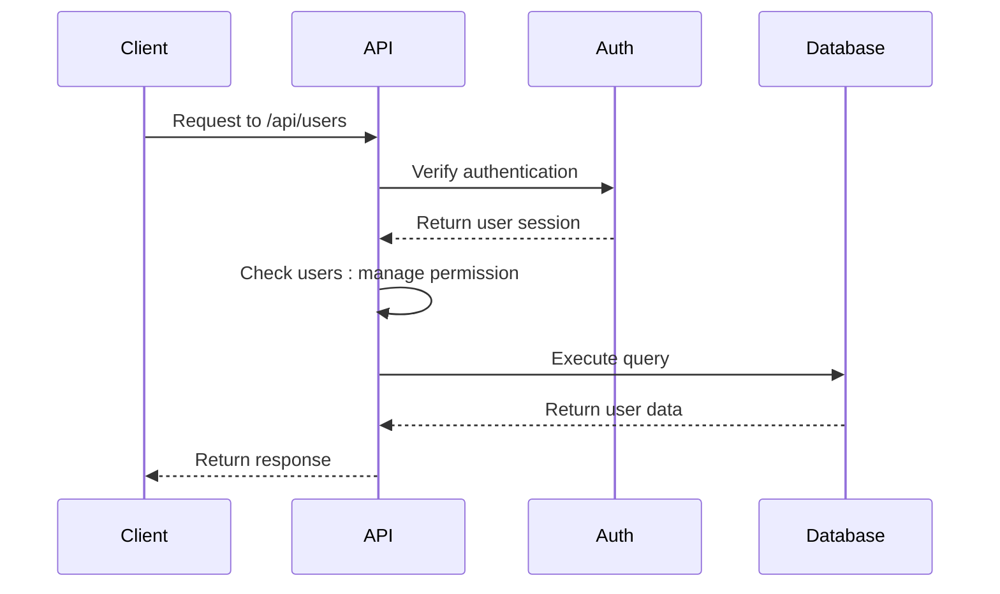
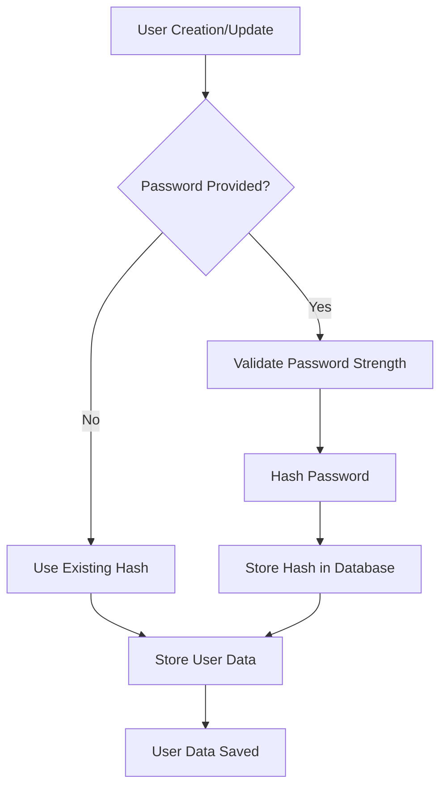

# User Management API

<cite>
**Referenced Files in This Document**   
- [users.ts](file://convex/users.ts)
- [route.ts](file://src/app/api/users/route.ts)
- [users-table.tsx](file://src/components/tables/users-table.tsx)
- [permissions.ts](file://src/types/permissions.ts)
- [shared-validators.ts](file://src/lib/validations/shared-validators.ts)
- [route.ts](file://src/app/api/users/[id]/route.ts)
- [permission-checkbox-group.tsx](file://src/components/users/permission-checkbox-group.tsx)
</cite>

## Table of Contents

1. [Introduction](#introduction)
2. [API Endpoints](#api-endpoints)
3. [User Data Model](#user-data-model)
4. [Authentication and Authorization](#authentication-and-authorization)
5. [Error Handling](#error-handling)
6. [Usage Examples](#usage-examples)
7. [Integration with Authentication System](#integration-with-authentication-system)

## Introduction

The User Management API provides comprehensive functionality for managing user accounts within the system. This API enables administrators to create, retrieve, update, and manage user accounts with various roles and permissions. The endpoints support filtering, searching, and pagination for efficient user management at scale.

**Section sources**

- [users.ts](file://convex/users.ts#L1-L220)
- [route.ts](file://src/app/api/users/route.ts#L1-L223)

## API Endpoints

### GET /api/users - Retrieve User List

Retrieves a paginated list of users with optional filtering by role, status, and search query.

**Query Parameters:**

- `search` (string, optional): Search term to filter users by name
- `role` (string, optional): Filter users by role
- `isActive` (boolean, optional): Filter users by active status (true/false)
- `limit` (number, optional): Number of results per page (max 100, default 50)

**Response Structure:**

```json
{
  "success": true,
  "data": [
    {
      "_id": "string",
      "name": "string",
      "email": "string",
      "role": "string",
      "permissions": ["string"],
      "isActive": true,
      "phone": "string",
      "createdAt": "string"
    }
  ],
  "total": 0,
  "continueCursor": "string",
  "isDone": true
}
```

The endpoint supports cursor-based pagination using the `continueCursor` value in subsequent requests.

**Section sources**

- [users.ts](file://convex/users.ts#L6-L63)
- [route.ts](file://src/app/api/users/route.ts#L107-L153)

### POST /api/users - Create New User

Creates a new user account with specified details and permissions.

**Request Body (Required Fields):**

- `name` (string): Full name of the user (minimum 2 characters)
- `email` (string): Valid email address (must be unique)
- `role` (string): User role or position (minimum 2 characters)
- `password` (string): User password meeting strength requirements
- `permissions` (array): Array of permission values the user should have

**Request Body (Optional Fields):**

- `phone` (string): Contact phone number
- `avatar` (string): URL to user avatar image
- `labels` (array): Array of string labels for user categorization
- `isActive` (boolean): Account status (default: true)

**Response Structure:**

```json
{
  "success": true,
  "data": {
    "_id": "string",
    "name": "string",
    "email": "string",
    "role": "string",
    "permissions": ["string"],
    "isActive": true,
    "createdAt": "string"
  },
  "message": "User created successfully"
}
```

**Section sources**

- [users.ts](file://convex/users.ts#L84-L121)
- [route.ts](file://src/app/api/users/route.ts#L155-L221)

### GET /api/users/[id] - Retrieve Specific User

Retrieves detailed information about a specific user by their ID.

**Path Parameter:**

- `id` (string): The unique identifier of the user

**Response Structure:**
Returns a single user object with all properties as defined in the User Data Model.

**Section sources**

- [users.ts](file://convex/users.ts#L66-L71)
- [route.ts](file://src/app/api/users/[id]/route.ts#L25-L45)

### PUT /api/users/[id] - Update User

Updates an existing user's information, including role, permissions, and status.

**Path Parameter:**

- `id` (string): The unique identifier of the user to update

**Request Body (All fields optional):**

- `name` (string): Updated full name
- `email` (string): Updated email address (must be unique)
- `role` (string): Updated role or position
- `permissions` (array): Updated array of permissions
- `password` (string): New password (triggers password hash update)
- `isActive` (boolean): Updated account status
- `phone` (string): Updated phone number
- `avatar` (string): Updated avatar URL
- `labels` (array): Updated array of labels

**Response Structure:**
Returns the updated user object with all current properties.

**Section sources**

- [users.ts](file://convex/users.ts#L124-L207)
- [route.ts](file://src/app/api/users/[id]/route.ts#L47-L120)

## User Data Model

The user data model defines the structure and validation rules for user accounts in the system.

**Core Properties:**

- `_id`: Unique identifier (generated by system)
- `name`: Full name (minimum 2 characters)
- `email`: Email address (normalized to lowercase, must be unique)
- `role`: User role or position (minimum 2 characters)
- `permissions`: Array of permission values granting access to system modules
- `isActive`: Boolean flag indicating account status
- `createdAt`: Timestamp of account creation
- `lastLogin`: Timestamp of last successful login (nullable)

**Optional Properties:**

- `phone`: Contact phone number
- `avatar`: URL to profile image
- `labels`: Array of string tags for user categorization
- `passwordHash`: Hashed password (stored securely, never exposed in responses)

**Section sources**

- [users.ts](file://convex/users.ts#L84-L121)
- [users-table.tsx](file://src/components/tables/users-table.tsx#L19-L28)

## Authentication and Authorization

The User Management API implements strict authorization controls to ensure only authorized users can perform administrative actions.

### Permission Requirements

- **users:manage**: Required for all user management operations (create, read, update, delete)
- This permission is defined in `SPECIAL_PERMISSIONS.USERS_MANAGE` constant

### Access Control

All endpoints require authentication via session tokens. Users without the `users:manage` permission receive a 403 Forbidden response when attempting to access any user management functionality.



**Diagram sources**

- [route.ts](file://src/app/api/users/route.ts#L109-L114)
- [auth.ts](file://convex/auth.ts#L1-L10)

**Section sources**

- [route.ts](file://src/app/api/users/route.ts#L109-L114)
- [permissions.ts](file://src/types/permissions.ts#L1-L38)

## Error Handling

The API provides comprehensive error handling for various failure scenarios.

### Common Error Responses

**400 Bad Request:**

- Invalid email format
- Name too short (less than 2 characters)
- Role too short (less than 2 characters)
- Missing required permissions
- Password does not meet strength requirements

**403 Forbidden:**

- User lacks `users:manage` permission
- CSRF token validation failed

**409 Conflict:**

- Email address already exists in the system

**404 Not Found:**

- User ID not found during update or retrieval

**500 Internal Server Error:**

- Database connectivity issues
- Unexpected server errors

### Validation Rules

- **Email**: Must be valid format and unique across the system
- **Password**: Minimum 8 characters with uppercase, lowercase, number, and special character
- **Name**: Minimum 2 characters, alphabetic characters only
- **Role**: Minimum 2 characters
- **Permissions**: Must be valid permission values from the system's permission set

**Section sources**

- [users.ts](file://convex/users.ts#L104-L105)
- [shared-validators.ts](file://src/lib/validations/shared-validators.ts#L305-L312)
- [route.ts](file://src/app/api/users/route.ts#L34-L47)

## Usage Examples

### Creating Users with Different Roles

**Admin User:**

```json
{
  "name": "John Admin",
  "email": "john@example.com",
  "role": "Administrator",
  "password": "SecurePass123!",
  "permissions": [
    "beneficiaries:access",
    "donations:access",
    "aid_applications:access",
    "scholarships:access",
    "messages:access",
    "finance:access",
    "reports:access",
    "settings:access",
    "workflow:access",
    "partners:access",
    "users:manage"
  ],
  "isActive": true
}
```

**Staff User:**

```json
{
  "name": "Jane Staff",
  "email": "jane@example.com",
  "role": "Staff Member",
  "password": "SecurePass123!",
  "permissions": [
    "beneficiaries:access",
    "donations:access",
    "aid_applications:access",
    "messages:access"
  ],
  "isActive": true
}
```

**Volunteer User:**

```json
{
  "name": "Bob Volunteer",
  "email": "bob@example.com",
  "role": "Volunteer",
  "password": "SecurePass123!",
  "permissions": ["beneficiaries:access", "messages:access"],
  "isActive": true
}
```

**Section sources**

- [permissions.ts](file://src/types/permissions.ts#L1-L38)
- [users.ts](file://convex/users.ts#L84-L121)

## Integration with Authentication System

### isActive Flag Functionality

The `isActive` flag serves as the primary mechanism for account management:

- When `isActive: true`: User can log in and access the system normally
- When `isActive: false`: User is prevented from logging in, effectively disabling the account

The flag integrates with the authentication system by checking the user's active status during the login process. Disabled accounts cannot obtain new session tokens.

### Password Management Workflow

1. Passwords are never stored in plain text
2. Upon user creation or password update, the system:
   - Validates password strength
   - Hashes the password using secure algorithms
   - Stores only the hash in the database
3. During login, the entered password is hashed and compared to the stored hash



**Diagram sources**

- [route.ts](file://src/app/api/users/route.ts#L181-L189)
- [users.ts](file://convex/users.ts#L97-L105)

**Section sources**

- [route.ts](file://src/app/api/users/route.ts#L181-L189)
- [users.ts](file://convex/users.ts#L97-L105)
- [password.ts](file://src/lib/auth/password.ts#L1-L10)
