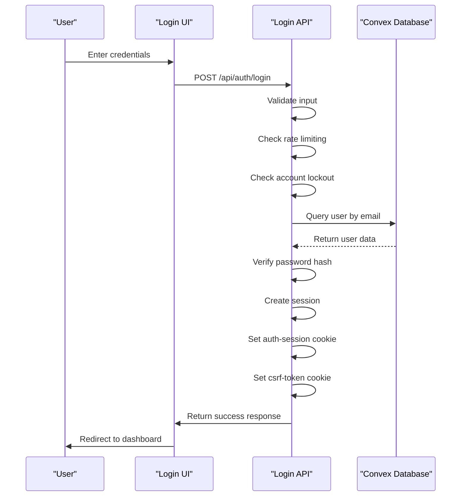
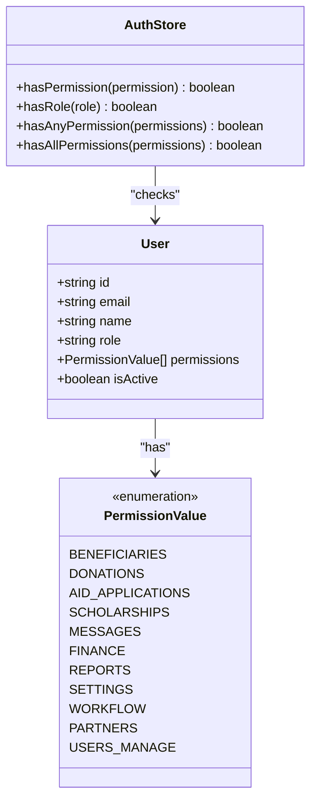

# Authentication Flow

<cite>
**Referenced Files in This Document**   
- [login/route.ts](file://src/app/api/auth/login/route.ts)
- [get-user.ts](file://src/lib/auth/get-user.ts)
- [session.ts](file://src/lib/auth/session.ts)
- [password.ts](file://src/lib/auth/password.ts)
- [csrf.ts](file://src/lib/csrf.ts)
- [rate-limit.ts](file://src/lib/rate-limit.ts)
- [auth.ts](file://convex/auth.ts)
- [users.ts](file://convex/users.ts)
- [authStore.ts](file://src/stores/authStore.ts)
- [corporate-login-form.tsx](file://src/components/ui/corporate-login-form.tsx)
</cite>

## Table of Contents

1. [Introduction](#introduction)
2. [Authentication Flow Overview](#authentication-flow-overview)
3. [Login Process](#login-process)
4. [Session Management](#session-management)
5. [User Identification](#user-identification)
6. [Role-Based Access Control](#role-based-access-control)
7. [Security Measures](#security-measures)
8. [Error Handling](#error-handling)
9. [Conclusion](#conclusion)

## Introduction

The Kafkasder-panel authentication system provides a secure and robust mechanism for user authentication and authorization. This document details the complete authentication flow, from user login to session management and access control. The system leverages Convex as the backend database, implements comprehensive security measures, and provides a seamless user experience through a well-structured API and client-side components.

**Section sources**

- [login/route.ts](file://src/app/api/auth/login/route.ts)
- [authStore.ts](file://src/stores/authStore.ts)

## Authentication Flow Overview

The authentication flow in Kafkasder-panel follows a standard secure pattern with additional security measures. When a user attempts to log in, their credentials are validated through a multi-step process that includes input validation, account status verification, password verification, and session creation. The system employs CSRF protection, rate limiting, and account lockout mechanisms to prevent abuse and ensure security.



**Diagram sources**

- [login/route.ts](file://src/app/api/auth/login/route.ts)
- [corporate-login-form.tsx](file://src/components/ui/corporate-login-form.tsx)

## Login Process

The login process begins when a user submits their credentials through the login form. The system validates the input, checks for rate limiting, and verifies the account status before proceeding with authentication.

### Input Validation

The login API first validates that both email and password are provided. If either field is missing, the request is rejected with a 400 status code.

### Rate Limiting

The authentication endpoint is protected by rate limiting to prevent brute force attacks. The system tracks login attempts by IP address and email, allowing a configurable number of attempts within a time window.

### Account Lockout

After a configurable number of failed login attempts, the account is temporarily locked to prevent further attempts. This helps protect against password guessing attacks.

### User Lookup and Verification

The system queries Convex for a user with the provided email address. If found, the password hash is verified using bcrypt. Upon successful authentication, a session is created and cookies are set.

**Section sources**

- [login/route.ts](file://src/app/api/auth/login/route.ts)
- [rate-limit.ts](file://src/lib/rate-limit.ts)
- [password.ts](file://src/lib/auth/password.ts)

## Session Management

Session management in Kafkasder-panel is implemented using HttpOnly cookies to store session information securely.

### Session Cookie

The `auth-session` cookie contains the user ID, session ID, and expiration time. This cookie is marked as HttpOnly to prevent access via JavaScript, reducing the risk of XSS attacks.

### Session Expiration

Sessions have configurable expiration times based on the "remember me" preference. Sessions are validated for expiration on each request, ensuring that expired sessions are rejected.

### Session Validation

The system provides utilities to validate sessions and extract user information from the session cookie. This ensures that only authenticated users can access protected routes.

```mermaid
classDiagram
class AuthSession {
+string sessionId
+string userId
+string expire
}
class SessionUser {
+string id
+string email
+string name
+string role
+PermissionValue[] permissions
+boolean isActive
+string[] labels
}
class SessionManager {
+parseAuthSession(cookieValue) AuthSession
+isSessionExpired(session) boolean
+getAuthSessionFromRequest(request) AuthSession
+getAuthSessionFromCookies() AuthSession
+getUserFromSession(session) SessionUser
+getRequestAuthContext(request) {session, user}
}
SessionManager --> AuthSession : "uses"
SessionManager --> SessionUser : "creates"
```

**Diagram sources**

- [session.ts](file://src/lib/auth/session.ts)
- [get-user.ts](file://src/lib/auth/get-user.ts)

## User Identification

The system provides a utility function to extract the user ID from the session cookie, which is used to identify authenticated users in protected routes.

### getCurrentUserId Function

The `getCurrentUserId` function extracts the user ID from the `auth-session` cookie. It handles both server-side and request-based contexts, making it versatile for different use cases.

### Session Data Structure

The session cookie contains a JSON object with the user ID, session ID, and expiration timestamp. This data is validated for integrity and expiration before use.

### Error Handling

The function includes comprehensive error handling to gracefully handle missing or invalid session data, returning null when authentication cannot be established.

**Section sources**

- [get-user.ts](file://src/lib/auth/get-user.ts)
- [session.ts](file://src/lib/auth/session.ts)

## Role-Based Access Control

The system implements role-based access control to manage user permissions and restrict access to specific features.

### Permission System

Permissions are defined as constants in the system, with each module having its own access permission. Special permissions, such as user management, are also defined.

### Role Assignment

Users are assigned roles that determine their base permissions. The system includes logic to grant additional permissions based on role names, such as granting administrative privileges to users with "ADMIN" or "BAŞKAN" in their role.

### Permission Checking

The authentication store provides helper functions to check if a user has specific permissions, allowing components to conditionally render based on user capabilities.



**Diagram sources**

- [permissions.ts](file://src/types/permissions.ts)
- [authStore.ts](file://src/stores/authStore.ts)

## Security Measures

The authentication system implements multiple security measures to protect against common web vulnerabilities.

### Password Hashing

Passwords are hashed using bcrypt with a salt factor of 12, providing strong protection against brute force attacks. The hashing is performed server-side to ensure security.

### CSRF Protection

The system implements CSRF protection using tokens. A CSRF token is generated upon login and stored in a separate cookie. This token must be included in the request headers for state-changing operations.

### Secure Cookies

All authentication cookies are configured with security attributes:

- HttpOnly: Prevents access via JavaScript
- Secure: Ensures cookies are only sent over HTTPS
- SameSite: Prevents CSRF attacks by restricting cookie sending to same-site requests

### Rate Limiting

Comprehensive rate limiting is implemented at multiple levels:

- Authentication endpoints
- Data modification operations
- Read-only operations
- File uploads
- Search operations

**Section sources**

- [password.ts](file://src/lib/auth/password.ts)
- [csrf.ts](file://src/lib/csrf.ts)
- [login/route.ts](file://src/app/api/auth/login/route.ts)
- [rate-limit.ts](file://src/lib/rate-limit.ts)

## Error Handling

The system implements comprehensive error handling to provide meaningful feedback while maintaining security.

### Authentication Errors

Specific error messages are returned for different failure scenarios:

- Invalid credentials
- Account locked
- Inactive account
- Network errors

### Logging

All authentication events are logged with appropriate severity levels. Successful logins are logged at the info level, while failed attempts are logged at the warning level.

### User Feedback

Error messages are designed to be helpful to legitimate users while not revealing sensitive information to potential attackers. For example, the same error message is used for both invalid email and password to prevent enumeration of valid email addresses.

**Section sources**

- [login/route.ts](file://src/app/api/auth/login/route.ts)
- [authStore.ts](file://src/stores/authStore.ts)

## Conclusion

The Kafkasder-panel authentication system provides a secure and user-friendly authentication experience. By combining robust security measures with a well-structured implementation, the system protects user data while providing reliable access control. The use of modern security practices, including bcrypt password hashing, CSRF protection, and rate limiting, ensures that the system is resilient against common attacks. The modular design allows for easy maintenance and extension as requirements evolve.
