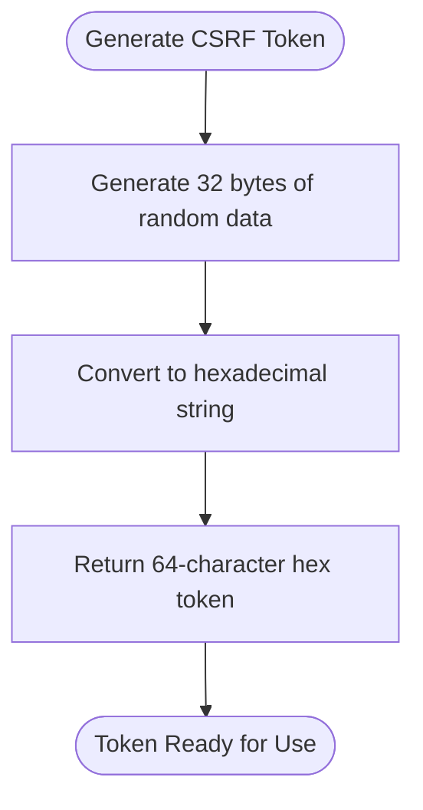
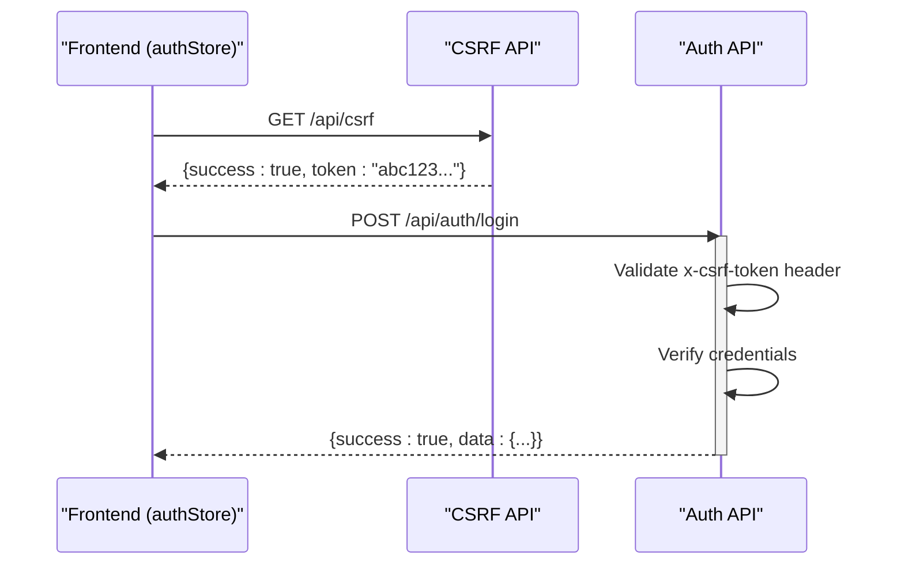
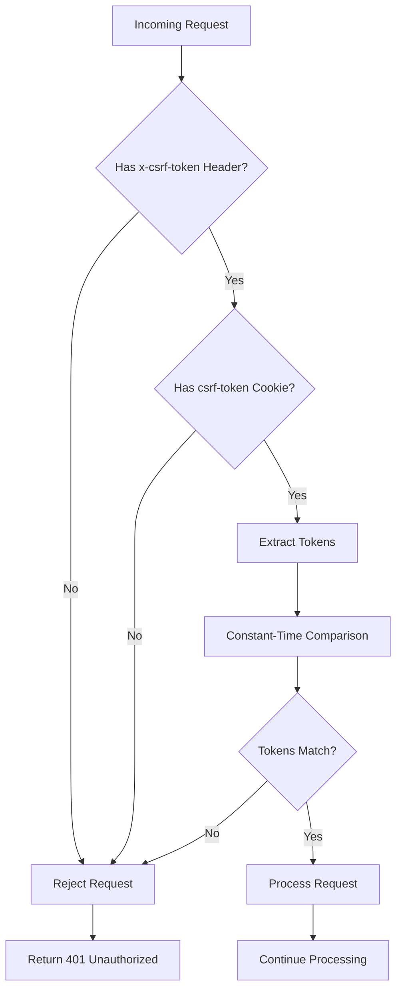
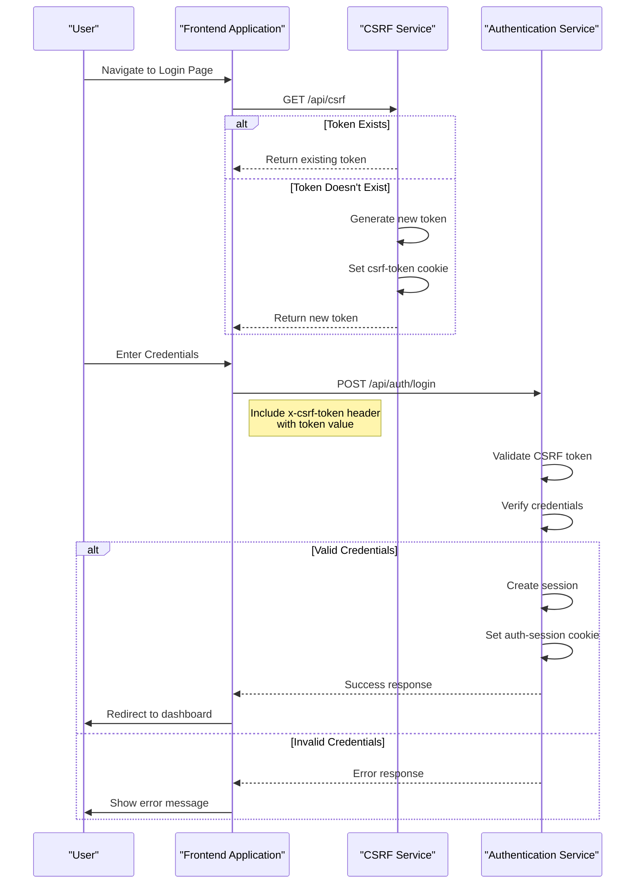

# CSRF Protection

<cite>
**Referenced Files in This Document**   
- [csrf.ts](file://src/lib/csrf.ts)
- [route.ts](file://src/app/api/csrf/route.ts)
- [authStore.ts](file://src/stores/authStore.ts)
- [login/route.ts](file://src/app/api/auth/login/route.ts)
</cite>

## Table of Contents

1. [Introduction](#introduction)
2. [CSRF Token Generation](#csrf-token-generation)
3. [Token Storage and Client-Side Access](#token-storage-and-client-side-access)
4. [Client-Side Integration](#client-side-integration)
5. [Server-Side Validation](#server-side-validation)
6. [Security Considerations](#security-considerations)
7. [Complete CSRF Flow](#complete-csrf-flow)
8. [Conclusion](#conclusion)

## Introduction

The Kafkasder-panel implements a robust Cross-Site Request Forgery (CSRF) protection mechanism to safeguard state-changing operations, particularly the authentication process. This documentation details the comprehensive CSRF protection system that combines cryptographically secure token generation, the double-submit cookie pattern, and strict server-side validation. The mechanism ensures that only legitimate requests originating from the application's frontend can perform sensitive operations like user login, preventing malicious third-party sites from forging authenticated requests on behalf of users.

**Section sources**

- [csrf.ts](file://src/lib/csrf.ts#L1-L5)
- [route.ts](file://src/app/api/csrf/route.ts#L5-L7)

## CSRF Token Generation

The CSRF protection mechanism begins with the generation of cryptographically secure tokens using Node.js's built-in `crypto` module. The `generateCsrfToken` function creates unpredictable, random tokens that are resistant to guessing attacks. Each token is 32 bytes (256 bits) long, providing a sufficiently large entropy space to prevent brute-force attacks. The tokens are generated using `randomBytes`, which leverages the operating system's cryptographically secure random number generator, ensuring that the tokens are suitable for security-sensitive applications.



**Diagram sources**

- [csrf.ts](file://src/lib/csrf.ts#L13-L15)

**Section sources**

- [csrf.ts](file://src/lib/csrf.ts#L8-L15)

## Token Storage and Client-Side Access

The system implements a double-submit cookie pattern for CSRF protection, where the same token value is stored in both an HTTP cookie and submitted as a request header. The CSRF token is stored in a non-HttpOnly cookie named `csrf-token`, which allows client-side JavaScript to access the token value. This design decision enables the frontend application to retrieve the token and include it in subsequent requests. The cookie is configured with `SameSite: 'strict'` to prevent cross-site requests from sending the cookie, and `Secure: true` in production to ensure transmission only over HTTPS. The token has a 24-hour expiration period, after which a new token is generated, implementing token rotation for enhanced security.

```mermaid
flowchart TD
A[Client Request] --> B{CSRF Token Exists?}
B --> |No| C[Generate New Token]
C --> D[Set csrf-token Cookie]
D --> E[httpOnly: false]
D --> F[secure: true (production)]
D --> G[sameSite: strict]
D --> H[maxAge: 24 hours]
B --> |Yes| I[Use Existing Token]
I --> J[Return Token in Response]
```

**Diagram sources**

- [route.ts](file://src/app/api/csrf/route.ts#L17-L27)

**Section sources**

- [route.ts](file://src/app/api/csrf/route.ts#L14-L27)

## Client-Side Integration

The integration between the frontend authentication store and the CSRF workflow is a critical component of the security mechanism. The `authStore` manages the authentication state and implements the login workflow, which begins with fetching the CSRF token before submitting login credentials. When a user attempts to log in, the store first makes a request to the `/api/csrf` endpoint to obtain a valid CSRF token. This token is then included in the `x-csrf-token` header of the subsequent login request. This sequential process ensures that the client always has a valid token before attempting authentication, and it prevents race conditions that could occur if token retrieval and login were attempted simultaneously.



**Diagram sources**

- [authStore.ts](file://src/stores/authStore.ts#L153-L164)
- [login/route.ts](file://src/app/api/auth/login/route.ts#L145-L147)

**Section sources**

- [authStore.ts](file://src/stores/authStore.ts#L145-L164)

## Server-Side Validation

The server implements strict validation of CSRF tokens to ensure request authenticity. When a login request is received, the server compares the token in the `x-csrf-token` header with the token stored in the `csrf-token` cookie. The validation process uses a constant-time comparison algorithm to prevent timing attacks that could potentially reveal information about the token through response time differences. If the tokens do not match or if either token is missing, the request is rejected with a 401 Unauthorized status. The validation occurs before any sensitive operations are performed, providing an early security check that protects against CSRF attacks.



**Diagram sources**

- [csrf.ts](file://src/lib/csrf.ts#L27-L44)
- [login/route.ts](file://src/app/api/auth/login/route.ts#L145-L147)

**Section sources**

- [csrf.ts](file://src/lib/csrf.ts#L27-L44)
- [login/route.ts](file://src/app/api/auth/login/route.ts#L145-L147)

## Security Considerations

The CSRF protection mechanism incorporates several security best practices to provide comprehensive protection against cross-site request forgery attacks. The use of cryptographically secure random tokens ensures that attackers cannot predict or guess valid tokens. The 24-hour token expiration implements token rotation, limiting the window of opportunity for any potential token compromise. The double-submit cookie pattern, combined with the `SameSite: 'strict'` attribute, provides defense in depth by requiring the attacker to both read the token value (which is protected by the same-origin policy) and submit it in a header. The constant-time comparison prevents timing attacks that could be used to gradually discover the token value. Additionally, the separation of concerns between the CSRF token (used for request validation) and the authentication session (stored in an HttpOnly cookie) follows the principle of least privilege.

**Section sources**

- [csrf.ts](file://src/lib/csrf.ts#L8-L9)
- [route.ts](file://src/app/api/csrf/route.ts#L22-L26)
- [login/route.ts](file://src/app/api/auth/login/route.ts#L173-L179)

## Complete CSRF Flow

The complete CSRF validation flow demonstrates the end-to-end process from token generation to validation. When a user accesses the login page, the authentication store automatically fetches a CSRF token from the `/api/csrf` endpoint. If no token exists, the server generates a new one and sets it in the `csrf-token` cookie. The client then uses this token to make a login request to `/api/auth/login`, including the token in the `x-csrf-token` header. The server validates that the header token matches the cookie token before processing the authentication request. This complete flow ensures that only requests originating from the legitimate application frontend can successfully authenticate, as third-party sites cannot read the CSRF token value due to the same-origin policy.



**Diagram sources**

- [route.ts](file://src/app/api/csrf/route.ts#L9-L33)
- [authStore.ts](file://src/stores/authStore.ts#L153-L174)
- [login/route.ts](file://src/app/api/auth/login/route.ts#L23-L207)

**Section sources**

- [route.ts](file://src/app/api/csrf/route.ts#L9-L33)
- [authStore.ts](file://src/stores/authStore.ts#L153-L174)
- [login/route.ts](file://src/app/api/auth/login/route.ts#L23-L207)

## Conclusion

The CSRF protection mechanism in Kafkasder-panel provides a robust defense against cross-site request forgery attacks through a combination of cryptographically secure token generation, the double-submit cookie pattern, and strict server-side validation. By requiring clients to include a token in both a cookie and a request header, the system ensures that only legitimate requests from the application's origin can perform sensitive operations. The integration between the frontend authentication store and the CSRF workflow creates a seamless user experience while maintaining high security standards. The implementation follows security best practices including token rotation, constant-time comparison, and proper cookie attributes, making it resistant to common attack vectors. This comprehensive approach to CSRF protection helps maintain the integrity and security of user sessions within the application.
