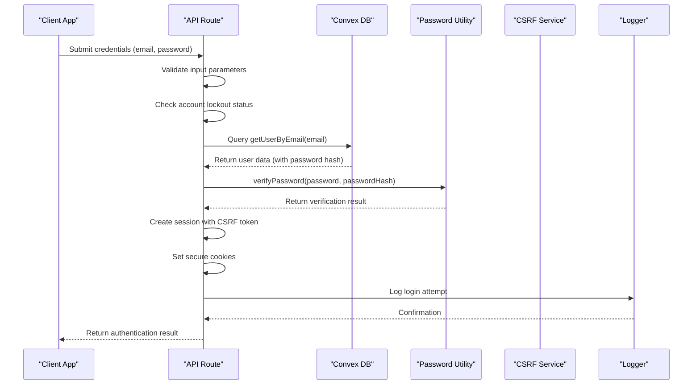
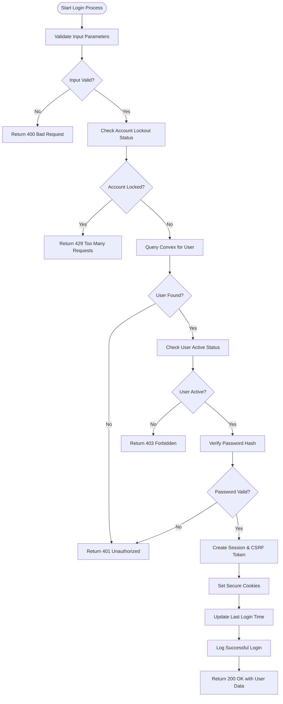
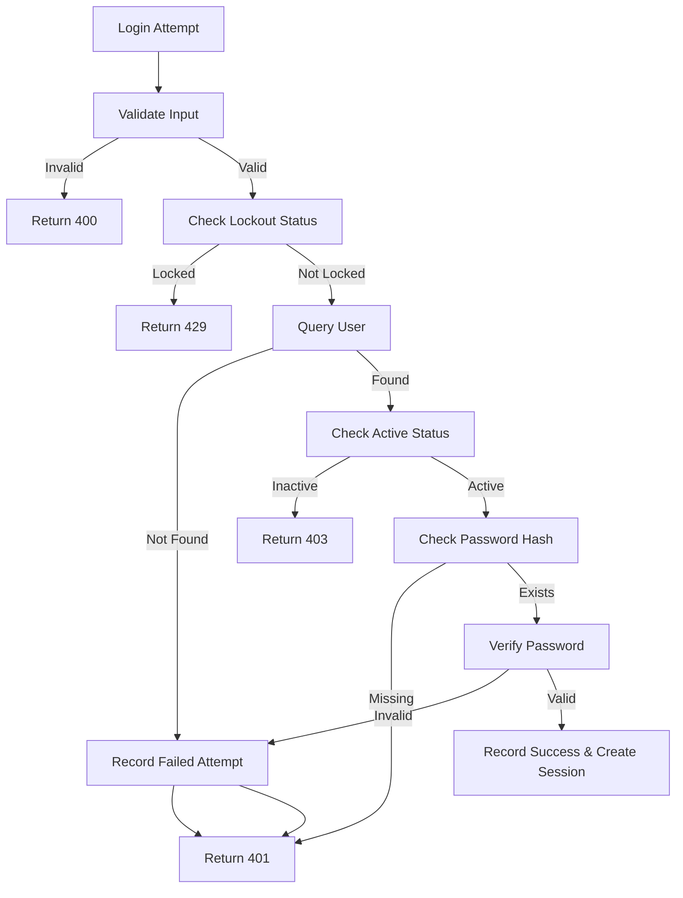
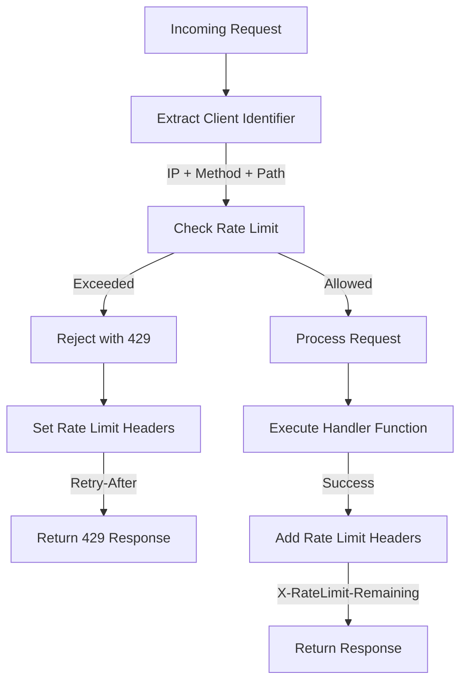
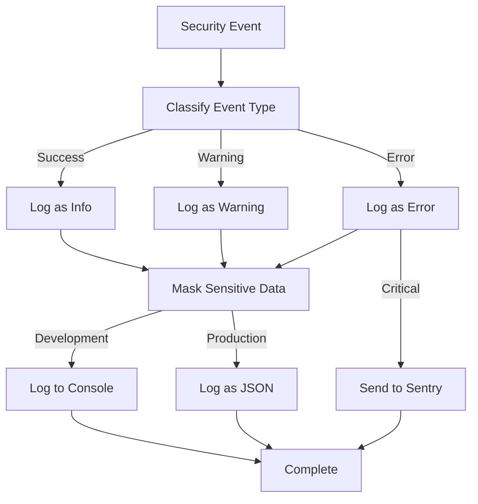

# Login Flow

<cite>
**Referenced Files in This Document**   
- [src/app/api/auth/login/route.ts](file://src/app/api/auth/login/route.ts)
- [convex/auth.ts](file://convex/auth.ts)
- [src/lib/auth/password.ts](file://src/lib/auth/password.ts)
- [src/lib/rate-limit.ts](file://src/lib/rate-limit.ts)
- [src/lib/csrf.ts](file://src/lib/csrf.ts)
- [src/lib/logger.ts](file://src/lib/logger.ts)
- [src/lib/auth/account-lockout.ts](file://src/lib/auth/account-lockout.ts)
</cite>

## Table of Contents

1. [Introduction](#introduction)
2. [Login Flow Overview](#login-flow-overview)
3. [Step-by-Step Authentication Process](#step-by-step-authentication-process)
4. [Error Handling Strategy](#error-handling-strategy)
5. [Rate Limiting Implementation](#rate-limiting-implementation)
6. [CSRF Protection and Session Management](#csrf-protection-and-session-management)
7. [Security Auditing with Logger](#security-auditing-with-logger)
8. [Conclusion](#conclusion)

## Introduction

The login flow authentication sub-component is a critical security feature that handles user authentication through a multi-step process. This document provides a comprehensive analysis of the login flow, detailing the step-by-step authentication process, error handling strategies, rate limiting implementation, CSRF protection, session management, and security auditing. The system is designed with security best practices in mind, including protection against brute force attacks, secure password verification, and comprehensive logging for security monitoring.

**Section sources**

- [src/app/api/auth/login/route.ts](file://src/app/api/auth/login/route.ts)

## Login Flow Overview

The login flow follows a structured sequence of operations that begins with the client submitting credentials and ends with the establishment of a secure authenticated session. The process involves multiple layers of validation, security checks, and state management to ensure both security and usability.



**Diagram sources**

- [src/app/api/auth/login/route.ts](file://src/app/api/auth/login/route.ts)
- [convex/auth.ts](file://convex/auth.ts)
- [src/lib/auth/password.ts](file://src/lib/auth/password.ts)
- [src/lib/csrf.ts](file://src/lib/csrf.ts)
- [src/lib/logger.ts](file://src/lib/logger.ts)

**Section sources**

- [src/app/api/auth/login/route.ts](file://src/app/api/auth/login/route.ts)

## Step-by-Step Authentication Process

The authentication process follows a well-defined sequence of steps that ensures security while providing a smooth user experience. Each step builds upon the previous one, creating a robust authentication pipeline.

### 1. Client Submits Credentials

The login flow begins when a client application submits user credentials through a POST request to the `/api/auth/login` endpoint. The request includes the user's email address and password in the request body.

### 2. API Route Validates Input

The API route first validates the input parameters to ensure both email and password are provided. This validation occurs in the initial part of the POST handler function.



**Diagram sources**

- [src/app/api/auth/login/route.ts](file://src/app/api/auth/login/route.ts)

### 3. Queries Convex getUserByEmail

After input validation, the system queries the Convex database to retrieve user information using the `getUserByEmail` function. This function performs a database lookup using the email address as a key.

### 4. Verifies Password Hash Using Bcrypt

The password verification process uses the bcrypt algorithm to securely compare the provided password with the stored hash. The `verifyPassword` utility function handles this comparison in a secure manner.

### 5. Creates Session with CSRF Protection

Upon successful authentication, the system creates a session with CSRF protection by generating a CSRF token and setting secure cookies. This ensures that subsequent requests are authenticated and protected against cross-site request forgery attacks.

### 6. Sets Secure Cookies

The authentication process concludes by setting secure cookies that maintain the user's authenticated state. These cookies include the session information and CSRF token, both configured with appropriate security flags.

**Section sources**

- [src/app/api/auth/login/route.ts](file://src/app/api/auth/login/route.ts)
- [convex/auth.ts](file://convex/auth.ts)
- [src/lib/auth/password.ts](file://src/lib/auth/password.ts)
- [src/lib/csrf.ts](file://src/lib/csrf.ts)

## Error Handling Strategy

The login flow implements a comprehensive error handling strategy that addresses various failure scenarios with appropriate HTTP status codes and user-friendly messages. This approach balances security requirements with user experience considerations.

### Failure Scenarios and Responses

| Failure Scenario      | HTTP Status Code      | Response Structure                                                                             | User Message                                                     |
| --------------------- | --------------------- | ---------------------------------------------------------------------------------------------- | ---------------------------------------------------------------- |
| Missing credentials   | 400 Bad Request       | `{success: false, error: "Email ve şifre gereklidir"}`                                         | "Email ve şifre gereklidir"                                      |
| Account locked        | 429 Too Many Requests | `{success: false, error: "Hesap geçici olarak kilitlendi...", locked: true, remainingSeconds}` | "Hesap geçici olarak kilitlendi. X dakika sonra tekrar deneyin." |
| Invalid credentials   | 401 Unauthorized      | `{success: false, error: "Geçersiz email veya şifre", remainingAttempts}`                      | "Geçersiz email veya şifre"                                      |
| Inactive account      | 403 Forbidden         | `{success: false, error: "Hesap aktif değil"}`                                                 | "Hesap aktif değil"                                              |
| Missing password hash | 401 Unauthorized      | `{success: false, error: "Geçersiz email veya şifre"}`                                         | "Geçersiz email veya şifre"                                      |
| Internal server error | 500 Internal Server   | `{success: false, error: errorMessage}`                                                        | "Giriş yapılırken bir hata oluştu"                               |

### Error Handling Implementation

The error handling is implemented through a combination of validation checks, conditional responses, and a try-catch block that captures unexpected errors. Each failure scenario triggers appropriate logging for security auditing purposes.



**Diagram sources**

- [src/app/api/auth/login/route.ts](file://src/app/api/auth/login/route.ts)
- [src/lib/auth/account-lockout.ts](file://src/lib/auth/account-lockout.ts)

**Section sources**

- [src/app/api/auth/login/route.ts](file://src/app/api/auth/login/route.ts)
- [src/lib/auth/account-lockout.ts](file://src/lib/auth/account-lockout.ts)

## Rate Limiting Implementation

The login flow incorporates rate limiting through the `authRateLimit` middleware to prevent brute force attacks. This security measure limits the number of login attempts from a single client within a specified time window.

### Rate Limiting Configuration

The rate limiting is configured with the following parameters:

- **Maximum requests**: 10 attempts per 10 minutes (configurable via environment variables)
- **Window duration**: 10 minutes (600,000 milliseconds)
- **Skip successful requests**: True (successful login attempts do not count toward the limit)
- **Skip failed requests**: True (failed login attempts do not count toward the limit)

### Rate Limiting Flow



The rate limiting system uses the client's IP address combined with the request method and path to create a unique identifier for tracking request frequency. When the limit is exceeded, the system returns a 429 Too Many Requests status code with appropriate headers indicating the retry timeframe.

**Diagram sources**

- [src/lib/rate-limit.ts](file://src/lib/rate-limit.ts)

**Section sources**

- [src/lib/rate-limit.ts](file://src/lib/rate-limit.ts)

## CSRF Protection and Session Management

The login flow implements robust CSRF protection and session management to ensure the security of authenticated sessions.

### CSRF Protection Mechanism

CSRF protection is implemented using a token-based approach where:

1. A cryptographically secure CSRF token is generated using `crypto.randomBytes`
2. The token is stored in a non-HttpOnly cookie accessible to client-side JavaScript
3. The token must be included in a custom header (`x-csrf-token`) for state-changing operations
4. The server validates the token using constant-time comparison to prevent timing attacks

### Session Management

Session management is handled through secure HTTP-only cookies that store session information:

- **Session cookie**: `auth-session` (HttpOnly, secure, sameSite=strict)
- **CSRF token cookie**: `csrf-token` (non-HttpOnly, secure, sameSite=strict)
- **Session expiration**: 24 hours (or 30 days if "remember me" is selected)
- **Session data**: Contains session ID, user ID, and expiration time

```mermaid
classDiagram
class SessionManager {
+generateCsrfToken() string
+validateCsrfToken(token, expected) boolean
+setSessionCookies(sessionData, csrfToken) void
+clearSessionCookies() void
}
class SessionData {
+sessionId string
+userId string
+expire string
}
class CsrfToken {
+token string
+timestamp number
}
SessionManager --> SessionData : "creates"
SessionManager --> CsrfToken : "generates"
SessionManager --> "auth-session cookie" : "sets"
SessionManager --> "csrf-token cookie" : "sets"
```

**Diagram sources**

- [src/lib/csrf.ts](file://src/lib/csrf.ts)
- [src/app/api/auth/login/route.ts](file://src/app/api/auth/login/route.ts)

**Section sources**

- [src/lib/csrf.ts](file://src/lib/csrf.ts)
- [src/app/api/auth/login/route.ts](file://src/app/api/auth/login/route.ts)

## Security Auditing with Logger

The login flow incorporates comprehensive logging for security auditing purposes, recording both successful and failed login attempts with appropriate context.

### Logging Implementation

The logger records various events throughout the login process:

- **Successful logins**: Info level with user ID, email (partially masked), and role
- **Failed logins**: Warning level with email (partially masked) and reason
- **Account lockouts**: Warning level with email and remaining lockout time
- **Internal errors**: Error level with full error details (in development) or generic message (in production)

### Log Context and Security

The logging system includes several security features:

- **Sensitive data masking**: Email addresses are partially masked in logs
- **Error truncation**: Stack traces are truncated in production to prevent information disclosure
- **Sentry integration**: Critical errors are reported to Sentry for monitoring
- **Context enrichment**: Logs include request context like IP address, user agent, and endpoint



**Diagram sources**

- [src/lib/logger.ts](file://src/lib/logger.ts)
- [src/app/api/auth/login/route.ts](file://src/app/api/auth/login/route.ts)

**Section sources**

- [src/lib/logger.ts](file://src/lib/logger.ts)
- [src/app/api/auth/login/route.ts](file://src/app/api/auth/login/route.ts)

## Conclusion

The login flow authentication sub-component implements a secure and robust authentication process that follows security best practices. The system effectively balances security requirements with user experience considerations through its multi-layered approach to authentication, error handling, and security monitoring.

Key strengths of the implementation include:

- Comprehensive input validation and error handling
- Protection against brute force attacks through rate limiting
- Secure password verification using bcrypt
- CSRF protection for authenticated sessions
- Comprehensive logging for security auditing
- Proper session management with secure cookies

The code structure is well-organized, with clear separation of concerns between different components (API route, database queries, password utilities, rate limiting, CSRF protection, and logging). This modular design makes the system maintainable and extensible while ensuring that each component focuses on a specific aspect of the authentication process.

**Section sources**

- [src/app/api/auth/login/route.ts](file://src/app/api/auth/login/route.ts)
- [convex/auth.ts](file://convex/auth.ts)
- [src/lib/auth/password.ts](file://src/lib/auth/password.ts)
- [src/lib/rate-limit.ts](file://src/lib/rate-limit.ts)
- [src/lib/csrf.ts](file://src/lib/csrf.ts)
- [src/lib/logger.ts](file://src/lib/logger.ts)
- [src/lib/auth/account-lockout.ts](file://src/lib/auth/account-lockout.ts)
