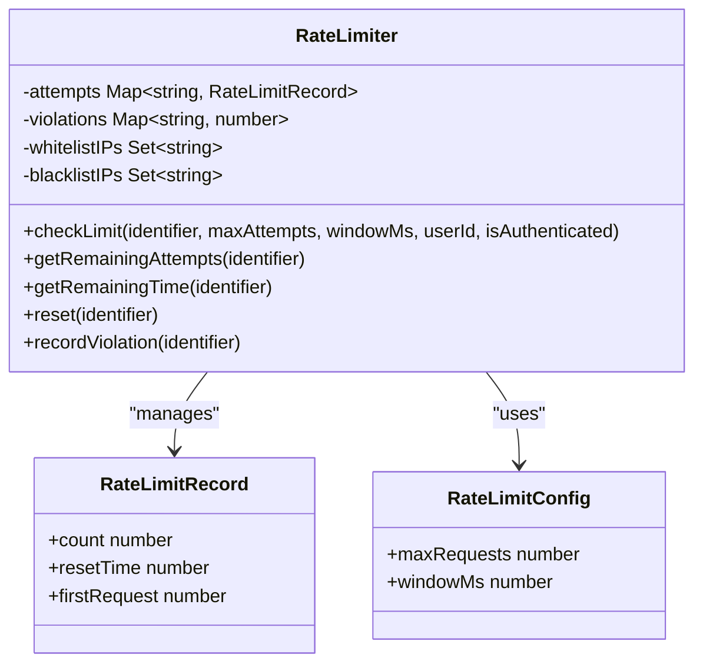
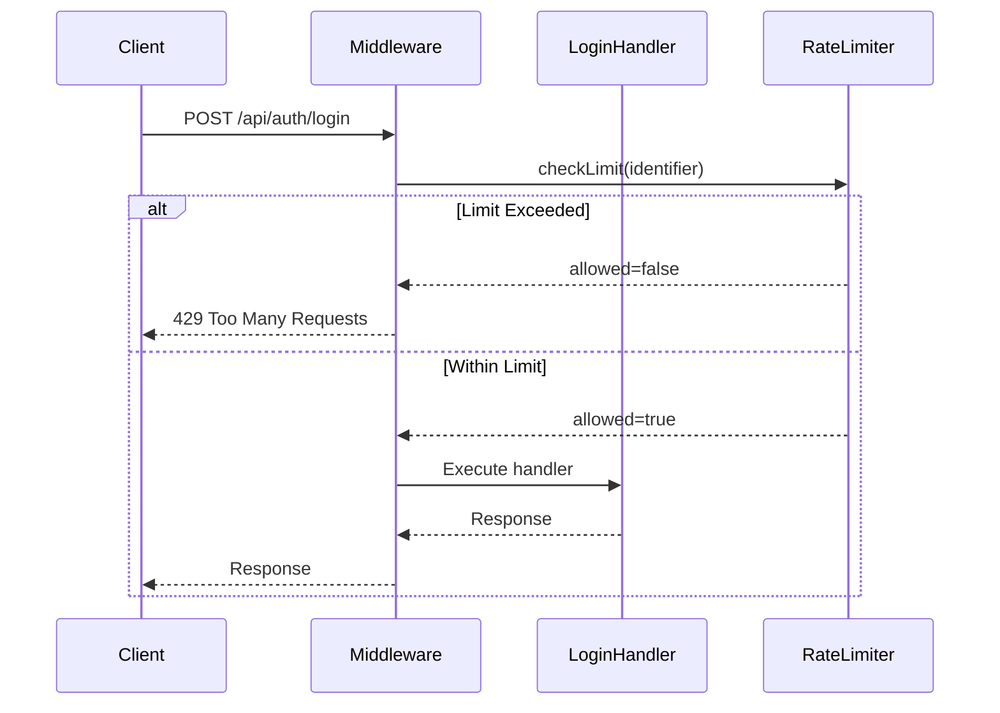
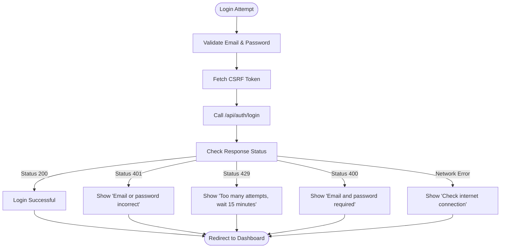

# Rate Limiting

<cite>
**Referenced Files in This Document**   
- [rate-limit.ts](file://src/lib/rate-limit.ts)
- [security.ts](file://src/lib/security.ts)
- [rate-limit-config.ts](file://src/lib/rate-limit-config.ts)
- [login/route.ts](file://src/app/api/auth/login/route.ts)
- [authStore.ts](file://src/stores/authStore.ts)
</cite>

## Table of Contents

1. [Introduction](#introduction)
2. [Configuration Options](#configuration-options)
3. [Core Implementation](#core-implementation)
4. [Middleware Application](#middleware-application)
5. [Frontend Error Handling](#frontend-error-handling)
6. [Storage Mechanism](#storage-mechanism)
7. [Security Features](#security-features)
8. [Rate Limit Headers](#rate-limit-headers)

## Introduction

The rate limiting system protects authentication endpoints from brute force attacks by enforcing request limits based on client IP addresses. The system uses the `authRateLimit` middleware to wrap the login route, preventing excessive login attempts. When limits are exceeded, the system returns a 429 status code with appropriate error messaging. The implementation supports both in-memory storage and can be extended to Redis for distributed environments. The configuration is environment-driven, allowing flexible adjustment of limits across deployment environments.

**Section sources**

- [rate-limit.ts](file://src/lib/rate-limit.ts#L1-L148)
- [security.ts](file://src/lib/security.ts#L77-L279)

## Configuration Options

The rate limiting system provides configurable parameters through environment variables. The authentication rate limiter is configured with a maximum of 10 requests per 10-minute window by default, though these values can be customized. The system includes special handling for authentication endpoints with `skipSuccessfulRequests` and `skipFailedRequests` options enabled, meaning neither successful nor failed login attempts increment the request counter. This prevents attackers from deliberately failing to exhaust limits. Additional security features include IP whitelisting and blacklisting through environment variables, allowing trusted IPs to bypass limits and blocked IPs to be permanently denied access.

**Section sources**

- [rate-limit.ts](file://src/lib/rate-limit.ts#L91-L99)
- [security.ts](file://src/lib/security.ts#L81-L97)

## Core Implementation

The rate limiting logic is implemented through the `RateLimiter` class in the security module, which maintains request counts in memory using JavaScript Maps. The system creates a unique identifier for each client based on IP address, HTTP method, and request path. For authentication endpoints, the `authRateLimit` function wraps the request handler with rate limiting logic that checks the client's request history against the configured limits. The implementation includes sophisticated features such as premium user multipliers (authenticated users receive higher limits) and automatic reset of counters when the time window expires. The system also tracks violations for monitoring and auditing purposes.

**Diagram sources**

- [security.ts](file://src/lib/security.ts#L77-L279)

**Section sources**

- [security.ts](file://src/lib/security.ts#L77-L279)
- [rate-limit.ts](file://src/lib/rate-limit.ts#L1-L148)

## Middleware Application

The `authRateLimit` middleware is applied directly to the login route handler in the authentication API endpoint. This implementation uses Next.js route handlers where the middleware wraps the POST handler function, ensuring rate limiting is enforced before any authentication logic executes. The middleware extracts the client IP from request headers, checking for forwarded, real, or client IP headers to accurately identify the client even behind proxies. When the rate limit is exceeded, the middleware immediately returns a 429 response with a user-friendly error message in Turkish, preventing further processing of the login attempt.

**Diagram sources**

- [login/route.ts](file://src/app/api/auth/login/route.ts#L23-L232)
- [rate-limit.ts](file://src/lib/rate-limit.ts#L11-L89)

**Section sources**

- [login/route.ts](file://src/app/api/auth/login/route.ts#L23-L232)
- [rate-limit.ts](file://src/lib/rate-limit.ts#L11-L89)

## Frontend Error Handling

The frontend auth store handles rate limit errors by presenting user-friendly messages when the 429 status code is received from the login endpoint. When a rate limit is hit, the store catches the error and displays a specific message advising the user to wait 15 minutes before trying again. The error handling is implemented in the login method of the `useAuthStore` store, which intercepts the fetch response and maps the 429 status code to an appropriate user-facing message. This provides a clear user experience while preventing brute force attacks. The store also handles other authentication errors, creating a comprehensive error handling system for the authentication flow.

**Diagram sources**

- [authStore.ts](file://src/stores/authStore.ts#L145-L191)

**Section sources**

- [authStore.ts](file://src/stores/authStore.ts#L145-L191)

## Storage Mechanism

The rate limiting system uses in-memory storage via JavaScript Maps to track request counts and violation records. The `RateLimiter` class maintains two primary data structures: a Map for tracking active request attempts and another Map for recording violations. Each request is identified by a composite key combining the client IP address, HTTP method, and request path, ensuring granular rate limiting per endpoint. While currently implemented with in-memory storage, the architecture supports extension to Redis or other distributed storage systems for multi-instance deployments. The in-memory approach provides low-latency access and automatic cleanup of expired records, with the entire state being ephemeral and reset on application restart.

**Section sources**

- [security.ts](file://src/lib/security.ts#L78-L80)
- [security.ts](file://src/lib/security.ts#L139-L176)

## Security Features

The rate limiting system includes multiple security features beyond basic request counting. IP whitelisting allows trusted addresses to bypass rate limits entirely, while IP blacklisting permanently denies access to specified addresses. The system also implements a premium user multiplier, granting higher rate limits to authenticated users, which helps prevent denial-of-service attacks against legitimate users. All rate limit violations are logged with detailed context for monitoring and incident response. The identifier construction includes the HTTP method and path, preventing cross-endpoint limit sharing and ensuring that different endpoints have independent rate limits. These features combine to create a robust defense against brute force attacks while minimizing impact on legitimate users.

**Section sources**

- [security.ts](file://src/lib/security.ts#L81-L128)
- [security.ts](file://src/lib/security.ts#L135-L138)

## Rate Limit Headers

When rate limits are applied, the system includes standard rate limiting headers in the response to provide clients with information about their rate limit status. These headers include `X-RateLimit-Remaining` which indicates how many requests remain in the current window, and `X-RateLimit-Reset` which provides an ISO timestamp of when the limit will reset. For exceeded limits, the `Retry-After` header is included with the number of seconds until the client can retry. These headers enable sophisticated client-side handling of rate limits, allowing applications to implement backoff strategies and provide accurate feedback to users about when they can make additional requests.

**Section sources**

- [rate-limit.ts](file://src/lib/rate-limit.ts#L44-L58)
- [rate-limit.ts](file://src/lib/rate-limit.ts#L75-L77)
