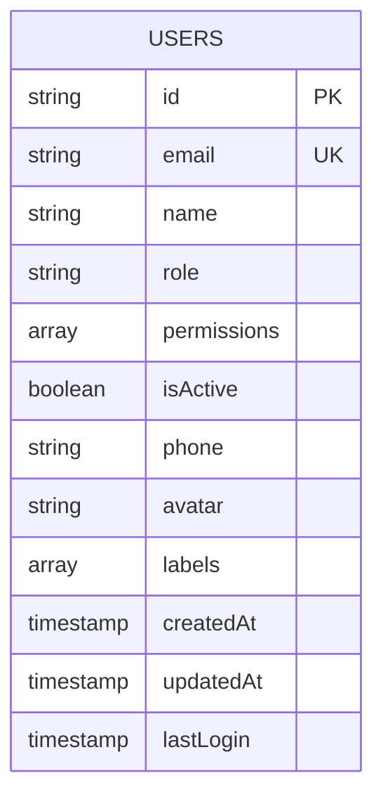
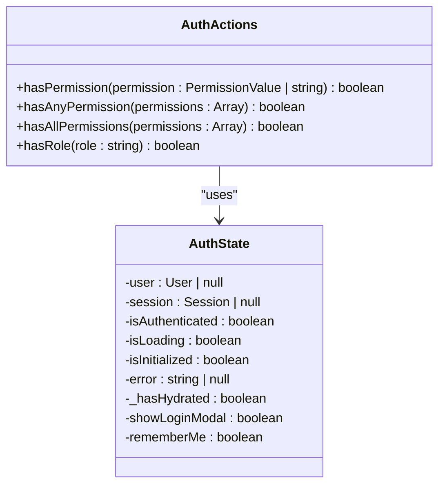
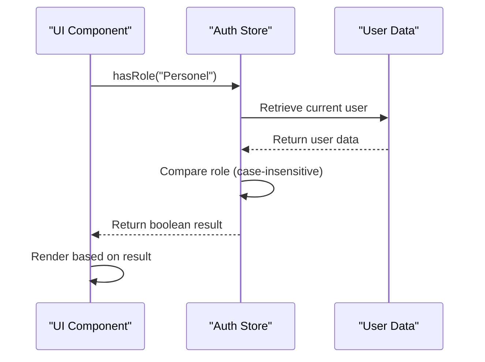
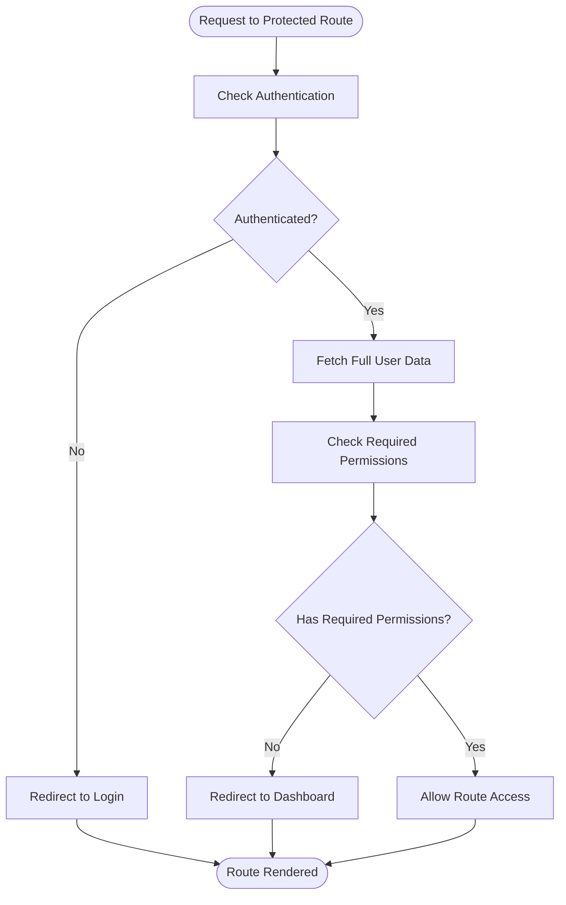
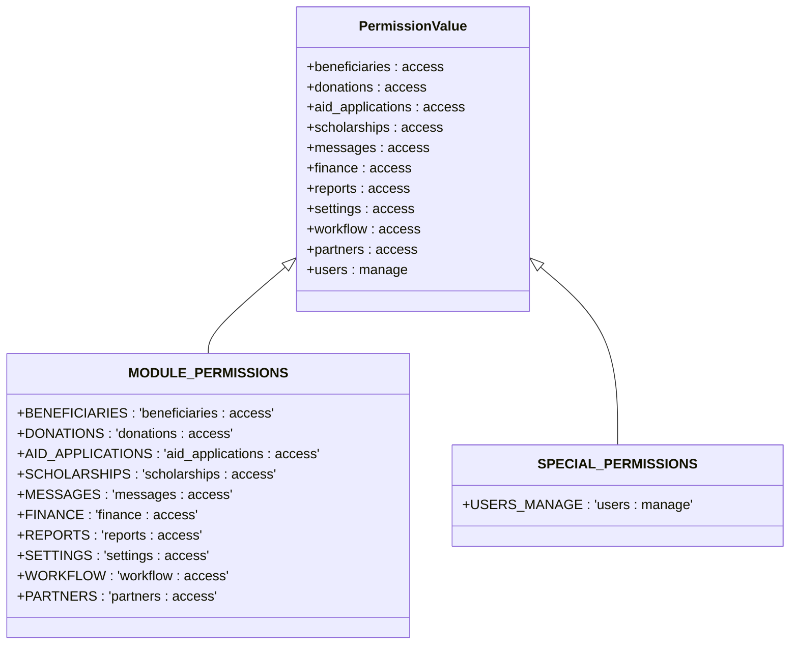
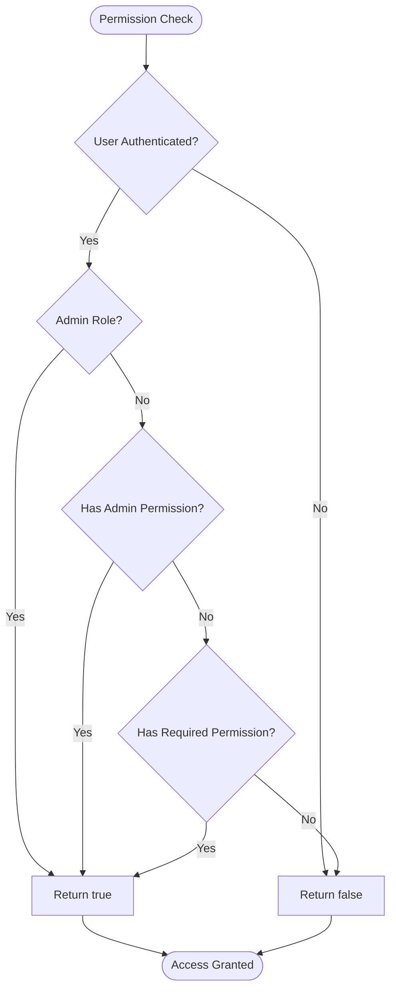

# Role-Based Access Control

<cite>
**Referenced Files in This Document**   
- [authStore.ts](file://src/stores/authStore.ts)
- [permissions.ts](file://src/types/permissions.ts)
- [users.ts](file://convex/users.ts)
- [auth-utils.ts](file://src/lib/api/auth-utils.ts)
- [proxy.ts](file://src/proxy.ts)
</cite>

## Table of Contents

1. [Introduction](#introduction)
2. [User Roles and Permissions Storage](#user-roles-and-permissions-storage)
3. [Permission Checking Methods](#permission-checking-methods)
4. [Role Checking Mechanism](#role-checking-mechanism)
5. [Protected Routes and User Data Retrieval](#protected-routes-and-user-data-retrieval)
6. [Type Safety and Error Handling](#type-safety-and-error-handling)
7. [Implementation Examples](#implementation-examples)

## Introduction

The role-based access control (RBAC) system in this application provides a comprehensive security framework for managing user access to various features and resources. The system combines role-based and permission-based authorization to enable fine-grained access control. This document explains how user roles and permissions are stored, retrieved, and evaluated throughout the application.

**Section sources**

- [authStore.ts](file://src/stores/authStore.ts)
- [permissions.ts](file://src/types/permissions.ts)

## User Roles and Permissions Storage

User roles and granular permissions are stored in the users collection within the Convex database. Each user document contains a role field that specifies the user's primary role (e.g., 'Personel') and a permissions array that stores the user's specific permission values. The permissions are defined as string literals following the pattern "module:access" (e.g., "beneficiaries:access", "donations:access"). During authentication, this data is retrieved from the database and stored in the client-side authentication store for quick access throughout the user's session.

**Diagram sources**

- [users.ts](file://convex/users.ts#L84-L220)

**Section sources**

- [users.ts](file://convex/users.ts#L84-L220)
- [authStore.ts](file://src/stores/authStore.ts#L65-L89)

## Permission Checking Methods

The authentication store implements several methods for checking user permissions: hasPermission, hasAnyPermission, and hasAllPermissions. These methods evaluate the current user's permissions against the required permissions for a given action or feature. The hasPermission method checks if the user has a specific permission, hasAnyPermission verifies if the user has at least one of the specified permissions, and hasAllPermissions ensures the user possesses all the required permissions. These methods are used extensively in UI components for feature gating, enabling or disabling functionality based on the user's authorization level.

**Diagram sources**

- [authStore.ts](file://src/stores/authStore.ts#L43-L47)
- [authStore.ts](file://src/stores/authStore.ts#L277-L305)

**Section sources**

- [authStore.ts](file://src/stores/authStore.ts#L43-L47)
- [auth-utils.ts](file://src/lib/api/auth-utils.ts#L29-L58)

## Role Checking Mechanism

The role checking mechanism is implemented through the hasRole method in the authentication store. This method compares the current user's role with the required role for a specific workflow or feature. The comparison is case-insensitive to ensure consistent behavior regardless of how roles are stored or specified. This mechanism enables role-specific workflows by allowing the application to conditionally render components or execute logic based on the user's role. For example, administrative features can be restricted to users with 'ADMIN' or 'SUPER_ADMIN' roles, while regular staff members have access to operational functionality.

**Diagram sources**

- [authStore.ts](file://src/stores/authStore.ts#L44)
- [authStore.ts](file://src/stores/authStore.ts#L284-L289)
- [auth-utils.ts](file://src/lib/api/auth-utils.ts#L60-L70)

**Section sources**

- [authStore.ts](file://src/stores/authStore.ts#L44)
- [auth-utils.ts](file://src/lib/api/auth-utils.ts#L60-L70)

## Protected Routes and User Data Retrieval

Protected routes use the getCurrentUserId function to extract the user ID from the authentication session and then fetch the full user data, including permissions, from the server. This process ensures that only authenticated users with appropriate permissions can access protected resources. The proxy middleware intercepts requests to protected routes and verifies the user's authentication status and permissions before allowing access. If the user is not authenticated, they are redirected to the login page with a redirect parameter to return to the requested resource after authentication.

**Diagram sources**

- [proxy.ts](file://src/proxy.ts#L103-L138)
- [proxy.ts](file://src/proxy.ts#L144-L227)

**Section sources**

- [proxy.ts](file://src/proxy.ts#L38-L98)
- [authStore.ts](file://src/stores/authStore.ts#L108-L142)

## Type Safety and Error Handling

The system provides type safety through the PermissionValue union type, which is derived from the ALL_PERMISSIONS constant. This ensures that only valid permission values can be used throughout the application, preventing typos and invalid permission checks. The system handles missing or malformed permission data gracefully by treating undefined or empty permissions arrays as having no permissions. In cases where permission data is malformed, the system defaults to denying access to maintain security. This approach ensures robust error handling while maintaining the integrity of the access control system.

**Diagram sources**

- [permissions.ts](file://src/types/permissions.ts#L1-L39)
- [auth-utils.ts](file://src/lib/api/auth-utils.ts#L10-L11)

**Section sources**

- [permissions.ts](file://src/types/permissions.ts#L1-L39)
- [authStore.ts](file://src/stores/authStore.ts#L14-L15)

## Implementation Examples

The permission evaluation logic in authStore.ts demonstrates how the system checks user permissions in a real-world context. The hasPermission method first verifies that a user is authenticated and then checks if the user's permissions array includes the required permission. Administrative users (those with 'ADMIN' or 'SUPER_ADMIN' roles) or users with the 'users:manage' special permission automatically have all permissions, implementing a privilege escalation mechanism. This logic is applied consistently across the application, ensuring a uniform security model for all features and resources.

**Diagram sources**

- [authStore.ts](file://src/stores/authStore.ts#L277-L282)
- [auth-utils.ts](file://src/lib/api/auth-utils.ts#L29-L41)

**Section sources**

- [authStore.ts](file://src/stores/authStore.ts#L277-L305)
- [auth-utils.ts](file://src/lib/api/auth-utils.ts#L29-L70)
