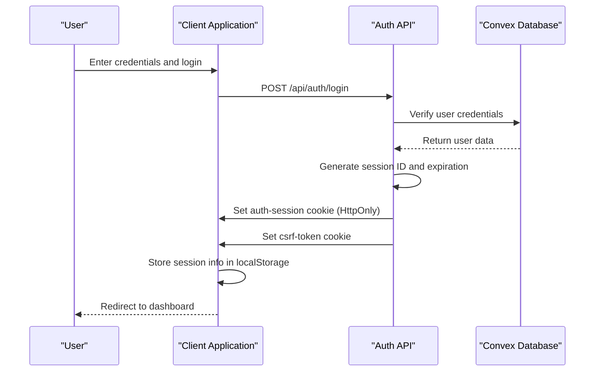
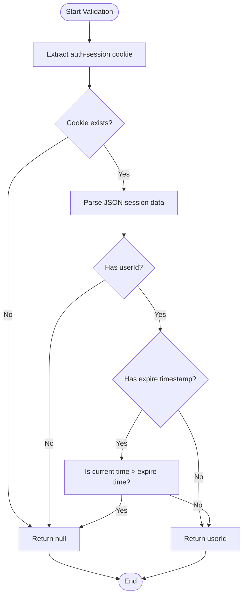
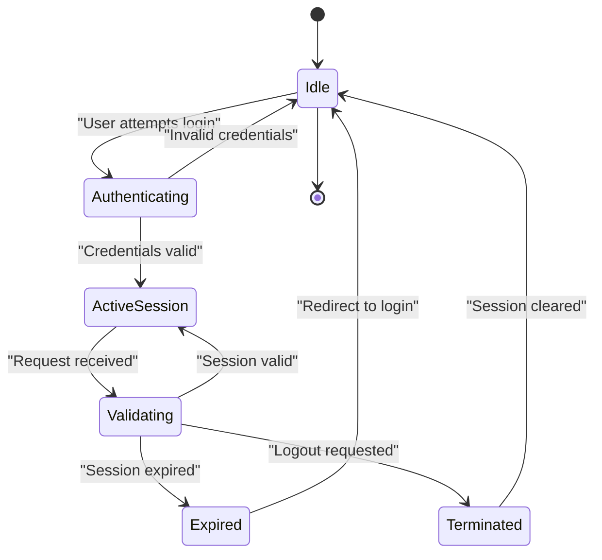
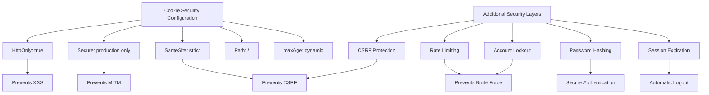
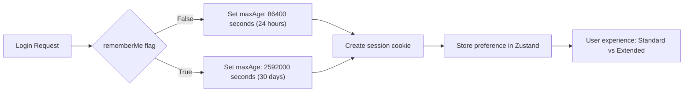
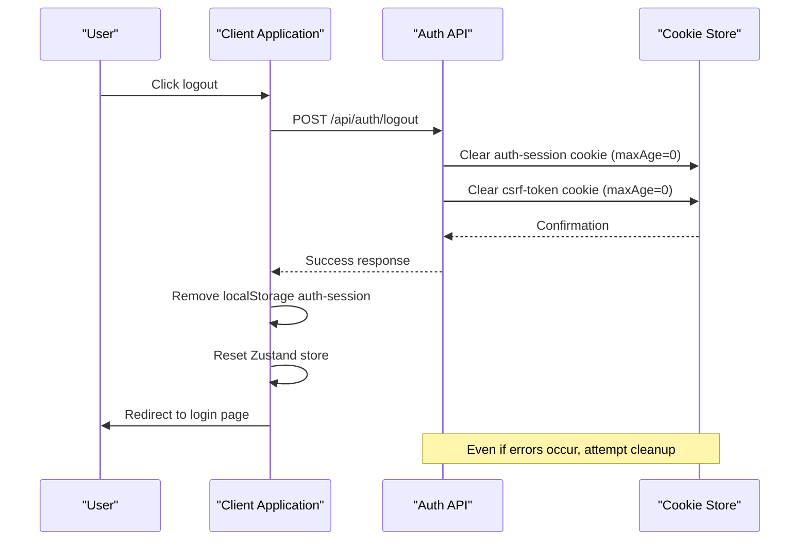

# Session Management

<cite>
**Referenced Files in This Document**   
- [session.ts](file://src/lib/auth/session.ts)
- [get-user.ts](file://src/lib/auth/get-user.ts)
- [authStore.ts](file://src/stores/authStore.ts)
- [login/route.ts](file://src/app/api/auth/login/route.ts)
- [logout/route.ts](file://src/app/api/auth/logout/route.ts)
- [session/route.ts](file://src/app/api/auth/session/route.ts)
</cite>

## Table of Contents

1. [Introduction](#introduction)
2. [Session Creation](#session-creation)
3. [Session Validation](#session-validation)
4. [Session Lifecycle](#session-lifecycle)
5. [Client-Server Session Synchronization](#client-server-session-synchronization)
6. [Security Configuration](#security-configuration)
7. [Remember Me Functionality](#remember-me-functionality)
8. [Session Expiration and Cleanup](#session-expiration-and-cleanup)

## Introduction

The Kafkasder-panel session management system implements a secure authentication mechanism using both server-side HttpOnly cookies and client-side localStorage for optimal user experience. This dual-layer approach ensures security while maintaining session persistence across browser sessions. The system handles user authentication, session validation, and secure logout operations with comprehensive error handling and security measures.

## Session Creation

The session creation process begins when a user successfully authenticates through the login endpoint. Upon successful credential verification, the system creates a session object containing the user ID, session ID, and expiration timestamp. This session data is serialized and stored in an HttpOnly server-side cookie named "auth-session" with strict security configurations.

The session creation process includes:

- User credential validation against the Convex database
- Password hash verification using secure cryptographic methods
- Generation of a unique session ID
- Creation of expiration timestamp based on rememberMe flag
- Secure cookie configuration with HttpOnly, Secure, and SameSite=strict attributes



**Diagram sources**

- [login/route.ts](file://src/app/api/auth/login/route.ts#L149-L170)
- [authStore.ts](file://src/stores/authStore.ts#L190-L213)

**Section sources**

- [login/route.ts](file://src/app/api/auth/login/route.ts#L23-L231)
- [authStore.ts](file://src/stores/authStore.ts#L145-L227)

## Session Validation

The session validation process is implemented through the `getCurrentUserId` function, which parses and verifies the session cookie, checks expiration, and returns the authenticated user ID. This function is used throughout the application to verify user authentication status in API routes and server-side operations.

The validation process follows these steps:

1. Extract the auth-session cookie from the request or server cookie store
2. Parse the JSON session data
3. Validate the presence of required fields (userId)
4. Check session expiration by comparing the expire timestamp with current time
5. Return the user ID if session is valid, or null if invalid/expired



**Diagram sources**

- [get-user.ts](file://src/lib/auth/get-user.ts#L12-L47)
- [session.ts](file://src/lib/auth/session.ts#L27-L41)

**Section sources**

- [get-user.ts](file://src/lib/auth/get-user.ts#L12-L47)
- [session/route.ts](file://src/app/api/auth/session/route.ts#L1-L65)

## Session Lifecycle

The session lifecycle in Kafkasder-panel encompasses the complete journey from creation to cleanup, ensuring secure and reliable user authentication management. The lifecycle includes three main phases: creation, validation, and cleanup.

### Creation Phase

During login, the system creates a new session with appropriate expiration based on the rememberMe preference. The session data is stored in a secure HttpOnly cookie and optionally mirrored in localStorage for client-side access.

### Validation Phase

On each authenticated request, the system validates the session by checking the cookie's integrity and expiration status. The `getCurrentUserId` function serves as the primary validation mechanism, ensuring only valid sessions grant access to protected resources.

### Cleanup Phase

During logout, the system securely terminates the session by clearing both server-side cookies and client-side storage. This ensures complete session termination and prevents unauthorized access.



**Diagram sources**

- [login/route.ts](file://src/app/api/auth/login/route.ts#L149-L170)
- [logout/route.ts](file://src/app/api/auth/logout/route.ts#L14-L28)
- [get-user.ts](file://src/lib/auth/get-user.ts#L12-L47)

**Section sources**

- [login/route.ts](file://src/app/api/auth/login/route.ts#L23-L231)
- [logout/route.ts](file://src/app/api/auth/logout/route.ts#L9-L73)
- [get-user.ts](file://src/lib/auth/get-user.ts#L12-L47)

## Client-Server Session Synchronization

The session management system implements a sophisticated synchronization mechanism between server-side session state and client-side Zustand store. This dual-storage approach enhances user experience while maintaining security best practices.

The synchronization works as follows:

- Server-side: Session data is stored in HttpOnly cookies, inaccessible to JavaScript, preventing XSS attacks
- Client-side: Non-sensitive session information is stored in localStorage for persistence across browser sessions
- The Zustand store manages the application's authentication state, providing a reactive interface for UI components

When a user logs in:

1. The server sets the HttpOnly auth-session cookie with sensitive data
2. The client stores a reduced session object in localStorage containing only non-sensitive information
3. The Zustand store is updated with the current authentication state
4. On subsequent visits, the client initializes from localStorage while the server validates the HttpOnly cookie

```mermaid
classDiagram
class ServerSideSession {
+HttpOnly cookie
+Secure flag
+SameSite=strict
+sessionId
+userId
+expire timestamp
+maxAge
}
class ClientSideStorage {
+localStorage
+userId
+email
+name
+role
+permissions
+avatar
}
class ZustandStore {
+user : User | null
+session : Session | null
+isAuthenticated : boolean
+isLoading : boolean
+error : string | null
+rememberMe : boolean
}
ServerSideSession -->|Secure channel| ClientSideStorage : "Initial sync on login"
ClientSideStorage --> ZustandStore : "State initialization"
ZustandStore --> ClientSideStorage : "Persistence"
ZustandStore --> ServerSideSession : "API requests"
```

**Diagram sources**

- [authStore.ts](file://src/stores/authStore.ts#L16-L35)
- [login/route.ts](file://src/app/api/auth/login/route.ts#L190-L213)
- [session.ts](file://src/lib/auth/session.ts#L8-L12)

**Section sources**

- [authStore.ts](file://src/stores/authStore.ts#L91-L403)
- [login/route.ts](file://src/app/api/auth/login/route.ts#L167-L205)

## Security Configuration

The session management system implements robust security configurations to protect user sessions from common web vulnerabilities. The primary security measures include:

### Cookie Security Attributes

- **HttpOnly**: Prevents client-side JavaScript access to the session cookie, mitigating XSS attacks
- **Secure**: Ensures cookies are only sent over HTTPS connections in production
- **SameSite=strict**: Prevents CSRF attacks by restricting cookie sending to same-site requests
- **Path=/**: Limits cookie scope to the entire application

### Additional Security Measures

- CSRF token protection for state-changing operations
- Rate limiting on login attempts to prevent brute force attacks
- Account lockout after multiple failed login attempts
- Secure password hashing using industry-standard algorithms
- Session expiration enforcement on both client and server sides



**Diagram sources**

- [login/route.ts](file://src/app/api/auth/login/route.ts#L164-L169)
- [logout/route.ts](file://src/app/api/auth/logout/route.ts#L15-L18)
- [authStore.ts](file://src/stores/authStore.ts#L154-L156)

**Section sources**

- [login/route.ts](file://src/app/api/auth/login/route.ts#L156-L170)
- [logout/route.ts](file://src/app/api/auth/logout/route.ts#L14-L28)
- [csrf.ts](file://src/lib/csrf.ts)

## Remember Me Functionality

The rememberMe functionality provides users with the option to extend their session duration based on their preference. This feature balances convenience with security by offering two distinct session duration options:

- **Standard Session**: 24 hours expiration when rememberMe is false
- **Extended Session**: 30 days expiration when rememberMe is true

The system implements this functionality by dynamically setting the maxAge attribute of the auth-session cookie based on the rememberMe flag value provided during login. This allows users to choose between enhanced security (shorter sessions) and convenience (longer sessions without re-authentication).

The implementation ensures that:

- The rememberMe preference is stored in the client-side Zustand store
- Cookie maxAge is set appropriately (86400 seconds for standard, 2592000 seconds for extended)
- Expiration timestamps are calculated accurately on the server side
- Users can change their rememberMe preference on subsequent logins



**Diagram sources**

- [login/route.ts](file://src/app/api/auth/login/route.ts#L151-L153)
- [authStore.ts](file://src/stores/authStore.ts#L34-L35)

**Section sources**

- [login/route.ts](file://src/app/api/auth/login/route.ts#L151-L153)
- [authStore.ts](file://src/stores/authStore.ts#L149-L150)

## Session Expiration and Cleanup

The session expiration and cleanup mechanism ensures secure termination of user sessions through multiple coordinated processes. The system handles both natural expiration and manual logout scenarios with comprehensive cleanup procedures.

### Automatic Expiration

Sessions automatically expire based on their configured duration (24 hours or 30 days). When an expired session is detected:

- The server-side validation returns null for getCurrentUserId
- The client-side session endpoint returns a 401 status
- The auth-session cookie is automatically deleted
- The user is redirected to the login page

### Manual Cleanup (Logout)

During explicit logout operations, the system performs thorough cleanup:

- Server-side: HttpOnly auth-session and csrf-token cookies are cleared with maxAge=0
- Client-side: localStorage entry for auth-session is removed
- Zustand store is reset to initial state
- User is redirected to the login page

The cleanup process includes error handling to ensure cookies are cleared even if partial failures occur, maintaining security integrity.



**Diagram sources**

- [logout/route.ts](file://src/app/api/auth/logout/route.ts#L14-L28)
- [authStore.ts](file://src/stores/authStore.ts#L249-L268)
- [session/route.ts](file://src/app/api/auth/session/route.ts#L29-L31)

**Section sources**

- [logout/route.ts](file://src/app/api/auth/logout/route.ts#L9-L73)
- [authStore.ts](file://src/stores/authStore.ts#L248-L274)
- [session/route.ts](file://src/app/api/auth/session/route.ts#L1-L65)
