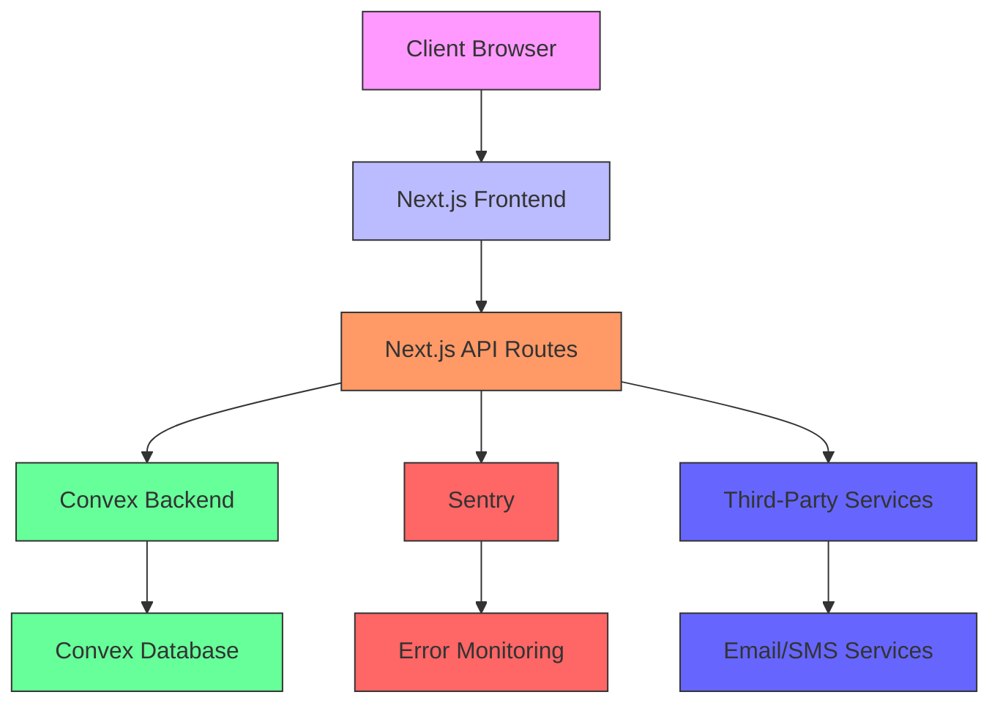
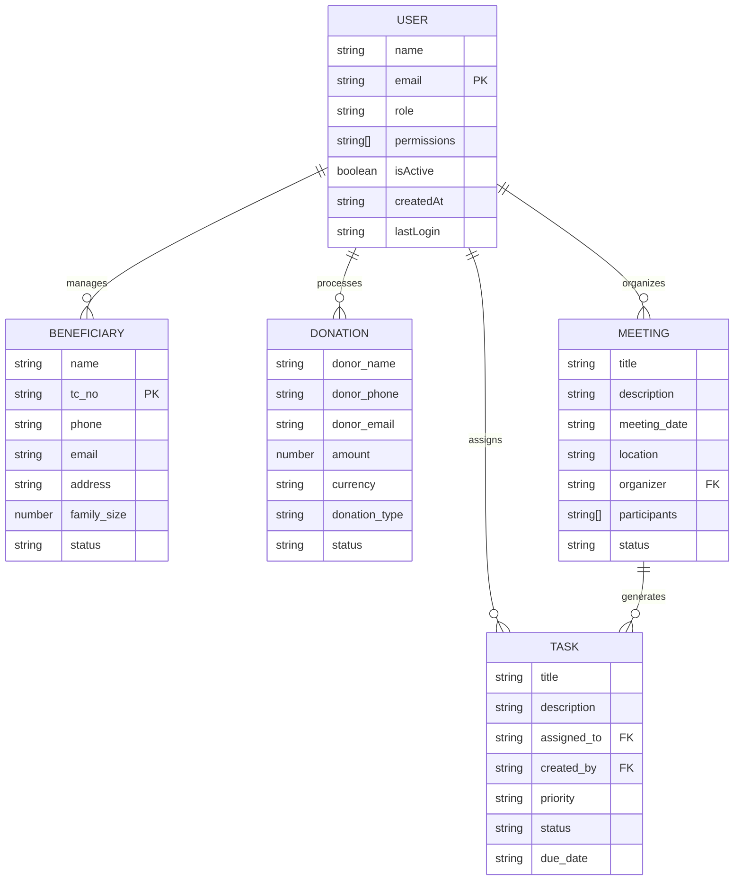
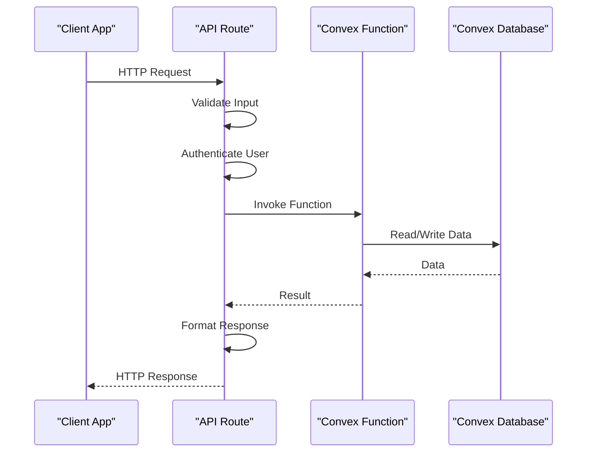
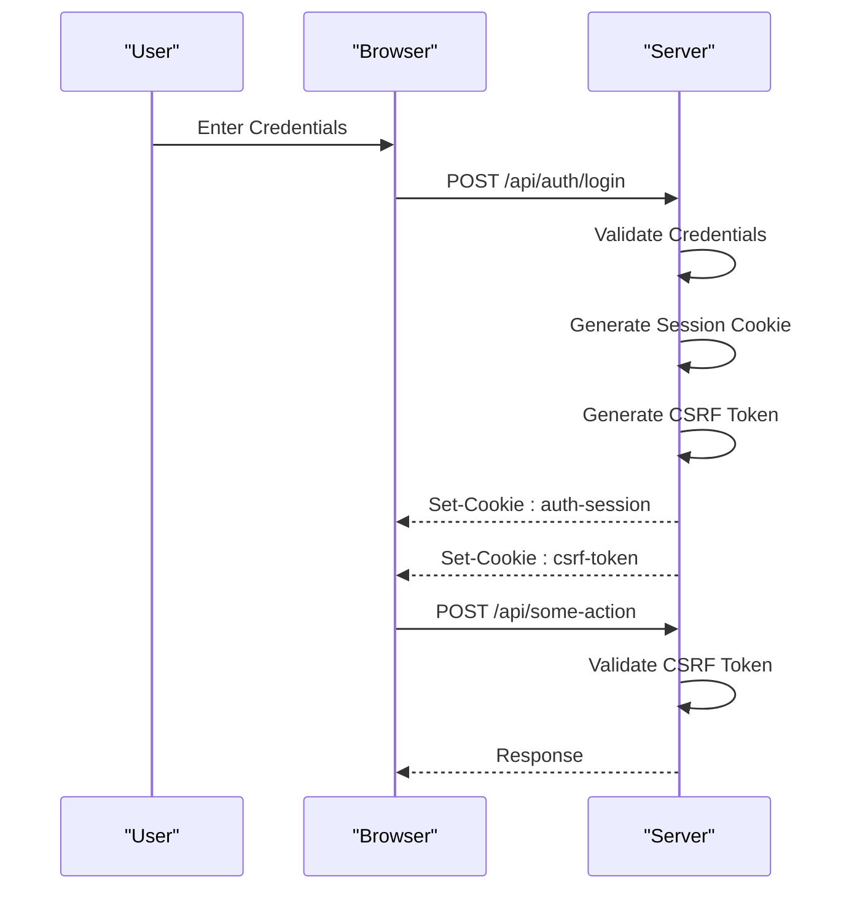
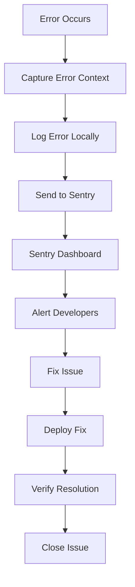

# Backend Architecture

<cite>
**Referenced Files in This Document**   
- [schema.ts](file://convex/schema.ts)
- [auth.ts](file://convex/auth.ts)
- [errors.ts](file://convex/errors.ts)
- [client.ts](file://src/lib/convex/client.ts)
- [server.ts](file://src/lib/convex/server.ts)
- [api.ts](file://src/lib/convex/api.ts)
- [auth-utils.ts](file://src/lib/api/auth-utils.ts)
- [csrf.ts](file://src/lib/csrf.ts)
- [rate-limit.ts](file://src/lib/rate-limit.ts)
- [error-tracker.ts](file://src/lib/error-tracker.ts)
- [session.ts](file://src/lib/auth/session.ts)
- [login/route.ts](file://src/app/api/auth/login/route.ts)
- [session/route.ts](file://src/app/api/auth/session/route.ts)
- [sentry.client.config.ts](file://sentry.client.config.ts)
- [sentry.server.config.ts](file://sentry.server.config.ts)
</cite>

## Table of Contents

1. [Introduction](#introduction)
2. [System Context](#system-context)
3. [Convex Architecture](#convex-architecture)
4. [API Routes and Convex Functions](#api-routes-and-convex-functions)
5. [Authentication Flow](#authentication-flow)
6. [Security Mechanisms](#security-mechanisms)
7. [Error Handling and Monitoring](#error-handling-and-monitoring)
8. [Conclusion](#conclusion)

## Introduction

The Kafkasder-panel backend architecture leverages Convex as a real-time serverless backend, integrated with Next.js API Routes as the interface layer. This architecture provides a scalable, secure, and maintainable foundation for the application. Convex serves as the primary data store and business logic engine, while Next.js API Routes handle HTTP requests, authentication, and security concerns. The system is designed with robust error handling, monitoring, and security mechanisms to ensure reliability and protect sensitive data.

**Section sources**

- [schema.ts](file://convex/schema.ts#L1-L1446)
- [client.ts](file://src/lib/convex/client.ts#L1-L108)

## System Context

The Kafkasder-panel system consists of a Next.js frontend, a Convex backend, and various third-party services for monitoring and security. The Next.js application serves as the primary interface, handling user interactions and API requests. Convex acts as the serverless backend, managing data storage, real-time updates, and business logic through queries, mutations, and actions. The system integrates with Sentry for error tracking and monitoring, and uses environment variables for configuration.

**Diagram sources**

- [schema.ts](file://convex/schema.ts#L1-L1446)
- [client.ts](file://src/lib/convex/client.ts#L1-L108)
- [sentry.client.config.ts](file://sentry.client.config.ts#L1-L10)
- [sentry.server.config.ts](file://sentry.server.config.ts#L1-L10)

## Convex Architecture

Convex serves as the real-time serverless backend for Kafkasder-panel, providing a unified platform for data storage, business logic, and real-time updates. The architecture is built around three core function types: queries, mutations, and actions, each serving a distinct purpose in the application.

### Data Model

The data model is defined in the `schema.ts` file, which uses Convex's schema definition language to specify collections and their fields. Key collections include `users`, `beneficiaries`, `donations`, `tasks`, `meetings`, and `errors`. Each collection has specific fields and indexes to optimize query performance. For example, the `users` collection includes fields for user information, role, permissions, and authentication status, with indexes on `email`, `role`, and `isActive` for efficient lookups.

**Diagram sources**

- [schema.ts](file://convex/schema.ts#L1-L1446)

### Function Types

Convex functions are categorized into three types: queries, mutations, and actions. Queries are used for reading data and are automatically cached and updated in real-time. Mutations are used for writing data and are executed atomically. Actions are used for complex operations that may involve multiple steps or external services.

- **Queries**: Functions that read data from the database. They are automatically cached and updated in real-time when the underlying data changes. Examples include `getUserByEmail`, `listBeneficiaries`, and `getDonationById`.
- **Mutations**: Functions that write data to the database. They are executed atomically and can modify multiple documents in a single transaction. Examples include `createUser`, `updateBeneficiary`, and `deleteDonation`.
- **Actions**: Functions that perform complex operations, such as sending emails or processing payments. They can call external APIs and are not limited to database operations. Examples include `sendEmailNotification` and `processPayment`.

**Section sources**

- [schema.ts](file://convex/schema.ts#L1-L1446)
- [auth.ts](file://convex/auth.ts#L1-L82)

## API Routes and Convex Functions

Next.js API Routes serve as the interface layer between the frontend and the Convex backend. They handle HTTP requests, authenticate users, and invoke Convex functions to perform data operations. Each API route corresponds to a specific endpoint and is responsible for validating input, handling errors, and returning appropriate responses.

### Data Flow

The data flow from API routes to Convex functions and back to clients is a critical aspect of the architecture. When a client makes a request, the API route first validates the input and authenticates the user. It then normalizes the request parameters and invokes the appropriate Convex function. The Convex function processes the request, interacts with the database, and returns a result. The API route then formats the result and sends it back to the client.

**Diagram sources**

- [api.ts](file://src/lib/convex/api.ts#L1-L442)
- [login/route.ts](file://src/app/api/auth/login/route.ts#L1-L231)
- [session/route.ts](file://src/app/api/auth/session/route.ts#L1-L65)

### Example: Login Flow

The login flow is a prime example of how API routes and Convex functions work together. When a user submits their credentials, the `/api/auth/login` route is invoked. This route first validates the input, then checks if the account is locked due to failed login attempts. If the account is not locked, it calls the `getUserByEmail` query to retrieve the user's information from Convex. The password is then verified using a secure hashing algorithm. If the credentials are valid, a session cookie and CSRF token are generated, and the user's last login time is updated using the `updateLastLogin` mutation.

**Section sources**

- [login/route.ts](file://src/app/api/auth/login/route.ts#L1-L231)
- [auth.ts](file://convex/auth.ts#L1-L82)
- [session.ts](file://src/lib/auth/session.ts#L1-L198)

## Authentication Flow

The authentication flow in Kafkasder-panel is designed to be secure and user-friendly. It involves several steps, including user login, session management, and CSRF protection. The flow ensures that only authenticated users can access protected resources and that their sessions are securely managed.

### Login Process

The login process begins when a user submits their email and password. The `/api/auth/login` route validates the input and checks if the account is locked due to too many failed login attempts. If the account is not locked, the system retrieves the user's information from Convex using the `getUserByEmail` query. The password is then verified using a secure hashing algorithm. If the credentials are valid, a session cookie and CSRF token are generated, and the user's last login time is updated.

### Session Management

Session management is handled using HTTP-only cookies to store session information. The session cookie contains the user's ID and expiration time, and is signed to prevent tampering. The CSRF token is stored in a separate cookie and is used to validate state-changing requests. When a user logs out, both cookies are cleared, effectively ending the session.

### CSRF Protection

CSRF (Cross-Site Request Forgery) protection is implemented using a combination of CSRF tokens and secure cookie settings. When a user logs in, a CSRF token is generated and stored in a cookie. This token is required for all state-changing requests, such as form submissions. The token is validated on the server side to ensure that the request originated from the same origin as the application.

**Diagram sources**

- [login/route.ts](file://src/app/api/auth/login/route.ts#L1-L231)
- [session/route.ts](file://src/app/api/auth/session/route.ts#L1-L65)
- [csrf.ts](file://src/lib/csrf.ts#L1-L57)

**Section sources**

- [login/route.ts](file://src/app/api/auth/login/route.ts#L1-L231)
- [session/route.ts](file://src/app/api/auth/session/route.ts#L1-L65)
- [csrf.ts](file://src/lib/csrf.ts#L1-L57)
- [session.ts](file://src/lib/auth/session.ts#L1-L198)

## Security Mechanisms

The Kafkasder-panel backend implements several security mechanisms to protect against common threats and ensure the integrity of the system. These mechanisms include rate limiting, input validation, and secure session management.

### Rate Limiting

Rate limiting is used to prevent abuse of the API by limiting the number of requests a client can make within a specified time window. The system uses a configurable rate limiter that can be applied to different endpoints. For example, the login endpoint is rate-limited to 10 attempts per 10 minutes to prevent brute-force attacks. The rate limiter logs each request and blocks clients that exceed the limit, returning a 429 status code.

### Input Validation

Input validation is performed at multiple levels to ensure that only valid data is processed. API routes validate incoming requests using schema validation, and Convex functions validate their arguments using type checking. This helps prevent injection attacks and ensures data integrity.

### Secure Session Management

Secure session management is achieved through the use of HTTP-only cookies, secure flags, and strict same-site policies. Session cookies are signed to prevent tampering, and CSRF tokens are used to validate state-changing requests. Sessions are automatically expired after a configurable period of inactivity.

**Section sources**

- [rate-limit.ts](file://src/lib/rate-limit.ts#L1-L148)
- [auth-utils.ts](file://src/lib/api/auth-utils.ts#L1-L123)
- [session.ts](file://src/lib/auth/session.ts#L1-L198)

## Error Handling and Monitoring

Robust error handling and monitoring are essential for maintaining the reliability and performance of the Kafkasder-panel backend. The system uses a combination of logging, error tracking, and monitoring tools to detect and resolve issues quickly.

### Error Tracking

Error tracking is implemented using Sentry, which captures and reports errors in real-time. When an error occurs, it is logged with detailed context, including the user ID, session ID, URL, and stack trace. The error is then sent to Sentry for analysis and alerting. This allows developers to quickly identify and fix issues.

### Logging

Logging is performed using a custom logger that writes to both the console and external services. Logs include timestamps, severity levels, and contextual information to aid in debugging. Critical errors are logged with high severity, while informational messages are logged with lower severity.

### Monitoring

Monitoring is provided by Sentry and custom performance metrics. Sentry tracks error rates, performance issues, and system health. Custom performance metrics are collected for key operations, such as API calls and database queries, to identify bottlenecks and optimize performance.

**Diagram sources**

- [error-tracker.ts](file://src/lib/error-tracker.ts#L1-L360)
- [sentry.client.config.ts](file://sentry.client.config.ts#L1-L10)
- [sentry.server.config.ts](file://sentry.server.config.ts#L1-L10)

**Section sources**

- [error-tracker.ts](file://src/lib/error-tracker.ts#L1-L360)
- [errors.ts](file://convex/errors.ts#L1-L512)
- [sentry.client.config.ts](file://sentry.client.config.ts#L1-L10)
- [sentry.server.config.ts](file://sentry.server.config.ts#L1-L10)

## Conclusion

The backend architecture of Kafkasder-panel is designed to be scalable, secure, and maintainable. By leveraging Convex as a real-time serverless backend and Next.js API Routes as the interface layer, the system provides a robust foundation for data storage, business logic, and real-time updates. The architecture includes comprehensive security mechanisms, such as CSRF protection and rate limiting, to protect against common threats. Robust error handling and monitoring ensure that issues are detected and resolved quickly, maintaining the reliability and performance of the application.
