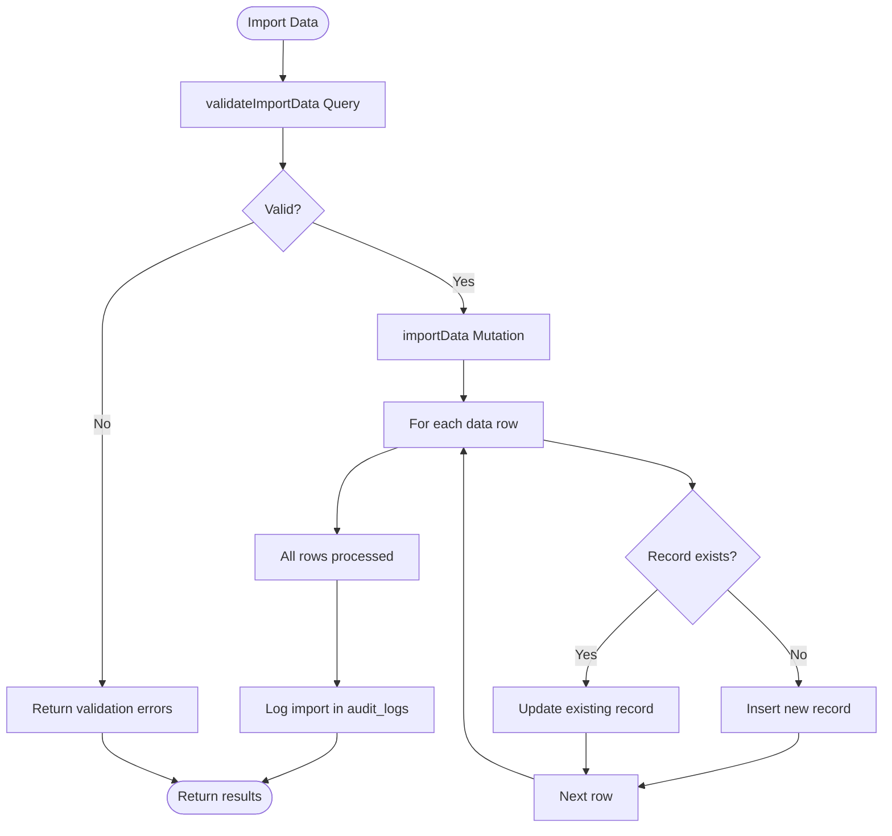

# Convex Actions

<cite>
**Referenced Files in This Document**   
- [workflow_notifications.ts](file://convex/workflow_notifications.ts)
- [data_import_export.ts](file://convex/data_import_export.ts)
- [email.ts](file://src/lib/services/email.ts)
- [sms.ts](file://src/lib/services/sms.ts)
- [server.d.ts](file://convex/_generated/server.d.ts)
- [server.js](file://convex/_generated/server.js)
</cite>

## Table of Contents

1. [Introduction](#introduction)
2. [Core Components](#core-components)
3. [Architecture Overview](#architecture-overview)
4. [Detailed Component Analysis](#detailed-component-analysis)
5. [Dependency Analysis](#dependency-analysis)
6. [Performance Considerations](#performance-considerations)
7. [Troubleshooting Guide](#troubleshooting-guide)
8. [Conclusion](#conclusion)

## Introduction

Convex Actions in Kafkasder-panel are server-side functions designed for executing long-running operations or tasks with significant side effects. Unlike reactive queries and mutations, actions operate outside the real-time data synchronization system, making them ideal for background processing. They are commonly used for operations such as sending email and SMS notifications, processing bulk data imports, generating reports, and interfacing with external services. This document details the implementation, usage patterns, authentication handling, error management, and performance characteristics of Convex Actions within the application.

## Core Components

Convex Actions in the Kafkasder-panel are defined using the `action` or `internalAction` builders from the Convex framework. These functions are asynchronous and can perform non-deterministic operations, including calling third-party APIs for email and SMS services. Key examples include the `sendWorkflowNotification` action in `workflow_notifications.ts` for alerting users about system events and the `importData` function in `data_import_export.ts` for batch processing of beneficiary, donation, and financial records. Actions interact with the database indirectly by invoking queries and mutations through the `ActionCtx` context object, ensuring separation between reactive data logic and background task execution.

**Section sources**

- [workflow_notifications.ts](file://convex/workflow_notifications.ts#L1-L281)
- [data_import_export.ts](file://convex/data_import_export.ts#L1-L365)
- [server.d.ts](file://convex/_generated/server.d.ts#L73-L102)

## Architecture Overview

The architecture of Convex Actions in Kafkasder-panel follows a clear separation of concerns between the reactive frontend and the background processing layer. Actions are invoked from the client or other server functions and execute in Convex's server environment, where they can safely perform side-effect-heavy operations without blocking the main application flow. They rely on service modules for external communication, such as `email.ts` for SMTP-based email delivery and `sms.ts` for Twilio-powered SMS messaging. The system uses audit logs to track import and export activities, ensuring traceability of background operations. Actions are designed to be stateless and idempotent where possible, facilitating retry mechanisms and fault tolerance.


**Diagram sources**

- [workflow_notifications.ts](file://convex/workflow_notifications.ts)
- [data_import_export.ts](file://convex/data_import_export.ts)
- [email.ts](file://src/lib/services/email.ts)
- [sms.ts](file://src/lib/services/sms.ts)

## Detailed Component Analysis

### Workflow Notification Actions

The `workflow_notifications.ts` file contains actions responsible for managing system alerts and notifications. These actions handle the creation, delivery, and tracking of workflow-related messages such as meeting reminders, task assignments, and report updates. The system uses a dedicated `workflow_notifications` collection to store notification records with statuses like "beklemede" (pending), "gonderildi" (sent), and "okundu" (read). Actions like `create` and `markAsSent` manage the lifecycle of these notifications, while `sendWorkflowNotification` (implied by the pattern) would orchestrate the actual delivery via email or SMS services.


**Diagram sources**

- [workflow_notifications.ts](file://convex/workflow_notifications.ts#L76-L104)
- [email.ts](file://src/lib/services/email.ts#L84-L132)
- [sms.ts](file://src/lib/services/sms.ts#L48-L106)

### Data Import and Export Actions

The `data_import_export.ts` file implements actions for batch processing of data, including validation, import, and export operations. The `importData` mutation performs bulk inserts or updates to collections like beneficiaries, donations, and finance records, with support for different modes (insert, update, upsert). It includes comprehensive error handling, logging each failed row, and records the import activity in the audit logs. The `exportCollectionData` query allows for filtered exports of data in JSON or CSV format, supporting date-based and status-based filtering. These actions are critical for data migration, reporting, and system integration tasks.



**Diagram sources**

- [data_import_export.ts](file://convex/data_import_export.ts#L179-L292)
- [data_import_export.ts](file://convex/data_import_export.ts#L105-L176)

### External Service Integration

Actions interact with external communication services through dedicated modules in `src/lib/services/`. The `email.ts` module uses Nodemailer to send emails via SMTP, supporting templated messages for welcome emails, password resets, and notifications. It includes a singleton transporter for connection reuse and comprehensive logging. The `sms.ts` module integrates with Twilio for SMS delivery, featuring phone number validation for Turkish formats, rate limiting to prevent API abuse, and specialized functions for verification codes and system alerts. Both services include graceful degradation when configuration is missing and detailed error logging for observability.

```mermaid
classDiagram
class EmailService {
+sendEmail(options EmailOptions) Promise~boolean~
+sendBulkEmails(recipients, subject, content) Promise~{success, failed}~
-getTransporter() nodemailer.Transporter
}
class SMSService {
+sendSMS(options SmsOptions) Promise~boolean~
+sendBulkSMS(recipients, message) Promise~{success, failed, results}~
+sendVerificationSMS(phone, code) Promise~boolean~
+sendNotificationSMS(phone, title, content) Promise~boolean~
-getTwilioClient() twilio.Twilio
-validateTurkishPhone(phone) boolean
}
class EmailOptions {
+to : string | string[]
+subject : string
+html? : string
+text? : string
+from? : string
+template? : string
+templateData? : Record~string, any~
}
class SmsOptions {
+to : string | string[]
+message : string
+from? : string
+priority? : 'normal' | 'high'
}
EmailService --> EmailOptions : "uses"
SMSService --> SmsOptions : "uses"
```

**Diagram sources**

- [email.ts](file://src/lib/services/email.ts#L84-L161)
- [sms.ts](file://src/lib/services/sms.ts#L48-L219)

## Dependency Analysis

Convex Actions in Kafkasder-panel have a well-defined dependency structure. They depend on the core Convex framework for the `action` and `internalAction` builders, which are defined in the generated `server.d.ts` and `server.js` files. Actions rely on the database for state management but interact with it indirectly through queries and mutations. For external communication, they depend on the email and SMS service modules, which in turn depend on third-party libraries (Nodemailer and Twilio) and environment configuration for credentials. The system uses the logger service for observability, creating a dependency on the application's logging infrastructure. There are no circular dependencies, and the separation between the action layer and the reactive query system ensures loose coupling and high maintainability.


**Diagram sources**

- [server.d.ts](file://convex/_generated/server.d.ts)
- [workflow_notifications.ts](file://convex/workflow_notifications.ts)
- [data_import_export.ts](file://convex/data_import_export.ts)
- [email.ts](file://src/lib/services/email.ts)
- [sms.ts](file://src/lib/services/sms.ts)

## Performance Considerations

The performance of Convex Actions is optimized for background processing. Actions are designed to be asynchronous and non-blocking, allowing the main application to remain responsive. For long-running operations like bulk data imports, the system processes records sequentially with error isolation to prevent a single bad record from failing the entire import. The use of connection pooling in the email and SMS services reduces the overhead of establishing new connections for each message. However, performance can be impacted by the volume of data being processed or the rate limits of external APIs. The system includes rate limiting in the SMS service to comply with Twilio's policies, and future optimizations could include parallel processing of independent records and more sophisticated retry strategies for failed operations.

## Troubleshooting Guide

When troubleshooting Convex Actions, the first step is to check the Convex observability tools for logs and error traces. Common issues include misconfigured environment variables for external services (e.g., missing SMTP or Twilio credentials), which will result in silent failures with warnings in the logs. For data import actions, validation errors in the input data can cause individual rows to fail; these are reported in the action's result object. Network issues with external APIs can cause transient failures, so implementing retry logic with exponential backoff is recommended. The audit logs provide a record of all import and export activities, which can be used to verify that actions are being triggered and completed as expected.

**Section sources**

- [email.ts](file://src/lib/services/email.ts#L87-L93)
- [sms.ts](file://src/lib/services/sms.ts#L51-L57)
- [data_import_export.ts](file://convex/data_import_export.ts#L265-L271)
- [errors.ts](file://convex/errors.ts)

## Conclusion

Convex Actions are a powerful feature in Kafkasder-panel for handling server-side, side-effect-heavy operations. They provide a clean separation from the reactive query system, allowing for the execution of long-running tasks like sending notifications and processing bulk data. By leveraging the `action` builder and integrating with external services through well-defined modules, the application achieves robust and maintainable background processing. Proper use of actions, as opposed to mutations, ensures that the reactive data layer remains fast and responsive, while background tasks are handled reliably with comprehensive error handling and logging.
