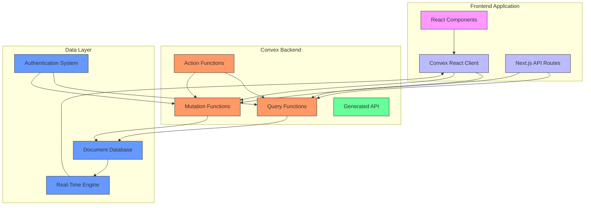

# Convex Backend Functions

<cite>
**Referenced Files in This Document**   
- [auth.ts](file://convex/auth.ts)
- [schema.ts](file://convex/schema.ts)
- [users.ts](file://convex/users.ts)
- [server.d.ts](file://convex/_generated/server.d.ts)
- [api.d.ts](file://convex/_generated/api.d.ts)
- [client.ts](file://src/lib/convex/client.ts)
- [server.ts](file://src/lib/convex/server.ts)
- [api.ts](file://src/lib/convex/api.ts)
</cite>

## Table of Contents

1. [Introduction](#introduction)
2. [Convex Function Types](#convex-function-types)
3. [Function Definition and API Exposure](#function-definition-and-api-exposure)
4. [Security Model and Authentication](#security-model-and-authentication)
5. [Data Consistency and Transactional Guarantees](#data-consistency-and-transactional-guarantees)
6. [Real-Time Subscription Mechanisms](#real-time-subscription-mechanisms)
7. [Example Analysis: Authentication Functions](#example-analysis-authentication-functions)
8. [Architecture Overview](#architecture-overview)
9. [Conclusion](#conclusion)

## Introduction

Convex serves as a real-time serverless backend for the Kafkasder-panel application, providing automatic data synchronization between the frontend and backend. It eliminates the need for writing traditional REST or GraphQL APIs by allowing developers to define functions directly in the `convex/` directory that are automatically exposed via a generated API. These functions operate on a global, JSON-based document database with strongly consistent queries and real-time subscriptions. The architecture integrates seamlessly with the Next.js frontend through Convex's React client, enabling reactive UI updates when data changes.

## Convex Function Types

Convex supports three primary types of serverless functions, each serving a distinct purpose within the application architecture:

### Queries (Read-Only Operations)

Queries are functions used for reading data from the Convex database. They are defined using the `query` builder imported from `./_generated/server`. These functions are read-only and cannot modify the database state. They are automatically cached and optimized by Convex, and their results can be subscribed to for real-time updates. Queries are ideal for fetching lists of records, individual documents, or computed data based on existing information.

### Mutations (Data Modifications)

Mutations are functions responsible for modifying data in the Convex database. They are defined using the `mutation` builder and are guaranteed to execute atomically. All database writes within a single mutation are executed as an atomic transaction, ensuring data consistency and preventing partial updates. Mutations are used for creating, updating, or deleting records, and they automatically trigger real-time updates to any subscribed queries.

### Actions (Server-Side Workflows)

Actions are server-side functions that can perform non-deterministic operations and interact with external services. Unlike queries and mutations, actions do not directly read from or write to the Convex database. Instead, they can call other queries and mutations to indirectly affect the database state. Actions are suitable for implementing complex workflows, sending emails, processing payments, or integrating with third-party APIs, providing a secure environment for sensitive operations.

## Function Definition and API Exposure

Convex functions are defined as individual TypeScript files within the `convex/` directory, with each file exporting one or more functions. The framework automatically generates a type-safe API based on these function definitions, making them accessible from the frontend without requiring manual API routing or endpoint configuration.

Each function is defined by specifying its arguments using Convex's value types (`v.string()`, `v.id()`, etc.) and providing a handler function that receives a context object (`ctx`) and the arguments. The context provides access to the database through `ctx.db`, allowing functions to query or modify data. For example, a query function uses `ctx.db.query()` to retrieve data, while a mutation uses `ctx.db.insert()`, `ctx.db.patch()`, or `ctx.db.delete()` to modify records.

The generated API is accessible through the `api` object imported from `convex/_generated/api`, which provides type-safe references to all defined functions. This enables frontend components to call backend functions directly using `convex.query(api.module.functionName, args)` for queries or `convex.mutation(api.module.functionName, args)` for mutations, with full TypeScript type checking.

## Security Model and Authentication

Convex provides a built-in authentication and authorization system that integrates with the application's user management. The security model is implemented through a combination of Convex's internal mechanisms and custom application logic defined in the `auth.ts` and related files.

Authentication is handled through a hybrid approach where password verification occurs in the Next.js API routes rather than in Convex functions, as Convex cannot run native modules like bcrypt. The `getUserByEmail` query in `auth.ts` retrieves user data including the password hash, which is then verified in the Next.js authentication route. Once authenticated, user sessions are managed through cookies, with Convex functions able to access user identity through the authentication context.

Authorization is implemented through role-based access control (RBAC) stored in the `users` collection. Each user document includes a `role` field and an optional `permissions` array that defines their access rights. Convex functions can check these fields to determine whether a user is authorized to perform specific operations. The security model also includes additional features such as two-factor authentication, tracked in the `two_factor_settings` collection, and session management through the `user_sessions` collection for security monitoring.

## Data Consistency and Transactional Guarantees

Convex ensures strong data consistency through atomic transactions and optimistic concurrency control. All mutations are executed as atomic operations, meaning that either all database changes within a mutation are applied, or none are, preventing partial updates that could leave the data in an inconsistent state.

The database provides strongly consistent reads, ensuring that queries always return the most up-to-date data. When a mutation modifies data, all subscribed queries are automatically updated with the new state, maintaining consistency across all clients. Convex uses optimistic concurrency control to handle concurrent modifications, allowing multiple clients to read and modify data simultaneously while detecting and resolving conflicts when they occur.

Data integrity is further enforced through the schema definition in `schema.ts`, which defines the structure of all collections and their indexes. The schema includes validation rules and constraints that ensure data conforms to the expected format. Additionally, Convex automatically manages document IDs and relationships through the `Id` type, providing type-safe references between documents in different collections.

## Real-Time Subscription Mechanisms

Convex provides real-time data synchronization through its subscription mechanism, which allows frontend components to automatically receive updates when data changes. This is implemented through the Convex React client, which manages subscriptions and efficiently updates the UI in response to data changes.

When a component uses `useQuery` from the Convex React client to call a query function, it establishes a subscription to that query's results. If any mutation modifies data that affects the query's results, Convex automatically pushes the updated data to all subscribed clients. This enables reactive UI updates without requiring manual polling or complex state management.

The real-time mechanism is optimized for performance through automatic batching and deduplication of updates. Multiple changes that occur in quick succession are batched together, and redundant updates are eliminated to minimize network traffic and UI re-renders. The subscription system also handles reconnection and state recovery automatically, ensuring that clients receive updates even after temporary network interruptions.

## Example Analysis: Authentication Functions

The `auth.ts` file in the `convex/` directory provides concrete examples of Convex query and mutation functions that implement core authentication functionality.

### getUserByEmail Query

The `getUserByEmail` function is a query that retrieves a user document from the `users` collection based on their email address. It uses the `query` builder to define a function that takes an email string as an argument and returns the corresponding user document. The function leverages a database index `by_email` for efficient lookups, executing `.query("users").withIndex("by_email", (q) => q.eq("email", args.email))`. This query returns the user document including the password hash, which is necessary for password verification in the Next.js API routes.

**Section sources**

- [auth.ts](file://convex/auth.ts#L33-L48)

### updateLastLogin Mutation

The `updateLastLogin` function is a mutation that updates the `lastLogin` timestamp for a user. It uses the `mutation` builder to define a function that takes a user ID as an argument and updates the corresponding user document. The mutation first retrieves the user with `ctx.db.get(args.userId)` to verify existence, then uses `ctx.db.patch(args.userId, { lastLogin: new Date().toISOString() })` to update only the `lastLogin` field. This demonstrates Convex's atomic mutation guarantees, as the entire operation either succeeds completely or fails without partial updates.

**Section sources**

- [auth.ts](file://convex/auth.ts#L53-L67)

## Architecture Overview

The Convex backend architecture for Kafkasder-panel follows a serverless, function-as-a-service model with automatic API generation and real-time data synchronization. The architecture consists of three main layers: the frontend application, the Convex serverless functions, and the underlying document database.

**Diagram sources**

- [auth.ts](file://convex/auth.ts)
- [schema.ts](file://convex/schema.ts)
- [client.ts](file://src/lib/convex/client.ts)
- [server.ts](file://src/lib/convex/server.ts)

The frontend interacts with Convex functions directly through the Convex React client for real-time data access, or through Next.js API routes for operations requiring native modules or external integrations. The Convex functions operate on a global document database with strongly consistent queries and automatic real-time updates. The architecture enables a reactive programming model where UI components automatically update in response to data changes, providing a seamless user experience.

## Conclusion

Convex provides a powerful backend solution for Kafkasder-panel, offering a serverless architecture with automatic API generation, real-time data synchronization, and strong consistency guarantees. By organizing backend logic into queries, mutations, and actions, the application achieves a clean separation of concerns while maintaining type safety and developer productivity. The integration with Next.js through the Convex React client enables reactive UI updates and efficient data fetching, while the built-in authentication and authorization system provides a secure foundation for user management. This architecture allows the development team to focus on business logic rather than infrastructure, accelerating development and ensuring a robust, scalable application.
