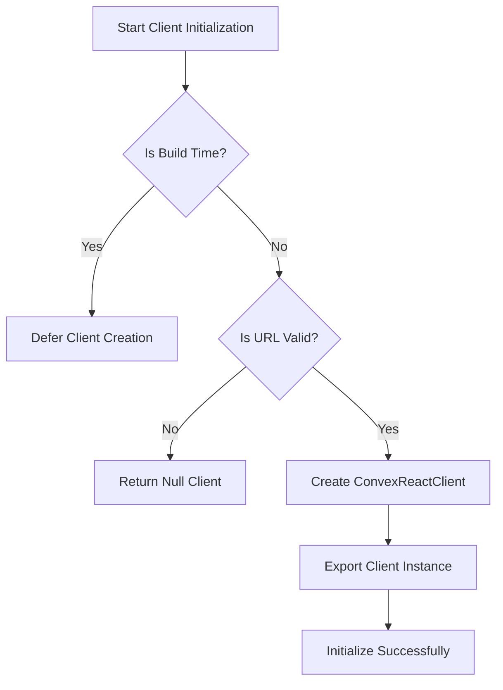
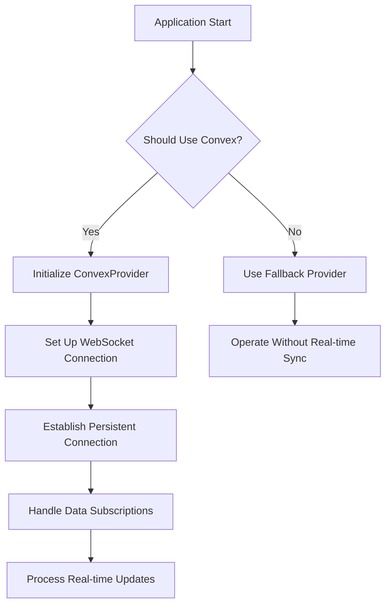
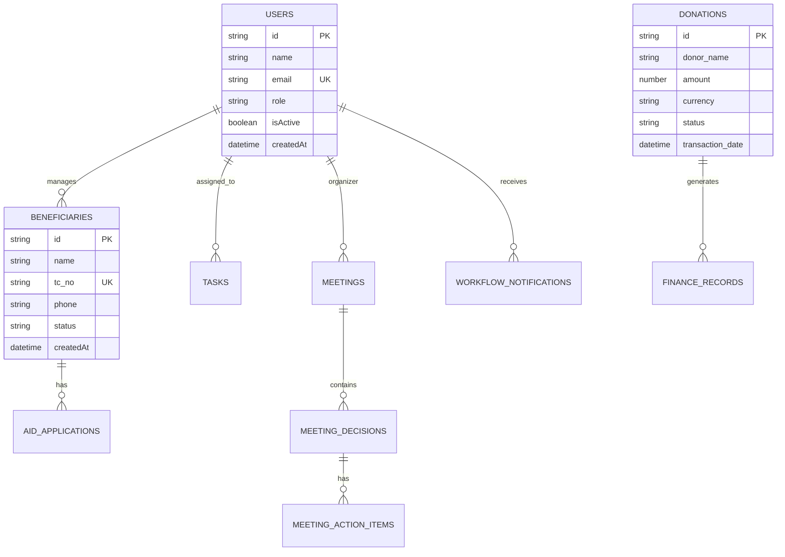
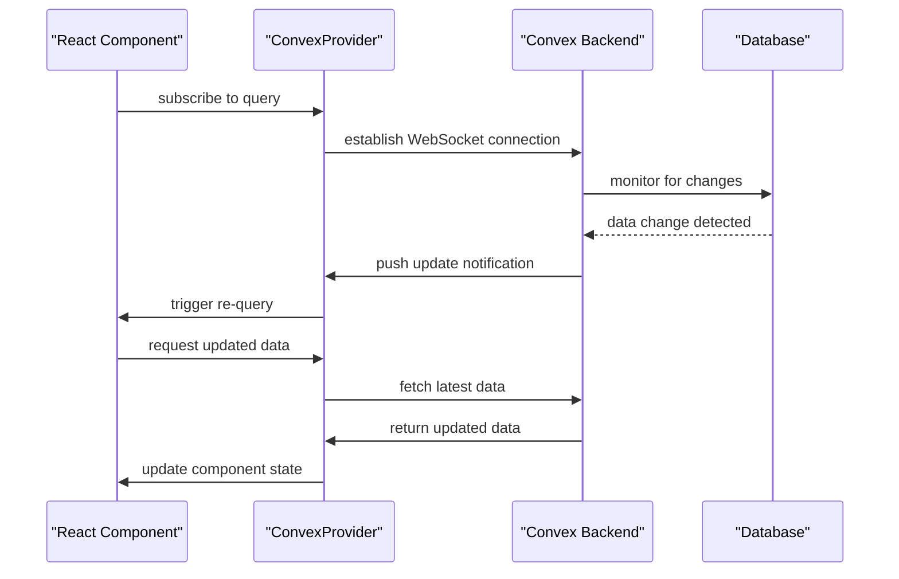
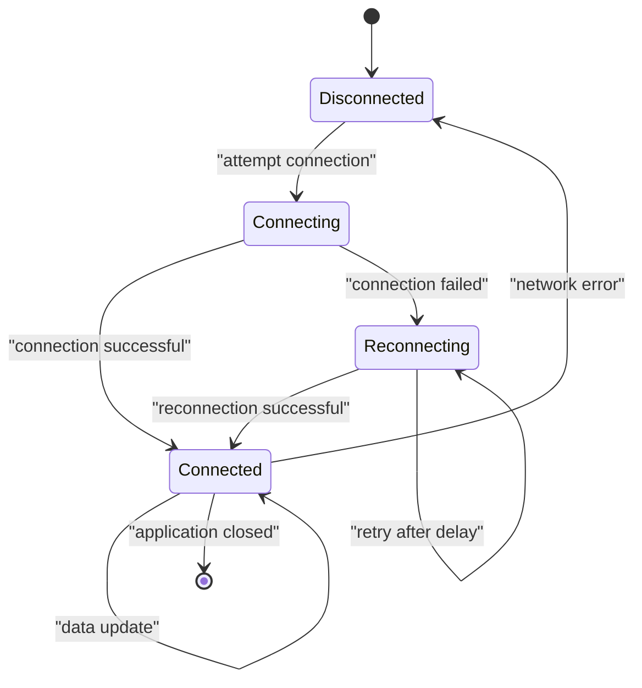
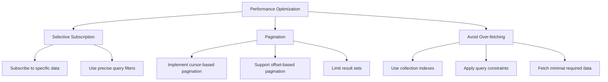
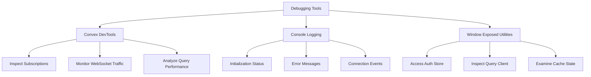

# Real-Time Data Synchronization

<cite>
**Referenced Files in This Document**   
- [client.ts](file://src/lib/convex/client.ts)
- [providers.tsx](file://src/app/providers.tsx)
- [schema.ts](file://convex/schema.ts)
</cite>

## Table of Contents

1. [Introduction](#introduction)
2. [Convex Client Initialization](#convex-client-initialization)
3. [Provider Setup and Connection Management](#provider-setup-and-connection-management)
4. [Data Model Structure and Synchronization](#data-model-structure-and-synchronization)
5. [Query Subscription and Reactive Updates](#query-subscription-and-reactive-updates)
6. [Connection Lifecycle and Reconnection Strategies](#connection-lifecycle-and-reconnection-strategies)
7. [Performance Optimization Techniques](#performance-optimization-techniques)
8. [Debugging and Monitoring with Convex DevTools](#debugging-and-monitoring-with-convex-devtools)
9. [Conclusion](#conclusion)

## Introduction

This document details the real-time data synchronization implementation in Kafkasder-panel using Convex. The system leverages Convex's reactive capabilities to maintain automatic, bidirectional data updates between the backend and frontend through persistent WebSocket connections. This architecture enables immediate UI updates when data changes occur, providing a seamless user experience across the application's various modules including beneficiaries, donations, tasks, meetings, and more.

## Convex Client Initialization

The Convex client initialization process in `src/lib/convex/client.ts` implements robust validation and error handling to ensure reliable connection establishment. The client creation is deferred during build time or when the Convex URL is invalid, preventing runtime errors in development and production environments.

The initialization process includes comprehensive URL validation, checking for proper formatting, protocol specification (http/https), and the required `.convex.cloud` domain pattern. This defensive approach ensures that only valid URLs are used to create the Convex client instance.

**Diagram sources**

- [client.ts](file://src/lib/convex/client.ts#L1-L108)

**Section sources**

- [client.ts](file://src/lib/convex/client.ts#L1-L108)

## Provider Setup and Connection Management

The application's provider setup in `providers.tsx` orchestrates the integration of Convex with other essential services, including React Query for data fetching and caching. The provider component conditionally wraps the application with `ConvexProvider` only when Convex is properly configured and available.

The connection management strategy employs a graceful fallback mechanism that allows the application to function without Convex during build processes or when configuration is incomplete. This ensures that the application remains operational while providing clear feedback about the Convex connection status.

**Diagram sources**

- [providers.tsx](file://src/app/providers.tsx#L1-L147)

**Section sources**

- [providers.tsx](file://src/app/providers.tsx#L1-L147)

## Data Model Structure and Synchronization

The data model structure defined in `convex/schema.ts` establishes the foundation for efficient real-time synchronization. Each collection is designed with appropriate indexes and search capabilities to optimize query performance and enable reactive updates.

The schema defines comprehensive data models for various entities including users, beneficiaries, donations, tasks, meetings, and workflow notifications. Each collection includes carefully designed indexes that support efficient querying and filtering, which is crucial for real-time applications where performance directly impacts user experience.

**Diagram sources**

- [schema.ts](file://convex/schema.ts#L1-L1446)

**Section sources**

- [schema.ts](file://convex/schema.ts#L1-L1446)

## Query Subscription and Reactive Updates

The real-time data synchronization system implements a subscription-based model where frontend components automatically receive updates when underlying data changes. This reactive approach eliminates the need for manual polling and ensures that the UI always reflects the current state of the data.

When a component subscribes to a query, Convex establishes a persistent WebSocket connection that remains open for the duration of the subscription. Any changes to the queried data trigger immediate push notifications to all subscribed clients, which then automatically re-execute the query to fetch the updated data.

The system leverages React Query's caching mechanisms in conjunction with Convex's real-time capabilities to provide an optimal balance between data freshness and performance. This hybrid approach ensures that components receive immediate updates while also benefiting from efficient caching strategies.

**Diagram sources**

- [client.ts](file://src/lib/convex/client.ts#L1-L108)
- [providers.tsx](file://src/app/providers.tsx#L1-L147)

## Connection Lifecycle and Reconnection Strategies

The connection lifecycle management system implements robust strategies for handling connection establishment, maintenance, and recovery. The system is designed to gracefully handle network interruptions and automatically re-establish connections when possible.

During the initial connection phase, the system performs comprehensive validation of the Convex URL and environment configuration. If the connection cannot be established, the system provides clear feedback through console messages in development mode, helping developers identify and resolve configuration issues.

The reconnection strategy employs exponential backoff to prevent overwhelming the server with repeated connection attempts during prolonged outages. When the connection is restored, the system automatically resynchronizes all active subscriptions, ensuring that no updates are missed during the disconnection period.

**Diagram sources**

- [client.ts](file://src/lib/convex/client.ts#L1-L108)
- [providers.tsx](file://src/app/providers.tsx#L1-L147)

## Performance Optimization Techniques

The real-time synchronization system incorporates several performance optimization techniques to ensure efficient data handling and minimize resource consumption.

Selective subscription allows components to subscribe only to the specific data they need, reducing the amount of data transferred over the WebSocket connection. This targeted approach improves both network efficiency and client-side performance.

Pagination is implemented for collections with large datasets, such as beneficiaries and donations, to prevent overwhelming the client with excessive data. The system supports both cursor-based and offset-based pagination strategies, allowing for flexible data retrieval patterns.

The application avoids over-fetching by implementing precise query parameters and leveraging Convex's indexing capabilities. This ensures that only the necessary data is retrieved and synchronized, reducing both network bandwidth and memory usage.

**Diagram sources**

- [schema.ts](file://convex/schema.ts#L1-L1446)
- [client.ts](file://src/lib/convex/client.ts#L1-L108)

## Debugging and Monitoring with Convex DevTools

The application integrates Convex DevTools to provide comprehensive debugging and monitoring capabilities for real-time behavior. These tools enable developers to inspect active subscriptions, monitor WebSocket traffic, and analyze query performance.

In development mode, the system exposes debug utilities through the browser's window object, allowing for manual inspection of the authentication store, query client, and cache utilities. This facilitates troubleshooting and performance analysis during development.

The logging system provides detailed feedback about the Convex client initialization status, including success messages when the client is properly configured and warnings when configuration issues are detected. This immediate feedback helps developers quickly identify and resolve connectivity problems.

**Diagram sources**

- [providers.tsx](file://src/app/providers.tsx#L1-L147)
- [client.ts](file://src/lib/convex/client.ts#L1-L108)

## Conclusion

The real-time data synchronization implementation in Kafkasder-panel using Convex provides a robust and efficient solution for maintaining data consistency between the backend and frontend. By leveraging persistent WebSocket connections and reactive query subscriptions, the system ensures that users always see the most current data without the need for manual refreshes.

The architecture combines Convex's real-time capabilities with React Query's caching mechanisms to deliver optimal performance and user experience. Comprehensive connection management, reconnection strategies, and debugging tools ensure reliability and maintainability across different environments and network conditions.

Through careful data model design, selective subscription, and performance optimization techniques, the system efficiently handles real-time updates while minimizing resource consumption. This approach enables Kafkasder-panel to provide a responsive and seamless user experience across its various modules and features.
