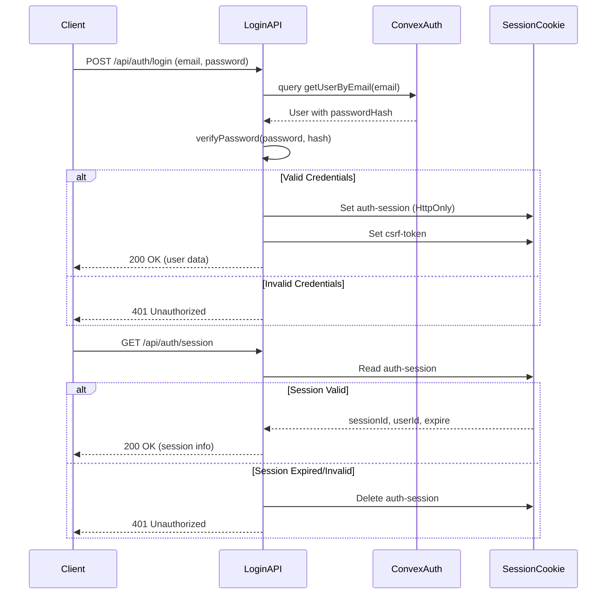
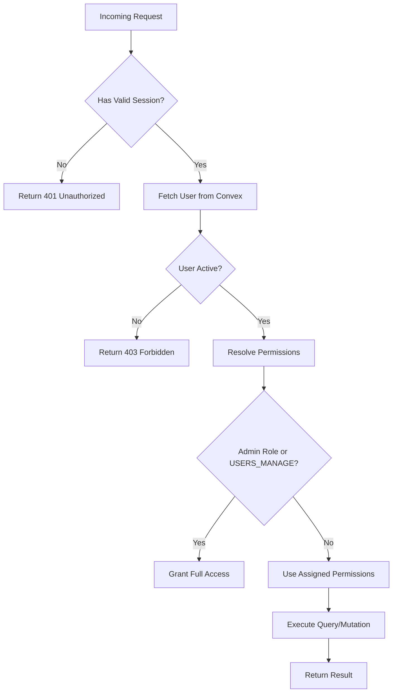
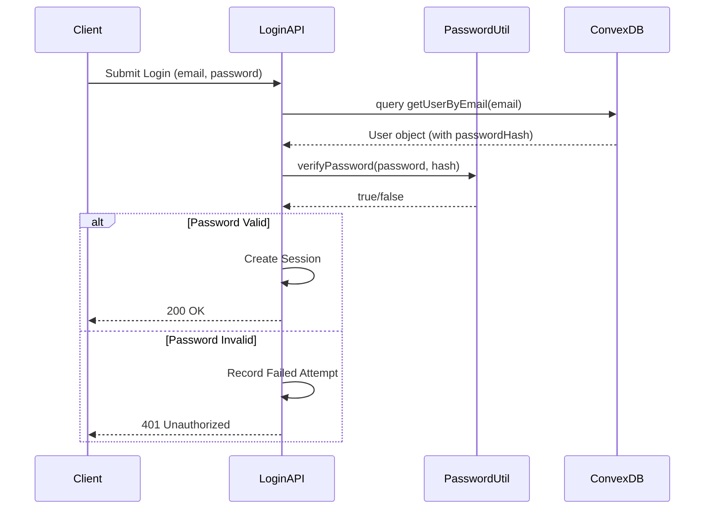
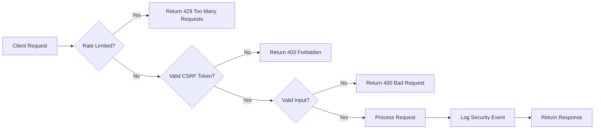
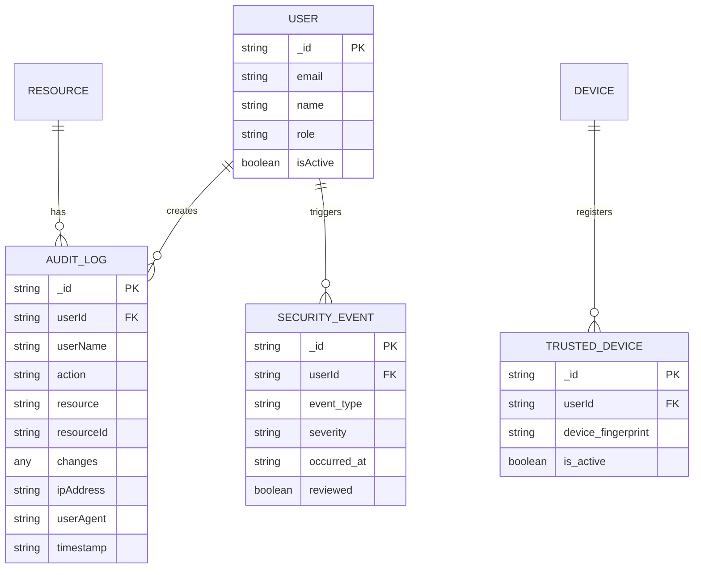

# Security & Authentication in Convex

<cite>
**Referenced Files in This Document**   
- [auth.ts](file://convex/auth.ts)
- [two_factor_auth.ts](file://convex/two_factor_auth.ts)
- [users.ts](file://convex/users.ts)
- [audit_logs.ts](file://convex/audit_logs.ts)
- [security_audit.ts](file://convex/security_audit.ts)
- [password.ts](file://src/lib/auth/password.ts)
- [session.ts](file://src/lib/auth/session.ts)
- [login/route.ts](file://src/app/api/auth/login/route.ts)
- [session/route.ts](file://src/app/api/auth/session/route.ts)
- [schema.ts](file://convex/schema.ts)
</cite>

## Table of Contents

1. [Introduction](#introduction)
2. [Authentication Flow with JWT and Session Management](#authentication-flow-with-jwt-and-session-management)
3. [Two-Factor Authentication Implementation](#two-factor-authentication-implementation)
4. [Role-Based Access Control (RBAC)](#role-based-access-control-rbac)
5. [Secure Password Handling](#secure-password-handling)
6. [API Endpoint Security and Vulnerability Prevention](#api-endpoint-security-and-vulnerability-prevention)
7. [Audit Logging and Security Monitoring](#audit-logging-and-security-monitoring)
8. [Conclusion](#conclusion)

## Introduction

This document provides a comprehensive overview of the security and authentication mechanisms implemented in the Convex backend for the Kafkasder-panel application. It details how user authentication is managed through JSON Web Tokens (JWT) and session cookies, the integration of two-factor authentication (2FA), role-based access control (RBAC), secure password handling, and audit logging. The system leverages Convex's server functions to enforce permissions at the query and mutation level, ensuring data integrity and compliance with security best practices.

The authentication flow begins with user login via email and password, followed by session creation and CSRF protection. Multi-factor authentication is supported through TOTP and backup codes, while trusted devices allow users to bypass repeated 2FA prompts. Role-based permissions are enforced using `ctx.auth` within Convex queries and mutations, restricting unauthorized access to sensitive operations.

Additionally, the system implements robust security features such as rate limiting, account lockout after failed attempts, and detailed audit logging for compliance and forensic analysis. All components work together to provide a secure, scalable, and auditable authentication framework.

## Authentication Flow with JWT and Session Management

The authentication flow in the Convex backend is implemented using session cookies rather than traditional JWTs, although the principles of token-based authentication are preserved. Upon successful login, a session object containing the user ID and expiration time is serialized and stored in an HTTP-only cookie named `auth-session`. This approach prevents client-side tampering and mitigates XSS risks.

Session validation occurs on both the frontend and backend. The `/api/auth/session` endpoint retrieves the current session from the cookie, parses it, and checks its expiration before returning user metadata. If the session has expired or is invalid, it is cleared and a 401 Unauthorized response is returned.

Session management includes CSRF protection via a separate `csrf-token` cookie, which is validated on state-changing requests. The session cookie is configured with `httpOnly`, `secure` (in production), and `sameSite: strict` flags to enhance security.



**Diagram sources**

- [login/route.ts](file://src/app/api/auth/login/route.ts#L23-L231)
- [session/route.ts](file://src/app/api/auth/session/route.ts#L1-L64)
- [session.ts](file://src/lib/auth/session.ts#L1-L198)

**Section sources**

- [login/route.ts](file://src/app/api/auth/login/route.ts#L23-L231)
- [session/route.ts](file://src/app/api/auth/session/route.ts#L1-L64)
- [session.ts](file://src/lib/auth/session.ts#L1-L198)

## Two-Factor Authentication Implementation

Two-factor authentication (2FA) is implemented in the `two_factor_auth.ts` file using TOTP (Time-Based One-Time Password) and backup codes. Users can enable 2FA by generating a secret key, which is stored encrypted in the `two_factor_settings` table. Upon login, if 2FA is enabled, the user must provide a valid code from their authenticator app.

The system supports backup codes for recovery in case the primary device is lost. These codes are generated during 2FA setup and marked as used upon first use. When fewer than three backup codes remain, the user is prompted to regenerate them.

Trusted devices are supported through device fingerprinting. After successful 2FA verification, a device can be marked as trusted, allowing future logins from that device without requiring 2FA. Device trust is stored in the `trusted_devices` collection and can be revoked by the user.

```mermaid
classDiagram
class TwoFactorSettings {
+user_id : Id~users~
+secret : string
+backup_codes : {code : string, used : boolean, used_at? : string}[]
+enabled : boolean
+enabled_at : string
+disabled_at? : string
+last_verified? : string
}
class TrustedDevice {
+user_id : Id~users~
+device_fingerprint : string
+device_name? : string
+added_at : string
+last_used? : string
+is_active : boolean
+removed_at? : string
}
class SecurityEvent {
+event_type : string
+user_id? : Id~users~
+ip_address? : string
+user_agent? : string
+details? : any
+severity : 'low'|'medium'|'high'|'critical'
+occurred_at : string
+reviewed : boolean
}
TwoFactorSettings --> SecurityEvent : logs
TrustedDevice --> SecurityEvent : logs
TwoFactorSettings --> TrustedDevice : allows bypass
```

**Diagram sources**

- [two_factor_auth.ts](file://convex/two_factor_auth.ts#L1-L346)
- [schema.ts](file://convex/schema.ts#L746-L794)

**Section sources**

- [two_factor_auth.ts](file://convex/two_factor_auth.ts#L1-L346)

## Role-Based Access Control (RBAC)

Role-Based Access Control (RBAC) is implemented through a combination of user roles and granular permissions stored in the `users` collection. Each user has a `role` field (e.g., 'admin', 'staff') and an array of `permissions` that define specific capabilities.

Permissions are enforced within Convex queries and mutations using the `ctx.auth` context. For example, when retrieving user data, the system checks whether the requesting user has the necessary permissions before allowing access. Special permissions like `USERS_MANAGE` grant administrative rights regardless of role.

The `users.ts` file contains CRUD operations that respect these permissions. For instance, only users with appropriate permissions can create, update, or delete other users. The system also includes fallback logic: if a user's role contains 'ADMIN' or 'BAŞKAN', they are granted base module access and user management permissions.



**Diagram sources**

- [users.ts](file://convex/users.ts#L1-L220)
- [session.ts](file://src/lib/auth/session.ts#L76-L185)
- [schema.ts](file://convex/schema.ts#L9-L41)

**Section sources**

- [users.ts](file://convex/users.ts#L1-L220)
- [session.ts](file://src/lib/auth/session.ts#L76-L185)

## Secure Password Handling

Password security is enforced through bcrypt hashing and strength validation. The `hashPassword` and `verifyPassword` functions in `password.ts` use bcryptjs to securely hash and compare passwords with a salt round of 12, providing strong protection against brute-force attacks.

Password strength is validated on both client and server sides. The validation rules require:

- Minimum 8 characters
- Maximum 128 characters
- At least one numeric character
- At least one alphabetic character

In production environments, additional rules may apply, including requirements for uppercase letters, special characters, and dictionary checks. Passwords are never stored in plaintext and are excluded from user objects returned by Convex queries.



**Diagram sources**

- [password.ts](file://src/lib/auth/password.ts#L1-L54)
- [login/route.ts](file://src/app/api/auth/login/route.ts#L107-L127)

**Section sources**

- [password.ts](file://src/lib/auth/password.ts#L1-L54)

## API Endpoint Security and Vulnerability Prevention

API endpoints are protected against common vulnerabilities through multiple layers of defense:

1. **Rate Limiting**: Implemented via the `authRateLimit` middleware to prevent brute-force attacks.
2. **Account Lockout**: After a configurable number of failed login attempts, accounts are temporarily locked.
3. **CSRF Protection**: A CSRF token is generated and validated for state-changing operations.
4. **Input Validation**: All inputs are validated before processing.
5. **HTTP Security Headers**: Cookies are marked as HttpOnly, Secure, and SameSite=Strict.

Critical endpoints such as login, password change, and user management are rate-limited and log all attempts for security auditing. The system also includes development safeguards, such as mock user support and relaxed password rules in non-production environments.

Security events (e.g., login success/failure, permission denied) are logged in the `security_events` collection for monitoring and incident response.



**Diagram sources**

- [login/route.ts](file://src/app/api/auth/login/route.ts#L23-L231)
- [security_audit.ts](file://convex/security_audit.ts#L1-L273)
- [schema.ts](file://convex/schema.ts#L675-L704)

**Section sources**

- [login/route.ts](file://src/app/api/auth/login/route.ts#L23-L231)
- [security_audit.ts](file://convex/security_audit.ts#L1-L273)

## Audit Logging and Security Monitoring

Audit logging is a core component of the system's security architecture. Every critical operation—such as data creation, modification, deletion, and access—is recorded in the `audit_logs` collection. Each log entry includes:

- User ID and name
- Action performed (CREATE, UPDATE, DELETE, VIEW)
- Resource type and ID
- Changes made (before/after values)
- IP address and user agent
- Timestamp

The `audit_logs.ts` file provides functions to:

- Log actions (`logAction`)
- List logs with filters (`list`)
- Get statistics (`getStats`)
- Retrieve resource history (`getResourceHistory`)

Security monitoring is enhanced through the `security_audit.ts` module, which analyzes patterns of behavior to detect suspicious activity, such as multiple failed login attempts, unusual IP addresses, or excessive permission denials.



**Diagram sources**

- [audit_logs.ts](file://convex/audit_logs.ts#L1-L178)
- [security_audit.ts](file://convex/security_audit.ts#L1-L273)
- [schema.ts](file://convex/schema.ts#L1-L800)

**Section sources**

- [audit_logs.ts](file://convex/audit_logs.ts#L1-L178)
- [security_audit.ts](file://convex/security_audit.ts#L1-L273)

## Conclusion

The Convex backend implements a robust, multi-layered security model that combines session-based authentication, two-factor verification, role-based access control, secure password handling, and comprehensive audit logging. By leveraging Convex's server functions and data model, the system ensures that all data access is properly authenticated and authorized, minimizing the risk of unauthorized access or data breaches.

Key strengths include:

- Secure session management with CSRF protection
- Support for 2FA with backup codes and trusted devices
- Granular RBAC with fallback admin detection
- Strong password hashing and validation
- Detailed audit trails for compliance and monitoring

These mechanisms work together to provide a secure foundation for the application, protecting user data and ensuring accountability across all operations.
