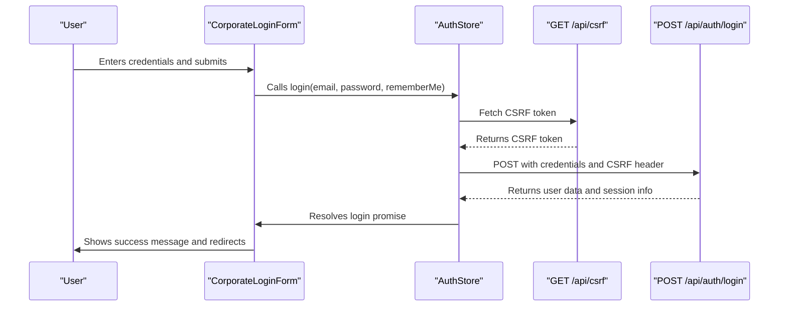
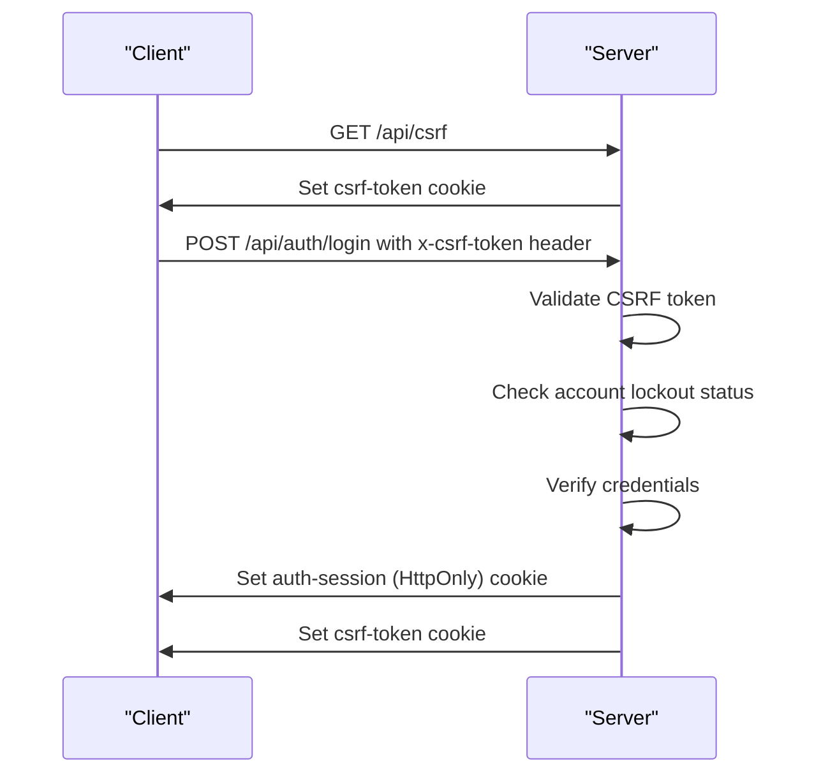
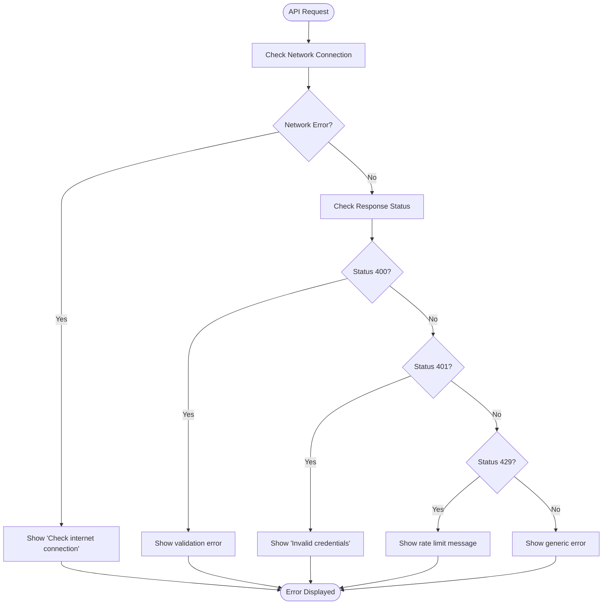
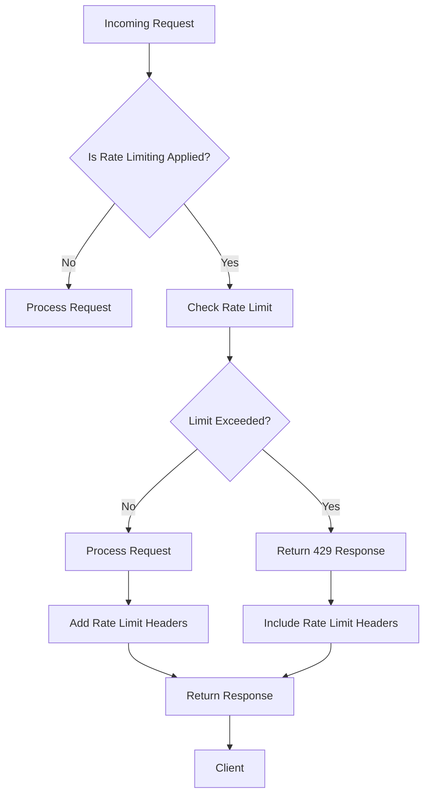

# Client-Server Communication Flow

<cite>
**Referenced Files in This Document**   
- [authStore.ts](file://src/stores/authStore.ts)
- [corporate-login-form.tsx](file://src/components/ui/corporate-login-form.tsx)
- [login/route.ts](file://src/app/api/auth/login/route.ts)
- [csrf.ts](file://src/lib/csrf.ts)
- [rate-limit.ts](file://src/lib/rate-limit.ts)
- [rate-limit-config.ts](file://src/lib/rate-limit-config.ts)
- [errors.ts](file://src/lib/errors.ts)
- [error-boundary.tsx](file://src/components/ui/error-boundary.tsx)
- [auth.ts](file://src/types/auth.ts)
</cite>

## Table of Contents

1. [Introduction](#introduction)
2. [Request Lifecycle from UI to API](#request-lifecycle-from-ui-to-api)
3. [Authentication and Security Mechanisms](#authentication-and-security-mechanisms)
4. [Error Handling Patterns](#error-handling-patterns)
5. [Rate Limiting Implementation](#rate-limiting-implementation)
6. [Common Issues and Solutions](#common-issues-and-solutions)

## Introduction

This document details the client-server communication flow in Kafkasder-panel, focusing on how React components initiate API requests through Next.js API routes. The analysis covers the complete request lifecycle from user interface interaction to server-side processing, including authentication mechanisms, security features like CSRF protection, error handling patterns, and rate limiting strategies. Special attention is given to the login flow as a concrete example of the communication pattern.

**Section sources**

- [authStore.ts](file://src/stores/authStore.ts#L1-L403)
- [corporate-login-form.tsx](file://src/components/ui/corporate-login-form.tsx#L1-L540)

## Request Lifecycle from UI to API

The client-server communication in Kafkasder-panel follows a structured flow from UI interaction to API route invocation. When a user interacts with the login form, the React component captures the input values and initiates the authentication process through the authentication store.

The login process begins in the CorporateLoginForm component, which uses the useAuthStore hook to access authentication functionality. When the user submits their credentials, the handleSubmit function calls the login method from the authentication store, passing the email, password, and rememberMe preference.

The authentication store (authStore.ts) manages the authentication state and handles the API communication. The login method first fetches a CSRF token from the /api/csrf endpoint, then makes a POST request to /api/auth/login with the user credentials and CSRF token in the headers. The request payload is formatted as JSON containing the email, password, and rememberMe boolean.

Upon successful authentication, the server sets HttpOnly cookies for the authentication session and CSRF token, while the client-side store updates its state with the user information and authentication status. The response includes user data and session information, which is used to update the application state and redirect the user to the appropriate page.

**Diagram sources**

- [corporate-login-form.tsx](file://src/components/ui/corporate-login-form.tsx#L18-L538)
- [authStore.ts](file://src/stores/authStore.ts#L38-L246)

**Section sources**

- [corporate-login-form.tsx](file://src/components/ui/corporate-login-form.tsx#L18-L538)
- [authStore.ts](file://src/stores/authStore.ts#L38-L246)
- [login/route.ts](file://src/app/api/auth/login/route.ts#L1-L231)

## Authentication and Security Mechanisms

Kafkasder-panel implements multiple security mechanisms to protect against common web vulnerabilities. The authentication flow incorporates CSRF (Cross-Site Request Forgery) protection, secure session management, and input validation.

CSRF protection is implemented through a dedicated endpoint (/api/csrf) that generates and returns a cryptographically secure token. This token is stored in a non-HttpOnly cookie, allowing client-side JavaScript to access it for inclusion in subsequent requests. The CSRF token is included in the x-csrf-token header for all state-changing operations, particularly the login request.

Session management uses HttpOnly cookies to store the authentication session, preventing client-side JavaScript from accessing the session token and mitigating XSS (Cross-Site Scripting) attacks. The session cookie contains the user ID, session expiration time, and a session ID, all stored as a JSON string. The CSRF token is stored in a separate cookie that is accessible to client-side code but has the same security attributes (secure, sameSite: strict).

The login flow also implements account lockout mechanisms to prevent brute force attacks. After a configurable number of failed login attempts, the account is temporarily locked, requiring a waiting period before further attempts can be made. This is tracked server-side using the account-lockout module, which records failed attempts and enforces the lockout policy.

**Diagram sources**

- [csrf.ts](file://src/lib/csrf.ts#L1-L90)
- [login/route.ts](file://src/app/api/auth/login/route.ts#L1-L231)

**Section sources**

- [csrf.ts](file://src/lib/csrf.ts#L1-L90)
- [login/route.ts](file://src/app/api/auth/login/route.ts#L1-L231)
- [authStore.ts](file://src/stores/authStore.ts#L145-L246)

## Error Handling Patterns

The application implements comprehensive error handling for both network failures and validation errors. Errors are categorized and handled appropriately based on their type and origin.

For network failures, the authentication store includes try-catch blocks around all API calls. Network errors such as "Failed to fetch" or "NetworkError" are detected and converted to user-friendly messages like "Check your internet connection." These errors are caught during the fetch operations and presented to the user through the toast notification system.

Validation errors are handled at multiple levels. Client-side validation occurs in the login form component, where email format and password requirements are checked before submission. Server-side validation ensures that required fields (email and password) are present in the request body. If validation fails, the server returns a 400 status code with an appropriate error message.

Authentication-specific errors have dedicated handling. Invalid credentials result in a 401 status code with the message "Invalid email or password." Rate limiting violations return a 429 status code with information about the remaining time before further attempts can be made. These error responses are standardized and include both a user-friendly message and a machine-readable error code.

The error handling process follows a consistent pattern:

1. Catch the error in the appropriate scope
2. Determine the error type (network, validation, authentication, etc.)
3. Convert technical error messages to user-friendly messages
4. Present the error to the user through appropriate UI elements
5. Log the error for monitoring and debugging purposes

**Diagram sources**

- [authStore.ts](file://src/stores/authStore.ts#L222-L245)
- [errors.ts](file://src/lib/errors.ts#L1-L377)
- [error-boundary.tsx](file://src/components/ui/error-boundary.tsx#L1-L259)

**Section sources**

- [authStore.ts](file://src/stores/authStore.ts#L222-L245)
- [errors.ts](file://src/lib/errors.ts#L1-L377)
- [error-boundary.tsx](file://src/components/ui/error-boundary.tsx#L1-L259)

## Rate Limiting Implementation

The application implements rate limiting to prevent abuse and protect server resources. The rate limiting system is configured through the rate-limit-config.ts file, which defines different rate limiting policies for various endpoint categories.

Authentication endpoints have the strictest rate limiting, allowing only 10 attempts per 10 minutes. This prevents brute force attacks on the login system. The authRateLimit configuration is applied specifically to endpoints under /api/auth/, including the login endpoint.

The rate limiting system uses a sliding window algorithm to track requests. Each request is identified by a combination of client IP address, HTTP method, and request path. The system checks if the client has exceeded the allowed number of requests within the specified time window. If the limit is exceeded, a 429 status code is returned with Retry-After and rate limit headers.

Rate limiting headers are included in all responses to inform clients of their current rate limit status:

- X-RateLimit-Remaining: Number of requests remaining in the current window
- X-RateLimit-Reset: Timestamp when the rate limit window resets
- Retry-After: Number of seconds to wait before making another request

Different endpoint categories have different rate limits:

- Authentication: 10 requests per 10 minutes
- Data modification: 50 requests per 15 minutes
- Read-only operations: 200 requests per 15 minutes
- Search operations: 30 requests per minute
- Dashboard operations: 60 requests per minute

The rate limiting system also includes monitoring and alerting capabilities to detect potential abuse patterns and notify administrators of suspicious activity.

**Diagram sources**

- [rate-limit.ts](file://src/lib/rate-limit.ts#L1-L148)
- [rate-limit-config.ts](file://src/lib/rate-limit-config.ts#L1-L195)

**Section sources**

- [rate-limit.ts](file://src/lib/rate-limit.ts#L1-L148)
- [rate-limit-config.ts](file://src/lib/rate-limit-config.ts#L1-L195)
- [login/route.ts](file://src/app/api/auth/login/route.ts#L23-L231)

## Common Issues and Solutions

Several common issues arise in the client-server communication flow, each with specific solutions implemented in the application.

CORS (Cross-Origin Resource Sharing) configuration is handled by Next.js middleware and API route configurations. The application uses appropriate headers to allow requests from authorized origins while maintaining security. The proxy middleware in the application routes handles authentication and permission checks before requests reach the API endpoints.

Authentication token persistence is managed through a combination of HttpOnly cookies and localStorage. The authentication session is stored in an HttpOnly cookie to prevent XSS attacks, while a reduced set of user information is stored in localStorage to maintain the UI state across page refreshes. The rememberMe functionality extends the session duration and stores the email address locally for convenience.

Rate limiting responses are handled gracefully on the client side. When a 429 response is received, the application displays a user-friendly message indicating that too many requests have been made and includes information about when the user can try again. The Retry-After header is used to provide an accurate waiting period.

CSRF token management includes automatic renewal when tokens expire. The application checks for CSRF token presence and validity before making state-changing requests, fetching a new token if necessary. This ensures that users don't encounter CSRF-related errors during normal usage.

Error recovery mechanisms include automatic retry of failed requests in certain scenarios and clear user guidance for resolving issues. Network errors prompt users to check their connection, while authentication errors guide users to verify their credentials. The error boundary components provide fallback UIs and recovery options when React components fail to render.

**Section sources**

- [authStore.ts](file://src/stores/authStore.ts#L145-L246)
- [csrf.ts](file://src/lib/csrf.ts#L1-L90)
- [proxy.ts](file://src/proxy.ts#L1-L47)
- [error-boundary.tsx](file://src/components/ui/error-boundary.tsx#L1-L259)
