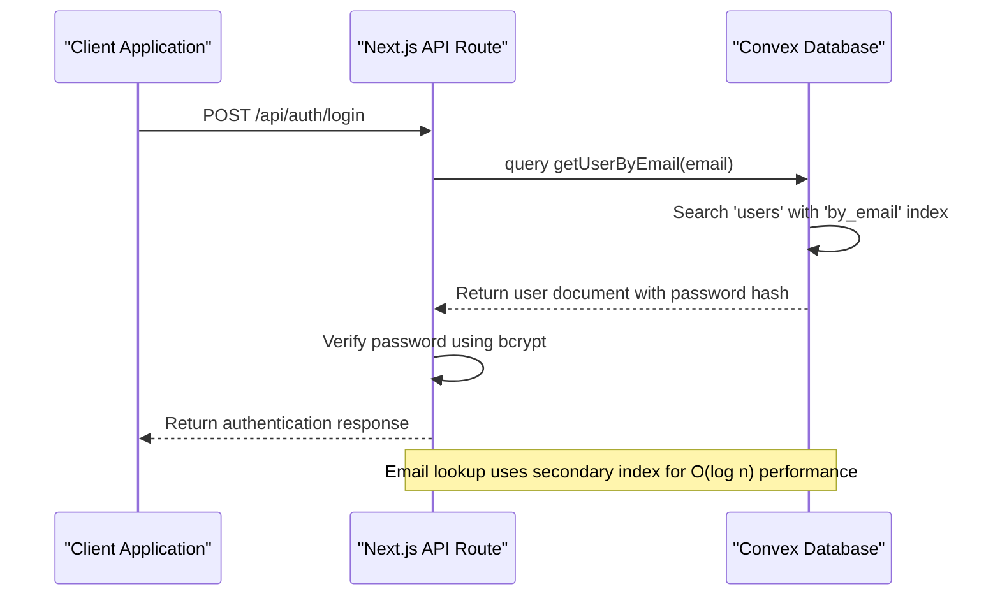
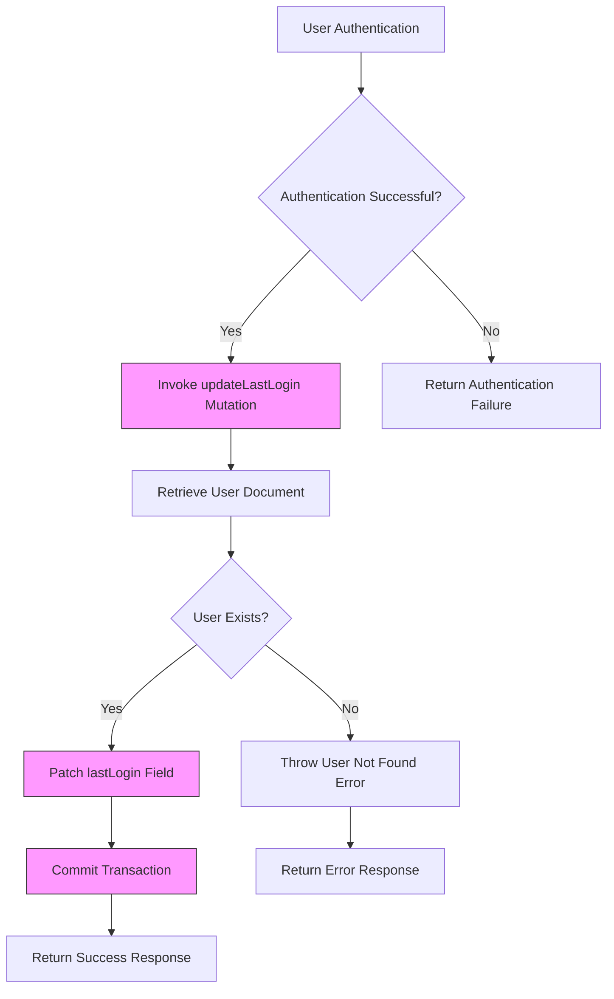

# Convex Data Persistence Layer

<cite>
**Referenced Files in This Document**   
- [auth.ts](file://convex/auth.ts)
- [users.ts](file://convex/users.ts)
- [schema.ts](file://convex/schema.ts)
- [login/route.ts](file://src/app/api/auth/login/route.ts)
- [session.ts](file://src/lib/auth/session.ts)
- [auth.ts](file://src/types/auth.ts)
</cite>

## Table of Contents

1. [Introduction](#introduction)
2. [Data Storage and Retrieval](#data-storage-and-retrieval)
3. [User Data Mutation Process](#user-data-mutation-process)
4. [Schema Design Patterns](#schema-design-patterns)
5. [Data Access Patterns](#data-access-patterns)
6. [Common Issues and Considerations](#common-issues-and-considerations)

## Introduction

The Convex data persistence layer in Kafkasder-panel provides a robust foundation for managing user data and authentication workflows. This document details the implementation of data storage, retrieval, and mutation operations within the Convex database, focusing on the authentication module's core functionality. The system leverages Convex's serverless database capabilities to ensure type-safe operations, efficient querying through secondary indexes, and consistent data management patterns across the application.

## Data Storage and Retrieval

The data retrieval mechanism in Kafkasder-panel centers around the `getUserByEmail` query, which efficiently retrieves user documents from the 'users' collection using a secondary index on the email field. This query is implemented in the auth module and serves as a critical component for the authentication workflow.

The retrieval process begins with a case-insensitive search using the `by_email` index defined in the schema. When a login request is received, the system normalizes the email input and queries the database using this optimized index. The query returns the complete user document, including the password hash which is necessary for verification in the Next.js API routes, as Convex cannot execute bcrypt directly due to its native module dependencies.



**Diagram sources**

- [auth.ts](file://convex/auth.ts#L33-L48)
- [login/route.ts](file://src/app/api/auth/login/route.ts#L62-L63)

**Section sources**

- [auth.ts](file://convex/auth.ts#L33-L48)
- [login/route.ts](file://src/app/api/auth/login/route.ts#L62-L63)

## User Data Mutation Process

The data mutation process in the authentication module is exemplified by the `updateLastLogin` mutation, which updates a user document with a new timestamp when the user successfully logs in. This operation demonstrates Convex's atomic document patching capabilities and ensures data consistency across the system.

When a user authenticates successfully, the system invokes the `updateLastLogin` mutation with the user's ID. The mutation first retrieves the user document to verify its existence, then applies a patch operation to update only the `lastLogin` field with the current timestamp in ISO format. This approach minimizes network overhead and ensures atomicity, as the entire operation is executed within a single transaction on the Convex server.

The mutation is designed to be idempotent and fails gracefully if the user document does not exist, throwing a descriptive error that can be handled by the calling application. This pattern ensures data integrity while providing meaningful feedback for error handling and monitoring.



**Diagram sources**

- [auth.ts](file://convex/auth.ts#L53-L67)
- [login/route.ts](file://src/app/api/auth/login/route.ts#L181-L184)

**Section sources**

- [auth.ts](file://convex/auth.ts#L53-L67)
- [login/route.ts](file://src/app/api/auth/login/route.ts#L181-L184)

## Schema Design Patterns

The schema design in the auth module demonstrates several effective patterns for type safety and data integrity. The system leverages TypeScript types in conjunction with Convex values (v) to ensure compile-time and runtime type checking, creating a robust type-safe environment for data operations.

The user schema defines explicit types for all fields, including string fields for name and email, boolean flags for account status, and optional fields for additional user information. The schema also establishes secondary indexes on key fields such as email, role, and active status, enabling efficient querying patterns. The `by_email` index is particularly critical for authentication workflows, allowing O(log n) lookups instead of full collection scans.

TypeScript interfaces in the frontend codebase mirror the Convex schema definitions, creating a consistent type contract between the client and server. The `User` interface in `types/auth.ts` includes properties that correspond directly to the database fields, with appropriate typing including optional fields and union types for status indicators. This pattern ensures type safety throughout the application stack and reduces the likelihood of runtime errors due to data structure mismatches.

```mermaid
classDiagram
class UserSchema {
+string name
+string email
+string role
+string[] permissions
+boolean isActive
+string? phone
+string? avatar
+string[]? labels
+string? createdAt
+string? lastLogin
+string? passwordHash
}
class UserType {
+string id
+string email
+string name
+string? role
+string? avatar
+PermissionValue[] permissions
+Date? lastLogin
+boolean isActive
+string | Date createdAt
+string | Date updatedAt
+string? phone
+string[]? labels
}
UserSchema --> UserType : "Mirrors structure"
UserType ..> PermissionValue : "Uses enum"
note right of UserSchema
Convex schema with secondary indexes :
- by_email [email]
- by_role [role]
- by_is_active [isActive]
- by_search [name]
end note
note left of UserType
TypeScript interface with proper
typing for frontend consumption
end note
```

**Diagram sources**

- [schema.ts](file://convex/schema.ts#L9-L38)
- [auth.ts](file://src/types/auth.ts#L3-L16)

**Section sources**

- [schema.ts](file://convex/schema.ts#L9-L38)
- [auth.ts](file://src/types/auth.ts#L3-L16)

## Data Access Patterns

The data access patterns in Kafkasder-panel follow Convex best practices, utilizing both direct document retrieval and indexed queries for optimal performance. The system employs `ctx.db.get()` for direct document access by ID and `ctx.db.query()` with indexes for efficient searches, ensuring that database operations are both performant and scalable.

For direct access, the `get` function in the users module uses `ctx.db.get()` to retrieve a user document by its unique ID. This operation is highly efficient with O(1) complexity, making it ideal for scenarios where the document ID is already known. The function is used in authentication workflows to retrieve user information after session validation.

For indexed searches, the system leverages `ctx.db.query()` with specific indexes to filter results efficiently. The `getUserByEmail` query uses the `by_email` index to locate users by their email address, while other queries use indexes on role and active status for filtering. The search functionality also incorporates full-text search capabilities through the `by_search` index, which targets the user's name field while filtering by email and phone.

These patterns ensure that database operations remain performant even as the dataset grows, with queries automatically leveraging the appropriate indexes to minimize execution time and resource consumption.

```mermaid
erDiagram
USER ||--o{ SESSION : "has"
USER ||--o{ SECURITY_EVENT : "generates"
USER ||--o{ AUDIT_LOG : "performs"
USER {
string _id PK
string name
string email UK
string role
string[] permissions
boolean isActive
string? phone
string? avatar
string[]? labels
string? createdAt
string? lastLogin
string? passwordHash
}
SESSION {
string _id PK
string user_id FK
string session_id
string ip_address
string user_agent
string created_at
string last_activity
boolean is_active
}
SECURITY_EVENT {
string _id PK
string user_id FK
string event_type
string ip_address
string user_agent
string occurred_at
string? details
string severity
}
AUDIT_LOG {
string _id PK
string user_id FK
string action
string resource
string resource_id
string timestamp
any? changes
}
index USER by_email [email]
index USER by_role [role]
index USER by_is_active [isActive]
index USER by_search [name]
index SESSION by_user [user_id]
index SESSION by_active [is_active]
index SECURITY_EVENT by_user [user_id]
index SECURITY_EVENT by_event_type [event_type]
index AUDIT_LOG by_user [user_id]
index AUDIT_LOG by_resource [resource, resource_id]
```

**Diagram sources**

- [users.ts](file://convex/users.ts#L66-L71)
- [auth.ts](file://convex/auth.ts#L37-L39)
- [schema.ts](file://convex/schema.ts#L35-L38)

**Section sources**

- [users.ts](file://convex/users.ts#L66-L71)
- [auth.ts](file://convex/auth.ts#L37-L39)

## Common Issues and Considerations

Several common issues and considerations arise in the implementation of the Convex data persistence layer, particularly around index optimization, data consistency, and soft delete patterns. These considerations are addressed through careful schema design and operational patterns.

Index optimization is critical for maintaining query performance as the user base grows. The current implementation includes essential indexes on email, role, and active status fields, but requires monitoring to ensure these indexes remain effective. Over-indexing can impact write performance, while under-indexing can lead to slow queries, so a balanced approach is necessary.

Data consistency is maintained through Convex's transactional guarantees and careful mutation design. The `updateLastLogin` mutation demonstrates this by performing a read-then-write operation within a single transaction, ensuring that the update is atomic and consistent. However, the system must handle cases where users are deactivated during active sessions, which is addressed through middleware that checks the `isActive` flag on each authenticated request.

The soft delete pattern is implemented using the `isActive` boolean flag rather than physically removing user documents. This approach preserves data integrity for audit trails and historical records while effectively disabling user accounts. The flag is checked in multiple locations, including the `getCurrentUser` query and authentication middleware, ensuring consistent enforcement across the application. This pattern allows for account recovery and maintains referential integrity with related documents in other collections.

**Section sources**

- [auth.ts](file://convex/auth.ts#L10-L20)
- [session.ts](file://src/lib/auth/session.ts#L150-L152)
- [schema.ts](file://convex/schema.ts#L23)
