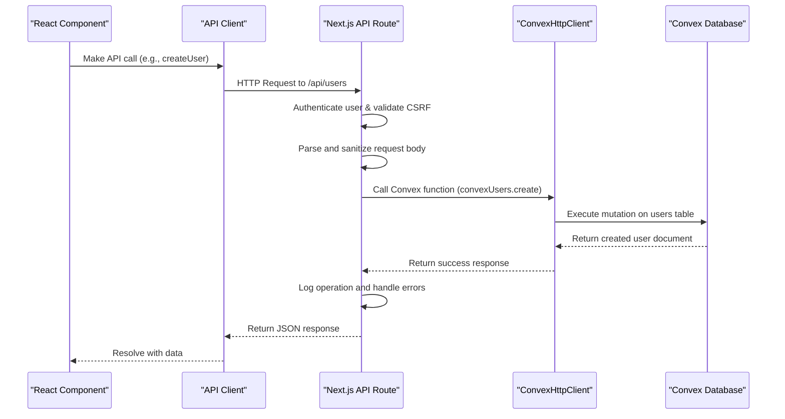

# Data Flow Architecture

<cite>
**Referenced Files in This Document**   
- [client.ts](file://src/lib/convex/client.ts)
- [convex-api-client.ts](file://src/lib/api/convex-api-client.ts)
- [users/route.ts](file://src/app/api/users/route.ts)
- [users.ts](file://convex/users.ts)
- [sentry.client.config.ts](file://sentry.client.config.ts)
- [sentry.server.config.ts](file://sentry.server.config.ts)
</cite>

## Table of Contents

1. [Introduction](#introduction)
2. [Data Flow Overview](#data-flow-overview)
3. [Convex Client Instances](#convex-client-instances)
4. [Lazy Initialization Pattern](#lazy-initialization-pattern)
5. [Error Handling and Logging Strategy](#error-handling-and-logging-strategy)
6. [Sequence Diagram](#sequence-diagram)
7. [Conclusion](#conclusion)

## Introduction

This document describes the complete data flow architecture in Kafkasder-panel, focusing on how data moves from the React frontend through Next.js API routes to the Convex backend and database. The architecture leverages Convex as the backend-as-a-service platform, with a clear separation between client-side and server-side operations. The system implements robust error handling and logging through Sentry integration, ensuring reliability and maintainability across all layers of the application.

## Data Flow Overview

The data flow in Kafkasder-panel follows a structured path from client to backend:

1. **React Component**: A React component initiates an API call using the client-side API wrapper
2. **Next.js API Route**: The request is handled by a Next.js API route that serves as the entry point to the backend
3. **Convex Function Call**: The API route calls a Convex function using the Convex HTTP client
4. **Convex Processing**: Convex processes the query or mutation operation
5. **Database Storage**: Data is stored in the Convex database with automatic indexing and querying capabilities
6. **Response Chain**: The response travels back through the API route to the client
7. **Client Reception**: The frontend receives a JSON response containing the requested data or operation result

This architecture ensures a clean separation of concerns, with the frontend only interacting with API routes rather than directly with the database. The API routes act as a secure gateway to Convex functions, providing an additional layer of validation and authentication.

**Section sources**

- [convex-api-client.ts](file://src/lib/api/convex-api-client.ts#L1-L765)
- [users/route.ts](file://src/app/api/users/route.ts#L1-L223)

## Convex Client Instances

Kafkasder-panel utilizes two distinct Convex client instances to handle different types of operations:

### ConvexReactClient (Frontend)

The `ConvexReactClient` is used for real-time subscriptions in the frontend, enabling reactive data updates without manual polling. This client provides automatic synchronization between the UI and the database, ensuring that components always display the most current data. It supports features like live queries and real-time updates, making it ideal for interactive user interfaces that require immediate feedback.

### ConvexHttpClient (Backend)

The `ConvexHttpClient` is used for server-side operations within Next.js API routes. This client allows the backend to securely communicate with Convex functions, executing queries and mutations with proper authentication and authorization. Unlike the React client, it does not maintain persistent connections for real-time updates but instead makes discrete HTTP requests for each operation.

The separation of these clients follows security best practices, preventing direct client-to-database connections while still enabling real-time functionality where needed. The server-side client can also perform operations that require elevated privileges or access to sensitive data that should not be exposed to the frontend.

**Section sources**

- [client.ts](file://src/lib/convex/client.ts#L1-L108)
- [server.ts](file://src/lib/convex/server.ts#L4-L10)

## Lazy Initialization Pattern

The lazy initialization pattern implemented in `client.ts` prevents build-time errors by deferring Convex client creation until runtime conditions are met. This approach addresses the challenge of environment variable availability during the Next.js build process.

The implementation includes several key features:

- **Build-Time Detection**: The system checks for `NEXT_PHASE === 'phase-production-build'` to identify when code is being executed during the build process
- **URL Validation**: Before creating a client, the system validates the Convex URL format to ensure it follows the expected pattern (`https://your-project.convex.cloud`)
- **Conditional Creation**: The client is only created when a valid URL is available and the application is not in build mode
- **Null Fallback**: When conditions aren't met (during build or with invalid configuration), the system returns `null` instead of attempting to create a client

This pattern ensures that the application can build successfully even when environment variables are not available, while still initializing the Convex client properly in development and production environments. The implementation includes defensive checks and error handling to provide clear feedback when configuration issues occur.

**Section sources**

- [client.ts](file://src/lib/convex/client.ts#L1-L108)

## Error Handling and Logging Strategy

The error handling and logging strategy in Kafkasder-panel provides comprehensive monitoring and debugging capabilities across both client and server environments through Sentry integration.

### Client-Side Error Handling

On the client side, the system captures errors with contextual information including:

- User interactions and component states
- Network request details
- Browser and device information
- Application version and environment

The client configuration samples 10% of traces in production to balance performance and monitoring needs, while enabling session replays for error investigation at a 20% sampling rate.

### Server-Side Error Handling

The server-side error handling includes:

- Full request and response logging for debugging
- Environment-specific error filtering
- Performance monitoring with trace sampling
- Release tracking for version correlation

Both configurations include production-specific settings that enable release tracking and appropriate sampling rates based on the environment. The system uses environment variables to control Sentry DSN and other configuration options, allowing for different settings in development, staging, and production environments.

The error handling is integrated throughout the data flow, with API routes wrapping operations in try-catch blocks and using helper functions like `buildErrorResponse` and `handleApiError` to standardize error responses. This ensures consistent error formats and proper HTTP status codes are returned to the client.

**Section sources**

- [sentry.client.config.ts](file://sentry.client.config.ts#L1-L25)
- [sentry.server.config.ts](file://sentry.server.config.ts#L1-L23)
- [users/route.ts](file://src/app/api/users/route.ts#L142-L152)

## Sequence Diagram

**Diagram sources**

- [convex-api-client.ts](file://src/lib/api/convex-api-client.ts#L121-L716)
- [users/route.ts](file://src/app/api/users/route.ts#L155-L223)
- [users.ts](file://convex/users.ts#L84-L122)

## Conclusion

The data flow architecture in Kafkasder-panel demonstrates a well-structured approach to full-stack development using Next.js and Convex. By separating concerns between client and server components, implementing proper initialization patterns, and establishing comprehensive error handling, the system achieves both reliability and maintainability. The use of two distinct Convex client instances optimizes performance and security, while the lazy initialization pattern prevents common deployment issues. The integrated Sentry monitoring provides valuable insights into application behavior across environments, enabling proactive issue resolution and performance optimization.
