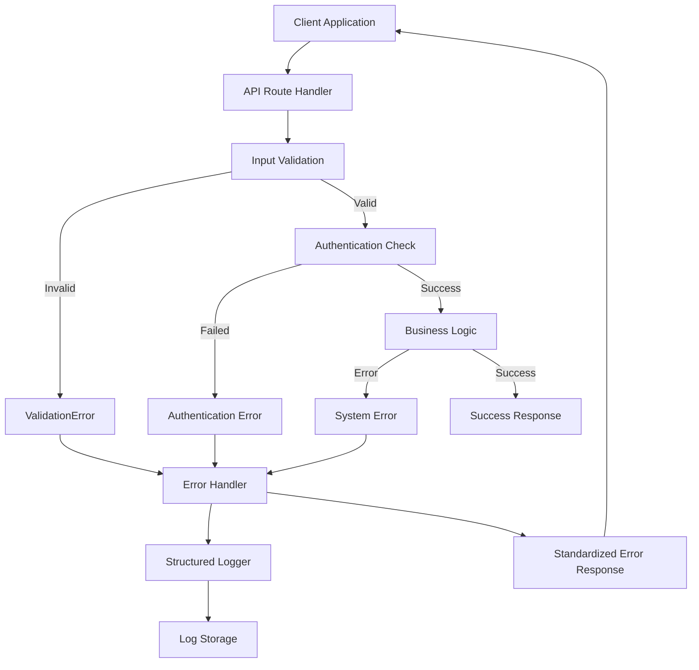
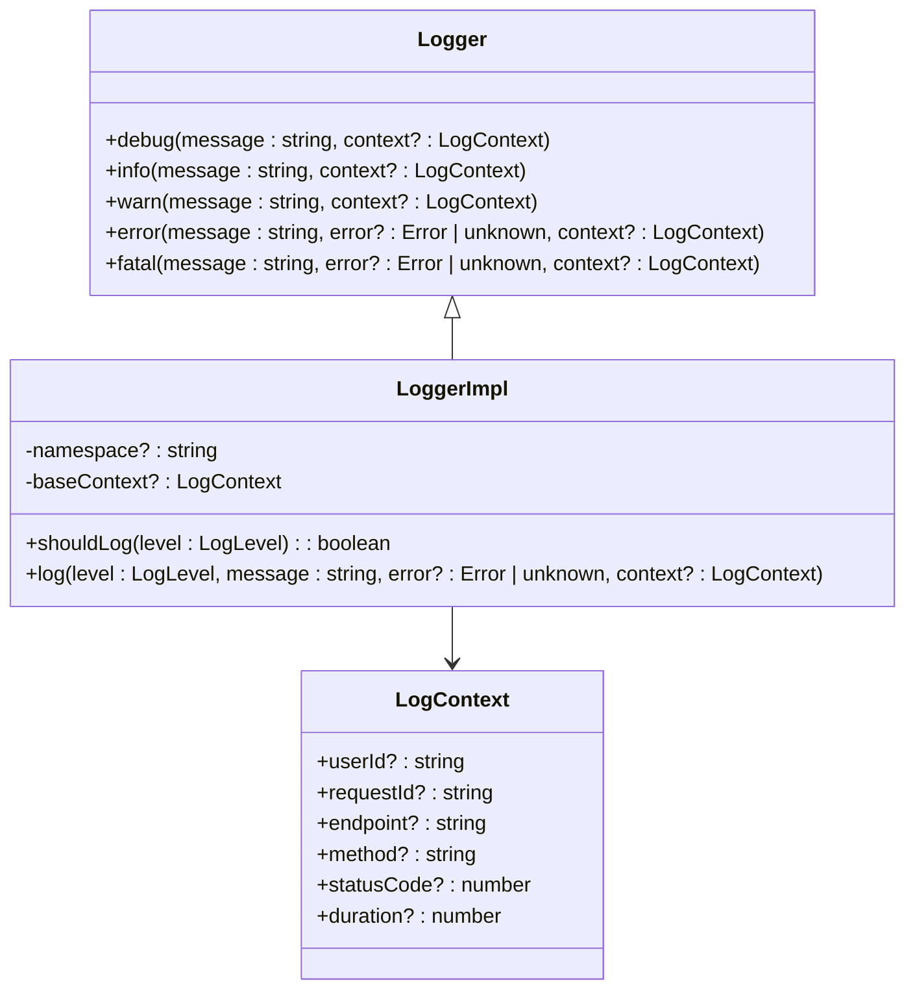
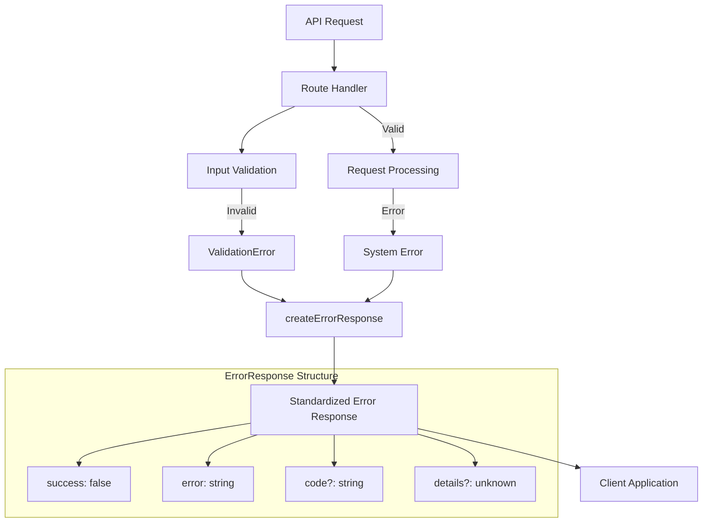
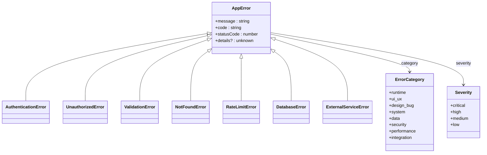
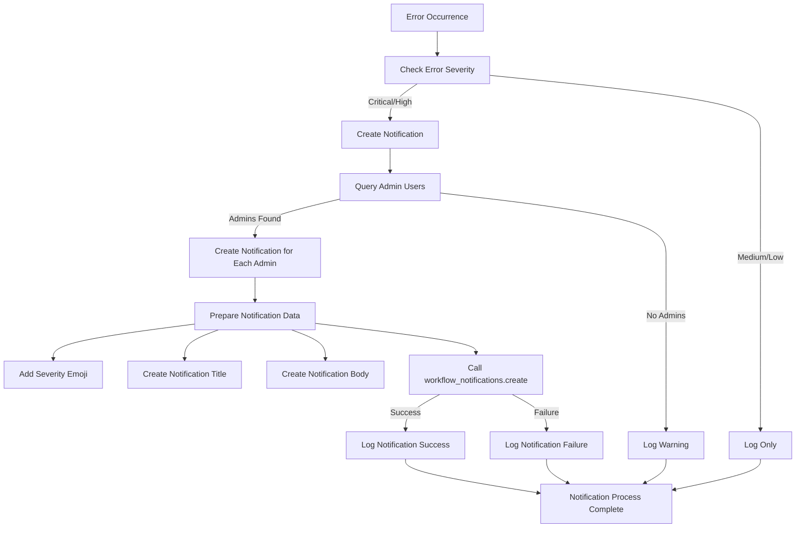
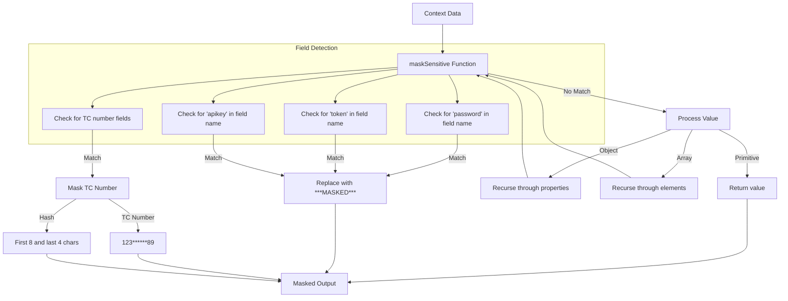
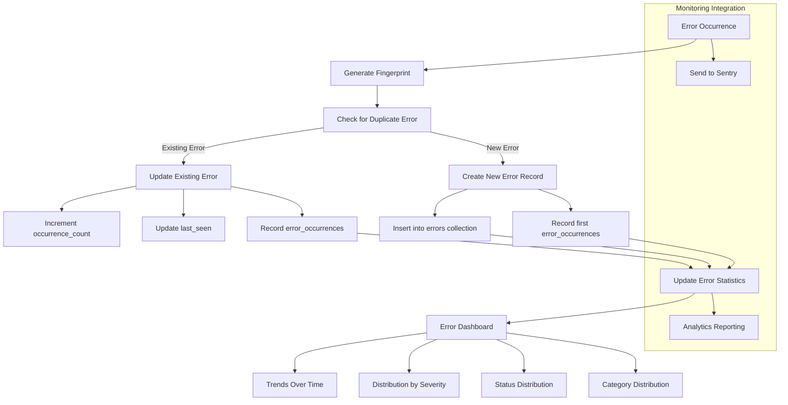
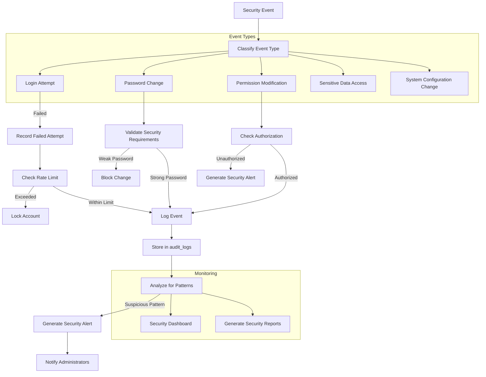

# Error Handling and Logging Strategy

<cite>
**Referenced Files in This Document**   
- [logger.ts](file://src/lib/logger.ts)
- [errors.ts](file://src/lib/errors.ts)
- [route.ts](file://src/app/api/errors/[id]/assign/route.ts)
- [errors.ts](file://convex/errors.ts)
- [login/route.ts](file://src/app/api/auth/login/route.ts)
- [error-notifications.ts](file://src/lib/error-notifications.ts)
- [auth.ts](file://convex/auth.ts)
</cite>

## Table of Contents

1. [Introduction](#introduction)
2. [Error Handling Architecture](#error-handling-architecture)
3. [Structured Logging Strategy](#structured-logging-strategy)
4. [API Error Response Format](#api-error-response-format)
5. [Authentication Error Handling](#authentication-error-handling)
6. [Error Classification and Severity](#error-classification-and-severity)
7. [Error Notification System](#error-notification-system)
8. [Sensitive Data Protection](#sensitive-data-protection)
9. [Error Correlation and Monitoring](#error-correlation-and-monitoring)
10. [Security Threat Detection](#security-threat-detection)
11. [Conclusion](#conclusion)

## Introduction

The Kafkasder-panel application implements a comprehensive error handling and logging strategy designed to ensure system reliability, security, and maintainability. This document details the multi-layered approach to error management across the application's data flow architecture, from client-side API calls to server-side Convex operations. The system employs structured logging with the logger module to capture authentication events, system errors, and user activities, while maintaining strict privacy controls for sensitive information. The error handling framework provides standardized responses across API routes with consistent success/error flags and HTTP status codes, enabling reliable client-side error management.

**Section sources**

- [logger.ts](file://src/lib/logger.ts#L1-L213)
- [errors.ts](file://src/lib/errors.ts#L1-L377)

## Error Handling Architecture

The error handling architecture in Kafkasder-panel follows a layered approach that captures and processes errors at multiple levels of the application stack. At the API route level, error handling is implemented through a combination of validation, authentication checks, and exception handling. The system uses a centralized error handling approach in API routes, where errors are caught and transformed into standardized response formats. For example, in the authentication login route, various error conditions are handled including invalid credentials, account lockouts, and inactive accounts, each producing appropriate HTTP status codes and error messages.

The architecture employs a try-catch mechanism in API route handlers to capture unexpected errors and prevent application crashes. When an error occurs, it is logged with comprehensive context information and transformed into a user-friendly error response. The system also implements rate limiting for authentication endpoints to prevent brute force attacks, with specific error handling for rate-limited requests. Error handling extends to Convex operations, where mutations and queries include validation and error handling logic to ensure data integrity and provide meaningful error feedback.



**Diagram sources**

- [login/route.ts](file://src/app/api/auth/login/route.ts#L23-L231)
- [errors.ts](file://src/lib/errors.ts#L1-L377)

**Section sources**

- [login/route.ts](file://src/app/api/auth/login/route.ts#L23-L231)
- [errors.ts](file://src/lib/errors.ts#L1-L377)

## Structured Logging Strategy

The structured logging strategy in Kafkasder-panel is implemented through the logger module, which provides a consistent interface for logging events across the application. The logger captures detailed context information including user IDs, request IDs, endpoints, HTTP methods, status codes, and execution duration. This structured approach enables effective monitoring, debugging, and performance analysis. The logger supports multiple log levels (debug, info, warn, error, fatal) with configurable minimum log levels based on the environment (development vs. production).

In development environments, logs are output with color coding and formatted for human readability, while in production, logs are output as JSON objects for easy parsing and integration with monitoring systems. The logging system automatically integrates with Sentry for error tracking and monitoring, capturing exceptions with full context information. Log entries include timestamps in ISO format, log levels, messages, context data, and error information when applicable. The system also implements performance monitoring through the measureTime utility function, which logs execution duration for specific operations.



**Diagram sources**

- [logger.ts](file://src/lib/logger.ts#L1-L213)

**Section sources**

- [logger.ts](file://src/lib/logger.ts#L1-L213)

## API Error Response Format

The API error response format in Kafkasder-panel follows a standardized structure that ensures consistency across all endpoints. Error responses include a success flag set to false, an error message, an optional error code, and additional details when applicable. The response format is defined by the ErrorResponse interface, which ensures type safety and consistency. HTTP status codes are used appropriately to indicate the nature of the error, with 4xx codes for client errors and 5xx codes for server errors.

For validation errors, the system returns a 400 status code with a message indicating invalid input. Authentication failures return 401 status codes, while authorization failures return 403 status codes. Not found errors return 404 status codes, and rate limiting errors return 429 status codes. Server errors return 500 status codes with generic error messages to prevent information disclosure. The createErrorResponse function transforms various error types into the standardized response format, ensuring consistent error handling across the application.



**Diagram sources**

- [errors.ts](file://src/lib/errors.ts#L326-L359)
- [route-helpers.ts](file://src/lib/api/route-helpers.ts#L1-L73)

**Section sources**

- [errors.ts](file://src/lib/errors.ts#L326-L359)
- [route-helpers.ts](file://src/lib/api/route-helpers.ts#L1-L73)

## Authentication Error Handling

Authentication error handling in Kafkasder-panel is designed to balance security and user experience. The system implements multiple layers of protection against unauthorized access while providing clear feedback to legitimate users. When a login attempt fails due to invalid credentials, the system returns a 401 status code with a generic error message to prevent user enumeration attacks. The error message "Geçersiz email veya şifre" (Invalid email or password) is used for both non-existent users and incorrect passwords to maintain security.

The system includes account lockout functionality to prevent brute force attacks. After a configurable number of failed login attempts, the account is temporarily locked, and subsequent login attempts return a 429 status code with a message indicating the account is temporarily locked. The lockout duration is configurable, and the remaining time is included in the error response. Successful login attempts clear the failed attempt counter, preventing legitimate users from being locked out after correcting their credentials.

```mermaid
sequenceDiagram
participant Client
participant LoginRoute
participant AuthSystem
participant Logger
Client->>LoginRoute : POST /api/auth/login
LoginRoute->>LoginRoute : Validate input
alt Invalid input
LoginRoute->>Client : 400 Bad Request
LoginRoute->>Logger : Log validation error
stop
end
LoginRoute->>AuthSystem : Check account lockout
alt Account locked
LoginRoute->>Client : 429 Too Many Requests
LoginRoute->>Logger : Log lockout event
stop
end
LoginRoute->>AuthSystem : Lookup user by email
alt User not found
LoginRoute->>AuthSystem : Record failed attempt
LoginRoute->>Client : 401 Unauthorized
LoginRoute->>Logger : Log failed login attempt
stop
end
AuthSystem->>AuthSystem : Verify password
alt Password invalid
LoginRoute->>AuthSystem : Record failed attempt
LoginRoute->>Client : 401 Unauthorized
LoginRoute->>Logger : Log invalid password
stop
end
AuthSystem->>LoginRoute : Return user data
LoginRoute->>LoginRoute : Create session
LoginRoute->>Client : 200 OK with user data
LoginRoute->>Logger : Log successful login
```

**Diagram sources**

- [login/route.ts](file://src/app/api/auth/login/route.ts#L23-L231)
- [account-lockout.ts](file://src/lib/auth/account-lockout.ts#L1-L100)

**Section sources**

- [login/route.ts](file://src/app/api/auth/login/route.ts#L23-L231)
- [account-lockout.ts](file://src/lib/auth/account-lockout.ts#L1-L100)

## Error Classification and Severity

The error classification system in Kafkasder-panel categorizes errors based on their type and severity to enable appropriate handling and prioritization. Errors are classified into several categories including runtime, UI/UX, design_bug, system, data, security, performance, and integration. Each error is assigned a severity level: critical, high, medium, or low, which determines its priority for resolution and notification.

The system uses a comprehensive error hierarchy with specific error classes extending from a base AppError class. This includes specialized error types such as ValidationError, NotFoundError, RateLimitError, DatabaseError, and ExternalServiceError, each with appropriate status codes and error codes. The error classification enables targeted error handling and reporting, allowing the system to respond appropriately to different types of errors. For example, critical errors trigger immediate notifications to administrators, while lower severity errors may only be logged for later review.



**Diagram sources**

- [errors.ts](file://src/lib/errors.ts#L8-L184)
- [errors.ts](file://convex/errors.ts#L18-L27)

**Section sources**

- [errors.ts](file://src/lib/errors.ts#L8-L184)
- [errors.ts](file://convex/errors.ts#L18-L27)

## Error Notification System

The error notification system in Kafkasder-panel ensures that critical errors are promptly communicated to administrators and relevant team members. The system uses the error-notifications module to create notifications for admin users when significant errors occur. Notifications are created based on error severity, with critical and high-severity errors triggering immediate notifications. The notification system integrates with the workflow_notifications Convex function to deliver notifications within the application.

When a critical error occurs, the system creates a notification with an appropriate emoji (🚨 for critical errors, ⚠️ for high-severity errors) and a descriptive title and body. The notification includes key error details such as the error title, category, code, and component, while omitting sensitive information. Administrators receive notifications in the application's notification center, enabling them to respond quickly to critical issues. The system also supports email notifications for critical errors, though this functionality is currently implemented as a placeholder for future integration.



**Diagram sources**

- [error-notifications.ts](file://src/lib/error-notifications.ts#L45-L86)
- [errors.ts](file://convex/errors.ts#L13-L48)

**Section sources**

- [error-notifications.ts](file://src/lib/error-notifications.ts#L45-L86)
- [errors.ts](file://convex/errors.ts#L13-L48)

## Sensitive Data Protection

The sensitive data protection system in Kafkasder-panel ensures that personally identifiable information and other sensitive data are not exposed in logs or error messages. The logger module implements automatic redaction of sensitive fields, including passwords, tokens, API keys, and TC identification numbers. When logging context data, the system recursively traverses objects and arrays, identifying and masking sensitive fields based on their names.

TC identification numbers are specifically masked to show only the first three and last two digits (e.g., 123**\*\***89), while password fields, tokens, and API keys are completely masked with "**_MASKED_**". This protection extends to error stack traces, which are truncated in production environments to prevent sensitive information disclosure. The system also masks sensitive data in audit logs and error notifications, ensuring that privacy is maintained across all logging and monitoring systems.



**Diagram sources**

- [logger.ts](file://src/lib/logger.ts#L66-L95)
- [export-service.ts](file://src/lib/export/export-service.ts#L55)

**Section sources**

- [logger.ts](file://src/lib/logger.ts#L66-L95)
- [export-service.ts](file://src/lib/export/export-service.ts#L55)

## Error Correlation and Monitoring

The error correlation and monitoring system in Kafkasder-panel enables effective tracking and analysis of errors across distributed systems. Each error is assigned a unique identifier and fingerprint to enable deduplication and correlation of repeated occurrences. The system tracks error occurrences over time, maintaining counts of first and subsequent occurrences. This allows the system to distinguish between new errors and recurring issues, providing valuable insights for troubleshooting and prioritization.

The monitoring system integrates with Sentry for comprehensive error tracking and performance monitoring. Error logs include request IDs, user IDs, and session IDs to enable correlation of related events across different system components. The system also implements error statistics and trends reporting, providing dashboards that show error counts by status, severity, category, and time period. This enables teams to identify patterns, monitor error resolution progress, and detect emerging issues before they affect users.



**Diagram sources**

- [errors.ts](file://convex/errors.ts#L51-L128)
- [monitoring.ts](file://convex/monitoring.ts#L1-L50)

**Section sources**

- [errors.ts](file://convex/errors.ts#L51-L128)
- [monitoring.ts](file://convex/monitoring.ts#L1-L50)

## Security Threat Detection

The security threat detection system in Kafkasder-panel monitors for suspicious activities and potential security breaches. The system implements rate limiting on authentication endpoints to prevent brute force attacks, with automatic account lockout after a configurable number of failed attempts. Failed login attempts are logged with the user's IP address and user agent, enabling analysis of attack patterns. The system also monitors for repeated failed attempts across multiple accounts, which may indicate credential stuffing attacks.

Audit logs capture security-relevant events including login attempts, password changes, and permission modifications. These logs include the user's IP address, user agent, and timestamp, enabling forensic analysis in case of security incidents. The system integrates with a security audit module that analyzes logs for suspicious patterns and generates security events for potential threats. Critical security events trigger immediate notifications to administrators, ensuring rapid response to potential breaches.



**Diagram sources**

- [security_audit.ts](file://convex/security_audit.ts#L217-L259)
- [account-lockout.ts](file://src/lib/auth/account-lockout.ts#L1-L100)

**Section sources**

- [security_audit.ts](file://convex/security_audit.ts#L217-L259)
- [account-lockout.ts](file://src/lib/auth/account-lockout.ts#L1-L100)

## Conclusion

The error handling and logging strategy in Kafkasder-panel provides a comprehensive framework for managing errors across the application's data flow architecture. The system implements a layered approach to error handling, with consistent error responses, structured logging, and appropriate error classification. The integration with Sentry enables effective monitoring and alerting, while the sensitive data protection mechanisms ensure privacy and compliance.

The authentication error handling system balances security and user experience, with rate limiting and account lockout features to prevent brute force attacks. The error notification system ensures that critical issues are promptly communicated to administrators, enabling rapid response to problems. The system's error correlation capabilities allow for effective tracking and analysis of issues across distributed components.

Overall, the error handling and logging strategy contributes significantly to the reliability, security, and maintainability of the Kafkasder-panel application. By providing comprehensive visibility into system behavior and potential issues, the system enables proactive monitoring and rapid resolution of problems, ultimately improving the user experience and system stability.
