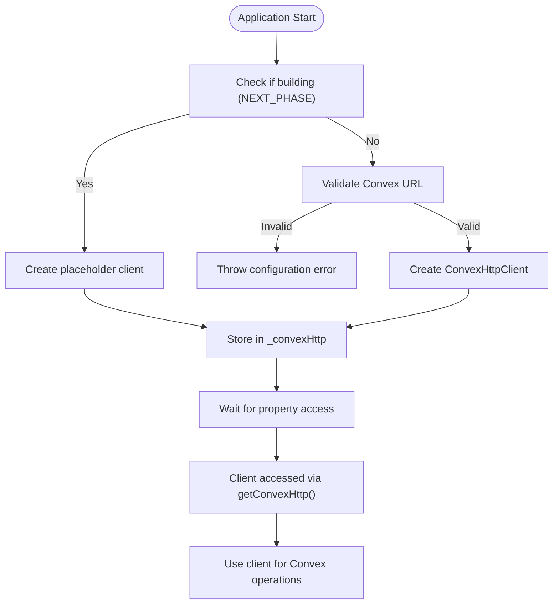
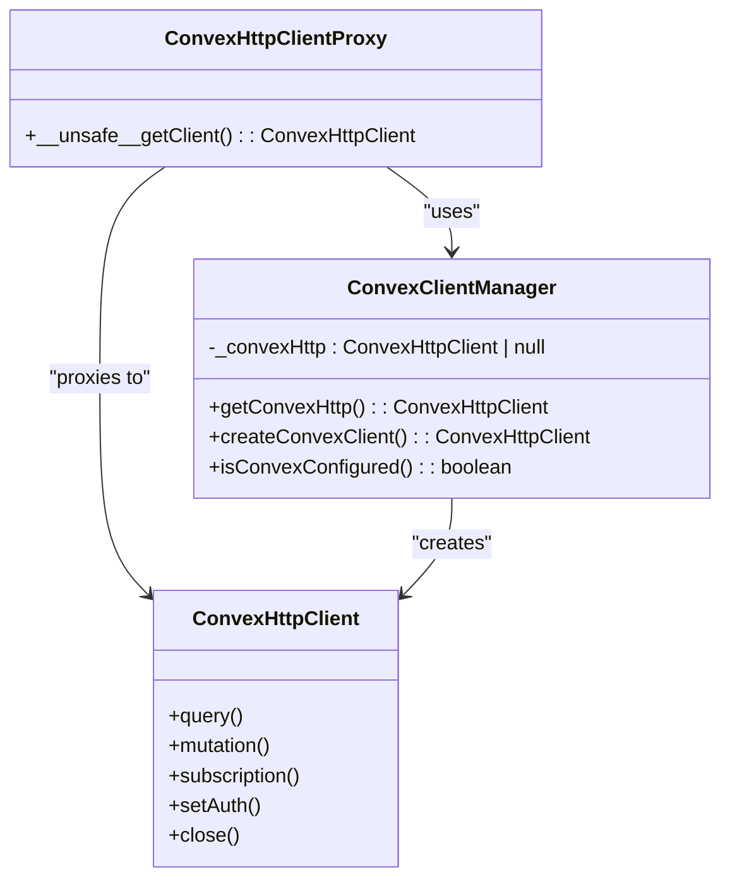
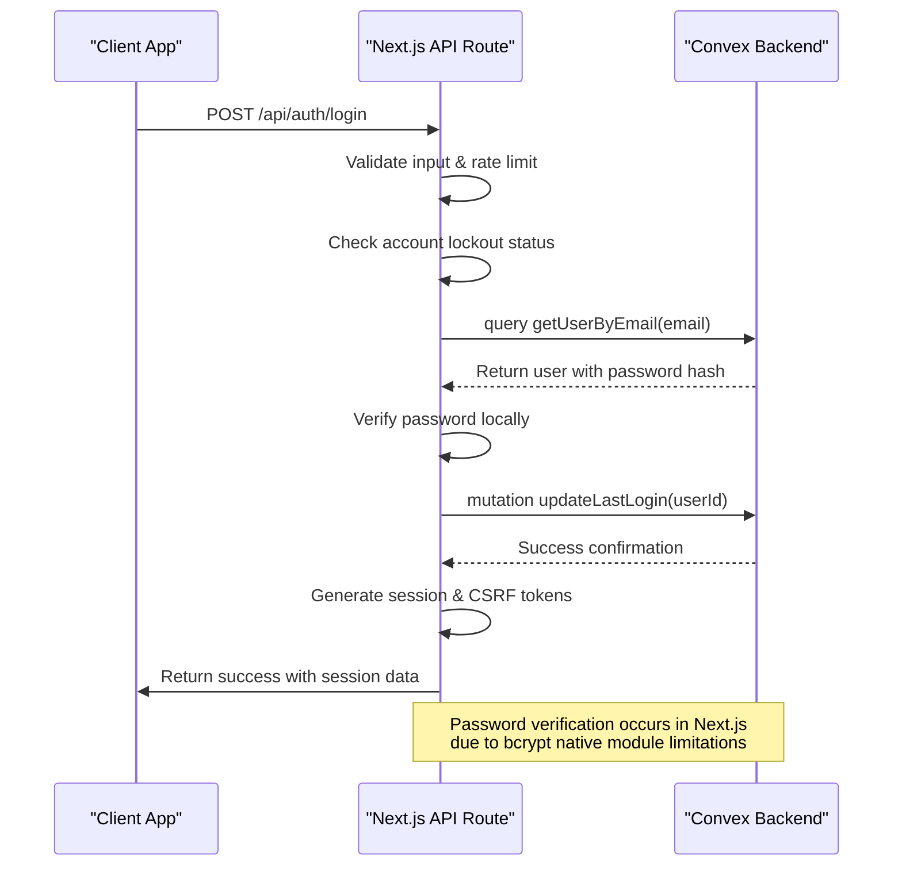

# Server-Convex Integration

<cite>
**Referenced Files in This Document**   
- [server.ts](file://src/lib/convex/server.ts)
- [auth.ts](file://convex/auth.ts)
- [login/route.ts](file://src/app/api/auth/login/route.ts)
- [convex-api-client.ts](file://src/lib/api/convex-api-client.ts)
- [client.ts](file://src/lib/convex/client.ts)
</cite>

## Table of Contents

1. [Introduction](#introduction)
2. [Core Integration Architecture](#core-integration-architecture)
3. [Lazy Initialization Pattern](#lazy-initialization-pattern)
4. [Proxy Client Implementation](#proxy-client-implementation)
5. [Login Flow Implementation](#login-flow-implementation)
6. [Error Handling and Logging](#error-handling-and-logging)
7. [Convex Operations Overview](#convex-operations-overview)
8. [Security Considerations](#security-considerations)
9. [Common Configuration Issues](#common-configuration-issues)
10. [Performance and Reliability](#performance-and-reliability)

## Introduction

The Kafkasder-panel application implements a robust server-side integration pattern between Next.js API routes and Convex, a serverless backend platform. This integration enables secure, type-safe communication between the frontend application and backend data operations while addressing critical concerns such as build-time compatibility, environment configuration, and authentication security. The architecture centers around the use of ConvexHttpClient to invoke server-side queries and mutations from Next.js API endpoints, with particular attention to lazy initialization patterns that prevent build-time errors.

## Core Integration Architecture

The integration pattern follows a layered approach where Next.js API routes serve as the interface between client requests and Convex backend operations. API routes import and utilize the ConvexHttpClient instance through the `convexHttp` proxy object, which provides access to generated Convex API functions. This pattern maintains separation of concerns by keeping Convex-specific logic within server-side routes while exposing clean REST-like endpoints to the frontend.

The architecture leverages Convex's code generation system, which produces type-safe API references in the `_generated` directory. These generated types ensure compile-time safety when calling Convex queries and mutations from Next.js routes. The integration is designed to be resilient to environment configuration issues, particularly during the Next.js build process when environment variables may not be available.

**Section sources**

- [server.ts](file://src/lib/convex/server.ts#L1-L71)
- [convex-api-client.ts](file://src/lib/api/convex-api-client.ts#L1-L765)

## Lazy Initialization Pattern

The integration implements a sophisticated lazy initialization pattern in `server.ts` to prevent build-time errors when the Convex URL is not configured. This pattern uses a combination of environment detection and conditional client creation to ensure the application can build successfully even when environment variables are missing.

The implementation checks for build-time conditions using `process.env.NEXT_PHASE === 'phase-production-build'` and validates the presence of `NEXT_PUBLIC_CONVEX_URL`. When in build mode or when the URL is invalid, the system creates a placeholder client or defers initialization entirely. The actual Convex client is only instantiated when first accessed at runtime, ensuring that network connections and configuration validation occur during actual execution rather than during the build process.

This approach allows the application to compile successfully in CI/CD pipelines and development environments without requiring fully configured Convex credentials, while still providing proper error handling when the client is actually used in production.

**Diagram sources**

- [server.ts](file://src/lib/convex/server.ts#L18-L48)

**Section sources**

- [server.ts](file://src/lib/convex/server.ts#L18-L48)
- [client.ts](file://src/lib/convex/client.ts#L7-L43)

## Proxy Client Implementation

The integration employs a Proxy pattern to further enhance the lazy initialization behavior. The `convexHttp` export is implemented as a JavaScript Proxy that intercepts property access on the Convex client object. This design ensures that the actual Convex client is only created when a specific method or property is accessed, rather than when the module is imported.

The Proxy implementation includes special handling for the `__unsafe__getClient` method, which provides direct access to the underlying client instance for advanced use cases requiring additional configuration. For all other property accesses, the Proxy routes calls through the `getConvexHttp()` function, which implements the lazy initialization logic.

This pattern provides several benefits:

- Prevents premature client creation during module loading
- Enables tree-shaking and reduces bundle size
- Provides a clean API surface that appears synchronous while implementing asynchronous initialization patterns
- Maintains compatibility with Convex's type definitions and code generation system

**Diagram sources**

- [server.ts](file://src/lib/convex/server.ts#L5-L62)

**Section sources**

- [server.ts](file://src/lib/convex/server.ts#L52-L62)

## Login Flow Implementation

The login flow serves as a primary example of the server-Convex integration pattern. The `/api/auth/login` route demonstrates how Next.js API routes use the ConvexHttpClient to authenticate users by calling Convex query and mutation functions.

The login process begins with input validation and rate limiting, followed by a call to `convexHttp.query(api.auth.getUserByEmail)` to retrieve the user record from Convex. This query returns the user document including the password hash, which is necessary for verification. Password verification is performed locally in Next.js using the `verifyPassword` function, as Convex cannot execute bcrypt due to its native module dependencies.

Upon successful authentication, the flow calls `convexHttp.mutation(api.auth.updateLastLogin)` to update the user's last login timestamp. This mutation is executed asynchronously, with errors being logged but not failing the overall login process. The implementation includes comprehensive error handling for various failure scenarios, including account lockout due to failed attempts, inactive accounts, and invalid credentials.

**Diagram sources**

- [login/route.ts](file://src/app/api/auth/login/route.ts#L23-L231)
- [auth.ts](file://convex/auth.ts#L33-L48)

**Section sources**

- [login/route.ts](file://src/app/api/auth/login/route.ts#L23-L231)
- [auth.ts](file://convex/auth.ts#L33-L48)

## Error Handling and Logging

The integration implements a comprehensive error handling and logging strategy to ensure reliability and observability. All Convex calls are wrapped in try-catch blocks that provide meaningful error responses to clients while preserving sensitive information.

When Convex calls fail, the system distinguishes between different error types:

- Configuration errors (missing Convex URL) are caught during client initialization
- Network errors during query/mutation execution are handled at the API route level
- Authentication-specific errors are translated into appropriate HTTP status codes

The implementation uses a centralized logger to record all authentication events, including successful logins, failed attempts, and system errors. Sensitive information like full email addresses is masked in logs to prevent accidental exposure. Error messages returned to clients are user-friendly and avoid revealing implementation details that could be exploited.

For mutations that are secondary to the main operation (like updating last login time), the system implements non-blocking error handling where failures are logged but do not affect the primary operation's success.

**Section sources**

- [login/route.ts](file://src/app/api/auth/login/route.ts#L208-L228)
- [server.ts](file://src/lib/convex/server.ts#L34-L36)

## Convex Operations Overview

The integration supports various Convex operations through a consistent pattern of query and mutation calls from Next.js API routes. Queries are used for read operations and are typically called with `convexHttp.query()`, while mutations are used for write operations and are called with `convexHttp.mutation()`.

The pattern is consistent across different domains in the application:

- User management operations use queries to retrieve user data and mutations to update user state
- Authentication flows use queries for user lookup and mutations for session updates
- Data operations for entities like beneficiaries, donations, and meetings follow the same pattern

The generated API types from Convex ensure that all operations are type-safe, with proper validation of input parameters and return types. This eliminates runtime type errors and provides excellent developer experience through IDE autocomplete and type checking.

**Section sources**

- [auth.ts](file://convex/auth.ts#L9-L82)
- [convex-api-client.ts](file://src/lib/api/convex-api-client.ts#L121-L716)

## Security Considerations

A critical security consideration in this integration is the decision to keep password verification in Next.js rather than in Convex. This is necessitated by technical limitations—bcrypt, the library used for password hashing, relies on native modules that cannot be executed in Convex's serverless environment.

This architectural decision has important security implications:

- The password hash must be returned from Convex to Next.js, requiring careful handling to prevent exposure
- All authentication logic must be implemented in trusted server-side code (Next.js API routes)
- The system must ensure that password hashes are never exposed to client-side code

The implementation addresses these concerns by:

- Restricting access to password hashes to authentication-specific queries
- Using HTTPS for all communications
- Implementing proper error handling that doesn't leak information about user existence
- Using secure session management with HttpOnly cookies

Additionally, the system implements account lockout mechanisms after repeated failed login attempts to prevent brute force attacks, with lockout state managed in Next.js rather than Convex for performance reasons.

**Section sources**

- [auth.ts](file://convex/auth.ts#L6-L8)
- [login/route.ts](file://src/app/api/auth/login/route.ts#L96-L107)

## Common Configuration Issues

Several common issues can arise with the server-Convex integration, primarily related to environment configuration:

1. **Missing NEXT_PUBLIC_CONVEX_URL**: This is the most common issue, especially in development or CI/CD environments. The lazy initialization pattern prevents build failures, but the application will fail at runtime if the URL is not properly configured.

2. **Incorrect URL format**: The Convex URL must be a valid HTTPS URL ending with `.convex.cloud`. Invalid formats are validated in the client initialization code.

3. **Build-time vs runtime configuration**: Developers must understand that environment variables available at runtime may not be available during the build process, necessitating the lazy initialization pattern.

4. **Rate limiting at Convex level**: Convex applies rate limits to API calls, which must be considered when designing high-frequency operations. The application should implement appropriate retry logic and caching.

The system includes validation and logging to help diagnose these issues, with clear error messages that guide developers toward proper configuration.

**Section sources**

- [server.ts](file://src/lib/convex/server.ts#L15-L21)
- [client.ts](file://src/lib/convex/client.ts#L4-L39)

## Performance and Reliability

The integration is designed with performance and reliability in mind. The lazy initialization and Proxy patterns minimize startup overhead and prevent unnecessary network connections during application initialization.

For reliability, the system implements:

- Graceful degradation when Convex is unavailable
- Comprehensive error logging and monitoring
- Input validation and sanitization
- Rate limiting to prevent abuse

The use of generated API types from Convex ensures that all operations are optimized and follow best practices for data access patterns. The architecture supports scaling by leveraging Convex's serverless infrastructure while maintaining predictable performance characteristics.

**Section sources**

- [server.ts](file://src/lib/convex/server.ts#L68-L71)
- [client.ts](file://src/lib/convex/client.ts#L84-L91)
