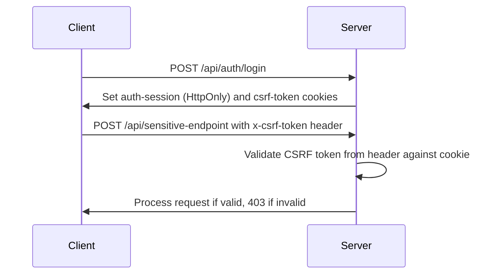
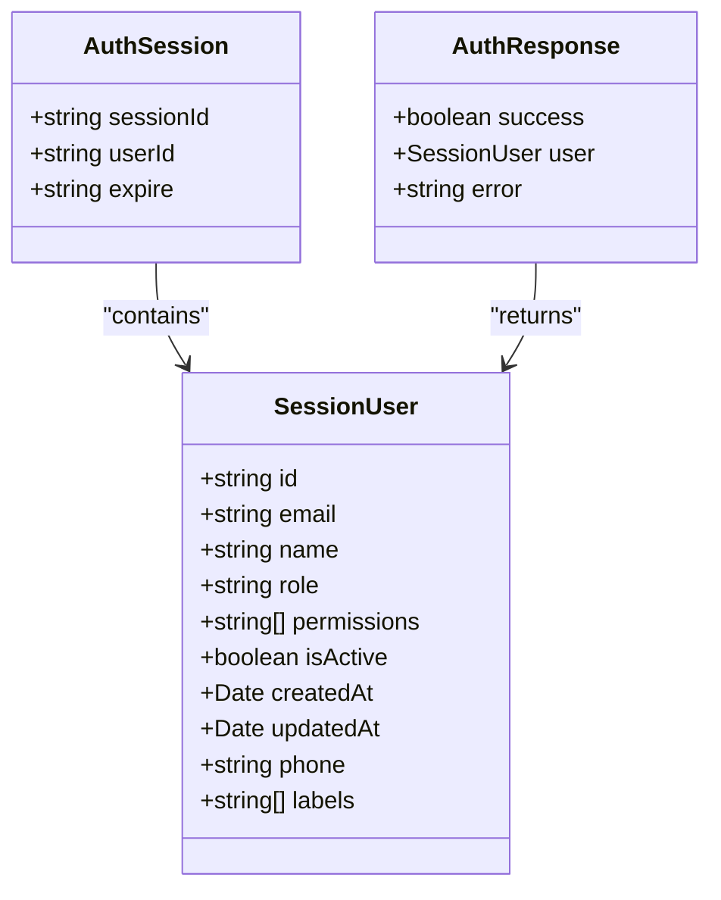

# Authentication API Routes

<cite>
**Referenced Files in This Document**   
- [login/route.ts](file://src/app/api/auth/login/route.ts)
- [logout/route.ts](file://src/app/api/auth/logout/route.ts)
- [session/route.ts](file://src/app/api/auth/session/route.ts)
- [dev-login/route.ts](file://src/app/api/auth/dev-login/route.ts)
- [auth.ts](file://convex/auth.ts)
- [session.ts](file://src/lib/auth/session.ts)
- [csrf.ts](file://src/lib/csrf.ts)
- [rate-limit.ts](file://src/lib/rate-limit.ts)
</cite>

## Table of Contents

1. [Introduction](#introduction)
2. [Authentication API Endpoints](#authentication-api-endpoints)
   - [POST /api/auth/login](#post-apiauthlogin)
   - [POST /api/auth/logout](#post-apiauthlogout)
   - [GET /api/auth/session](#get-apiauthsession)
   - [GET /api/auth/dev-login](#get-apiauthdev-login)
3. [Security Implementation](#security-implementation)
   - [CSRF Protection](#csrf-protection)
   - [Rate Limiting](#rate-limiting)
   - [Session Management](#session-management)
4. [Client-Side Integration](#client-side-integration)
5. [Security Considerations](#security-considerations)
6. [Error Handling](#error-handling)

## Introduction

The Kafkasder-panel authentication system provides a secure API for user authentication and session management. This documentation details the authentication endpoints, their integration with Convex backend functions, and the security mechanisms implemented throughout the authentication flow. The system uses HttpOnly cookies for session management, CSRF tokens for protection against cross-site request forgery, and rate limiting to prevent brute-force attacks.

**Section sources**

- [login/route.ts](file://src/app/api/auth/login/route.ts)
- [logout/route.ts](file://src/app/api/auth/logout/route.ts)
- [session/route.ts](file://src/app/api/auth/session/route.ts)
- [dev-login/route.ts](file://src/app/api/auth/dev-login/route.ts)

## Authentication API Endpoints

### POST /api/auth/login

Handles user login with CSRF protection, password verification, and session cookie creation.

**HTTP Method**: POST

**Request Schema**:

```json
{
  "email": "string",
  "password": "string",
  "rememberMe": "boolean (optional)"
}
```

**Response Schema (Success)**:

```json
{
  "success": true,
  "data": {
    "user": {
      "id": "string",
      "email": "string",
      "name": "string",
      "role": "string",
      "permissions": ["string"],
      "isActive": "boolean",
      "createdAt": "string",
      "updatedAt": "string",
      "phone": "string",
      "labels": ["string"]
    },
    "session": {
      "sessionId": "string",
      "expire": "string (ISO date)"
    }
  }
}
```

**Response Schema (Error)**:

```json
{
  "success": false,
  "error": "string",
  "remainingAttempts": "number (optional)",
  "locked": "boolean (optional)",
  "remainingSeconds": "number (optional)"
}
```

**Authentication Requirements**: None (public endpoint)

**Error Codes**:

- `400 Bad Request`: Missing email or password
- `401 Unauthorized`: Invalid credentials
- `403 Forbidden`: Inactive account
- `429 Too Many Requests`: Account locked due to failed attempts
- `500 Internal Server Error`: Server error during login process

**Section sources**

- [login/route.ts](file://src/app/api/auth/login/route.ts)
- [auth.ts](file://convex/auth.ts)
- [password.ts](file://src/lib/auth/password.ts)

### POST /api/auth/logout

Clears session cookie and logs out the user.

**HTTP Method**: POST

**Request Schema**: None

**Response Schema (Success)**:

```json
{
  "success": true,
  "message": "string"
}
```

**Response Schema (Error)**:

```json
{
  "success": true,
  "message": "string"
}
```

**Authentication Requirements**: None (public endpoint, but requires active session)

**Error Codes**:

- `200 OK`: Logout successful (even if errors occur during cookie cleanup)
- `500 Internal Server Error`: Error during logout process (still returns success)

**Section sources**

- [logout/route.ts](file://src/app/api/auth/logout/route.ts)

### GET /api/auth/session

Retrieves current session information for client-side authentication state initialization.

**HTTP Method**: GET

**Request Schema**: None

**Response Schema (Success)**:

```json
{
  "success": true,
  "data": {
    "userId": "string",
    "expiresAt": "string (ISO date)"
  }
}
```

**Response Schema (Error)**:

```json
{
  "success": false,
  "error": "string"
}
```

**Authentication Requirements**: Requires valid session cookie

**Error Codes**:

- `401 Unauthorized`: No active session or session expired
- `401 Unauthorized`: Invalid session data
- `500 Internal Server Error`: Server error during session validation

**Section sources**

- [session/route.ts](file://src/app/api/auth/session/route.ts)
- [session.ts](file://src/lib/auth/session.ts)

### GET /api/auth/dev-login

Development-only login bypass endpoint that creates a mock session for testing.

**HTTP Method**: GET

**Query Parameters**:

- `user`: Mock user identifier (default: mock-admin-1)
- `redirect`: Redirect path after login (default: /)

**Allowed Mock Users**:

- mock-admin-1
- mock-admin-2
- mock-manager-1
- mock-member-1
- mock-viewer-1

**Response Schema (Success)**:

```json
{
  "success": true
}
```

**Response Schema (Error)**:

```json
{
  "success": false,
  "error": "string"
}
```

**Authentication Requirements**: None (development only)

**Error Codes**:

- `400 Bad Request`: Invalid mock user
- `404 Not Found`: Endpoint not available in production
- `500 Internal Server Error`: Server error during dev login

**Security Note**: This endpoint returns 404 in production to prevent discovery and usage.

**Section sources**

- [dev-login/route.ts](file://src/app/api/auth/dev-login/route.ts)
- [session.ts](file://src/lib/auth/session.ts)

## Security Implementation

### CSRF Protection

The authentication system implements CSRF protection using a dual-cookie approach:

1. **CSRF Token Generation**: A cryptographically secure token is generated using `crypto.randomBytes()` when a user logs in successfully.
2. **Cookie Strategy**:
   - `auth-session`: HttpOnly cookie containing session data (inaccessible to JavaScript)
   - `csrf-token`: Regular cookie containing the CSRF token (accessible to JavaScript)
3. **Header Validation**: For state-changing operations (POST, PUT, PATCH, DELETE), the client must include the CSRF token in the `x-csrf-token` header.
4. **Constant-Time Comparison**: The validation uses a constant-time comparison algorithm to prevent timing attacks.

The CSRF protection is implemented in the `lib/csrf.ts` module, which provides functions for token generation, validation, and client-side fetch helpers.



**Diagram sources**

- [csrf.ts](file://src/lib/csrf.ts)
- [login/route.ts](file://src/app/api/auth/login/route.ts)

### Rate Limiting

The authentication endpoints are protected by rate limiting to prevent brute-force attacks:

1. **Implementation**: Uses a rate limiter with configurable limits based on client IP, HTTP method, and endpoint path.
2. **Configuration**:
   - 10 login attempts allowed per 10 minutes (configurable via environment variables)
   - Successful and failed requests are not counted toward the limit (prevents attackers from locking out legitimate users)
3. **Headers**: Responses include rate limiting headers:
   - `X-RateLimit-Remaining`: Number of requests remaining in the current window
   - `X-RateLimit-Reset`: Time when the rate limit resets (ISO date)
   - `Retry-After`: Seconds to wait before retrying (for 429 responses)

The rate limiting is implemented through the `authRateLimit` middleware in `lib/rate-limit.ts`.

**Section sources**

- [rate-limit.ts](file://src/lib/rate-limit.ts)
- [login/route.ts](file://src/app/api/auth/login/route.ts)

### Session Management

The system uses HttpOnly cookies for secure session management:

1. **Session Cookie**: `auth-session` cookie contains:
   - `sessionId`: Unique session identifier
   - `userId`: User identifier
   - `expire`: Session expiration time (ISO date)
2. **Cookie Attributes**:
   - `HttpOnly`: Prevents access via JavaScript (mitigates XSS)
   - `Secure`: Only sent over HTTPS (in production)
   - `SameSite: strict`: Prevents CSRF attacks
   - `Max-Age`: Configurable based on "remember me" preference
3. **Session Validation**: The `/api/auth/session` endpoint validates the session by:
   - Checking for the presence of the session cookie
   - Parsing and validating the session data
   - Verifying the session has not expired
4. **Session Expiration**: Sessions expire after 24 hours by default, or 30 days if "remember me" is selected.



**Diagram sources**

- [session.ts](file://src/lib/auth/session.ts)
- [types/auth.ts](file://src/types/auth.ts)

## Client-Side Integration

To integrate with the authentication API, clients should follow this flow:

1. **Login Flow**:
   - Send POST request to `/api/auth/login` with email and password
   - Store CSRF token from response cookie for subsequent requests
   - Use `/api/auth/session` to initialize authentication state on page load

2. **Protected Requests**:
   - Include the CSRF token from the `csrf-token` cookie in the `x-csrf-token` header
   - Handle 401 responses by redirecting to login page

3. **Logout Flow**:
   - Send POST request to `/api/auth/logout`
   - Clear any client-side authentication state

Example client-side code:

```javascript
// Login function
async function login(email, password, rememberMe) {
  const response = await fetch('/api/auth/login', {
    method: 'POST',
    headers: { 'Content-Type': 'application/json' },
    body: JSON.stringify({ email, password, rememberMe }),
  });

  const data = await response.json();
  if (data.success) {
    // Login successful, CSRF token is automatically stored in cookie
    return data.data.user;
  } else {
    throw new Error(data.error);
  }
}

// API request with CSRF protection
async function apiRequest(url, options = {}) {
  const csrfToken = getCsrfTokenFromCookie(); // Function from lib/csrf.ts

  const headers = new Headers(options.headers);
  if (csrfToken && ['POST', 'PUT', 'PATCH', 'DELETE'].includes(options.method || 'GET')) {
    headers.set('x-csrf-token', csrfToken);
  }

  return fetch(url, { ...options, headers });
}
```

**Section sources**

- [csrf.ts](file://src/lib/csrf.ts)
- [session.ts](file://src/lib/auth/session.ts)

## Security Considerations

The authentication system implements multiple security measures:

1. **Secure Cookie Flags**:
   - `HttpOnly`: Prevents XSS attacks from stealing session cookies
   - `Secure`: Ensures cookies are only sent over HTTPS in production
   - `SameSite: strict`: Prevents CSRF attacks by restricting cookie sending to same-site requests

2. **Brute-Force Protection**:
   - Rate limiting on authentication endpoints (10 attempts per 10 minutes)
   - Account lockout after maximum failed attempts
   - Constant-time password comparison to prevent timing attacks

3. **Development vs Production Behavior**:
   - `/api/auth/dev-login` endpoint returns 404 in production to prevent discovery
   - Secure cookie flag is only enabled in production
   - Mock user accounts are only available in development

4. **Password Security**:
   - Passwords are hashed using bcrypt with 12 salt rounds
   - Password verification occurs server-side, never exposing password hashes to the client
   - Password strength validation enforces minimum requirements (8 characters, letters and numbers)

5. **Error Handling**:
   - Generic error messages to prevent information disclosure
   - Detailed logging for debugging without exposing sensitive information to clients
   - Graceful degradation for logout operations (attempt to clear cookies even if errors occur)

**Section sources**

- [login/route.ts](file://src/app/api/auth/login/route.ts)
- [logout/route.ts](file://src/app/api/auth/logout/route.ts)
- [dev-login/route.ts](file://src/app/api/auth/dev-login/route.ts)
- [password.ts](file://src/lib/auth/password.ts)

## Error Handling

The authentication API uses consistent error handling patterns:

1. **Error Response Format**:

   ```json
   {
     "success": false,
     "error": "User-friendly error message"
   }
   ```

2. **Common Error Scenarios**:
   - `400 Bad Request`: Invalid input (missing email/password)
   - `401 Unauthorized`: Invalid credentials
   - `403 Forbidden`: Active account required
   - `429 Too Many Requests`: Rate limiting or account lockout
   - `500 Internal Server Error`: Unexpected server errors

3. **Client-Side Error Handling**:
   - Display user-friendly error messages
   - Implement retry logic for rate-limited requests
   - Clear form fields after authentication errors
   - Redirect to login page on session expiration

4. **Logging**:
   - All authentication events are logged with relevant context
   - Sensitive information (full email addresses) is masked in logs
   - Error details are captured for debugging but not exposed to clients

**Section sources**

- [login/route.ts](file://src/app/api/auth/login/route.ts)
- [logout/route.ts](file://src/app/api/auth/logout/route.ts)
- [session/route.ts](file://src/app/api/auth/session/route.ts)
- [logger.ts](file://src/lib/logger.ts)
