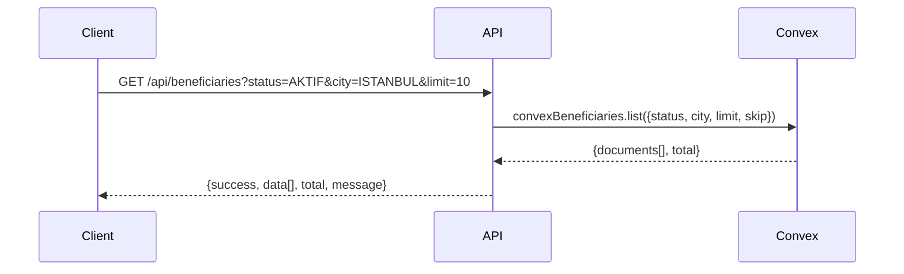
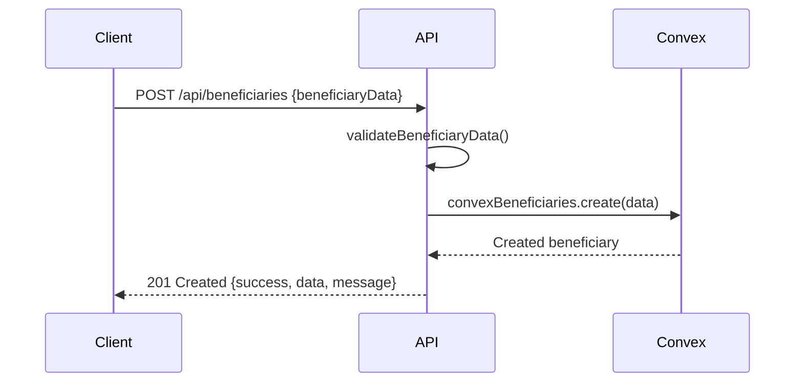
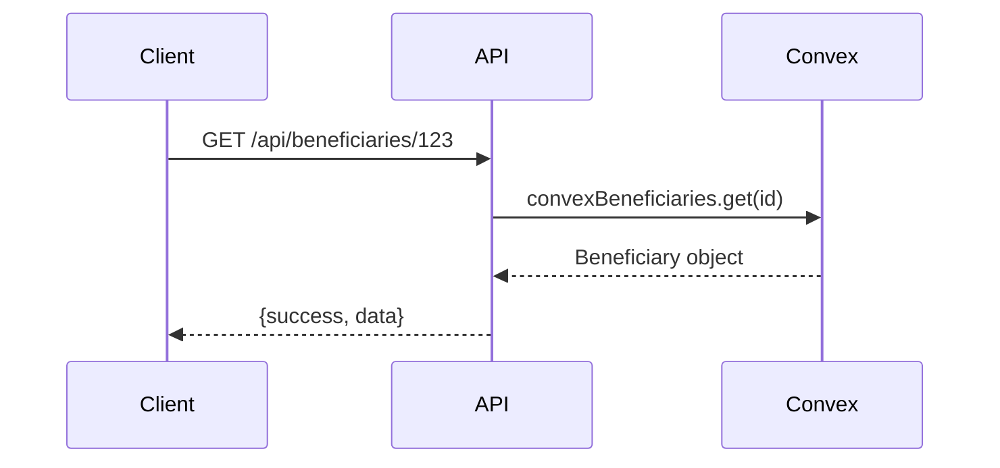
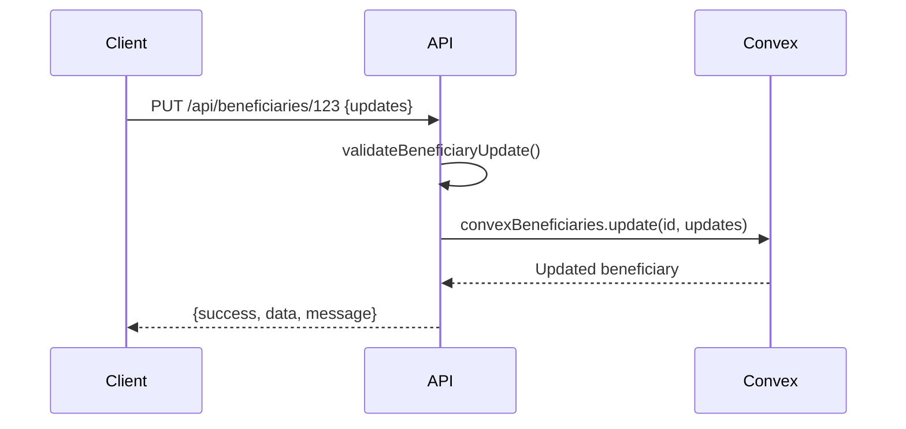
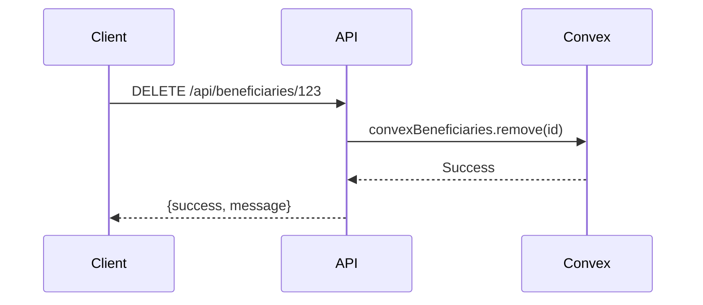
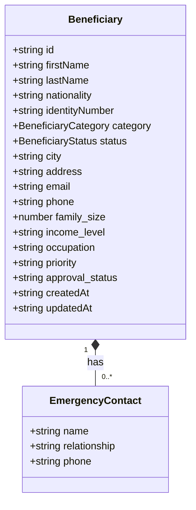
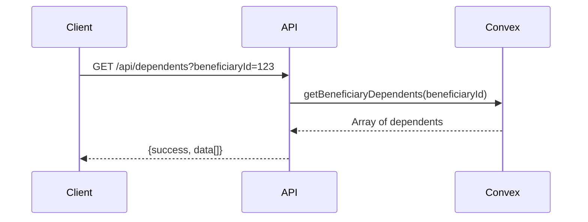
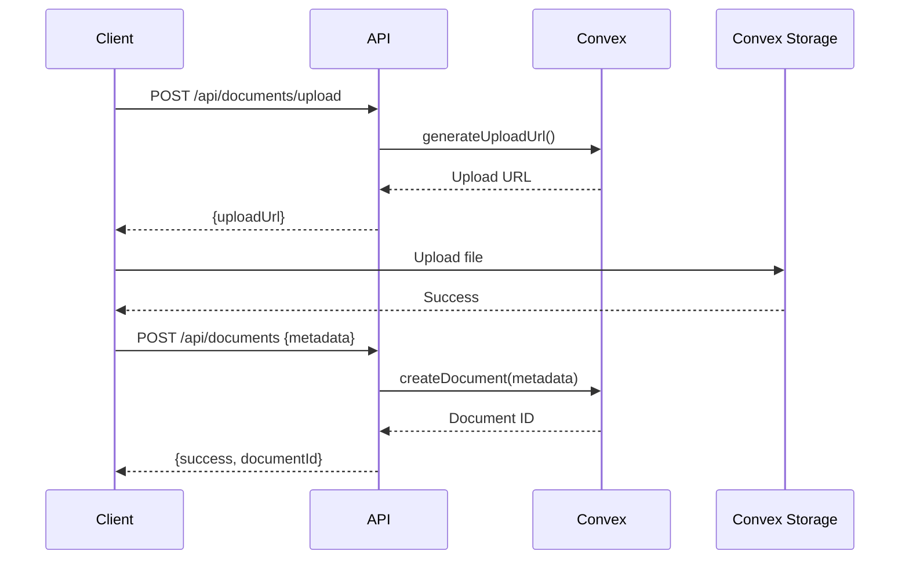
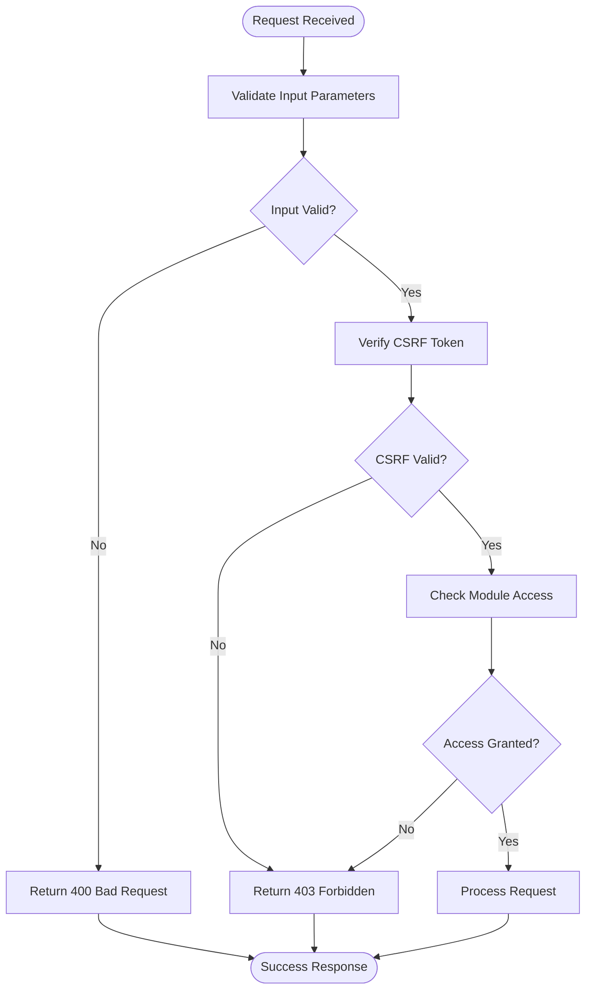
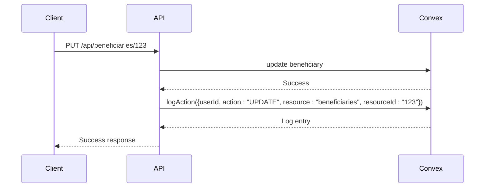

# Beneficiary Management API Routes

<cite>
**Referenced Files in This Document**   
- [beneficiaries.ts](file://convex/beneficiaries.ts)
- [documents.ts](file://convex/documents.ts)
- [dependents.ts](file://convex/dependents.ts)
- [audit_logs.ts](file://convex/audit_logs.ts)
- [route.ts](file://src/app/api/beneficiaries/route.ts)
- [route.ts](file://src/app/api/beneficiaries/[id]/route.ts)
- [beneficiary.ts](file://src/types/beneficiary.ts)
- [beneficiary.ts](file://src/lib/validations/beneficiary.ts)
</cite>

## Table of Contents

1. [Introduction](#introduction)
2. [Core API Endpoints](#core-api-endpoints)
3. [Request/Response Schemas](#requestresponse-schemas)
4. [Dependent Management](#dependent-management)
5. [Document Management](#document-management)
6. [Data Validation and Security](#data-validation-and-security)
7. [Search, Filtering and Pagination](#search-filtering-and-pagination)
8. [Audit Logging](#audit-logging)
9. [Error Handling](#error-handling)
10. [Usage Examples](#usage-examples)

## Introduction

The Beneficiary Management API provides comprehensive CRUD operations for managing beneficiary records within the KafkasDer system. This API enables organizations to register, track, and support beneficiaries through a structured data model that includes personal information, family details, social assessments, and document management. The API integrates with Convex for data persistence and implements robust validation, access control, and audit logging to ensure data integrity and compliance.

The system supports complex operations including dependent management, document uploads with versioning, and detailed social assessments. All operations are logged for audit purposes, and data privacy is maintained through secure access controls and masking of sensitive information in logs.

**Section sources**

- [beneficiaries.ts](file://convex/beneficiaries.ts#L1-L229)
- [route.ts](file://src/app/api/beneficiaries/route.ts#L1-L247)

## Core API Endpoints

### GET /api/beneficiaries

Retrieves a paginated list of beneficiaries with optional filtering by status, city, and search term. The endpoint supports pagination through limit and skip parameters and returns both the data and total count for client-side pagination.



**Diagram sources**

- [route.ts](file://src/app/api/beneficiaries/route.ts#L85-L122)
- [beneficiaries.ts](file://convex/beneficiaries.ts#L7-L61)

### POST /api/beneficiaries

Creates a new beneficiary record with comprehensive validation. The endpoint performs both client-side and server-side validation to ensure data quality and uniqueness constraints, particularly for TC identification numbers.



**Diagram sources**

- [route.ts](file://src/app/api/beneficiaries/route.ts#L128-L243)
- [beneficiaries.ts](file://convex/beneficiaries.ts#L90-L169)

### GET /api/beneficiaries/[id]

Retrieves a specific beneficiary's complete profile by ID, including all personal, family, and social assessment data.



**Diagram sources**

- [route.ts](file://src/app/api/beneficiaries/[id]/route.ts#L75-L111)
- [beneficiaries.ts](file://convex/beneficiaries.ts#L64-L69)

### PUT /api/beneficiaries/[id]

Updates an existing beneficiary record with partial updates. The endpoint validates all provided fields and maintains referential integrity, particularly when updating TC identification numbers.



**Diagram sources**

- [route.ts](file://src/app/api/beneficiaries/[id]/route.ts#L117-L171)
- [beneficiaries.ts](file://convex/beneficiaries.ts#L173-L214)

### DELETE /api/beneficiaries/[id]

Performs a soft delete of a beneficiary record by updating its status to 'SILINDI' (Deleted). The operation is logged for audit purposes.



**Diagram sources**

- [route.ts](file://src/app/api/beneficiaries/[id]/route.ts#L177-L215)
- [beneficiaries.ts](file://convex/beneficiaries.ts#L217-L228)

## Request/Response Schemas

### Beneficiary Data Structure

The beneficiary record includes comprehensive personal, family, and social assessment data:



**Diagram sources**

- [beneficiary.ts](file://src/types/beneficiary.ts#L393-L507)
- [beneficiaries.ts](file://convex/beneficiaries.ts#L92-L149)

### Response Format

All API endpoints return a consistent response structure:

```json
{
  "success": true,
  "data": {
    /* beneficiary object or array */
  },
  "total": 100,
  "message": "Operation successful"
}
```

**Section sources**

- [route.ts](file://src/app/api/beneficiaries/route.ts#L100-L105)
- [route.ts](file://src/app/api/beneficiaries/[id]/route.ts#L93-L96)

## Dependent Management

The system supports management of dependents through related endpoints that allow CRUD operations on dependent records associated with a beneficiary.



The dependent management system enforces TC number validation and maintains referential integrity with the parent beneficiary record.

**Section sources**

- [dependents.ts](file://convex/dependents.ts#L7-L140)
- [beneficiaries.ts](file://convex/beneficiaries.ts#L158-L163)

## Document Management

The API supports document uploads and management through integration with Convex storage, providing versioning and access control.



Document operations include versioning, rollback, and metadata management with access control levels.

**Section sources**

- [documents.ts](file://convex/documents.ts#L52-L404)
- [storage.ts](file://convex/storage.ts)

## Data Validation and Security

The API implements multi-layer validation to ensure data quality and security.

### Validation Rules

- TC identification numbers must be 11 digits and pass algorithmic validation
- Phone numbers must follow Turkish mobile format (+905XXXXXXXXX)
- Email addresses must be valid format
- Required fields include name, TC number, phone, and address
- Status values are restricted to predefined enum values



**Diagram sources**

- [beneficiary.ts](file://src/lib/validations/beneficiary.ts#L38-L61)
- [auth-utils.ts](file://src/lib/api/auth-utils.ts)
- [route.ts](file://src/app/api/beneficiaries/route.ts#L131-L148)

## Search, Filtering and Pagination

The API supports advanced search and filtering capabilities for beneficiary records.

### Query Parameters

| Parameter | Type   | Description                  | Example         |
| --------- | ------ | ---------------------------- | --------------- |
| `limit`   | number | Number of records to return  | `limit=10`      |
| `skip`    | number | Number of records to skip    | `skip=20`       |
| `status`  | string | Filter by beneficiary status | `status=AKTIF`  |
| `city`    | string | Filter by city               | `city=ISTANBUL` |
| `search`  | string | Full-text search on name     | `search=Ahmet`  |

The search functionality uses Convex search indexes for efficient querying and supports compound filtering.

**Section sources**

- [beneficiaries.ts](file://convex/beneficiaries.ts#L8-L14)
- [route.ts](file://src/app/api/beneficiaries/route.ts#L89-L95)

## Audit Logging

All critical operations are logged for compliance and security monitoring through the audit logging system.



Audit logs capture:

- User ID and name
- Action type (CREATE, UPDATE, DELETE, VIEW)
- Resource type and ID
- Timestamp
- IP address and user agent
- Change details (for updates)

**Section sources**

- [audit_logs.ts](file://convex/audit_logs.ts#L12-L35)
- [route.ts](file://src/app/api/beneficiaries/[id]/route.ts#L138-L139)

## Error Handling

The API implements comprehensive error handling with appropriate HTTP status codes and descriptive messages.

### Error Responses

| Status | Error Type           | Description                    |
| ------ | -------------------- | ------------------------------ |
| 400    | Validation Error     | Invalid input data             |
| 401    | Authentication Error | Invalid or missing credentials |
| 403    | Authorization Error  | Insufficient permissions       |
| 404    | Not Found            | Resource not found             |
| 409    | Conflict             | Duplicate TC number            |
| 500    | Server Error         | Internal server error          |

Error responses include detailed validation messages for client-side form handling.

**Section sources**

- [route.ts](file://src/app/api/beneficiaries/route.ts#L229-L239)
- [route.ts](file://src/app/api/beneficiaries/[id]/route.ts#L158-L169)
- [errors.ts](file://convex/errors.ts)

## Usage Examples

### Beneficiary Registration

```http
POST /api/beneficiaries HTTP/1.1
Content-Type: application/json

{
  "name": "Ahmet Yılmaz",
  "tc_no": "12345678901",
  "phone": "+905551234567",
  "address": "Bağdat Cd. No:123, Kadıköy",
  "city": "ISTANBUL",
  "family_size": 4,
  "status": "TASLAK",
  "income_level": "DUSUK",
  "priority": "YUKSEK"
}
```

### Profile Update

```http
PUT /api/beneficiaries/123 HTTP/1.1
Content-Type: application/json

{
  "status": "AKTIF",
  "income_level": "ORTA",
  "notes": "Updated after home visit assessment"
}
```

**Section sources**

- [route.ts](file://src/app/api/beneficiaries/route.ts#L128-L243)
- [route.ts](file://src/app/api/beneficiaries/[id]/route.ts#L117-L171)
