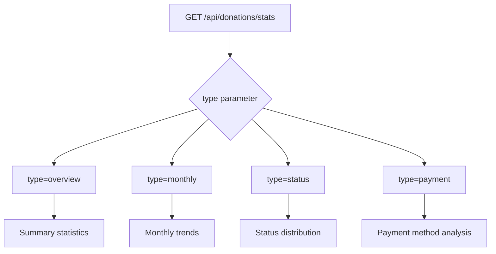
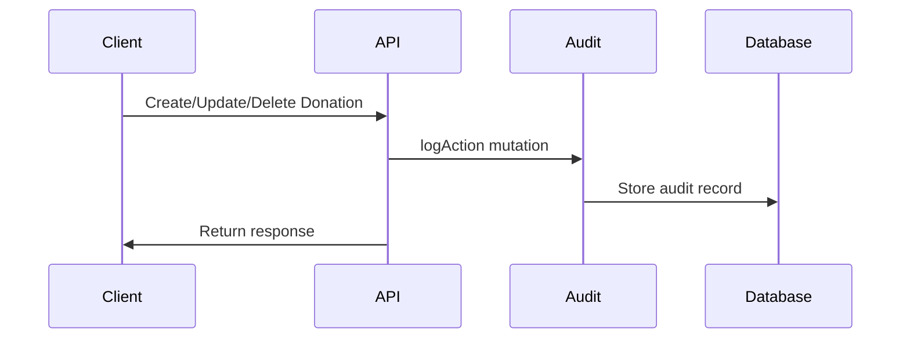

# Donation Management API Routes

<cite>
**Referenced Files in This Document**   
- [donations.ts](file://convex/donations.ts)
- [route.ts](file://src/app/api/donations/route.ts)
- [route.ts](file://src/app/api/donations/[id]/route.ts)
- [route.ts](file://src/app/api/donations/stats/route.ts)
- [kumbara.ts](file://src/lib/validations/kumbara.ts)
- [audit_logs.ts](file://convex/audit_logs.ts)
- [financial.ts](file://src/types/financial.ts)
- [DonationForm.tsx](file://src/components/forms/DonationForm.tsx)
</cite>

## Table of Contents

1. [Introduction](#introduction)
2. [API Endpoints](#api-endpoints)
3. [Financial Data Schema](#financial-data-schema)
4. [Kumbara Integration](#kumbara-integration)
5. [Reporting and Analytics](#reporting-and-analytics)
6. [Reconciliation and Audit Trails](#reconciliation-and-audit-trails)
7. [Donation Processing Examples](#donation-processing-examples)
8. [Error Handling](#error-handling)

## Introduction

The Donation Management API provides comprehensive functionality for managing donation records within the system. It supports CRUD operations for donations, advanced filtering capabilities, statistical reporting, and integration with the Kumbara (piggy bank) collection system. The API ensures data integrity through validation, audit logging, and reconciliation workflows.

**Section sources**

- [donations.ts](file://convex/donations.ts#L1-L149)
- [route.ts](file://src/app/api/donations/route.ts#L1-L148)

## API Endpoints

### GET /api/donations (List Donations)

Retrieves a paginated list of donations with optional filtering by status, donor email, and Kumbara association.

**Query Parameters:**

- `limit`: Number of records to return (default: 50)
- `skip`: Number of records to skip for pagination
- `status`: Filter by donation status (pending, completed, cancelled)
- `donor_email`: Filter by donor email address
- `is_kumbara`: Filter by Kumbara collection status (true/false)

**Response Structure:**

```json
{
  "success": true,
  "data": [
    {
      "_id": "string",
      "donor_name": "string",
      "donor_phone": "string",
      "donor_email": "string",
      "amount": "number",
      "currency": "TRY|USD|EUR",
      "donation_type": "string",
      "payment_method": "string",
      "donation_purpose": "string",
      "receipt_number": "string",
      "status": "pending|completed|cancelled",
      "is_kumbara": "boolean"
    }
  ],
  "total": "number"
}
```

**Section sources**

- [donations.ts](file://convex/donations.ts#L5-L53)
- [route.ts](file://src/app/api/donations/route.ts#L54-L83)

### POST /api/donations (Create Donation)

Records a new donation with comprehensive donor and financial information.

**Request Body:**

```json
{
  "donor_name": "string",
  "donor_phone": "string",
  "donor_email": "string",
  "amount": "number",
  "currency": "TRY|USD|EUR",
  "donation_type": "string",
  "payment_method": "string",
  "donation_purpose": "string",
  "notes": "string",
  "receipt_number": "string",
  "receipt_file_id": "string",
  "status": "pending|completed|cancelled",
  "is_kumbara": "boolean"
}
```

**Validation Rules:**

- Donor name must be at least 2 characters
- Amount must be positive
- Valid currency codes: TRY, USD, EUR
- Email format validation
- Phone number format validation

**Response:**

```json
{
  "success": true,
  "data": "Donation object",
  "message": "Donation successfully created"
}
```

**Section sources**

- [donations.ts](file://convex/donations.ts#L76-L109)
- [route.ts](file://src/app/api/donations/route.ts#L89-L145)

### GET /api/donations/[id] (Retrieve Donation Details)

Retrieves detailed information about a specific donation by ID.

**Response:**

```json
{
  "success": true,
  "data": "Complete donation object with all fields"
}
```

**Section sources**

- [donations.ts](file://convex/donations.ts#L55-L61)
- [route.ts](file://src/app/api/donations/[id]/route.ts#L42-L78)

### PUT /api/donations/[id] (Update Donation)

Updates an existing donation record with new information.

**Request Body:**

```json
{
  "status": "pending|completed|cancelled",
  "amount": "number",
  "notes": "string"
}
```

**Section sources**

- [donations.ts](file://convex/donations.ts#L111-L134)
- [route.ts](file://src/app/api/donations/[id]/route.ts#L84-L137)

### GET /api/donations/stats (Retrieve Donation Statistics)

Provides statistical insights on donation data with multiple view types.

**Query Parameters:**

- `type`: stats view type (overview, monthly, status, payment)

**Response Types:**

- **Overview**: Summary statistics including totals, monthly growth, and status breakdown
- **Monthly**: Monthly trend data for charts
- **Status**: Distribution by donation status
- **Payment**: Distribution by payment method

**Section sources**

- [route.ts](file://src/app/api/donations/stats/route.ts#L22-L198)

## Financial Data Schema

### Core Financial Fields

The donation system captures comprehensive financial data with the following key fields:

| Field          | Type   | Description               | Constraints                            |
| -------------- | ------ | ------------------------- | -------------------------------------- |
| amount         | number | Donation amount           | Positive value required                |
| currency       | string | Currency code             | TRY, USD, or EUR                       |
| payment_method | string | Method of payment         | Cash, bank transfer, credit card, etc. |
| donation_type  | string | Type of donation          | Cash, in-kind, Kumbara, etc.           |
| receipt_number | string | Unique receipt identifier | Required, unique                       |
| status         | string | Donation status           | pending, completed, cancelled          |

### Donor Information

| Field       | Type   | Description          | Validation                |
| ----------- | ------ | -------------------- | ------------------------- |
| donor_name  | string | Full name of donor   | Minimum 2 characters      |
| donor_phone | string | Contact phone number | Turkish format validation |
| donor_email | string | Email address        | Valid email format        |

**Section sources**

- [financial.ts](file://src/types/financial.ts#L1-L303)
- [donations.ts](file://convex/donations.ts#L77-L105)

## Kumbara Integration

### Kumbara-Specific Fields

The system supports special handling for Kumbara (piggy bank) collections with additional metadata:

```typescript
{
  is_kumbara: boolean;
  kumbara_location: string;
  collection_date: string;
  kumbara_institution: string;
  location_coordinates: {
    lat: number;
    lng: number;
  }
  location_address: string;
  route_points: Array<{ lat: number; lng: number }>;
  route_distance: number;
  route_duration: number;
}
```

### Validation and Processing

Kumbara donations are validated through specific business rules ensuring complete collection data. The system tracks collection routes, distances, and durations for operational efficiency analysis.

**Section sources**

- [kumbara.ts](file://src/lib/validations/kumbara.ts)
- [donations.ts](file://convex/donations.ts#L96-L104)

## Reporting and Analytics

### Statistical Endpoints

The reporting system provides multiple statistical views through the `/api/donations/stats` endpoint:



**Diagram sources**

- [route.ts](file://src/app/api/donations/stats/route.ts#L22-L67)

### Data Aggregation

The system aggregates donation data for analytics purposes, calculating:

- Monthly growth rates
- Status-based distributions
- Payment method preferences
- Geographic collection patterns
- Temporal trends

**Section sources**

- [route.ts](file://src/app/api/donations/stats/route.ts#L76-L198)

## Reconciliation and Audit Trails

### Audit Logging

All donation operations are tracked in the audit system with comprehensive metadata:



**Diagram sources**

- [audit_logs.ts](file://convex/audit_logs.ts#L12-L35)
- [route.ts](file://src/app/api/donations/[id]/route.ts#L143-L177)

### Audit Record Structure

| Field      | Description                    |
| ---------- | ------------------------------ |
| userId     | ID of user performing action   |
| userName   | Name of user performing action |
| action     | CREATE, UPDATE, DELETE, VIEW   |
| resource   | "donations"                    |
| resourceId | Donation ID                    |
| changes    | Object with changed fields     |
| ipAddress  | Client IP address              |
| userAgent  | Browser/device information     |
| timestamp  | ISO timestamp of action        |

**Section sources**

- [audit_logs.ts](file://convex/audit_logs.ts#L6-L35)

## Donation Processing Examples

### Cash Donation

```json
{
  "donor_name": "Ahmet Yılmaz",
  "donor_phone": "0555 123 45 67",
  "amount": 1000,
  "currency": "TRY",
  "donation_type": "Cash",
  "payment_method": "Nakit",
  "donation_purpose": "Ramazan Yardımı",
  "receipt_number": "MB2024001",
  "status": "completed"
}
```

### Bank Transfer

```json
{
  "donor_name": "Ayşe Demir",
  "donor_email": "ayse@example.com",
  "amount": 500,
  "currency": "USD",
  "donation_type": "Bank Transfer",
  "payment_method": "Banka Transferi",
  "donation_purpose": "Education Support",
  "receipt_number": "BT2024001",
  "status": "pending"
}
```

### Kumbara Collection

```json
{
  "donor_name": "Kumbara Toplama",
  "donor_phone": "0555 000 00 00",
  "amount": 2500,
  "currency": "TRY",
  "donation_type": "Kumbara",
  "payment_method": "Nakit",
  "donation_purpose": "Regular Collection",
  "receipt_number": "KC2024001",
  "status": "completed",
  "is_kumbara": true,
  "kumbara_location": "Şişli Şubesi",
  "collection_date": "2024-01-15",
  "location_coordinates": {
    "lat": 41.0355,
    "lng": 28.9834
  },
  "route_distance": 15.5,
  "route_duration": 120
}
```

**Section sources**

- [DonationForm.tsx](file://src/components/forms/DonationForm.tsx#L27-L40)
- [donations.ts](file://convex/donations.ts#L77-L105)

## Error Handling

### Validation Errors

The API returns structured error responses for validation failures:

```json
{
  "success": false,
  "error": "Validation error",
  "details": ["Error messages"]
}
```

### Common Error Scenarios

- **400 Bad Request**: Invalid input data
- **404 Not Found**: Donation ID not found
- **403 Forbidden**: Insufficient permissions
- **500 Internal Server Error**: System errors

### Error Logging

All errors are logged with contextual information including endpoint, method, and relevant identifiers for troubleshooting.

**Section sources**

- [route.ts](file://src/app/api/donations/route.ts#L71-L82)
- [route.ts](file://src/app/api/donations/[id]/route.ts#L67-L78)
