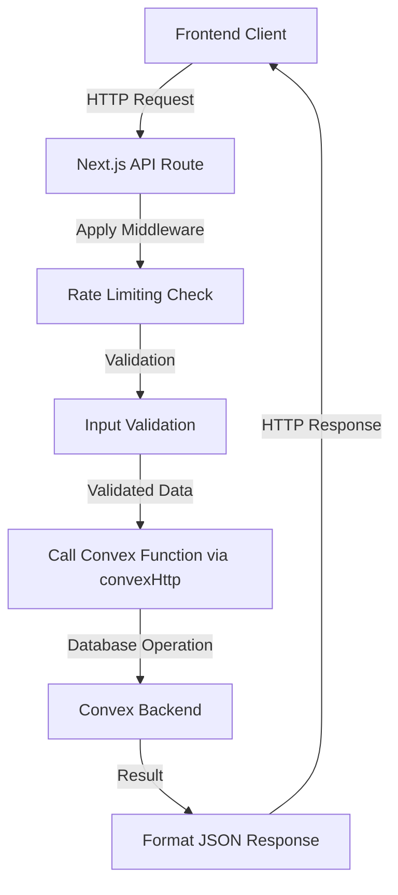
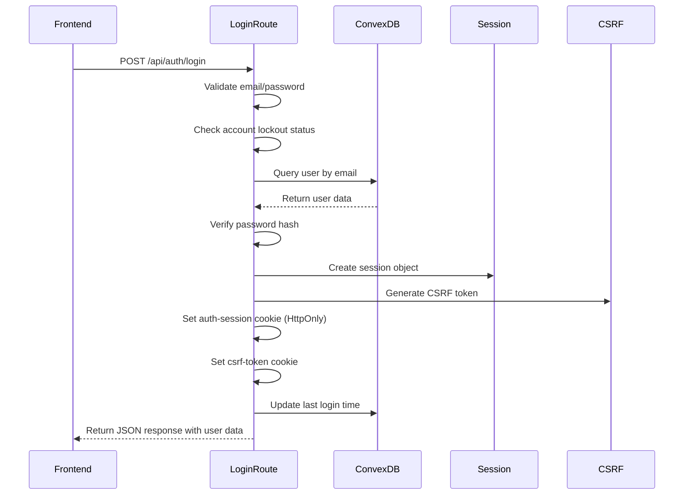
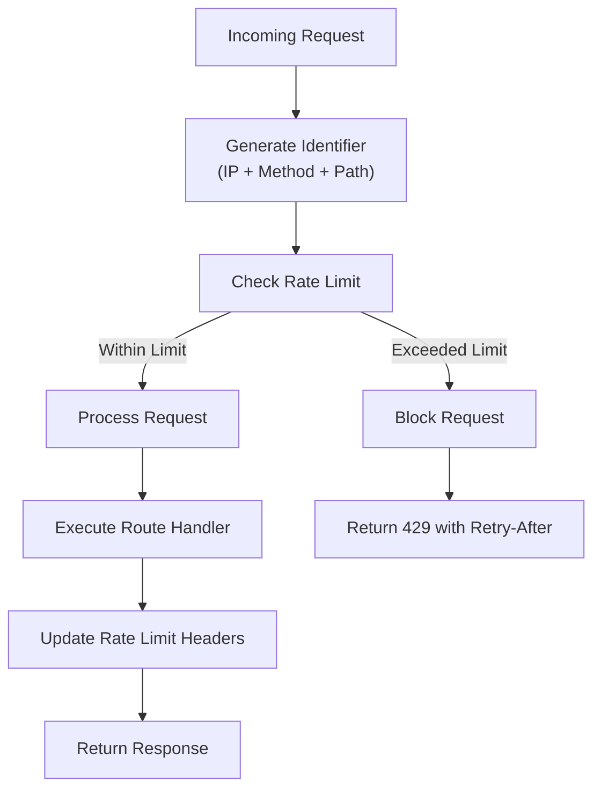
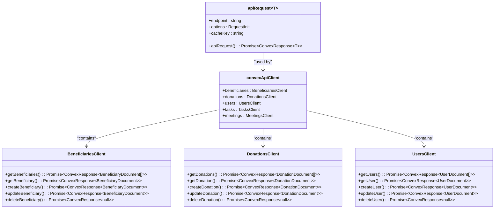

# Next.js API Routes

<cite>
**Referenced Files in This Document**   
- [login/route.ts](file://src/app/api/auth/login/route.ts)
- [convex-api-client.ts](file://src/lib/api/convex-api-client.ts)
- [rate-limit.ts](file://src/lib/rate-limit.ts)
- [csrf.ts](file://src/lib/csrf.ts)
- [session.ts](file://src/lib/auth/session.ts)
</cite>

## Table of Contents

1. [Introduction](#introduction)
2. [Request Flow Architecture](#request-flow-architecture)
3. [Authentication Handling](#authentication-handling)
4. [Rate Limiting Implementation](#rate-limiting-implementation)
5. [API Client Abstraction](#api-client-abstraction)
6. [Security Considerations](#security-considerations)

## Introduction

The Next.js API Routes in Kafkasder-panel serve as the critical interface layer between the frontend application and the Convex backend database. These routes implement a secure, well-structured pattern for handling HTTP requests, validating input data, interacting with Convex functions through the convexHttp client, and returning standardized JSON responses. The architecture follows a server-side approach where API routes act as middleware, abstracting the direct Convex database access from the frontend components. This design enhances security, enables centralized validation and error handling, and provides a clean separation of concerns between the presentation layer and data access layer.

## Request Flow Architecture

The request flow in Kafkasder-panel follows a consistent pattern across all API routes. When an HTTP request is received by a Next.js API route, the request first passes through any applicable middleware wrappers such as rate limiting. The route handler then validates the incoming request data, ensuring all required fields are present and properly formatted. Once validation passes, the API route uses the convexHttp client to call the appropriate Convex function, passing any necessary parameters. The Convex function executes the requested operation on the database and returns the result to the API route. The API route then formats this result into a standardized JSON response structure, which is returned to the client. This flow ensures that all data access is properly mediated, validated, and secured before reaching the underlying database.

**Diagram sources**

- [login/route.ts](file://src/app/api/auth/login/route.ts#L23-L231)
- [convex-api-client.ts](file://src/lib/api/convex-api-client.ts#L64-L116)

**Section sources**

- [login/route.ts](file://src/app/api/auth/login/route.ts#L23-L231)
- [convex-api-client.ts](file://src/lib/api/convex-api-client.ts#L64-L116)

## Authentication Handling

The authentication system in Kafkasder-panel implements a comprehensive security approach centered around the login API route. When a user attempts to log in, the system first validates the provided email and password. The route incorporates CSRF protection by generating a CSRF token upon successful authentication, which is then stored in a client-accessible cookie. Session management is handled through a secure session cookie named "auth-session" that contains the session ID, user ID, and expiration time. This session cookie is configured with HttpOnly and Secure flags to prevent client-side script access and ensure transmission only over HTTPS in production environments. Password verification is performed using secure hashing algorithms, and the system includes account lockout functionality after multiple failed login attempts to prevent brute force attacks. Upon successful authentication, the system updates the user's last login time in the database and returns a JSON response containing user data and session information.

**Diagram sources**

- [login/route.ts](file://src/app/api/auth/login/route.ts#L23-L231)
- [session.ts](file://src/lib/auth/session.ts#L8-L41)

**Section sources**

- [login/route.ts](file://src/app/api/auth/login/route.ts#L23-L231)
- [session.ts](file://src/lib/auth/session.ts#L8-L41)

## Rate Limiting Implementation

The rate limiting system in Kafkasder-panel is implemented through the authRateLimit wrapper and related rate limiting utilities. This system protects against abuse and denial-of-service attacks by limiting the number of requests a client can make within a specified time window. The implementation uses client IP address combined with the request method and pathname as the identifier for tracking request rates. Different endpoints have different rate limiting configurations based on their sensitivity and usage patterns. For example, authentication endpoints have stricter limits (10 attempts per 10 minutes) compared to read-only data endpoints. The rate limiter tracks the number of requests and automatically blocks clients that exceed their allowed quota, returning a 429 Too Many Requests response with appropriate retry information. The system also includes specialized handling for authentication requests, where both successful and failed login attempts can be configured to not count against the rate limit to prevent legitimate users from being locked out.

**Diagram sources**

- [rate-limit.ts](file://src/lib/rate-limit.ts#L11-L148)
- [login/route.ts](file://src/app/api/auth/login/route.ts#L23-L231)

**Section sources**

- [rate-limit.ts](file://src/lib/rate-limit.ts#L11-L148)

## API Client Abstraction

The API client abstraction in convex-api-client.ts provides a clean, consistent interface for frontend components to interact with the Next.js API routes. This abstraction layer implements several important features including caching, error handling, and request normalization. The client uses a generic apiRequest function that handles the common aspects of HTTP requests, such as setting appropriate headers, managing credentials, and parsing JSON responses. For GET requests, the client automatically checks the cache before making a network request, improving performance and reducing server load. The abstraction also standardizes error handling by converting HTTP errors and network exceptions into a consistent response format with success and error fields. The client exports specialized modules for different data types (beneficiaries, donations, users, etc.), each providing CRUD operations that map to the corresponding API routes. This design allows frontend components to work with a simple, promise-based interface while the complexity of HTTP communication, caching, and error recovery is handled centrally.

**Diagram sources**

- [convex-api-client.ts](file://src/lib/api/convex-api-client.ts#L64-L765)

**Section sources**

- [convex-api-client.ts](file://src/lib/api/convex-api-client.ts#L64-L765)

## Security Considerations

The API routes in Kafkasder-panel implement multiple security measures to protect against common web vulnerabilities. HttpOnly cookies are used for session management to prevent cross-site scripting (XSS) attacks from accessing session data. The Secure flag is set on all sensitive cookies, ensuring they are only transmitted over HTTPS connections in production environments. SameSite=strict is implemented to prevent cross-site request forgery (CSRF) attacks. Input validation is performed on all incoming requests to prevent injection attacks and ensure data integrity. The system implements CSRF protection through token-based validation, requiring a valid CSRF token for state-changing operations. Passwords are securely hashed using industry-standard algorithms before storage. Rate limiting protects against brute force attacks and denial-of-service attempts. The API routes also implement proper error handling that avoids leaking sensitive information in error messages. Additionally, the system includes account lockout functionality after multiple failed login attempts, providing an additional layer of protection against credential stuffing and brute force attacks.

**Section sources**

- [login/route.ts](file://src/app/api/auth/login/route.ts#L23-L231)
- [csrf.ts](file://src/lib/csrf.ts#L1-L90)
- [session.ts](file://src/lib/auth/session.ts#L8-L41)
- [rate-limit.ts](file://src/lib/rate-limit.ts#L11-L148)
