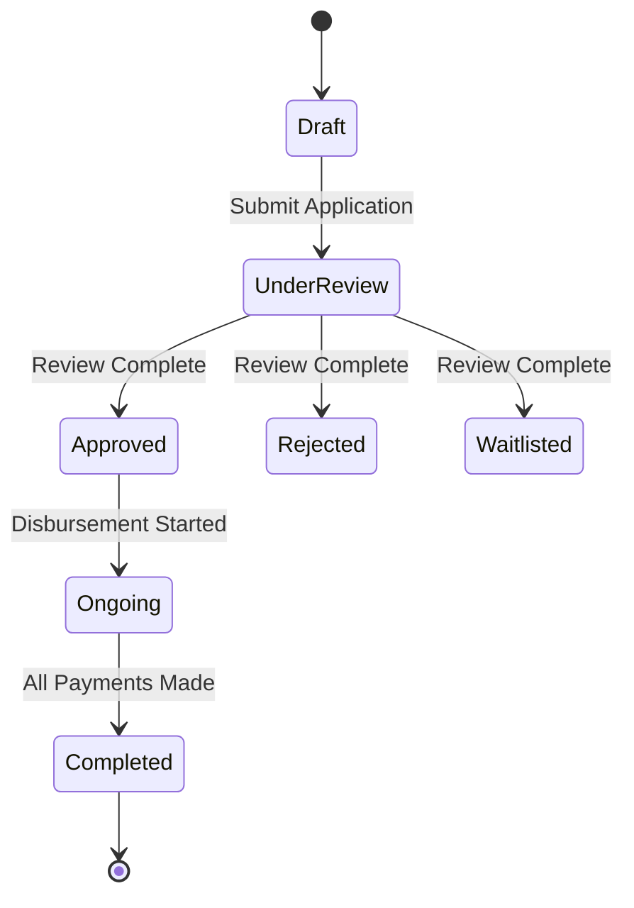
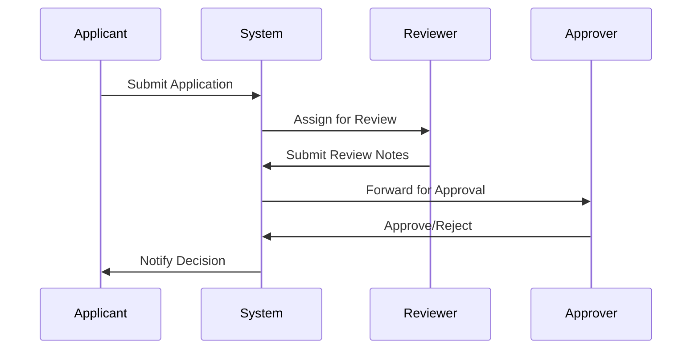
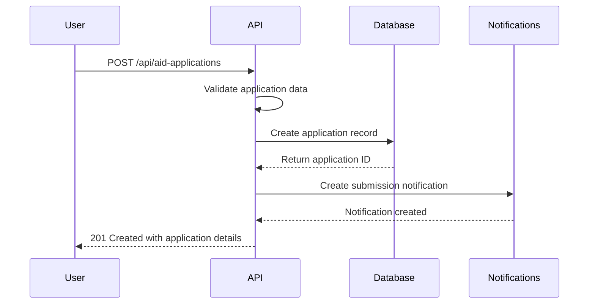
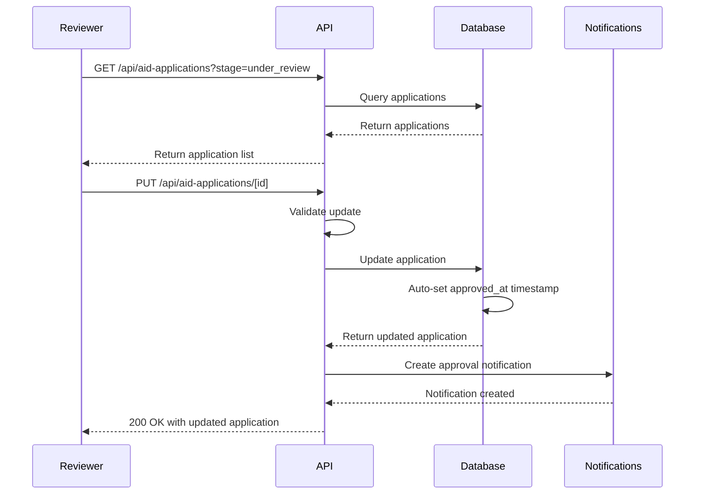

# Scholarship Management API Routes

<cite>
**Referenced Files in This Document**   
- [aid-applications/route.ts](file://src/app/api/aid-applications/route.ts)
- [aid-applications/[id]/route.ts](file://src/app/api/aid-applications/[id]/route.ts)
- [aid_applications.ts](file://convex/aid_applications.ts)
- [scholarships.ts](file://convex/scholarships.ts)
- [workflow_notifications.ts](file://convex/workflow_notifications.ts)
- [aid-application.ts](file://src/lib/validations/aid-application.ts)
- [scholarship.ts](file://src/types/scholarship.ts)
- [beneficiary.ts](file://src/types/beneficiary.ts)
</cite>

## Table of Contents

1. [Introduction](#introduction)
2. [API Endpoints](#api-endpoints)
3. [Application Data Schema](#application-data-schema)
4. [Integration with Scholarship Programs](#integration-with-scholarship-programs)
5. [Multi-Stage Review Process](#multi-stage-review-process)
6. [Notification System](#notification-system)
7. [Data Validation Rules](#data-validation-rules)
8. [Document Requirements](#document-requirements)
9. [Beneficiary Profile Integration](#beneficiary-profile-integration)
10. [Usage Examples](#usage-examples)
11. [Error Handling](#error-handling)

## Introduction

The Scholarship Management API provides a comprehensive system for managing scholarship applications throughout their lifecycle. This API enables users to submit, retrieve, update, and withdraw scholarship applications while maintaining integration with beneficiary profiles, scholarship programs, and a multi-stage review workflow. The system supports comprehensive filtering, status tracking, and automated notifications to ensure efficient scholarship administration.

**Section sources**

- [aid-applications/route.ts](file://src/app/api/aid-applications/route.ts)
- [scholarships.ts](file://convex/scholarships.ts)

## API Endpoints

The Scholarship Management API provides RESTful endpoints for managing scholarship applications with comprehensive CRUD operations and filtering capabilities.

### GET /api/aid-applications

Retrieves a paginated list of scholarship applications with optional filtering by status, stage, or beneficiary ID.

**Request Parameters**

- `limit` (optional): Number of records to return (default: 50)
- `skip` (optional): Number of records to skip for pagination
- `stage` (optional): Filter by application stage (draft, under_review, approved, ongoing, completed)
- `status` (optional): Filter by application status (open, closed)
- `beneficiary_id` (optional): Filter by beneficiary ID

**Response**

```json
{
  "success": true,
  "data": [
    {
      "application_date": "2023-01-15T10:30:00Z",
      "applicant_type": "person",
      "applicant_name": "John Doe",
      "beneficiary_id": "doc123",
      "stage": "under_review",
      "status": "open",
      "priority": "high"
    }
  ],
  "total": 1
}
```

**Section sources**

- [aid-applications/route.ts](file://src/app/api/aid-applications/route.ts#L32-L55)
- [aid_applications.ts](file://convex/aid_applications.ts#L5-L43)

### POST /api/aid-applications

Submits a new scholarship application with comprehensive financial and academic information.

**Request Body**

```json
{
  "application_date": "2023-01-15T10:30:00Z",
  "applicant_type": "person",
  "applicant_name": "John Doe",
  "beneficiary_id": "doc123",
  "one_time_aid": 500,
  "regular_financial_aid": 200,
  "regular_food_aid": 100,
  "in_kind_aid": 75,
  "service_referral": 1,
  "stage": "draft",
  "status": "open",
  "description": "Scholarship for university education",
  "notes": "Additional information about the application",
  "priority": "high"
}
```

**Validation Rules**

- `applicant_name` is required (minimum 2 characters)
- `application_date` is required
- `stage` must be one of: draft, under_review, approved, ongoing, completed
- `status` must be one of: open, closed

**Response**

```json
{
  "success": true,
  "data": {
    "_id": "app456",
    "application_date": "2023-01-15T10:30:00Z",
    "applicant_name": "John Doe",
    "stage": "draft",
    "status": "open"
  },
  "message": "Application created"
}
```

**Section sources**

- [aid-applications/route.ts](file://src/app/api/aid-applications/route.ts#L61-L110)
- [aid_applications.ts](file://convex/aid_applications.ts#L55-L91)

### GET /api/aid-applications/[id]

Retrieves detailed information about a specific scholarship application by ID.

**Response**

```json
{
  "success": true,
  "data": {
    "_id": "app456",
    "application_date": "2023-01-15T10:30:00Z",
    "applicant_name": "John Doe",
    "beneficiary_id": "doc123",
    "one_time_aid": 500,
    "regular_financial_aid": 200,
    "stage": "under_review",
    "status": "open",
    "processed_by": "user789",
    "processed_at": "2023-01-16T14:20:00Z",
    "approved_by": "user789",
    "approved_at": "2023-01-17T09:15:00Z"
  }
}
```

**Section sources**

- [aid-applications/[id]/route.ts](file://src/app/api/aid-applications/[id]/route.ts#L27-L47)
- [aid_applications.ts](file://convex/aid_applications.ts#L47-L52)

### PUT /api/aid-applications/[id]

Updates an existing scholarship application, including status changes and notes. The API automatically manages timestamps for status transitions.

**Request Body**

```json
{
  "stage": "approved",
  "status": "closed",
  "priority": "urgent",
  "notes": "Application approved after review",
  "processed_by": "user789",
  "approved_by": "user789"
}
```

**Automatic Timestamps**

- When `stage` is updated to "approved", `approved_at` is automatically set to current timestamp
- When `stage` is updated to "completed", `completed_at` is automatically set to current timestamp

**Response**

```json
{
  "success": true,
  "data": {
    "_id": "app456",
    "stage": "approved",
    "status": "closed",
    "approved_at": "2023-01-17T09:15:00Z",
    "notes": "Application approved after review"
  },
  "message": "Application successfully updated"
}
```

**Section sources**

- [aid-applications/[id]/route.ts](file://src/app/api/aid-applications/[id]/route.ts#L53-L119)
- [aid_applications.ts](file://convex/aid_applications.ts#L95-L146)

### DELETE /api/aid-applications/[id]

Withdraws a scholarship application by removing it from the system.

**Response**

```json
{
  "success": true,
  "message": "Application successfully deleted"
}
```

**Section sources**

- [aid-applications/[id]/route.ts](file://src/app/api/aid-applications/[id]/route.ts#L125-L151)
- [aid_applications.ts](file://convex/aid_applications.ts#L149-L159)

## Application Data Schema

The scholarship application data model includes comprehensive fields for academic records, financial need assessment, and review workflow status.

### Core Application Fields

| Field              | Type              | Required | Description                                       |
| ------------------ | ----------------- | -------- | ------------------------------------------------- |
| `_id`              | string            | Yes      | Unique identifier for the application             |
| `application_date` | string (ISO 8601) | Yes      | Date when the application was submitted           |
| `applicant_type`   | enum              | Yes      | Type of applicant (person, organization, partner) |
| `applicant_name`   | string            | Yes      | Name of the applicant                             |
| `beneficiary_id`   | string            | No       | Reference to beneficiary profile                  |
| `stage`            | enum              | Yes      | Current stage of the application                  |
| `status`           | enum              | Yes      | Open or closed status                             |

### Financial Aid Assessment

| Field                   | Type   | Description                          |
| ----------------------- | ------ | ------------------------------------ |
| `one_time_aid`          | number | One-time financial assistance amount |
| `regular_financial_aid` | number | Monthly financial assistance amount  |
| `regular_food_aid`      | number | Monthly food assistance amount       |
| `in_kind_aid`           | number | Value of in-kind assistance          |
| `service_referral`      | number | Number of service referrals provided |

### Review Workflow Status

| Field          | Type   | Description                                |
| -------------- | ------ | ------------------------------------------ |
| `priority`     | enum   | Priority level (low, normal, high, urgent) |
| `processed_by` | string | ID of user who processed the application   |
| `processed_at` | string | Timestamp when application was processed   |
| `approved_by`  | string | ID of user who approved the application    |
| `approved_at`  | string | Timestamp when application was approved    |
| `completed_at` | string | Timestamp when application was completed   |

**Section sources**

- [aid-application.ts](file://src/lib/validations/aid-application.ts#L8-L45)
- [aid_applications.ts](file://convex/aid_applications.ts#L56-L87)

## Integration with Scholarship Programs

The Scholarship Management API integrates with the scholarship program management system to ensure alignment between applications and available programs.

### Scholarship Program Schema

```typescript
interface Scholarship {
  id: string;
  name: string;
  description: string;
  type: ScholarshipType;
  amount: number;
  currency: string;
  duration: number; // months
  maxRecipients: number;
  requirements: string[];
  eligibilityCriteria: string[];
  applicationDeadline: Date;
  isActive: boolean;
}
```

### Program-Application Relationship

Each scholarship application is linked to a specific scholarship program through the `scholarship_id` field. The system validates that:

1. The referenced scholarship program exists
2. The application is submitted within the program's application window
3. The applicant meets the program's eligibility criteria
4. The program has not reached its maximum recipient limit

### Program Status Management

Scholarship programs can be activated or deactivated based on funding and administrative decisions. When a program is deactivated:

- New applications cannot be submitted
- Existing applications remain accessible for review
- Approved applications continue to receive funding

**Section sources**

- [scholarships.ts](file://convex/scholarships.ts#L54-L76)
- [scholarship.ts](file://src/types/scholarship.ts#L62-L80)

## Multi-Stage Review Process

The system implements a structured multi-stage review process to ensure thorough evaluation of scholarship applications.

### Review Stages



**Diagram sources**

- [scholarships.ts](file://convex/scholarships.ts#L247-L254)
- [aid_applications.ts](file://convex/aid_applications.ts#L70-L75)

### Stage Transitions

| Current Stage | Valid Next Stages              | Transition Rules                            |
| ------------- | ------------------------------ | ------------------------------------------- |
| Draft         | under_review                   | Application must be complete and validated  |
| under_review  | approved, rejected, waitlisted | Requires reviewer assignment and evaluation |
| approved      | ongoing                        | Requires first payment disbursement         |
| ongoing       | completed                      | All scheduled payments completed            |
| completed     | -                              | Final state                                 |

### Review Workflow



**Diagram sources**

- [scholarships.ts](file://convex/scholarships.ts#L243-L275)
- [workflow_notifications.ts](file://convex/workflow_notifications.ts#L76-L104)

**Section sources**

- [scholarships.ts](file://convex/scholarships.ts#L243-L275)
- [aid_applications.ts](file://convex/aid_applications.ts#L95-L146)

## Notification System

The system includes a comprehensive notification system to keep stakeholders informed about application status changes and review progress.

### Notification Types

| Category   | Description                   | Trigger                   |
| ---------- | ----------------------------- | ------------------------- |
| meeting    | Meeting-related notifications | Meeting scheduled/updated |
| gorev      | Task assignments              | New task assigned         |
| rapor      | System reports                | Reports generated         |
| hatirlatma | Reminders                     | Upcoming deadlines        |

### Notification Workflow

```mermaid
flowchart TD
A[Application Submitted] --> B[System Creates Notification)
B --> C{Recipient Online?}
C --> |Yes| D[Push Notification]
C --> |No| E[Store in Database]
E --> F[Email Notification]
D --> G[User Marks as Read]
G --> H[Update Status to 'okundu']
```

**Diagram sources**

- [workflow_notifications.ts](file://convex/workflow_notifications.ts#L76-L104)
- [workflow_notifications.ts](file://convex/workflow_notifications.ts#L129-L148)

### Notification Status Management

The system tracks notification status through three states:

- **beklemede** (pending): Notification created but not yet sent
- **gonderildi** (sent): Notification has been delivered
- **okundu** (read): User has viewed the notification

API endpoints allow for:

- Marking notifications as read
- Getting unread notification count
- Retrieving recent notifications for a user
- Deleting old read notifications

**Section sources**

- [workflow_notifications.ts](file://convex/workflow_notifications.ts#L1-L281)

## Data Validation Rules

The API enforces comprehensive data validation rules to ensure data integrity and consistency.

### Required Fields

- `applicant_name`: Minimum 2 characters, required
- `application_date`: ISO 8601 date string, required
- `stage`: Must be one of: draft, under_review, approved, ongoing, completed
- `status`: Must be one of: open, closed

### Financial Data Validation

- All financial amounts must be non-negative numbers
- At least one form of aid must be specified
- Total aid amount must be within program limits

### Status Transition Validation

- Applications can only be submitted from "draft" stage
- Only applications in "under_review" stage can be approved or rejected
- Applications cannot be updated once in "completed" stage

### Zod Schema Validation

The system uses Zod for runtime validation of API responses:

```typescript
const aidApplicationDocumentSchema = z.object({
  _id: z.string().min(1),
  application_date: z.string(),
  applicant_type: z.enum(['person', 'organization', 'partner']),
  applicant_name: z.string().min(1),
  stage: z.enum(['draft', 'under_review', 'approved', 'ongoing', 'completed']),
  status: z.enum(['open', 'closed']),
  // ... other fields
});
```

**Section sources**

- [aid-applications/route.ts](file://src/app/api/aid-applications/route.ts#L6-L27)
- [aid-application.ts](file://src/lib/validations/aid-application.ts#L8-L45)

## Document Requirements

The scholarship application process requires specific documentation to support the financial need assessment and academic records.

### Required Documents

| Document Type      | Description                       | Verification Required |
| ------------------ | --------------------------------- | --------------------- |
| TRANSCRIPT         | Academic transcript               | Yes                   |
| INCOME_PROOF       | Family income documentation       | Yes                   |
| IDENTITY           | Government-issued ID              | Yes                   |
| PERSONAL_STATEMENT | Personal statement from applicant | No                    |
| RECOMMENDATION     | Recommendation letters            | Yes                   |

### Document Management

Documents are stored securely in the system with the following metadata:

- Document type
- Upload timestamp
- Verification status
- Verifier information
- Access permissions

The system supports document verification workflows where designated staff can:

- Review uploaded documents
- Mark documents as verified
- Add verification notes
- Request additional documentation

**Section sources**

- [scholarship.ts](file://src/types/scholarhip.ts#L157-L166)
- [scholarships.ts](file://convex/scholarships.ts#L203-L222)

## Beneficiary Profile Integration

The scholarship application system is tightly integrated with beneficiary profiles to ensure comprehensive support.

### Profile Linking

Each scholarship application can be linked to an existing beneficiary profile through the `beneficiary_id` field. This integration enables:

- Access to complete beneficiary information
- Historical aid tracking
- Family relationship mapping
- Duplicate application prevention

### Shared Data Fields

| Field     | Scholarship Application          | Beneficiary Profile          |
| --------- | -------------------------------- | ---------------------------- |
| Name      | applicant_name                   | firstName, lastName          |
| Contact   | applicant_phone, applicant_email | mobilePhone, email           |
| Address   | applicant_address                | country, city, address       |
| Financial | monthly_income, family_income    | monthlyIncome, incomeSources |

### Data Synchronization

When a scholarship application is approved:

- The beneficiary's total aid amount is updated
- Scholarship-specific notes are added to the profile
- The beneficiary's status may be updated based on scholarship terms
- Academic progress tracking is initiated for student beneficiaries

**Section sources**

- [aid_applications.ts](file://convex/aid_applications.ts#L64-L65)
- [beneficiary.ts](file://src/types/beneficiary.ts#L393-L507)

## Usage Examples

### Application Submission Workflow



**Diagram sources**

- [aid-applications/route.ts](file://src/app/api/aid-applications/route.ts#L61-L110)
- [workflow_notifications.ts](file://convex/workflow_notifications.ts#L76-L104)

### Review and Approval Workflow



**Diagram sources**

- [aid-applications/[id]/route.ts](file://src/app/api/aid-applications/[id]/route.ts#L53-L119)
- [aid_applications.ts](file://convex/aid_applications.ts#L137-L142)

## Error Handling

The API implements comprehensive error handling to provide meaningful feedback to clients.

### Common Error Responses

| Status Code | Error Type       | Message                                    | Cause                              |
| ----------- | ---------------- | ------------------------------------------ | ---------------------------------- |
| 400         | Validation Error | "Validation failed"                        | Invalid or missing required fields |
| 404         | Not Found        | "Application not found"                    | Invalid application ID             |
| 409         | Conflict         | "Only draft applications can be submitted" | Invalid state transition           |
| 500         | Server Error     | "Operation failed"                         | Internal server error              |

### Error Response Structure

```json
{
  "success": false,
  "error": "Validation failed",
  "details": ["Applicant name is required", "Application date is required"]
}
```

The system logs all errors with contextual information including:

- Endpoint and HTTP method
- Request parameters
- User information (when available)
- Timestamp of the error

**Section sources**

- [aid-applications/route.ts](file://src/app/api/aid-applications/route.ts#L48-L54)
- [aid-applications/[id]/route.ts](file://src/app/api/aid-applications/[id]/route.ts#L103-L118)
