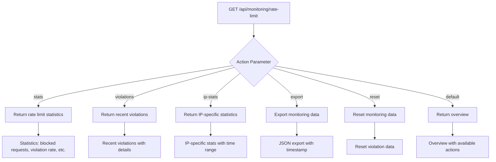
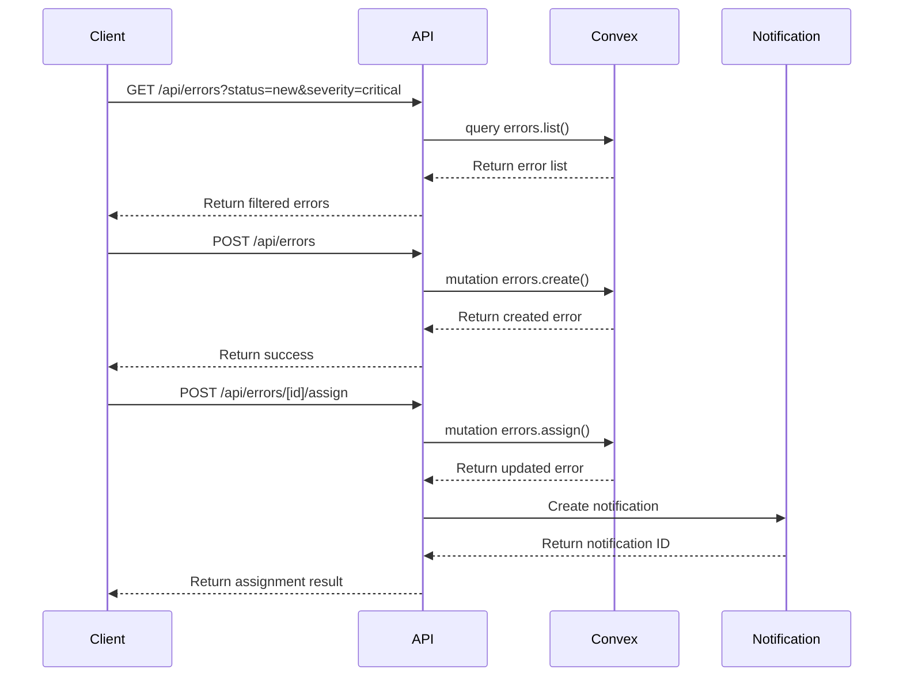
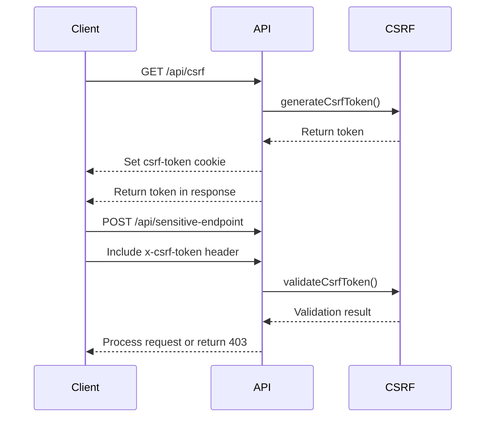
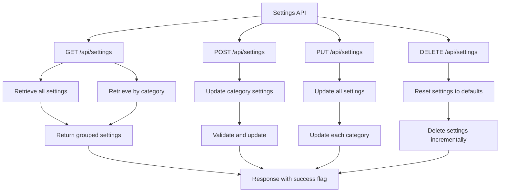
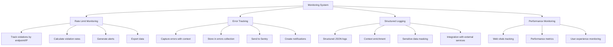
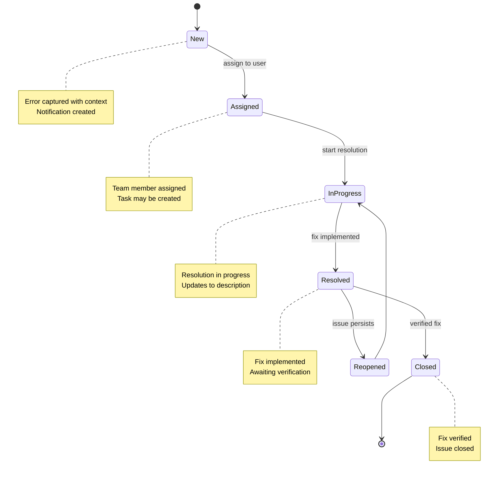
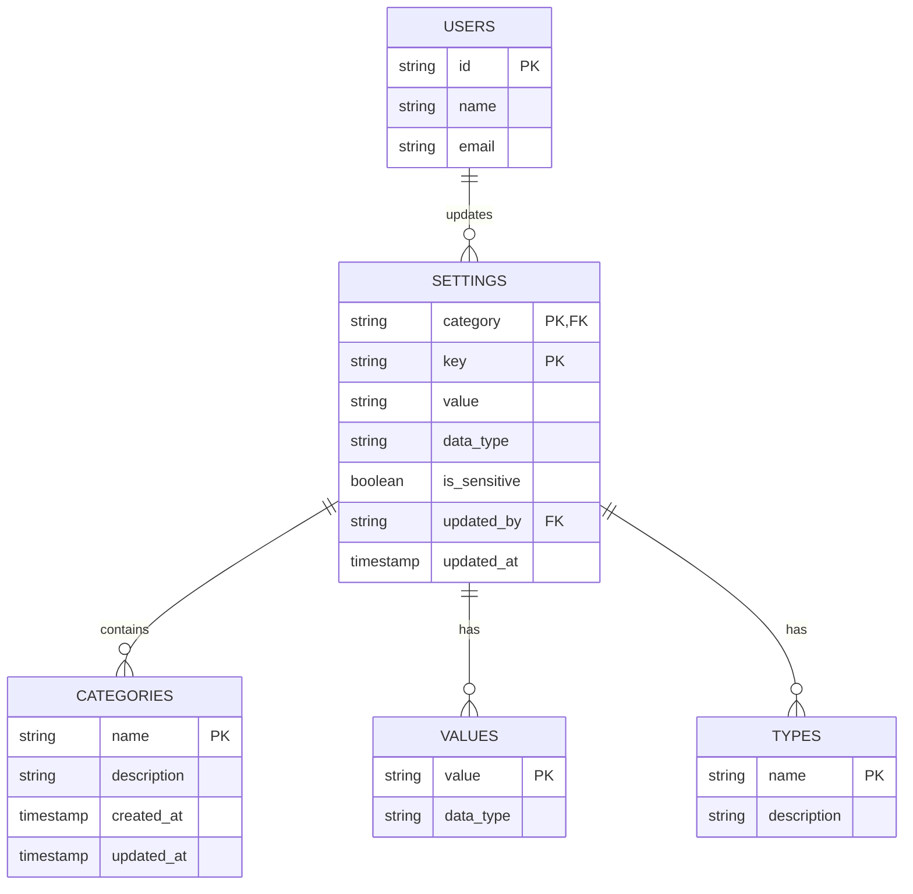
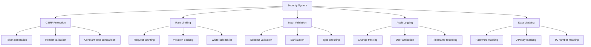

# System Utilities and Monitoring API Routes

<cite>
**Referenced Files in This Document**   
- [system_settings.ts](file://convex/system_settings.ts)
- [errors.ts](file://convex/errors.ts)
- [rate-limit-monitor.ts](file://src/lib/rate-limit-monitor.ts)
- [rate-limit.ts](file://src/lib/rate-limit.ts)
- [security.ts](file://src/lib/security.ts)
- [csrf.ts](file://src/lib/csrf.ts)
- [api/errors/[id]/assign/route.ts](file://src/app/api/errors/[id]/assign/route.ts)
- [api/errors/route.ts](file://src/app/api/errors/route.ts)
- [api/monitoring/rate-limit/route.ts](file://src/app/api/monitoring/rate-limit/route.ts)
- [api/health/route.ts](file://src/app/api/health/route.ts)
- [api/settings/route.ts](file://src/app/api/settings/route.ts)
- [api/csrf/route.ts](file://src/app/api/csrf/route.ts)
- [error-tracker.ts](file://src/lib/error-tracker.ts)
- [error-notifications.ts](file://src/lib/error-notifications.ts)
- [logger.ts](file://src/lib/logger.ts)
</cite>

## Table of Contents

1. [Introduction](#introduction)
2. [Health Check Endpoint](#health-check-endpoint)
3. [Rate Limit Monitoring](#rate-limit-monitoring)
4. [Error Management API](#error-management-api)
5. [CSRF Protection](#csrf-protection)
6. [System Settings Management](#system-settings-management)
7. [Monitoring and Observability](#monitoring-and-observability)
8. [Error Management Workflow](#error-management-workflow)
9. [Configuration Management](#configuration-management)
10. [Security Aspects](#security-aspects)
11. [Conclusion](#conclusion)

## Introduction

The System Utilities and Monitoring API provides essential functionality for maintaining system health, monitoring performance, managing errors, and configuring system settings. This documentation details the API routes for health checks, rate limit monitoring, error reporting and management, CSRF protection, and system settings configuration. The system implements comprehensive monitoring and observability capabilities, including error tracking, rate limit monitoring, and system diagnostics. The error management workflow covers the complete lifecycle from error capture to resolution, while configuration management allows for dynamic feature toggles and system parameter adjustments. Security aspects include CSRF protection implementation and audit logging for configuration changes.

**Section sources**

- [system_settings.ts](file://convex/system_settings.ts)
- [errors.ts](file://convex/errors.ts)
- [rate-limit-monitor.ts](file://src/lib/rate-limit-monitor.ts)

## Health Check Endpoint

The health check endpoint provides a simple way to verify the system's operational status. The GET /api/health route returns a 200 status code with a success message when the system is functioning properly. This endpoint is typically used by monitoring systems and load balancers to determine the health of the application. The implementation is straightforward, returning a JSON response with a success flag and timestamp, allowing external systems to quickly assess the application's availability without requiring authentication or complex processing.

```mermaid
flowchart TD
A[GET /api/health] --> B{System Operational?}
B --> |Yes| C[Return 200 OK]
B --> |No| D[Return 503 Service Unavailable]
C --> E[{"success": true, "timestamp": "ISO8601"}]
D --> F[{"success": false, "error": "Service unavailable"}]
```

**Diagram sources**

- [api/health/route.ts](file://src/app/api/health/route.ts)

**Section sources**

- [api/health/route.ts](file://src/app/api/health/route.ts)

## Rate Limit Monitoring

The rate limit monitoring system provides comprehensive tracking and analysis of API usage patterns and rate limit violations. The GET /api/monitoring/rate-limit endpoint offers multiple actions through query parameters to retrieve different types of monitoring data. The system tracks violations by endpoint, IP address, and time period, providing detailed statistics on blocked requests, violation rates, and top violating endpoints. The monitoring data includes information on the number of blocked requests, total requests, violation rate, top violators, endpoint-specific statistics, active limits, and whitelisted/blacklisted IPs. The system supports different time ranges (1h, 24h, 7d, 30d) for statistical analysis and allows filtering by specific IP addresses for targeted investigation.



**Diagram sources**

- [api/monitoring/rate-limit/route.ts](file://src/app/api/monitoring/rate-limit/route.ts)
- [rate-limit-monitor.ts](file://src/lib/rate-limit-monitor.ts)

**Section sources**

- [api/monitoring/rate-limit/route.ts](file://src/app/api/monitoring/rate-limit/route.ts)
- [rate-limit-monitor.ts](file://src/lib/rate-limit-monitor.ts)
- [rate-limit.ts](file://src/lib/rate-limit.ts)
- [security.ts](file://src/lib/security.ts)

## Error Management API

The error management API provides comprehensive functionality for reporting, retrieving, updating, and assigning errors within the system. The GET /api/errors endpoint retrieves a list of errors with optional filtering by status, severity, category, assigned user, and date range, supporting pagination for large datasets. The POST /api/errors endpoint allows clients to report new errors with detailed information including error code, title, description, category, severity, and contextual data. The GET /api/errors/[id] endpoint retrieves detailed information about a specific error, including associated user details and linked tasks. The POST /api/errors/[id]/assign endpoint assigns an error to a team member and optionally creates a corresponding task for resolution.



**Diagram sources**

- [api/errors/route.ts](file://src/app/api/errors/route.ts)
- [api/errors/[id]/assign/route.ts](file://src/app/api/errors/[id]/assign/route.ts)
- [errors.ts](file://convex/errors.ts)

**Section sources**

- [api/errors/route.ts](file://src/app/api/errors/route.ts)
- [api/errors/[id]/assign/route.ts](file://src/app/api/errors/[id]/assign/route.ts)
- [errors.ts](file://convex/errors.ts)
- [error-tracker.ts](file://src/lib/error-tracker.ts)
- [error-notifications.ts](file://src/lib/error-notifications.ts)

## CSRF Protection

The CSRF protection system implements a token-based mechanism to prevent cross-site request forgery attacks. The GET /api/csrf endpoint generates a cryptographically secure CSRF token and sets it in a cookie with appropriate security attributes (HttpOnly=false, secure in production, sameSite=strict). The client can then include this token in subsequent state-changing requests via the x-csrf-token header. The system uses constant-time comparison to validate tokens, preventing timing attacks. The implementation includes client-side utilities for automatically including the CSRF token in fetch requests for methods that require protection (POST, PUT, PATCH, DELETE). The token is stored in a non-HttpOnly cookie so that client-side JavaScript can access it for inclusion in request headers.



**Diagram sources**

- [api/csrf/route.ts](file://src/app/api/csrf/route.ts)
- [csrf.ts](file://src/lib/csrf.ts)

**Section sources**

- [api/csrf/route.ts](file://src/app/api/csrf/route.ts)
- [csrf.ts](file://src/lib/csrf.ts)

## System Settings Management

The system settings API provides CRUD operations for managing application configuration through the GET/POST/PUT/DELETE /api/settings endpoints. Settings are organized by category and key, allowing for structured configuration management. The GET endpoint retrieves all settings or settings for a specific category, returning them grouped by category. The POST endpoint updates settings for a specific category, while the PUT endpoint updates all settings across categories. The DELETE endpoint resets settings to defaults, either for a specific category or globally. Settings are stored in the system_settings table with metadata including data type, sensitivity flag, update timestamp, and updater ID. Sensitive settings (containing 'password', 'secret', or 'key' in the key name) are automatically flagged for special handling.



**Diagram sources**

- [api/settings/route.ts](file://src/app/api/settings/route.ts)
- [system_settings.ts](file://convex/system_settings.ts)

**Section sources**

- [api/settings/route.ts](file://src/app/api/settings/route.ts)
- [system_settings.ts](file://convex/system_settings.ts)

## Monitoring and Observability

The system implements comprehensive monitoring and observability capabilities through multiple integrated components. The rate limit monitoring system tracks API usage patterns, violation rates, and blocked requests, providing detailed statistics by endpoint, IP address, and time period. The error tracking system captures application errors with rich context including user information, device details, performance metrics, and stack traces, storing them for analysis and reporting. The logging system provides structured logging with context enrichment and sensitive data masking, integrating with external monitoring services like Sentry. Monitoring data is used to generate alerts for high violation rates, excessive IP violations, and endpoint-specific thresholds, enabling proactive system management. The system also supports exporting monitoring data for offline analysis and compliance reporting.



**Diagram sources**

- [rate-limit-monitor.ts](file://src/lib/rate-limit-monitor.ts)
- [error-tracker.ts](file://src/lib/error-tracker.ts)
- [logger.ts](file://src/lib/logger.ts)

**Section sources**

- [rate-limit-monitor.ts](file://src/lib/rate-limit-monitor.ts)
- [error-tracker.ts](file://src/lib/error-tracker.ts)
- [logger.ts](file://src/lib/logger.ts)

## Error Management Workflow

The error management workflow encompasses the complete lifecycle of error handling from capture to resolution. Errors are captured through the error tracking system, which automatically collects contextual information including user details, device information, performance metrics, and stack traces. Captured errors are stored in the errors collection with metadata such as error code, category, severity, status, and timestamps. The system supports various status transitions including new, assigned, in_progress, resolved, closed, and reopened. When an error is assigned to a team member, a notification is created, and optionally a task is generated to track the resolution process. The workflow includes audit logging of all status changes and assignments, providing a complete history of error handling activities. Critical errors trigger immediate notifications to administrators, ensuring timely response to severe issues.



**Diagram sources**

- [errors.ts](file://convex/errors.ts)
- [error-tracker.ts](file://src/lib/error-tracker.ts)
- [error-notifications.ts](file://src/lib/error-notifications.ts)

**Section sources**

- [errors.ts](file://convex/errors.ts)
- [error-tracker.ts](file://src/lib/error-tracker.ts)
- [error-notifications.ts](file://src/lib/error-notifications.ts)

## Configuration Management

The configuration management system allows for dynamic adjustment of system parameters through the system settings API. Settings are organized into categories such as 'system', 'security', 'email', 'sms', and 'ui', with each setting having a key, value, and data type. The system supports various data types including string, number, boolean, object, and array, automatically detecting the type based on the value. Settings can be updated individually or in bulk by category, with changes audited through update timestamps and updater IDs. The system includes a reset functionality to restore settings to defaults, processing deletions in batches to avoid conflicts. Sensitive settings are automatically identified and flagged based on their key names, ensuring appropriate handling and display restrictions. The configuration system integrates with the application's feature toggle mechanism, allowing dynamic enabling/disabling of functionality without code changes.



**Diagram sources**

- [system_settings.ts](file://convex/system_settings.ts)
- [api/settings/route.ts](file://src/app/api/settings/route.ts)

**Section sources**

- [system_settings.ts](file://convex/system_settings.ts)
- [api/settings/route.ts](file://src/app/api/settings/route.ts)

## Security Aspects

The system implements multiple security measures to protect against common web vulnerabilities and ensure data integrity. CSRF protection is implemented through token-based authentication for state-changing operations, with tokens generated server-side and validated using constant-time comparison to prevent timing attacks. Rate limiting is enforced at the API level to prevent abuse and denial-of-service attacks, with configurable limits based on endpoint, user authentication status, and IP address. The system includes IP-based whitelisting and blacklisting capabilities for enhanced security control. All configuration changes are audited with update timestamps and updater IDs, providing a complete audit trail for security reviews. Sensitive data such as passwords, API keys, and TC numbers are automatically masked in logs and error reports to prevent accidental exposure. The system integrates with external monitoring services like Sentry for error tracking while ensuring sensitive information is properly redacted.



**Diagram sources**

- [csrf.ts](file://src/lib/csrf.ts)
- [security.ts](file://src/lib/security.ts)
- [logger.ts](file://src/lib/logger.ts)

**Section sources**

- [csrf.ts](file://src/lib/csrf.ts)
- [security.ts](file://src/lib/security.ts)
- [logger.ts](file://src/lib/logger.ts)

## Conclusion

The System Utilities and Monitoring API provides a comprehensive set of tools for maintaining system health, monitoring performance, managing errors, and configuring application settings. The API design follows RESTful principles with clear endpoints for each functionality, making it easy to integrate and use. The monitoring capabilities offer deep insights into system behavior, enabling proactive issue detection and resolution. The error management system provides a complete workflow from error capture to resolution, with robust notification and tracking features. Configuration management through the system settings API allows for flexible and dynamic adjustment of application parameters without requiring code changes or restarts. Security aspects are well-considered, with CSRF protection, rate limiting, and data masking implemented to protect against common vulnerabilities. The system's observability features, including structured logging and integration with external monitoring services, provide valuable insights for debugging and performance optimization. Overall, these utilities form a solid foundation for maintaining a reliable, secure, and well-monitored application.
