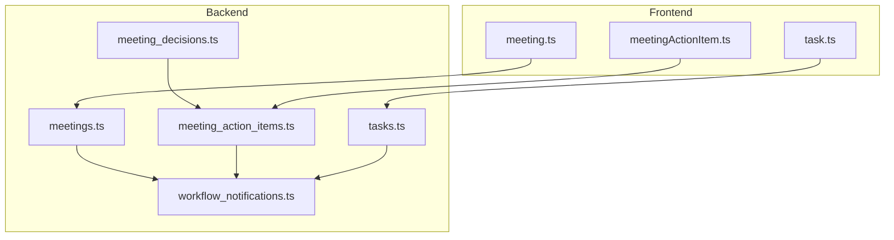
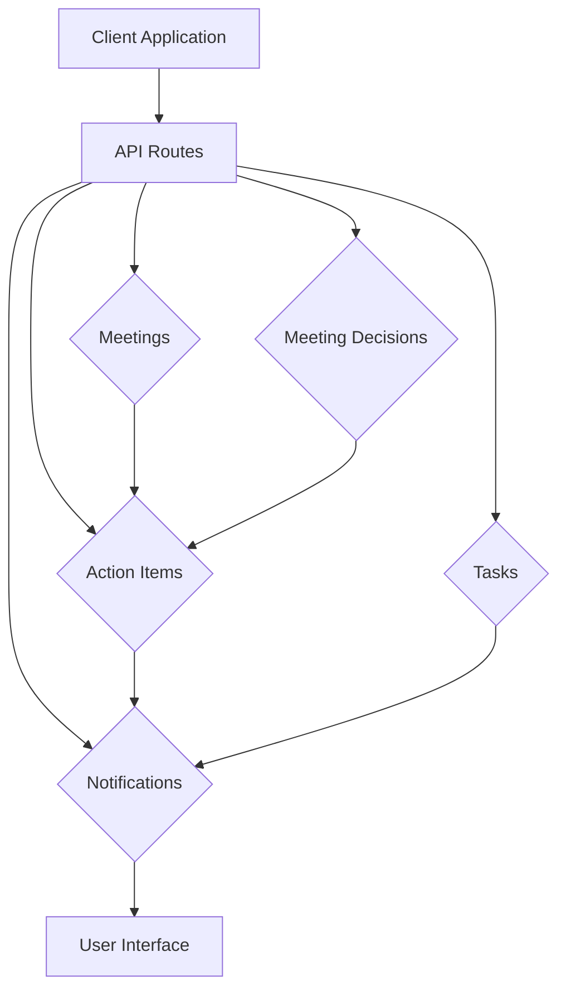
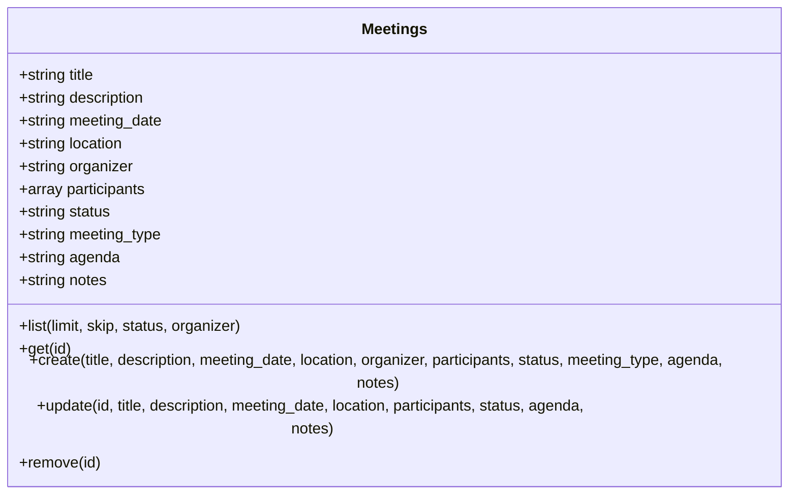
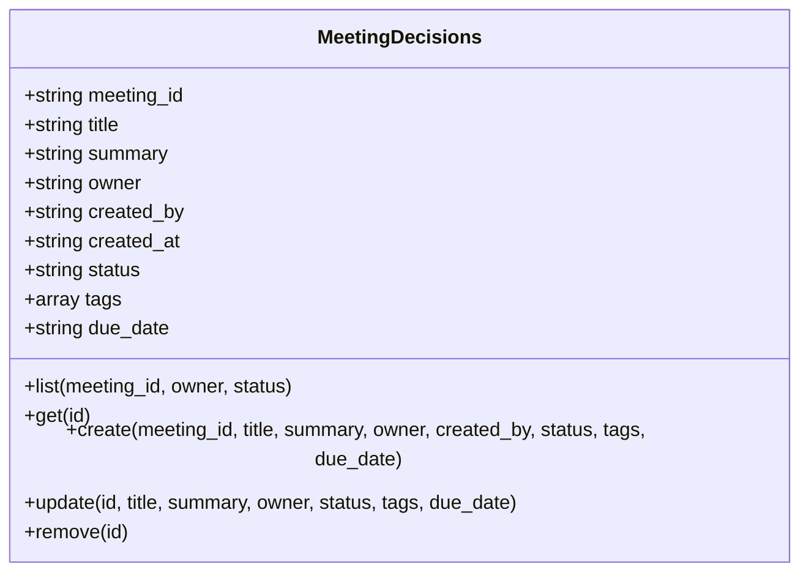
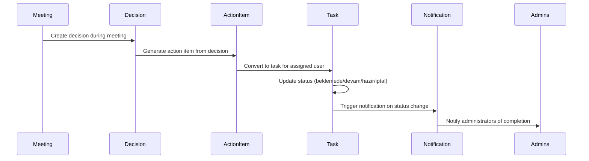
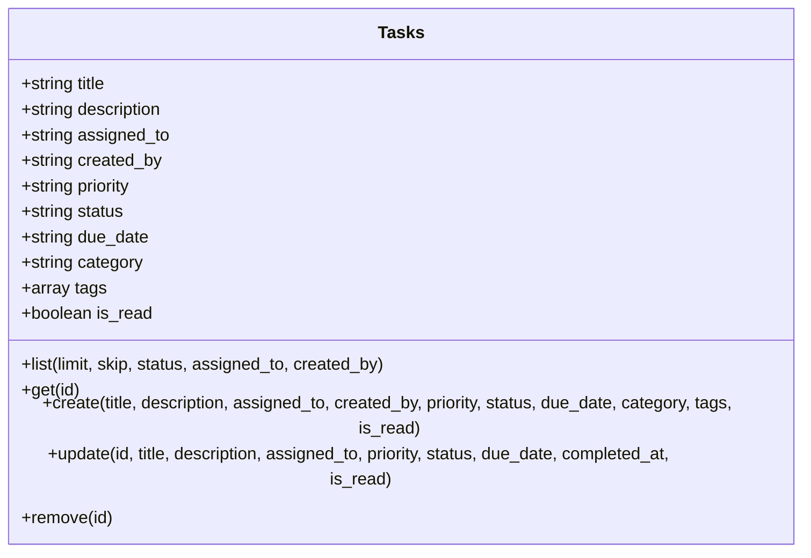
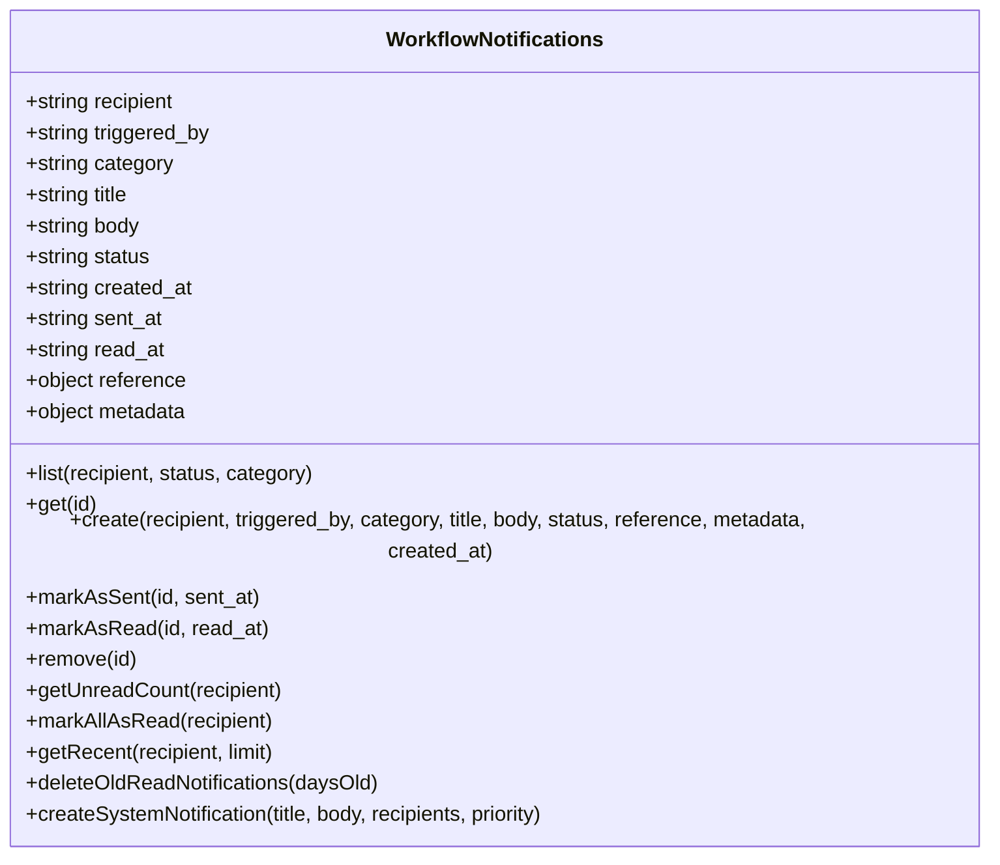
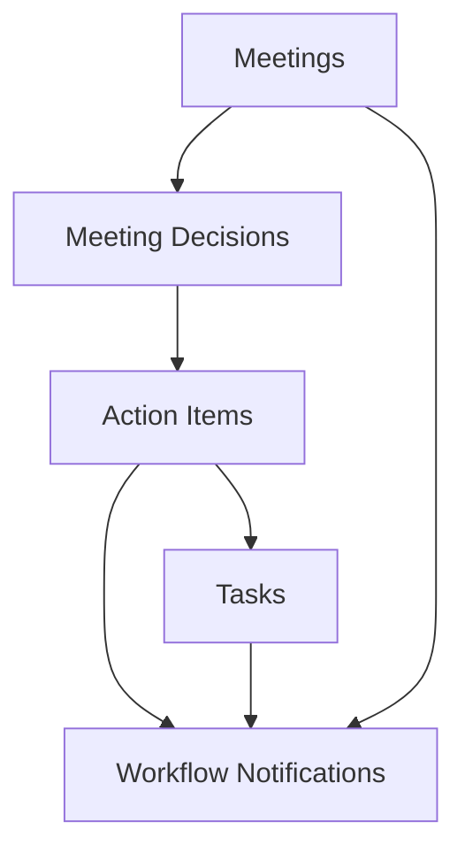

# Task and Meeting Management API Routes

<cite>
**Referenced Files in This Document**   
- [meetings.ts](file://convex/meetings.ts)
- [meeting_decisions.ts](file://convex/meeting_decisions.ts)
- [meeting_action_items.ts](file://convex/meeting_action_items.ts)
- [tasks.ts](file://convex/tasks.ts)
- [workflow_notifications.ts](file://convex/workflow_notifications.ts)
- [meeting.ts](file://src/lib/validations/meeting.ts)
- [meetingActionItem.ts](file://src/lib/validations/meetingActionItem.ts)
- [task.ts](file://src/lib/validations/task.ts)
</cite>

## Table of Contents

1. [Introduction](#introduction)
2. [Project Structure](#project-structure)
3. [Core Components](#core-components)
4. [Architecture Overview](#architecture-overview)
5. [Detailed Component Analysis](#detailed-component-analysis)
6. [Dependency Analysis](#dependency-analysis)
7. [Performance Considerations](#performance-considerations)
8. [Troubleshooting Guide](#troubleshooting-guide)
9. [Conclusion](#conclusion)

## Introduction

This document provides comprehensive API documentation for the Task and Meeting Management system. It details the endpoints for managing meetings, meeting decisions, action items, and tasks. The system supports workflow automation where meeting decisions generate action items, enables task assignment and status tracking, and integrates with user management and notification systems. The API supports recurrence patterns, reminders, and calendar integrations through the workflow_notifications module.

## Project Structure

The project is structured with a clear separation of concerns between backend logic in the `convex` directory and frontend components in the `src` directory. The API routes are defined in the `convex` directory as server-side functions, while validation schemas and client-side logic are located in the `src/lib/validations` directory.

**Diagram sources**

- [meetings.ts](file://convex/meetings.ts)
- [meeting_decisions.ts](file://convex/meeting_decisions.ts)
- [meeting_action_items.ts](file://convex/meeting_action_items.ts)
- [tasks.ts](file://convex/tasks.ts)
- [workflow_notifications.ts](file://convex/workflow_notifications.ts)
- [meeting.ts](file://src/lib/validations/meeting.ts)
- [meetingActionItem.ts](file://src/lib/validations/meetingActionItem.ts)
- [task.ts](file://src/lib/validations/task.ts)

**Section sources**

- [meetings.ts](file://convex/meetings.ts)
- [meeting_decisions.ts](file://convex/meeting_decisions.ts)
- [meeting_action_items.ts](file://convex/meeting_action_items.ts)
- [tasks.ts](file://convex/tasks.ts)
- [workflow_notifications.ts](file://convex/workflow_notifications.ts)

## Core Components

The core components of the Task and Meeting Management system include meetings, meeting decisions, action items, tasks, and workflow notifications. Meetings serve as the primary organizational unit, containing decisions that generate action items. Action items are automatically converted to tasks and assigned to users. The system tracks status changes and sends notifications through the workflow_notifications system.

**Section sources**

- [meetings.ts](file://convex/meetings.ts)
- [meeting_decisions.ts](file://convex/meeting_decisions.ts)
- [meeting_action_items.ts](file://convex/meeting_action_items.ts)
- [tasks.ts](file://convex/tasks.ts)
- [workflow_notifications.ts](file://convex/workflow_notifications.ts)

## Architecture Overview

The system follows a serverless architecture with Convex as the backend platform. API endpoints are exposed through server-side functions that handle CRUD operations for meetings, decisions, action items, and tasks. The architecture supports workflow automation where meeting decisions trigger the creation of action items, which are then tracked through their lifecycle with status updates and notifications.

**Diagram sources**

- [meetings.ts](file://convex/meetings.ts)
- [meeting_decisions.ts](file://convex/meeting_decisions.ts)
- [meeting_action_items.ts](file://convex/meeting_action_items.ts)
- [tasks.ts](file://convex/tasks.ts)
- [workflow_notifications.ts](file://convex/workflow_notifications.ts)

## Detailed Component Analysis

### Meeting Management

The meeting management system provides CRUD operations for meetings with support for agendas, minutes, and participant tracking. Meetings can be filtered by status, organizer, or date, and support pagination for large datasets.

**Diagram sources**

- [meetings.ts](file://convex/meetings.ts)
- [meeting.ts](file://src/lib/validations/meeting.ts)

**Section sources**

- [meetings.ts](file://convex/meetings.ts)
- [meeting.ts](file://src/lib/validations/meeting.ts)

### Meeting Decisions

Meeting decisions are created during or after meetings to document key outcomes. Each decision is linked to a specific meeting and can be assigned to an owner for follow-up. Decisions have a status lifecycle and can be filtered by meeting, owner, or status.

**Diagram sources**

- [meeting_decisions.ts](file://convex/meeting_decisions.ts)

**Section sources**

- [meeting_decisions.ts](file://convex/meeting_decisions.ts)

### Action Items and Task Workflow

The system implements an automated workflow where meeting decisions generate action items that are tracked to completion. Action items can be created directly or generated from decisions, and they automatically create tasks for assigned users. The system tracks status changes and notifies administrators when tasks are completed.

**Diagram sources**

- [meeting_action_items.ts](file://convex/meeting_action_items.ts)
- [workflow_notifications.ts](file://convex/workflow_notifications.ts)

**Section sources**

- [meeting_action_items.ts](file://convex/meeting_action_items.ts)
- [workflow_notifications.ts](file://convex/workflow_notifications.ts)

### Task Management

The task management system provides comprehensive CRUD operations for tasks with support for assignment, priority, status tracking, and deadline management. Tasks can be filtered by status, assignee, or creator, and support pagination for large datasets.

**Diagram sources**

- [tasks.ts](file://convex/tasks.ts)
- [task.ts](file://src/lib/validations/task.ts)

**Section sources**

- [tasks.ts](file://convex/tasks.ts)
- [task.ts](file://src/lib/validations/task.ts)

### Workflow Notifications

The workflow notification system manages notifications for task completions, meeting updates, and other system events. Notifications are sent to recipients based on their role and are tracked through their lifecycle from creation to reading.

**Diagram sources**

- [workflow_notifications.ts](file://convex/workflow_notifications.ts)

**Section sources**

- [workflow_notifications.ts](file://convex/workflow_notifications.ts)

## Dependency Analysis

The Task and Meeting Management system has a well-defined dependency structure where higher-level entities depend on lower-level ones. Meetings are the root entity, with decisions depending on meetings, action items depending on decisions, and tasks depending on action items. The notification system depends on all other components to send status updates.

**Diagram sources**

- [meetings.ts](file://convex/meetings.ts)
- [meeting_decisions.ts](file://convex/meeting_decisions.ts)
- [meeting_action_items.ts](file://convex/meeting_action_items.ts)
- [tasks.ts](file://convex/tasks.ts)
- [workflow_notifications.ts](file://convex/workflow_notifications.ts)

**Section sources**

- [meetings.ts](file://convex/meetings.ts)
- [meeting_decisions.ts](file://convex/meeting_decisions.ts)
- [meeting_action_items.ts](file://convex/meeting_action_items.ts)
- [tasks.ts](file://convex/tasks.ts)
- [workflow_notifications.ts](file://convex/workflow_notifications.ts)

## Performance Considerations

The system is designed with performance in mind, using indexed queries for efficient data retrieval. All list operations support pagination to prevent performance issues with large datasets. The system uses efficient data structures and minimizes database queries through batch operations where possible.

## Troubleshooting Guide

Common issues in the Task and Meeting Management system include validation errors during creation, permission issues during updates, and notification delivery problems. Ensure that all required fields are provided and that users have appropriate permissions for the operations they are attempting.

**Section sources**

- [meetings.ts](file://convex/meetings.ts)
- [meeting_decisions.ts](file://convex/meeting_decisions.ts)
- [meeting_action_items.ts](file://convex/meeting_action_items.ts)
- [tasks.ts](file://convex/tasks.ts)
- [workflow_notifications.ts](file://convex/workflow_notifications.ts)

## Conclusion

The Task and Meeting Management API provides a comprehensive system for managing meetings, decisions, action items, and tasks. The system supports workflow automation, status tracking, and notification integration, making it suitable for complex organizational workflows. The API is well-structured with clear endpoints and validation rules, ensuring reliable and predictable behavior.
