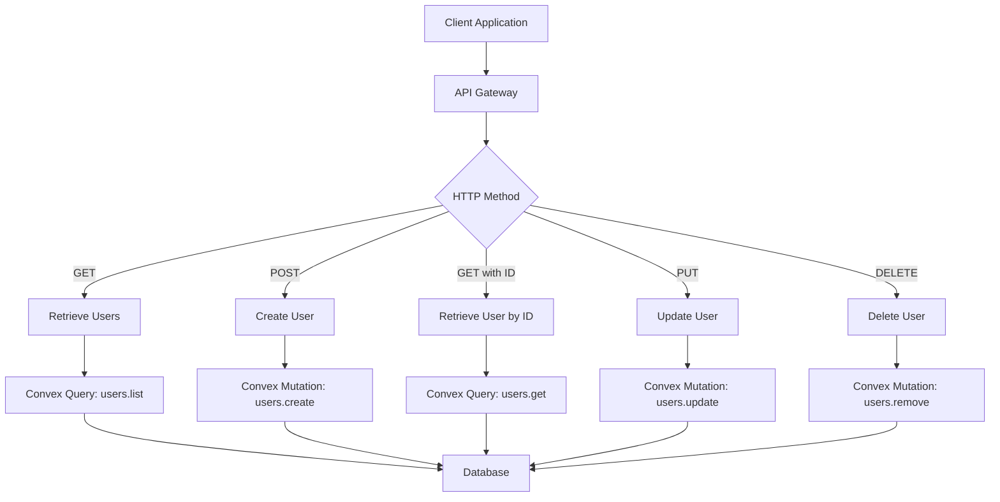
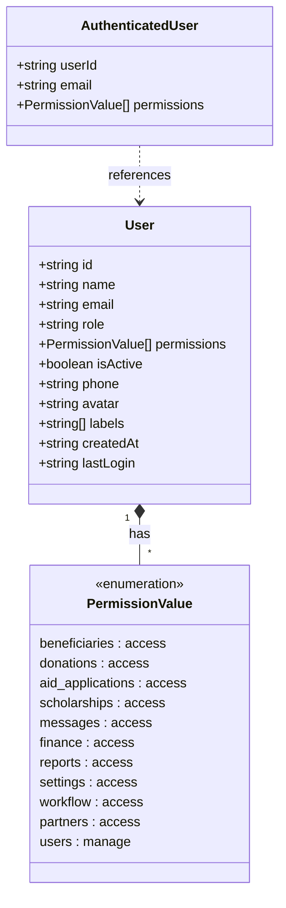
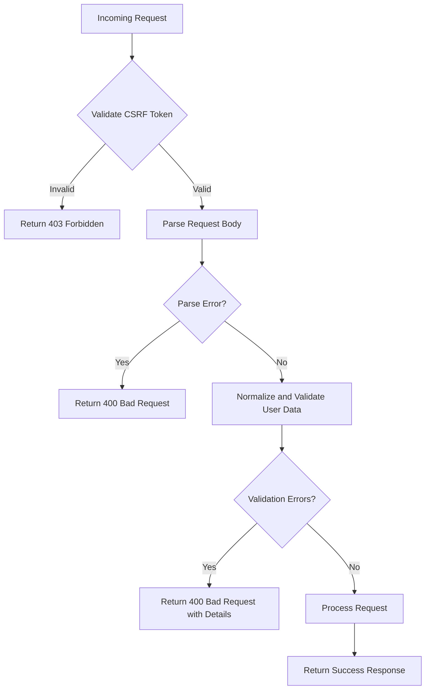
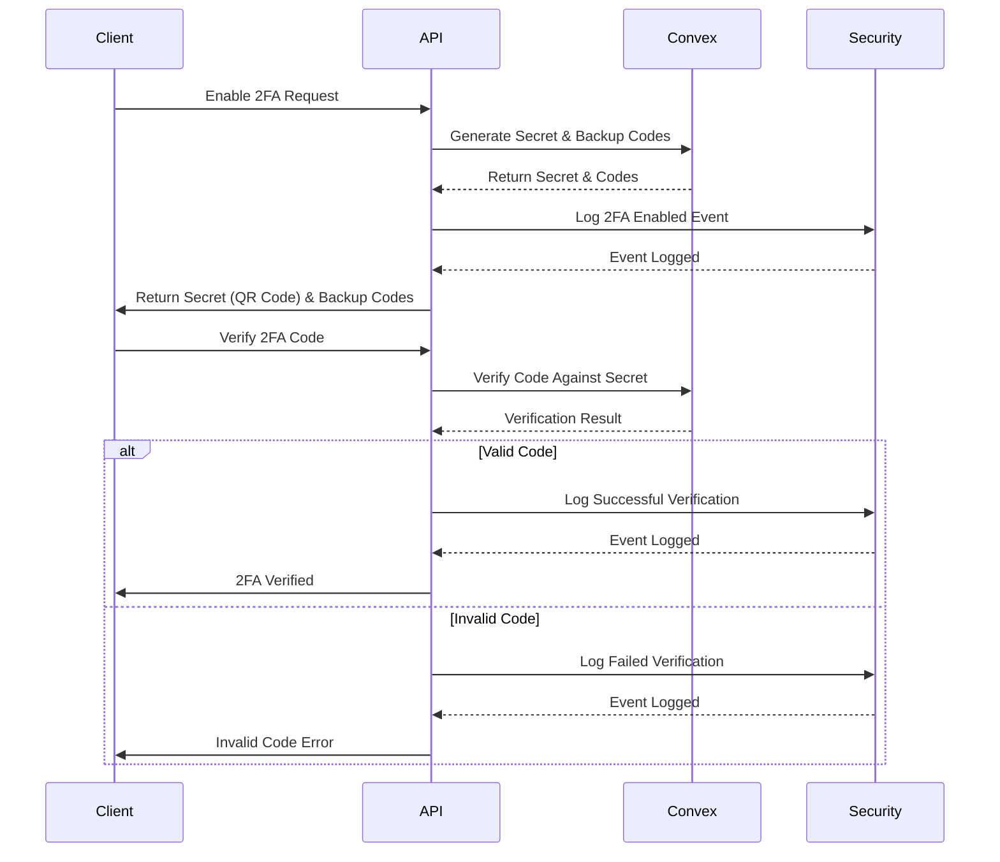

# User Management API Routes

<cite>
**Referenced Files in This Document**   
- [users.ts](file://convex/users.ts)
- [two_factor_auth.ts](file://convex/two_factor_auth.ts)
- [audit_logs.ts](file://convex/audit_logs.ts)
- [route.ts](file://src/app/api/users/route.ts)
- [route.ts](file://src/app/api/users/[id]/route.ts)
- [api.ts](file://src/lib/convex/api.ts)
- [permissions.ts](file://src/types/permissions.ts)
- [shared-validators.ts](file://src/lib/validations/shared-validators.ts)
</cite>

## Table of Contents

1. [Introduction](#introduction)
2. [API Endpoints](#api-endpoints)
3. [Request/Response Schemas](#requestresponse-schemas)
4. [Role-Based Access Control](#role-based-access-control)
5. [Input Validation](#input-validation)
6. [Two-Factor Authentication Integration](#two-factor-authentication-integration)
7. [Audit Logging](#audit-logging)
8. [Usage Examples](#usage-examples)
9. [Security Considerations](#security-considerations)

## Introduction

The User Management API provides comprehensive user lifecycle management capabilities for the application. It supports creating, reading, updating, and deleting user accounts with robust security features including role-based access control, two-factor authentication, and comprehensive audit logging. The API is built on Convex backend functions and follows RESTful principles with proper HTTP status codes and JSON responses.

**Section sources**

- [users.ts](file://convex/users.ts#L1-L220)
- [route.ts](file://src/app/api/users/route.ts#L1-L223)

## API Endpoints

### GET /api/users

Retrieves a paginated list of users with optional filtering by search term, role, and active status.

### POST /api/users

Creates a new user account with specified profile information, role, permissions, and password.

### GET /api/users/[id]

Retrieves detailed information about a specific user by their unique identifier.

### PUT /api/users/[id]

Updates an existing user's information including profile data, role, permissions, and status.

### DELETE /api/users/[id]

Deletes a user account by their unique identifier.



**Diagram sources**

- [users.ts](file://convex/users.ts#L6-L63)
- [route.ts](file://src/app/api/users/route.ts#L107-L223)
- [route.ts](file://src/app/api/users/[id]/route.ts#L29-L217)

**Section sources**

- [route.ts](file://src/app/api/users/route.ts#L107-L223)
- [route.ts](file://src/app/api/users/[id]/route.ts#L29-L217)

## Request/Response Schemas

### User Object Schema

The user object contains the following properties:

| Property    | Type              | Required | Description                             |
| ----------- | ----------------- | -------- | --------------------------------------- |
| id          | string            | Yes      | Unique identifier for the user          |
| name        | string            | Yes      | Full name of the user                   |
| email       | string            | Yes      | Email address (normalized to lowercase) |
| role        | string            | Yes      | User role/title within the organization |
| permissions | array of strings  | Yes      | List of permission values the user has  |
| isActive    | boolean           | Yes      | Whether the user account is active      |
| phone       | string            | No       | Phone number in E.164 format            |
| avatar      | string            | No       | URL to user's profile picture           |
| labels      | array of strings  | No       | Custom labels/tags for the user         |
| createdAt   | string (ISO 8601) | Yes      | Timestamp when user was created         |
| lastLogin   | string (ISO 8601) | No       | Timestamp of last successful login      |

### GET /api/users Response

```json
{
  "success": true,
  "data": [
    {
      "id": "user_123",
      "name": "John Doe",
      "email": "john@example.com",
      "role": "Administrator",
      "permissions": ["users:manage", "beneficiaries:access"],
      "isActive": true,
      "phone": "5551234567",
      "avatar": "https://example.com/avatar.jpg",
      "labels": ["team-leader"],
      "createdAt": "2024-01-01T00:00:00Z",
      "lastLogin": "2024-01-02T10:30:00Z"
    }
  ],
  "total": 1,
  "continueCursor": null,
  "isDone": true
}
```

### POST /api/users Request

```json
{
  "name": "John Doe",
  "email": "john@example.com",
  "role": "Administrator",
  "permissions": ["users:manage", "beneficiaries:access"],
  "password": "SecurePassword123!",
  "isActive": true,
  "phone": "5551234567",
  "avatar": "https://example.com/avatar.jpg",
  "labels": ["team-leader"]
}
```

**Section sources**

- [users.ts](file://convex/users.ts#L84-L121)
- [route.ts](file://src/app/api/users/route.ts#L16-L105)
- [shared-validators.ts](file://src/lib/validations/shared-validators.ts#L305-L312)

## Role-Based Access Control

### Permission System

The API implements a granular permission system based on the `PermissionValue` type defined in the application. Permissions are categorized into module access and special administrative permissions.

### Available Permissions

| Permission              | Label               | Description                            |
| ----------------------- | ------------------- | -------------------------------------- |
| beneficiaries:access    | Beneficiaries       | Access to beneficiary management       |
| donations:access        | Donations           | Access to donation records             |
| aid_applications:access | Aid Applications    | Access to aid application processing   |
| scholarships:access     | Scholarships        | Access to scholarship management       |
| messages:access         | Messaging           | Access to internal messaging system    |
| finance:access          | Finance             | Access to financial records            |
| reports:access          | Reports             | Access to reporting features           |
| settings:access         | Settings            | Access to system settings              |
| workflow:access         | Workflow & Meetings | Access to task and meeting management  |
| partners:access         | Partners            | Access to partner management           |
| users:manage            | User Management     | Administrative access to user accounts |

### Access Control Implementation

All endpoints enforce role-based access control by verifying the authenticated user's permissions before processing requests. The `users:manage` permission is required for all user management operations.



**Diagram sources**

- [permissions.ts](file://src/types/permissions.ts#L1-L39)
- [users.ts](file://convex/users.ts#L84-L121)
- [route.ts](file://src/app/api/users/route.ts#L110-L114)

**Section sources**

- [permissions.ts](file://src/types/permissions.ts#L1-L39)
- [route.ts](file://src/app/api/users/route.ts#L109-L114)
- [route.ts](file://src/app/api/users/[id]/route.ts#L32-L37)

## Input Validation

### Validation Implementation

Input validation is performed using both inline validation in API routes and Zod-based schema validation. The system validates all incoming user data to ensure data integrity and security.

### Validation Rules

- **Name**: Minimum 2 characters, maximum 50 characters, letters and spaces only
- **Email**: Must be valid email format, normalized to lowercase
- **Role**: Minimum 2 characters
- **Password**: Minimum 8 characters with at least one uppercase letter, one lowercase letter, one number, and one special character
- **Phone**: Must match Turkish mobile format (5XXXXXXXXX) or international format (+XXXXXXXXXX)
- **Permissions**: Must be valid permission values from the defined set

### Validation Flow



**Diagram sources**

- [route.ts](file://src/app/api/users/route.ts#L166-L177)
- [route.ts](file://src/app/api/users/[id]/route.ts#L78-L108)
- [shared-validators.ts](file://src/lib/validations/shared-validators.ts#L305-L312)

**Section sources**

- [route.ts](file://src/app/api/users/route.ts#L166-L177)
- [route.ts](file://src/app/api/users/[id]/route.ts#L78-L108)
- [shared-validators.ts](file://src/lib/validations/shared-validators.ts#L305-L312)

## Two-Factor Authentication Integration

### 2FA Architecture

The User Management API integrates with the two-factor authentication system to enhance security for user accounts. The integration allows for enabling, disabling, and verifying 2FA for user accounts.

### Key Functions

- **enable2FA**: Enables 2FA for a user by storing the secret and backup codes
- **disable2FA**: Disables 2FA for a user (requires verification)
- **verify2FACode**: Verifies a TOTP code during login
- **useBackupCode**: Uses a backup code for authentication
- **regenerateBackupCodes**: Regenerates backup codes (requires 2FA verification)
- **get2FAStatus**: Retrieves the current 2FA status for a user

### Security Features

- Backup codes are encrypted and marked as used when consumed
- Security events are logged for all 2FA operations
- Trusted devices can be registered to avoid repeated 2FA challenges
- Rate limiting prevents brute force attacks on 2FA codes



**Diagram sources**

- [two_factor_auth.ts](file://convex/two_factor_auth.ts#L5-L346)
- [users.ts](file://convex/users.ts#L84-L121)

**Section sources**

- [two_factor_auth.ts](file://convex/two_factor_auth.ts#L5-L346)

## Audit Logging

### Audit Trail Implementation

All user management operations are logged in the audit system to provide a complete record of changes for compliance and security monitoring.

### Logged Actions

- **CREATE**: User account creation
- **UPDATE**: User information modification
- **DELETE**: User account deletion
- **VIEW**: User information retrieval

### Audit Log Structure

| Field      | Type   | Description                                     |
| ---------- | ------ | ----------------------------------------------- |
| userId     | string | ID of the user performing the action            |
| userName   | string | Name of the user performing the action          |
| action     | string | Type of action (CREATE, UPDATE, DELETE, VIEW)   |
| resource   | string | Resource type ('users')                         |
| resourceId | string | ID of the user being acted upon                 |
| changes    | object | Details of changes made (for UPDATE operations) |
| ipAddress  | string | IP address of the request                       |
| userAgent  | string | User agent string of the client                 |
| metadata   | object | Additional context-specific data                |
| timestamp  | string | ISO 8601 timestamp of the action                |

### Usage Example

```typescript
// Log user creation
await convexHttp.mutation(api.audit_logs.logAction, {
  userId: currentUser.id,
  userName: currentUser.name,
  action: 'CREATE',
  resource: 'users',
  resourceId: newUser.id,
  changes: {
    name: newUser.name,
    email: newUser.email,
    role: newUser.role,
    permissions: newUser.permissions,
  },
  ipAddress: request.headers.get('x-forwarded-for'),
  userAgent: request.headers.get('user-agent'),
});
```

**Diagram sources**

- [audit_logs.ts](file://convex/audit_logs.ts#L12-L35)
- [users.ts](file://convex/users.ts#L84-L121)

**Section sources**

- [audit_logs.ts](file://convex/audit_logs.ts#L12-L35)

## Usage Examples

### User Provisioning Workflow

```javascript
// Create a new user
const response = await fetch('/api/users', {
  method: 'POST',
  headers: {
    'Content-Type': 'application/json',
    'X-CSRF-Token': csrfToken,
  },
  body: JSON.stringify({
    name: 'Jane Smith',
    email: 'jane@example.com',
    role: 'Case Worker',
    permissions: ['beneficiaries:access', 'messages:access'],
    password: 'StrongPassword123!',
    isActive: true,
    phone: '5559876543',
  }),
});

if (response.ok) {
  const result = await response.json();
  console.log('User created:', result.data);
} else {
  const error = await response.json();
  console.error('Error creating user:', error);
}
```

### User Management Workflow

```javascript
// Update user permissions
const response = await fetch('/api/users/user_123', {
  method: 'PUT',
  headers: {
    'Content-Type': 'application/json',
    'X-CSRF-Token': csrfToken,
  },
  body: JSON.stringify({
    permissions: ['beneficiaries:access', 'donations:access', 'reports:access'],
  }),
});

// Get updated user information
const getUserResponse = await fetch('/api/users/user_123');
const userData = await getUserResponse.json();
console.log('Updated user:', userData.data);
```

### List Users with Filtering

```javascript
// Get active administrators
const response = await fetch('/api/users?role=Administrator&isActive=true&limit=25');
const result = await response.json();
console.log(`Found ${result.total} administrators`);
result.data.forEach((user) => {
  console.log(`${user.name} - ${user.email}`);
});
```

**Section sources**

- [route.ts](file://src/app/api/users/route.ts#L107-L223)
- [route.ts](file://src/app/api/users/[id]/route.ts#L29-L217)

## Security Considerations

### Permission Checks

All endpoints perform strict permission checks to prevent unauthorized access:

- The `users:manage` permission is required for all user management operations
- Permission validation occurs immediately after authentication
- Attempts to modify users without proper permissions return 403 Forbidden

### Audit Logging

Comprehensive audit logging is implemented for all user management operations:

- Every create, update, delete, and view operation is logged
- Logs include user identity, action type, target resource, and timestamp
- IP address and user agent are recorded for security analysis

### Protection Against Privilege Escalation

The system includes multiple safeguards against privilege escalation:

- Users cannot grant themselves permissions they don't already have
- The API validates that requested permissions are valid values
- Role and permission changes are logged for audit purposes
- Password changes require proper authentication

### Additional Security Measures

- CSRF tokens are required for all mutating operations
- Input sanitization is performed on all user-provided data
- Email addresses are normalized (lowercase) to prevent duplication
- Passwords are hashed using secure algorithms before storage
- Rate limiting is applied to prevent brute force attacks

**Section sources**

- [route.ts](file://src/app/api/users/route.ts#L109-L114)
- [route.ts](file://src/app/api/users/[id]/route.ts#L32-L37)
- [audit_logs.ts](file://convex/audit_logs.ts#L12-L35)
- [users.ts](file://convex/users.ts#L104-L106)
