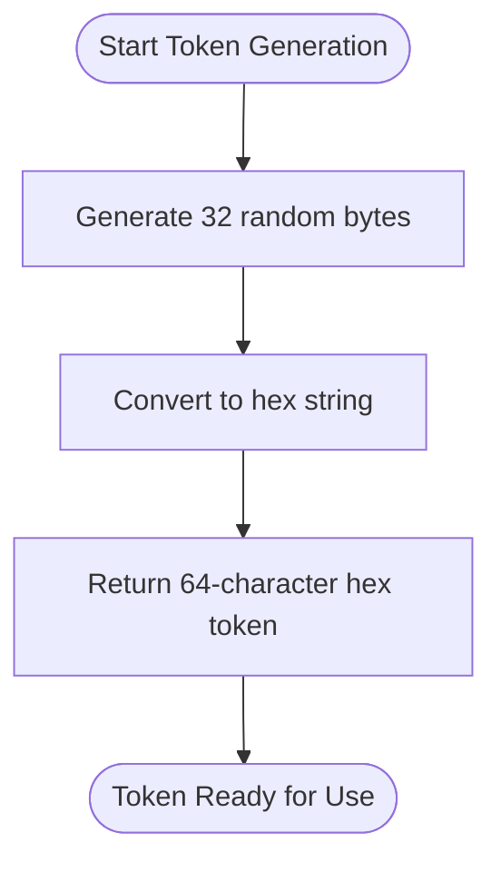
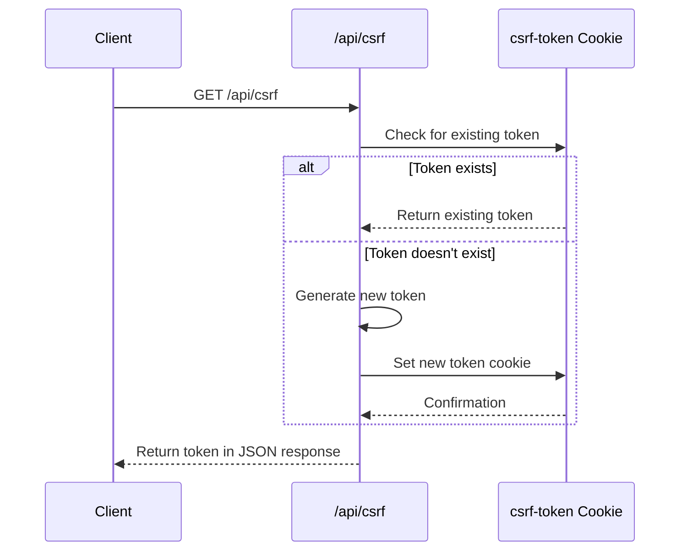
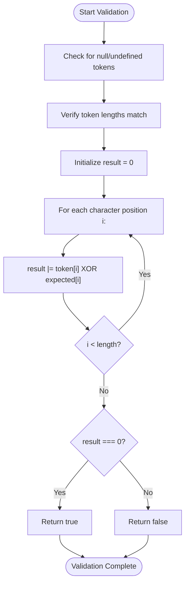
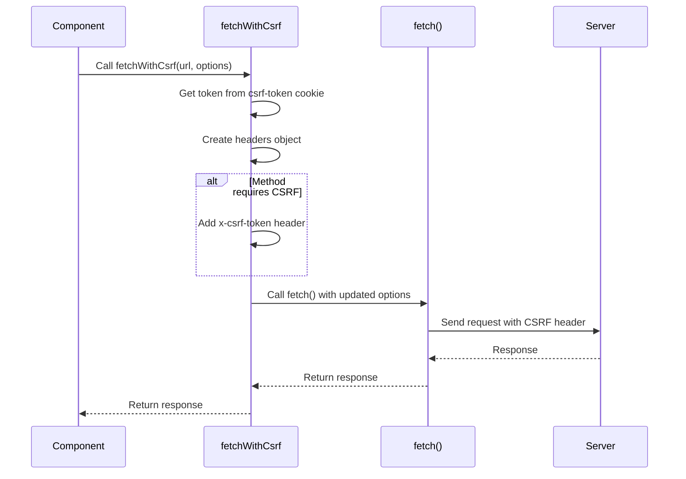
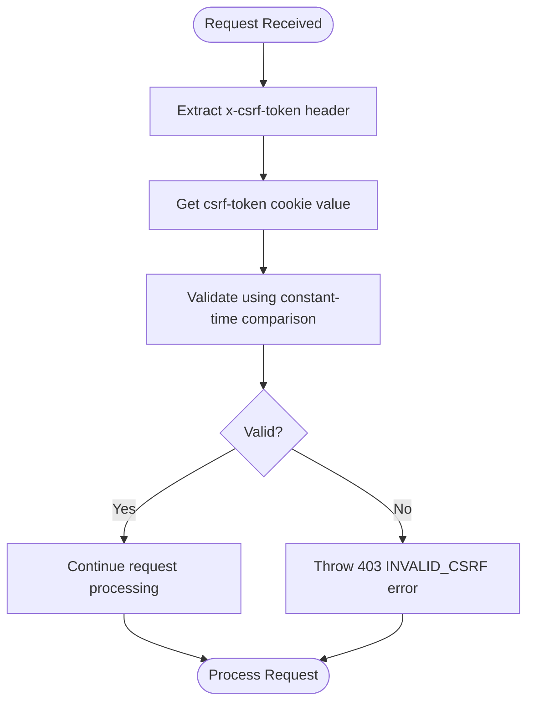
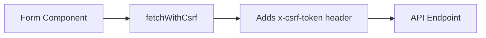
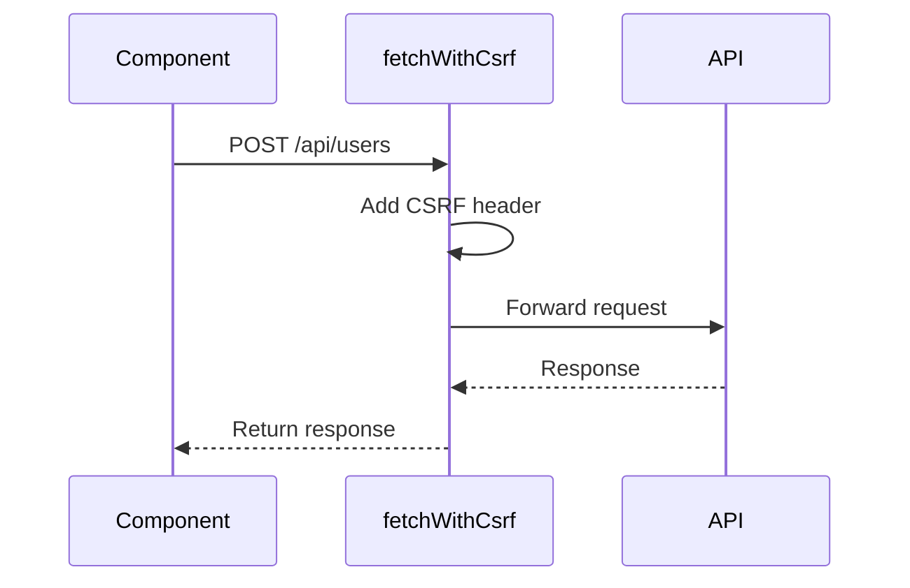
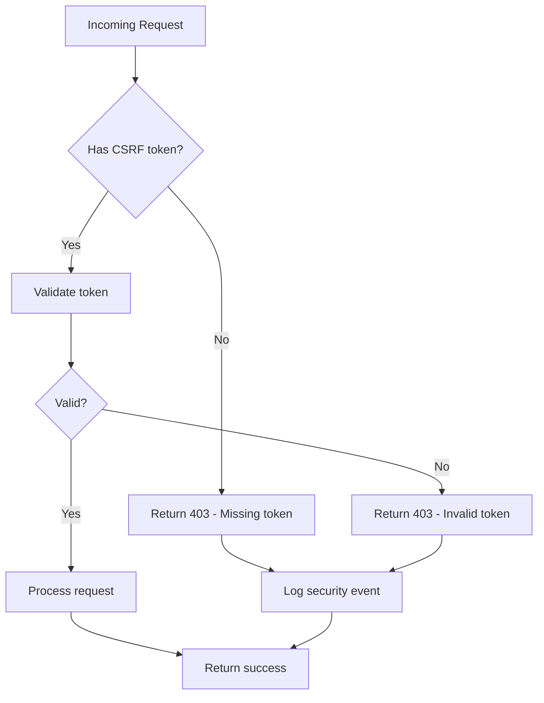

# CSRF Protection

<cite>
**Referenced Files in This Document**   
- [csrf.ts](file://src/lib/csrf.ts)
- [auth-utils.ts](file://src/lib/api/auth-utils.ts)
- [route.ts](file://src/app/api/csrf/route.ts)
- [authStore.ts](file://src/stores/authStore.ts)
</cite>

## Table of Contents

1. [Introduction](#introduction)
2. [Token Generation](#token-generation)
3. [Token Storage and Flow](#token-storage-and-flow)
4. [Validation Mechanism](#validation-mechanism)
5. [Client-Side Implementation](#client-side-implementation)
6. [Server-Side Verification](#server-side-verification)
7. [Integration Points](#integration-points)
8. [Usage Examples](#usage-examples)
9. [Error Handling](#error-handling)

## Introduction

The CSRF protection mechanism in Kafkasder-panel implements a robust security system to prevent Cross-Site Request Forgery attacks. This documentation details the architecture and implementation of the CSRF protection system, focusing on cryptographically secure token generation, token flow management, validation algorithms, and integration patterns throughout the application.

**Section sources**

- [csrf.ts](file://src/lib/csrf.ts#L1-L10)
- [auth-utils.ts](file://src/lib/api/auth-utils.ts#L1-L10)

## Token Generation

The CSRF protection system generates cryptographically secure tokens using Node.js's `crypto` module. The implementation creates 32-character hexadecimal tokens through the `randomBytes` function, ensuring high entropy and unpredictability.

The token generation process uses a fixed length of 32 characters (256 bits of entropy) and converts the random bytes to a hexadecimal string representation. This approach leverages the operating system's cryptographically secure random number generator, making the tokens resistant to prediction and brute force attacks.



**Diagram sources**

- [csrf.ts](file://src/lib/csrf.ts#L13-L15)

**Section sources**

- [csrf.ts](file://src/lib/csrf.ts#L6-L15)

## Token Storage and Flow

The CSRF token follows a specific lifecycle from generation to usage in HTTP requests. The token is generated during authentication and stored in a cookie that is accessible to client-side JavaScript but protected by SameSite and HTTPS policies.

The token flow begins with the `/api/csrf` endpoint, which checks for an existing token in the `csrf-token` cookie. If no token exists, a new one is generated and set in the cookie with appropriate security attributes. The cookie is configured with `httpOnly: false` to allow client-side access, `secure: true` in production, `sameSite: strict`, and a 24-hour expiration.



**Diagram sources**

- [route.ts](file://src/app/api/csrf/route.ts#L8-L41)

**Section sources**

- [route.ts](file://src/app/api/csrf/route.ts#L1-L42)
- [csrf.ts](file://src/lib/csrf.ts#L49-L63)

## Validation Mechanism

The CSRF protection system employs a constant-time string comparison algorithm to validate tokens and prevent timing attacks. This algorithm ensures that the comparison operation takes the same amount of time regardless of the similarity between the provided token and the expected token.

The validation process first checks for the presence of both tokens and verifies they have identical lengths (to prevent early termination that could leak information). The constant-time comparison uses bitwise operations to compare each character without short-circuiting, ensuring that attackers cannot use timing differences to guess the token value character by character.



**Diagram sources**

- [csrf.ts](file://src/lib/csrf.ts#L27-L44)

**Section sources**

- [csrf.ts](file://src/lib/csrf.ts#L27-L44)

## Client-Side Implementation

The client-side implementation includes a `fetchWithCsrf` wrapper function that automatically injects CSRF tokens into outgoing requests. This utility function retrieves the token from the `csrf-token` cookie and adds it to the `x-csrf-token` header for state-changing HTTP methods (POST, PUT, PATCH, DELETE).

The implementation checks the HTTP method to determine whether a CSRF token is required, ensuring that only mutating operations are protected while read operations remain unaffected. This approach minimizes overhead while maintaining security for vulnerable operations.



**Diagram sources**

- [csrf.ts](file://src/lib/csrf.ts#L68-L80)

**Section sources**

- [csrf.ts](file://src/lib/csrf.ts#L68-L89)
- [authStore.ts](file://src/stores/authStore.ts#L153-L160)

## Server-Side Verification

Server-side verification occurs in the `verifyCsrfToken` function within `auth-utils.ts`. This function extracts the CSRF token from the `x-csrf-token` header and compares it with the token stored in the `csrf-token` cookie using the constant-time comparison algorithm.

The verification process is designed to be integrated into API route handlers, typically as middleware or a prerequisite check before processing sensitive operations. If validation fails, an `ApiAuthError` with status 403 is thrown, preventing the request from proceeding.



**Diagram sources**

- [auth-utils.ts](file://src/lib/api/auth-utils.ts#L77-L86)

**Section sources**

- [auth-utils.ts](file://src/lib/api/auth-utils.ts#L77-L86)

## Integration Points

The CSRF protection system integrates with several key endpoints and components in the application:

1. **Authentication endpoints**: The login process retrieves a CSRF token before submitting credentials
2. **/api/csrf endpoint**: Generates and returns CSRF tokens to clients
3. **State-changing API routes**: Verify CSRF tokens before processing POST, PUT, PATCH, and DELETE requests
4. **Auth store**: Manages CSRF token retrieval during authentication flows

The `/api/csrf` endpoint serves as the primary integration point for clients to obtain tokens, while the authentication system ensures tokens are available before sensitive operations can be performed.

```mermaid
graph TB
A[/api/csrf] --> |Provides token| B[Client Components]
C[Login Process] --> |Uses| A
D[State-Changing APIs] --> |Verify| E[CSRF Token]
B --> |Sends| D
F[Auth Store] --> |Manages| A
F --> |Uses| D
```

**Diagram sources**

- [route.ts](file://src/app/api/csrf/route.ts#L8-L41)
- [authStore.ts](file://src/stores/authStore.ts#L153-L160)
- [auth-utils.ts](file://src/lib/api/auth-utils.ts#L77-L86)

**Section sources**

- [route.ts](file://src/app/api/csrf/route.ts#L8-L41)
- [authStore.ts](file://src/stores/authStore.ts#L153-L160)

## Usage Examples

### Form Submissions

When submitting forms that modify data, the CSRF token must be included in the request headers. The `fetchWithCsrf` wrapper handles this automatically:



### API Calls

For direct API calls, developers can use the `fetchWithCsrf` function which automatically includes the token for mutating operations:



**Section sources**

- [csrf.ts](file://src/lib/csrf.ts#L68-L80)
- [authStore.ts](file://src/stores/authStore.ts#L167-L174)

## Error Handling

The CSRF protection system implements comprehensive error handling for invalid or missing tokens. When validation fails, the server returns a 403 Forbidden status with an `INVALID_CSRF` error code. Client-side code should handle these errors by prompting users to refresh the page or re-authenticate.

The error handling process includes logging validation failures for monitoring and security analysis, while providing user-friendly error messages that don't expose implementation details. This approach balances security with usability, preventing attacks while minimizing disruption to legitimate users.



**Diagram sources**

- [auth-utils.ts](file://src/lib/api/auth-utils.ts#L83-L85)

**Section sources**

- [auth-utils.ts](file://src/lib/api/auth-utils.ts#L83-L85)
- [authStore.ts](file://src/stores/authStore.ts#L156-L158)
