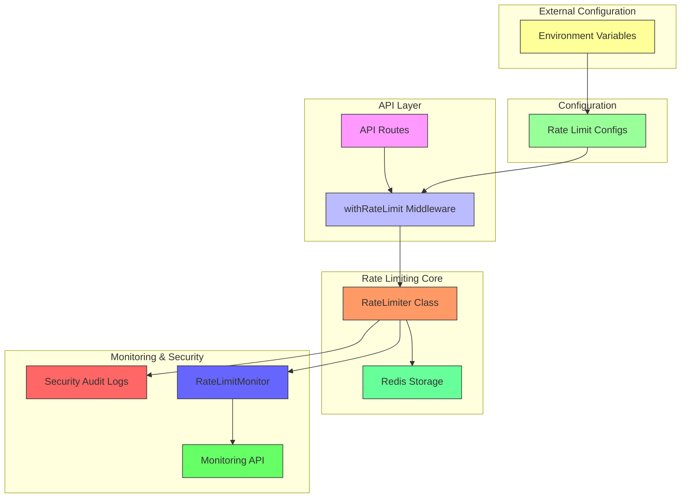
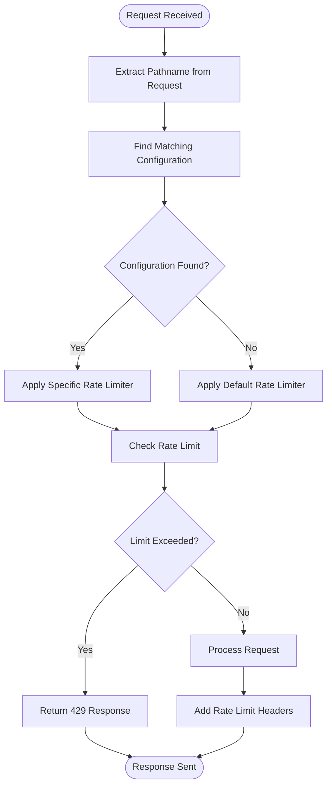
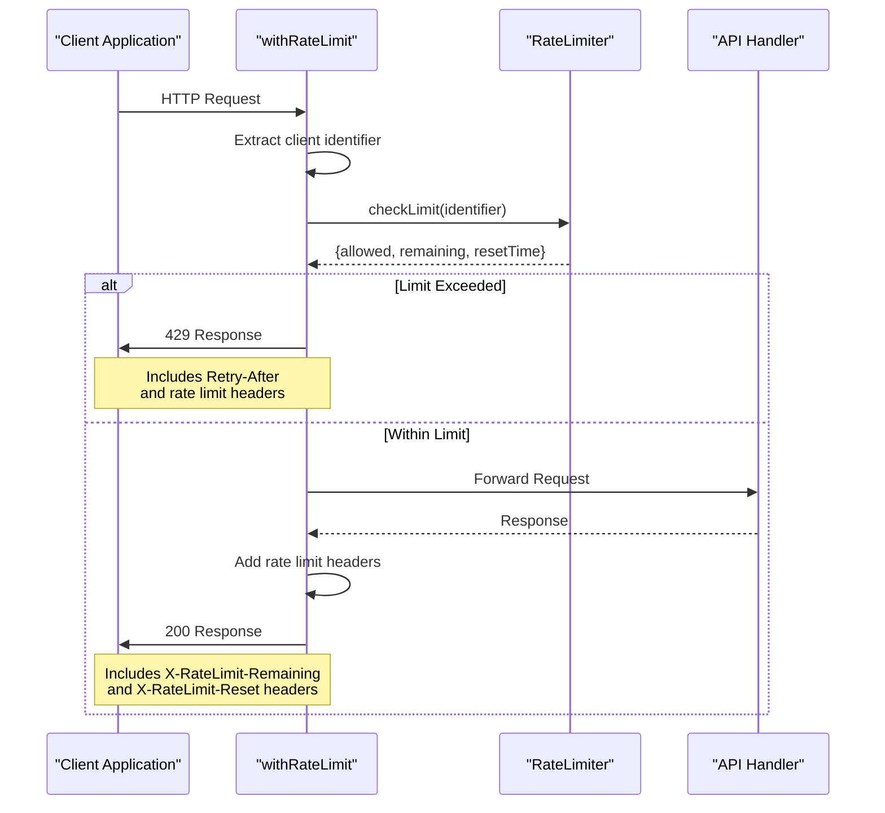
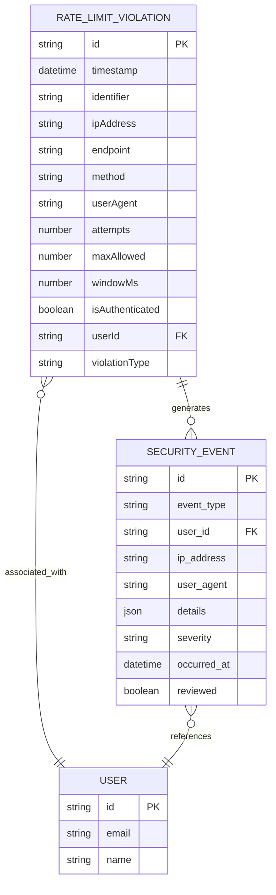
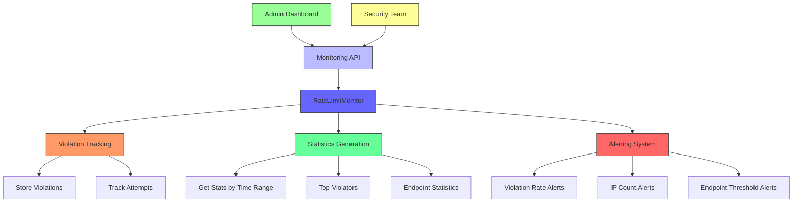

# Rate Limiting

<cite>
**Referenced Files in This Document**   
- [rate-limit.ts](file://src/lib/rate-limit.ts)
- [rate-limit-config.ts](file://src/lib/rate-limit-config.ts)
- [security.ts](file://src/lib/security.ts)
- [rate-limit-monitor.ts](file://src/lib/rate-limit-monitor.ts)
- [route.ts](file://src/app/api/monitoring/rate-limit/route.ts)
</cite>

## Table of Contents

1. [Introduction](#introduction)
2. [Architecture Overview](#architecture-overview)
3. [Core Components](#core-components)
4. [Configuration-Driven Rate Limiting](#configuration-driven-rate-limiting)
5. [Middleware Implementation](#middleware-implementation)
6. [Pre-configured Rate Limiters](#pre-configured-rate-limiters)
7. [Security Audit Integration](#security-audit-integration)
8. [Monitoring and Analytics](#monitoring-and-analytics)
9. [Implementation Examples](#implementation-examples)
10. [Best Practices](#best-practices)

## Introduction

The rate limiting system in Kafkasder-panel is a comprehensive middleware-based solution designed to prevent abuse of critical API endpoints. This system implements Redis-backed counters to track request patterns and enforce limits across various endpoint categories. The architecture combines configuration-driven policies with dynamic enforcement mechanisms to protect authentication, data modification, file upload, and search operations from excessive usage. The system integrates with security audit logging to provide comprehensive tracking of violations and supports environment variable overrides for flexible deployment configurations.

## Architecture Overview

The rate limiting system follows a layered architecture with distinct components for configuration, enforcement, monitoring, and integration. The core implementation uses a middleware pattern where API routes are wrapped with rate limiting functions that intercept requests before they reach the business logic layer. The system leverages a centralized RateLimiter class that maintains request counters in Redis, providing distributed rate limiting across application instances. Configuration is managed through a declarative approach using the RATE_LIMIT_CONFIGS object, which maps endpoint patterns to specific rate limiting policies. Violation tracking is integrated with the security audit system, ensuring all rate limit events are logged and available for compliance reporting.

**Diagram sources**

- [rate-limit.ts](file://src/lib/rate-limit.ts)
- [rate-limit-config.ts](file://src/lib/rate-limit-config.ts)
- [security.ts](file://src/lib/security.ts)
- [rate-limit-monitor.ts](file://src/lib/rate-limit-monitor.ts)

## Core Components

The rate limiting system comprises several key components that work together to provide comprehensive protection for API endpoints. The foundation is the RateLimiter class in security.ts, which handles the core counting logic and Redis interactions. This is complemented by the withRateLimit higher-order function in rate-limit.ts, which serves as the middleware wrapper for API routes. The configuration system in rate-limit-config.ts defines the policy rules that determine which limits apply to specific endpoints. For monitoring and analytics, the RateLimitMonitor class tracks violations and generates statistics, while the monitoring API endpoint provides access to this data. Together, these components create a robust system that prevents abuse while providing visibility into usage patterns.

**Section sources**

- [security.ts](file://src/lib/security.ts#L77-L279)
- [rate-limit.ts](file://src/lib/rate-limit.ts#L10-L88)
- [rate-limit-config.ts](file://src/lib/rate-limit-config.ts#L21-L107)

## Configuration-Driven Rate Limiting

The rate limiting system employs a configuration-driven approach through the RATE_LIMIT_CONFIGS object, which defines specific limits for different endpoint categories. This configuration uses regular expression patterns to match API endpoints and apply appropriate rate limiting policies. The system implements distinct limits for authentication endpoints (10 attempts per 10 minutes), data modification operations (50 requests per 15 minutes), file uploads (10 per minute), and search operations (30 per minute). Health check endpoints are explicitly excluded from rate limiting to ensure system availability monitoring is not affected. The configuration also supports environment variable overrides, allowing deployment-specific tuning of rate limits without code changes.

**Diagram sources**

- [rate-limit-config.ts](file://src/lib/rate-limit-config.ts#L21-L107)
- [rate-limit.ts](file://src/lib/rate-limit.ts#L115-L128)

## Middleware Implementation

The withRateLimit higher-order function implements the middleware pattern for rate limiting API routes. This function wraps route handlers and intercepts requests to check against rate limiting policies before allowing them to proceed. The implementation extracts client identifiers from request headers, including IP address, HTTP method, and pathname, creating a unique key for rate limit tracking. When a rate limit is exceeded, the middleware returns a 429 Too Many Requests response with appropriate Retry-After headers and rate limit metadata. The system also adds X-RateLimit-Remaining and X-RateLimit-Reset headers to successful responses, providing clients with information about their current rate limit status. The middleware supports configuration options to skip counting for successful or failed requests, enabling specialized behavior for certain endpoint types.

**Diagram sources**

- [rate-limit.ts](file://src/lib/rate-limit.ts#L10-L88)
- [security.ts](file://src/lib/security.ts#L98-L176)

## Pre-configured Rate Limiters

The system provides several pre-configured rate limiters for common endpoint categories, each with specific configuration parameters. These include authRateLimit for authentication endpoints, dataModificationRateLimit for data modification operations, readOnlyRateLimit for read-only queries, uploadRateLimit for file uploads, and searchRateLimit for search operations. Each pre-configured limiter is implemented as a wrapper function that calls withRateLimit with appropriate parameters for the specific use case. These limiters support environment variable overrides through RATE*LIMIT*\* configuration variables, allowing administrators to adjust limits without code changes. The system also includes a dashboardRateLimit for high-frequency dashboard updates and a generic apiRateLimit for custom configurations.

**Section sources**

- [rate-limit.ts](file://src/lib/rate-limit.ts#L91-L147)
- [rate-limit-config.ts](file://src/lib/rate-limit-config.ts#L21-L107)

## Security Audit Integration

The rate limiting system is tightly integrated with the security audit logging framework to track and record all violations. When a rate limit is exceeded, the system creates an entry in the security_events collection with details about the violation, including the endpoint, IP address, user ID (if authenticated), and violation type. This integration enables comprehensive monitoring of potential abuse patterns and supports compliance reporting requirements. The audit logs include severity levels based on the nature of the violation, with repeated rate limit exceedances classified as higher severity events. The system also supports IP-based whitelisting and blacklisting through environment variables, allowing administrators to exempt trusted clients or block abusive ones.

**Diagram sources**

- [security.ts](file://src/lib/security.ts#L208-L217)
- [security_audit.ts](file://convex/security_audit.ts#L5-L38)

## Monitoring and Analytics

The RateLimitMonitor class provides comprehensive monitoring and analytics capabilities for the rate limiting system. This component tracks all violations and generates detailed statistics about request patterns, including top violators, endpoint-specific metrics, and violation rates over time. The monitoring system exposes an API endpoint at /api/monitoring/rate-limit that provides access to these statistics and supports various query parameters for filtering and analysis. Administrators can retrieve overall statistics, recent violations, IP-specific statistics, and export monitoring data for further analysis. The system also includes alerting capabilities that trigger warnings when violation rates exceed configured thresholds, helping identify potential abuse campaigns or denial-of-service attacks.

**Diagram sources**

- [rate-limit-monitor.ts](file://src/lib/rate-limit-monitor.ts#L41-L301)
- [route.ts](file://src/app/api/monitoring/rate-limit/route.ts#L27-L195)

## Implementation Examples

The rate limiting system is implemented across various API routes in the application, with specific configurations for different endpoint types. Authentication endpoints use the authRateLimit wrapper to protect login and registration functionality with strict limits. Data modification endpoints for beneficiaries, users, tasks, and other resources use dataModificationRateLimit to prevent excessive changes. File upload endpoints apply uploadRateLimit to control the rate of uploads, while search endpoints use searchRateLimit to manage query frequency. The implementation follows a consistent pattern where route handlers are wrapped with the appropriate rate limiter function, ensuring uniform protection across the API surface. The system also supports conditional rate limiting based on user authentication status, providing higher limits for authenticated users through a premium multiplier.

**Section sources**

- [rate-limit-config.ts](file://src/lib/rate-limit-config.ts#L21-L107)
- [rate-limit.ts](file://src/lib/rate-limit.ts#L91-L147)

## Best Practices

When implementing and using the rate limiting system, several best practices should be followed to ensure effective protection and good user experience. Clients should handle 429 responses gracefully by respecting the Retry-After header and implementing exponential backoff for retry attempts. API consumers should monitor rate limit headers to avoid hitting limits unexpectedly. Administrators should regularly review monitoring statistics to identify potential abuse patterns and adjust limits as needed. The environment variable overrides should be used to tune limits for different deployment environments, with more permissive settings in development and stricter limits in production. Security teams should monitor the alerting system for signs of coordinated attacks and update IP blacklists as needed. Documentation should clearly communicate rate limit policies to API consumers to prevent confusion and support effective integration.

**Section sources**

- [rate-limit.ts](file://src/lib/rate-limit.ts#L43-L58)
- [rate-limit-monitor.ts](file://src/lib/rate-limit-monitor.ts#L208-L255)
- [security.ts](file://src/lib/security.ts#L81-L97)
