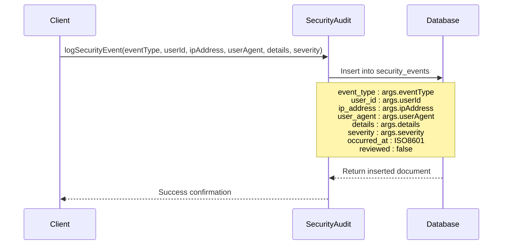
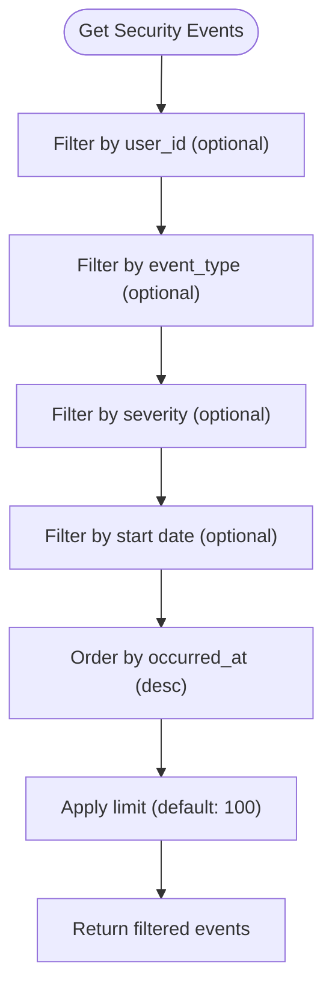
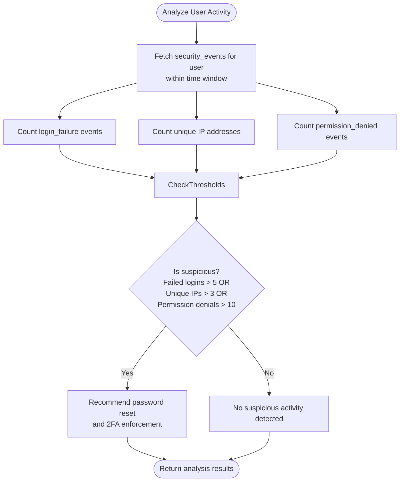
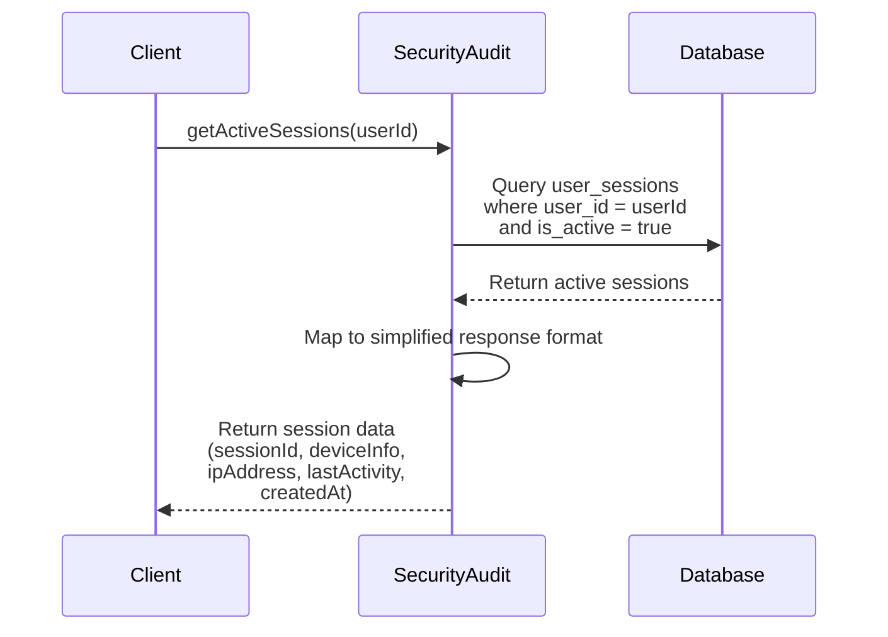
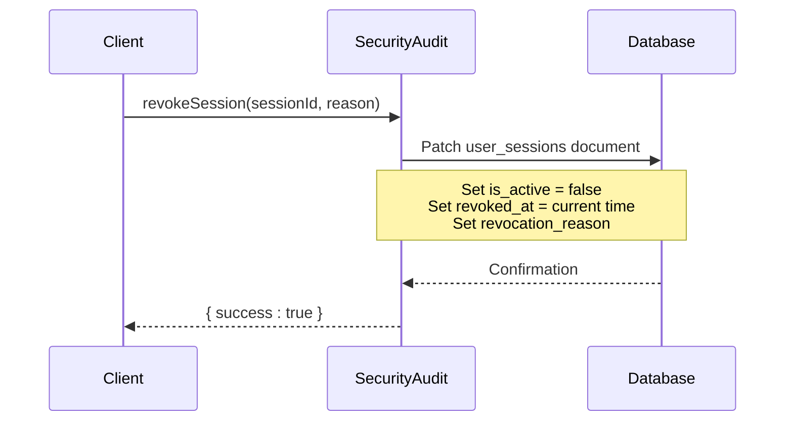
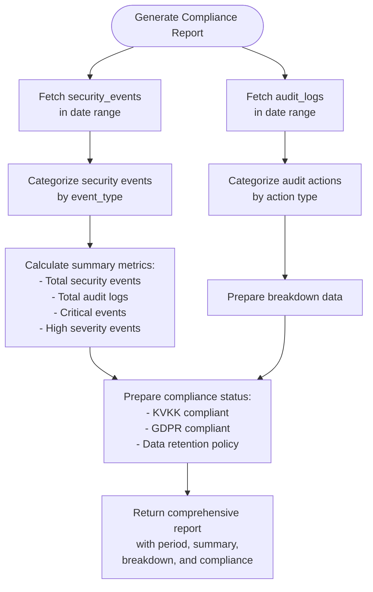

# Security Audit Logging

<cite>
**Referenced Files in This Document**   
- [security_audit.ts](file://convex/security_audit.ts)
- [schema.ts](file://convex/schema.ts)
- [audit_logs.ts](file://convex/audit_logs.ts)
- [two_factor_auth.ts](file://convex/two_factor_auth.ts)
</cite>

## Table of Contents

1. [Introduction](#introduction)
2. [Security Events Data Model](#security-events-data-model)
3. [Event Logging and Retrieval](#event-logging-and-retrieval)
4. [Suspicious Activity Detection](#suspicious-activity-detection)
5. [Session Management Integration](#session-management-integration)
6. [Compliance Reporting](#compliance-reporting)
7. [Retention Policies](#retention-policies)

## Introduction

The security audit logging system in Kafkasder-panel provides comprehensive monitoring and auditing capabilities for security-related activities. This system captures critical security events, enables detection of suspicious behavior, and supports regulatory compliance reporting for KVKK and GDPR requirements. The architecture is built around Convex database collections and server-side functions that implement mutation-based logging and query-based retrieval patterns.

**Section sources**

- [security_audit.ts](file://convex/security_audit.ts#L1-L274)
- [schema.ts](file://convex/schema.ts#L659-L721)

## Security Events Data Model

The security audit system is centered around the `security_events` collection, which stores detailed information about security-related activities. The data model includes essential fields for comprehensive auditing:

```mermaid
erDiagram
security_events {
string event_type PK
Id<'users'> user_id FK
string ip_address
string user_agent
any details
string severity
string occurred_at
boolean reviewed
}
users ||--o{ security_events : "triggers"
security_events {
"login_attempt"
"login_success"
"login_failure"
"logout"
"permission_denied"
"suspicious_activity"
"password_change"
"2fa_enabled"
"2fa_disabled"
"data_access"
"data_modification"
}
security_events {
"low"
"medium"
"high"
"critical"
}
```

**Diagram sources**

- [schema.ts](file://convex/schema.ts#L675-L704)

### Field Definitions

| Field           | Type        | Description                                                 |
| --------------- | ----------- | ----------------------------------------------------------- |
| **event_type**  | string      | Type of security event (login_attempt, login_success, etc.) |
| **user_id**     | Id<'users'> | Reference to the user associated with the event             |
| **ip_address**  | string      | Source IP address of the event                              |
| **user_agent**  | string      | User agent string identifying the client                    |
| **details**     | any         | Structured contextual details specific to the event         |
| **severity**    | string      | Severity level (low, medium, high, critical)                |
| **occurred_at** | string      | ISO timestamp when the event occurred                       |
| **reviewed**    | boolean     | Flag indicating whether the event has been reviewed         |

The collection includes indexes on `user_id`, `occurred_at`, and `event_type` fields to optimize query performance for common filtering operations.

**Section sources**

- [schema.ts](file://convex/schema.ts#L675-L704)

## Event Logging and Retrieval

The security audit system implements a mutation-based approach for logging events and query-based retrieval with filtering capabilities.

### Logging Security Events

Security events are logged using the `logSecurityEvent` mutation, which follows a consistent pattern for recording security-related activities:



**Diagram sources**

- [security_audit.ts](file://convex/security_audit.ts#L4-L37)

The mutation accepts parameters including event type, user ID, IP address, user agent, structured details, and severity level. Upon execution, it automatically sets the `occurred_at` timestamp to the current time in ISO format and initializes the `reviewed` flag to false.

### Querying Security Events

Security events can be retrieved using the `getSecurityEvents` query function, which supports multiple filtering options:



**Diagram sources**

- [security_audit.ts](file://convex/security_audit.ts#L41-L70)

The query function supports filtering by:

- Specific user ID
- Event type
- Severity level
- Start date (returning events from that date onward)
- Result limit (default: 100)

Events are returned in descending order by occurrence time, providing a reverse chronological view of security activities.

**Section sources**

- [security_audit.ts](file://convex/security_audit.ts#L41-L70)

## Suspicious Activity Detection

The system includes proactive security monitoring through the `detectSuspiciousActivity` function, which analyzes login patterns and user behavior to identify potential account compromise.



**Diagram sources**

- [security_audit.ts](file://convex/security_audit.ts#L73-L116)

The detection algorithm analyzes events within a configurable time window (default: 24 hours) and evaluates three key indicators:

- More than 5 failed login attempts
- Logins from more than 3 different IP addresses
- More than 10 permission denied events

When suspicious activity is detected, the system recommends requiring a password reset and enabling two-factor authentication to secure the account.

**Section sources**

- [security_audit.ts](file://convex/security_audit.ts#L73-L116)

## Session Management Integration

The security audit system integrates with session management functionality to provide comprehensive user session monitoring and control.

### Active Session Retrieval

The `getActiveSessions` function retrieves information about currently active sessions for a specific user:



**Diagram sources**

- [security_audit.ts](file://convex/security_audit.ts#L119-L142)

### Session Revocation

The `revokeSession` mutation allows for terminating specific user sessions, which is critical for security response:



**Diagram sources**

- [security_audit.ts](file://convex/security_audit.ts#L145-L159)

The integration with the `user_sessions` collection enables monitoring of active sessions and immediate response to security incidents by revoking compromised sessions.

**Section sources**

- [security_audit.ts](file://convex/security_audit.ts#L119-L159)
- [schema.ts](file://convex/schema.ts#L706-L731)

## Compliance Reporting

The system provides regulatory compliance reporting through the `generateComplianceReport` function, which produces reports for KVKK and GDPR requirements.



**Diagram sources**

- [security_audit.ts](file://convex/security_audit.ts#L214-L272)

The compliance report includes:

- **Period**: Date range for the report
- **Summary**: Key metrics including total events, critical events, and high severity events
- **Breakdown**: Categorization of events by type
- **Compliance**: Status for KVKK and GDPR compliance with data retention policy (7 years as required by KVKK)

The report combines data from both security events and audit logs to provide a comprehensive view of system activity for regulatory purposes.

**Section sources**

- [security_audit.ts](file://convex/security_audit.ts#L214-L272)

## Retention Policies

The security audit system implements retention policies to ensure compliance with regulatory requirements while managing storage efficiently. Based on the compliance report generation, the system maintains audit data for 7 years to meet KVKK requirements. The data model and query functions are designed to support long-term retention with appropriate indexing for performance optimization.

The system does not currently implement automated data purging, relying on the 7-year retention policy for compliance. Future enhancements could include automated archiving or purging mechanisms to manage data volume while maintaining compliance.

**Section sources**

- [security_audit.ts](file://convex/security_audit.ts#L269)
- [schema.ts](file://convex/schema.ts#L675-L704)
