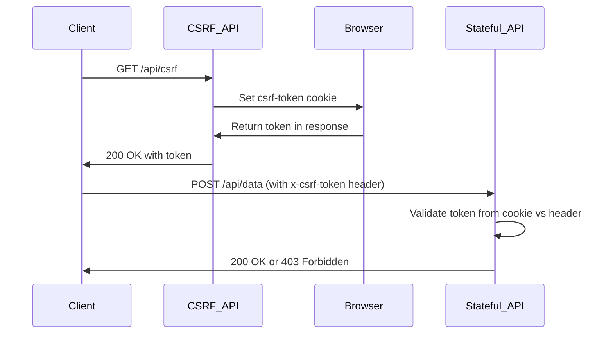
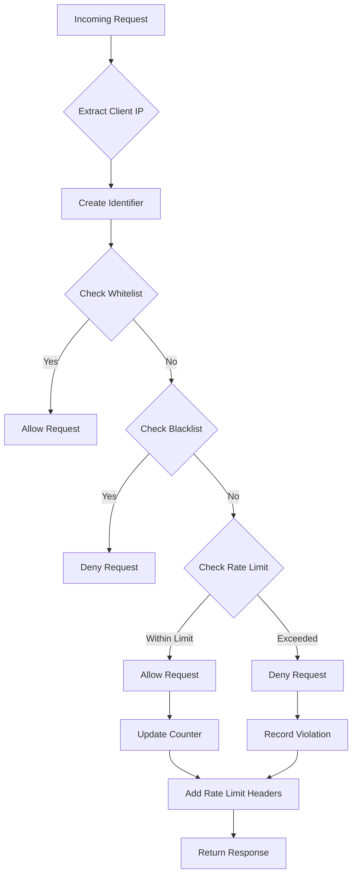
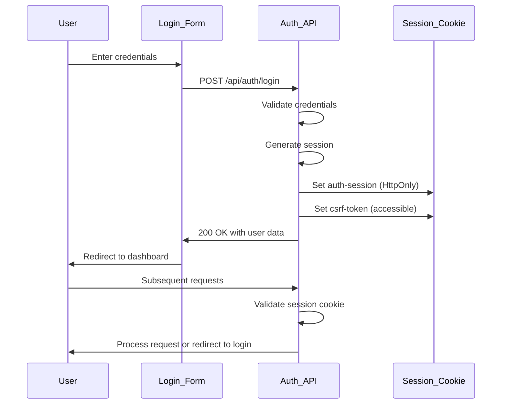
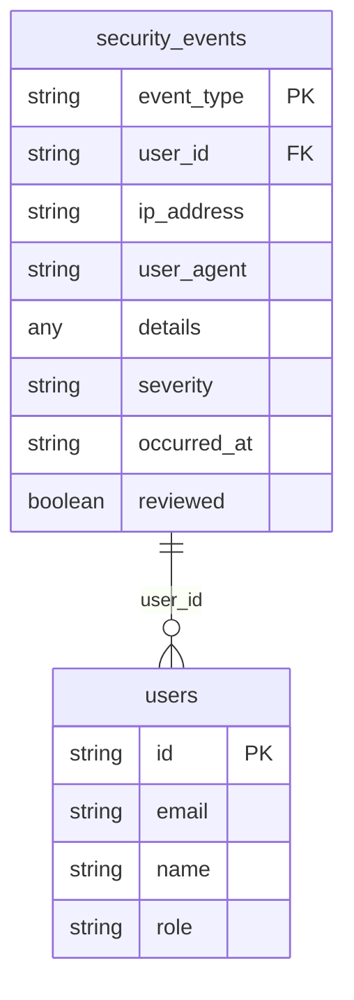
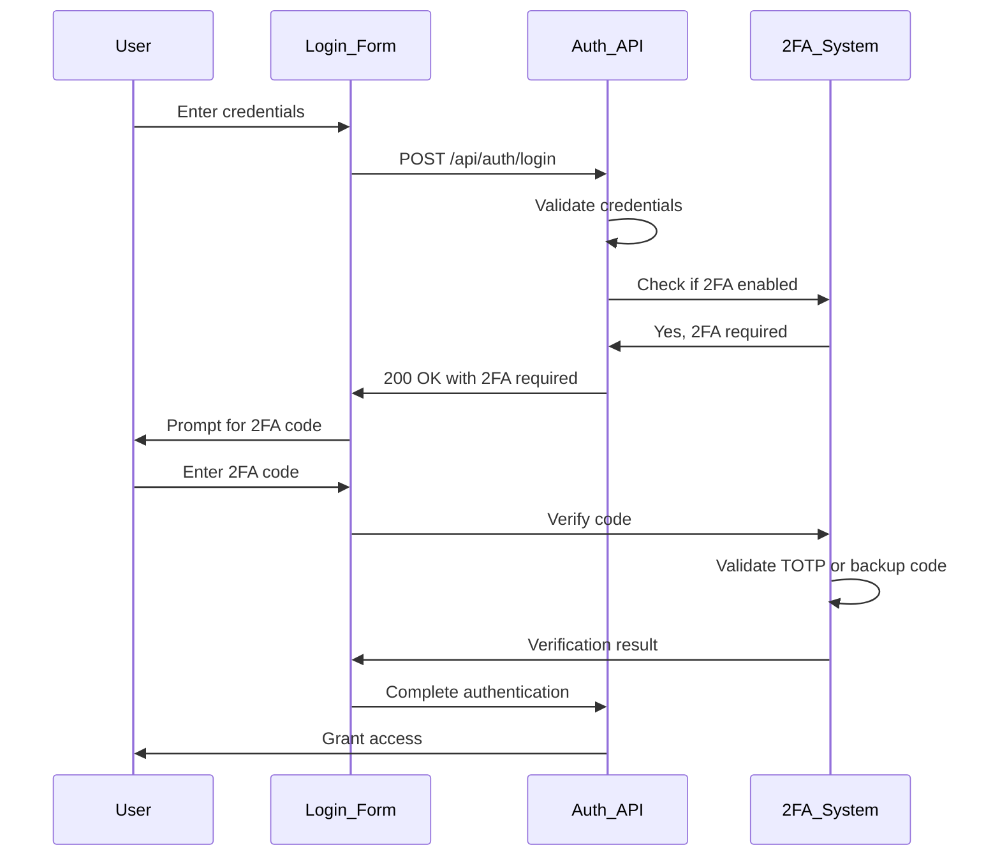
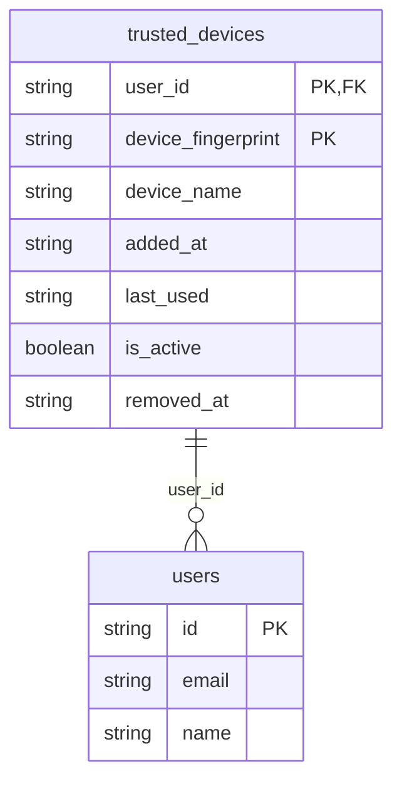

# Security Mechanisms

<cite>
**Referenced Files in This Document**   
- [csrf.ts](file://src/lib/csrf.ts)
- [security.ts](file://src/lib/security.ts)
- [rate-limit.ts](file://src/lib/rate-limit.ts)
- [rate-limit-monitor.ts](file://src/lib/rate-limit-monitor.ts)
- [auth.ts](file://convex/auth.ts)
- [security_audit.ts](file://convex/security_audit.ts)
- [two_factor_auth.ts](file://convex/two_factor_auth.ts)
- [schema.ts](file://convex/schema.ts)
- [login/route.ts](file://src/app/api/auth/login/route.ts)
- [logout/route.ts](file://src/app/api/auth/logout/route.ts)
- [session/route.ts](file://src/app/api/auth/session/route.ts)
- [csrf/route.ts](file://src/app/api/csrf/route.ts)
- [session.ts](file://src/lib/auth/session.ts)
</cite>

## Table of Contents

1. [Introduction](#introduction)
2. [CSRF Protection](#csrf-protection)
3. [Rate Limiting](#rate-limiting)
4. [Session Management](#session-management)
5. [Security Audit Logging](#security-audit-logging)
6. [Two-Factor Authentication](#two-factor-authentication)
7. [Trusted Devices Management](#trusted-devices-management)
8. [Conclusion](#conclusion)

## Introduction

Kafkasder-panel implements a comprehensive multi-layered security architecture designed to protect against common web application threats. The system employs CSRF protection, rate limiting, secure session management, input validation, and detailed security auditing to ensure robust protection of user data and application integrity. This document details the implementation of these security mechanisms, focusing on how they work together to create a secure environment for users and administrators.

## CSRF Protection

Kafkasder-panel implements token-based CSRF protection using cryptographically secure tokens to prevent cross-site request forgery attacks. The system generates and validates CSRF tokens for all state-changing operations, ensuring that requests originate from legitimate sources.

The CSRF implementation follows a two-part approach: token generation and validation. The system generates cryptographically secure tokens using Node.js's `crypto.randomBytes()` function, creating 32-byte hexadecimal strings that are resistant to prediction attacks. These tokens are stored in browser cookies with appropriate security flags to prevent unauthorized access.

**Diagram sources**

- [csrf.ts](file://src/lib/csrf.ts#L1-L90)
- [csrf/route.ts](file://src/app/api/csrf/route.ts#L1-L43)

The CSRF token endpoint (`/api/csrf`) serves as the token distribution mechanism. When a client requests a token, the system checks if a token already exists in the cookie. If not, it generates a new cryptographically secure token and sets it in a cookie with `httpOnly: false` to allow client-side JavaScript access, while maintaining `secure` and `sameSite: strict` flags for additional protection.

Token validation employs constant-time comparison to prevent timing attacks. The validation function first checks that both the provided token and expected token exist and have the same length, then performs a bitwise comparison across all characters to ensure that the operation takes the same amount of time regardless of where the mismatch occurs.

Client-side integration is handled through a fetch wrapper that automatically includes the CSRF token in requests to state-changing endpoints. The system only includes CSRF tokens in `POST`, `PUT`, `PATCH`, and `DELETE` requests, as these are the operations that modify server state and are therefore vulnerable to CSRF attacks.

**Section sources**

- [csrf.ts](file://src/lib/csrf.ts#L1-L90)
- [csrf/route.ts](file://src/app/api/csrf/route.ts#L1-L43)

## Rate Limiting

Kafkasder-panel implements a comprehensive rate limiting strategy to prevent brute force attacks and abuse of authentication endpoints. The system uses in-memory counters with configurable thresholds to limit the number of requests from individual clients within specified time windows.

The rate limiting system is built around a central `RateLimiter` class that maintains counters for different request identifiers. Each identifier is constructed from the client's IP address, HTTP method, and request path, creating a unique key for rate limiting purposes. The system supports different rate limits for various endpoint types, with stricter limits applied to authentication endpoints.

**Diagram sources**

- [security.ts](file://src/lib/security.ts#L1-L507)
- [rate-limit.ts](file://src/lib/rate-limit.ts#L1-L148)

The system implements different rate limiting profiles for various endpoint categories:

- Authentication endpoints: 10 attempts per 10 minutes
- Data modification endpoints: 50 requests per 15 minutes
- Read-only endpoints: 200 requests per 15 minutes
- Upload endpoints: 10 uploads per minute
- Search endpoints: 30 searches per minute

Authentication endpoints receive special treatment with the `skipSuccessfulRequests` and `skipFailedRequests` options enabled. This means that both successful and failed login attempts are not counted toward the rate limit, preventing attackers from locking out legitimate users through brute force attacks. Instead, a separate account lockout mechanism handles repeated failed login attempts.

The rate limiting system includes sophisticated features such as IP-based whitelisting and blacklisting, configurable through environment variables. Whitelisted IPs bypass rate limiting entirely, while blacklisted IPs are always denied access. The system also applies a premium multiplier to authenticated users, giving them higher rate limits as a reward for being authenticated.

Rate limit monitoring is implemented through the `RateLimitMonitor` class, which tracks violations and generates alerts when suspicious patterns are detected. The monitor maintains a rolling window of violations and can detect distributed attacks from multiple IP addresses or concentrated attacks on specific endpoints.

**Section sources**

- [security.ts](file://src/lib/security.ts#L1-L507)
- [rate-limit.ts](file://src/lib/rate-limit.ts#L1-L148)
- [rate-limit-monitor.ts](file://src/lib/rate-limit-monitor.ts#L1-L303)

## Session Management

Kafkasder-panel implements secure session management using HttpOnly cookies to protect against session hijacking and XSS attacks. The system creates cryptographically secure session identifiers and stores session data server-side, with only the session ID transmitted to the client.

When a user successfully authenticates, the system creates a session object containing the user ID, session ID, and expiration timestamp. This object is serialized to JSON and stored in an HttpOnly cookie named `auth-session`. The HttpOnly flag prevents client-side JavaScript from accessing the cookie, mitigating the risk of XSS attacks stealing session tokens.

**Diagram sources**

- [login/route.ts](file://src/app/api/auth/login/route.ts#L1-L231)
- [session.ts](file://src/lib/auth/session.ts#L1-L198)

Session cookies are configured with multiple security flags:

- `httpOnly: true` to prevent JavaScript access
- `secure: true` in production to ensure transmission over HTTPS only
- `sameSite: strict` to prevent CSRF attacks
- Appropriate `maxAge` based on the user's "remember me" preference

The system implements session expiration based on both absolute and sliding windows. Regular sessions expire after 24 hours of inactivity, while "remember me" sessions last for 30 days. The session validation endpoint (`/api/auth/session`) checks the expiration timestamp and clears expired cookies automatically.

Session management is integrated with CSRF protection by setting both the `auth-session` and `csrf-token` cookies during login. This ensures that users have both a secure session token and a CSRF token available for subsequent requests. During logout, the system clears both cookies by setting them with an immediate expiration time.

The session system includes robust error handling for invalid or expired sessions. When a session validation fails, the system returns a 401 Unauthorized response and clears the invalid session cookie to prevent repeated failed validation attempts.

**Section sources**

- [login/route.ts](file://src/app/api/auth/login/route.ts#L1-L231)
- [logout/route.ts](file://src/app/api/auth/logout/route.ts#L1-L73)
- [session/route.ts](file://src/app/api/auth/session/route.ts#L1-L65)
- [session.ts](file://src/lib/auth/session.ts#L1-L198)

## Security Audit Logging

Kafkasder-panel maintains comprehensive security audit logs in the `security_events` collection to track authentication activities, permission denials, and suspicious behavior. The system logs critical security events with detailed contextual information for monitoring and forensic analysis.

The audit logging system captures a wide range of security-related events, including:

- Login attempts (success and failure)
- Logout operations
- Permission denials
- Suspicious activities
- Password changes
- Two-factor authentication events
- Data access and modification

**Diagram sources**

- [schema.ts](file://convex/schema.ts#L659-L689)
- [security_audit.ts](file://convex/security_audit.ts#L1-L44)

Each security event includes essential metadata such as the event type, user ID (when available), IP address, user agent string, severity level, and timestamp. The severity level is categorized as low, medium, high, or critical, allowing for prioritized review of critical security incidents.

The system implements structured event details for different event types. For example, login failure events include the reason for failure, while permission denial events specify the requested action and resource. This structured approach enables effective filtering and analysis of security events.

Security events are stored in the Convex database, leveraging its indexing capabilities for efficient querying. The system creates indexes on user ID, event type, and occurrence timestamp to support fast retrieval of relevant events during security investigations.

The audit logging system provides query capabilities to retrieve security events based on various criteria, including user, event type, severity, and date range. This enables security administrators to investigate specific incidents or conduct periodic security reviews.

The system also implements compliance reporting features that generate summary reports of security events over specified time periods. These reports include metrics such as total security events, critical events, and event distribution by type, providing valuable insights into the security posture of the application.

**Section sources**

- [security_audit.ts](file://convex/security_audit.ts#L1-L44)
- [schema.ts](file://convex/schema.ts#L659-L689)

## Two-Factor Authentication

Kafkasder-panel implements a robust two-factor authentication (2FA) system to enhance account security beyond traditional password-based authentication. The system supports time-based one-time passwords (TOTP) and backup codes, providing multiple layers of protection against unauthorized access.

The 2FA implementation is managed through the `two_factor_settings` collection, which stores user-specific 2FA configurations including the TOTP secret, backup codes, and enrollment status. When a user enables 2FA, the system generates a cryptographically secure secret key and stores it encrypted in the database.

**Diagram sources**

- [two_factor_auth.ts](file://convex/two_factor_auth.ts#L1-L48)
- [schema.ts](file://convex/schema.ts#L752-L785)

The 2FA workflow begins after successful password authentication. If 2FA is enabled for the user, the system prompts for a verification code. Users can provide either a time-based one-time password generated by an authenticator app or a backup code.

Backup codes are generated when a user enables 2FA, providing alternative access methods when the primary authenticator is unavailable. Each backup code can only be used once, and the system tracks usage status to prevent replay attacks. Users are warned when they have fewer than three backup codes remaining, prompting them to generate new ones.

The system logs all 2FA-related activities in the security audit log, including successful and failed verification attempts, enabling and disabling of 2FA, and backup code usage. This comprehensive logging enables detection of suspicious patterns such as repeated failed 2FA attempts or unexpected 2FA configuration changes.

Users can manage their 2FA settings through a dedicated interface that allows them to:

- Enable or disable 2FA
- Regenerate backup codes
- View enrollment status and last verification time
- Check remaining backup codes

The 2FA implementation follows security best practices by requiring verification of the current 2FA code before allowing 2FA to be disabled, preventing attackers from removing 2FA protection after gaining partial access to an account.

**Section sources**

- [two_factor_auth.ts](file://convex/two_factor_auth.ts#L1-L48)
- [schema.ts](file://convex/schema.ts#L752-L785)

## Trusted Devices Management

Kafkasder-panel includes a trusted devices management system that allows users to bypass 2FA prompts on devices they frequently use. This feature improves user experience while maintaining security by requiring initial 2FA verification before marking a device as trusted.

The trusted devices system uses device fingerprinting to uniquely identify client devices. When a user successfully completes 2FA on a device, they have the option to mark it as trusted. The system then stores a device fingerprint in the `trusted_devices` collection, associating it with the user account.

**Diagram sources**

- [schema.ts](file://convex/schema.ts#L783-L812)
- [two_factor_auth.ts](file://convex/two_factor_auth.ts#L266-L316)

The device fingerprint is generated from a combination of browser and system characteristics, creating a unique identifier for each device. When a user accesses the application from a trusted device, the system recognizes the fingerprint and skips the 2FA prompt, allowing for seamless authentication.

Users can manage their trusted devices through a security settings interface that displays all currently trusted devices, including the device name, addition date, and last usage time. Users can remove trust from any device at any time, which immediately requires 2FA verification on the next login from that device.

The system implements automatic trust expiration after a configurable period of inactivity, ensuring that devices that are no longer in use eventually require re-verification. This balances convenience with security by preventing indefinite trust for devices that may have been lost or compromised.

Trusted devices management is integrated with the security audit system, logging all additions and removals of trusted devices. This provides an audit trail of device trust changes and helps detect suspicious activity such as multiple trusted device registrations from different locations in a short time period.

**Section sources**

- [two_factor_auth.ts](file://convex/two_factor_auth.ts#L266-L316)
- [schema.ts](file://convex/schema.ts#L783-L812)

## Conclusion

Kafkasder-panel implements a comprehensive, multi-layered security architecture that effectively protects against common web application threats. The system combines CSRF protection, rate limiting, secure session management, detailed audit logging, two-factor authentication, and trusted devices management to create a robust security posture.

The CSRF protection system prevents cross-site request forgery attacks through cryptographically secure tokens and proper cookie configuration. Rate limiting safeguards authentication endpoints from brute force attacks while allowing legitimate users to access the system. Secure session management with HttpOnly cookies protects against session hijacking and XSS attacks.

The security audit logging system provides comprehensive visibility into authentication activities and security events, enabling effective monitoring and incident response. Two-factor authentication adds an additional layer of protection beyond passwords, while trusted devices management balances security with user convenience.

These security mechanisms work together to create a defense-in-depth strategy that protects user accounts and sensitive data. The system's modular design allows for future enhancements and adaptation to emerging security threats while maintaining a positive user experience.
