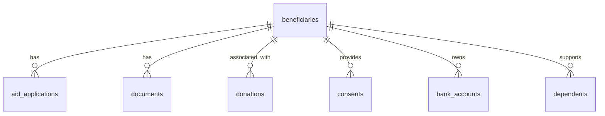

# Beneficiaries Data Model

<cite>
**Referenced Files in This Document**   
- [schema.ts](file://convex/schema.ts)
- [beneficiaries.ts](file://convex/beneficiaries.ts)
- [beneficiary.ts](file://src/types/beneficiary.ts)
- [database.ts](file://src/types/database.ts)
- [beneficiary-validation.test.ts](file://src/__tests__/lib/beneficiary-validation.test.ts)
- [beneficiaryForm.tsx](file://src/components/forms/BeneficiaryForm.tsx)
- [page.tsx](file://src/app/(dashboard)/yardim/ihtiyac-sahipleri/[id]/page.tsx)
- [route.ts](file://src/app/api/beneficiaries/route.ts)
</cite>

## Table of Contents

1. [Introduction](#introduction)
2. [Entity Structure](#entity-structure)
3. [Field Definitions](#field-definitions)
4. [Indexing Strategy](#indexing-strategy)
5. [Search Configuration](#search-configuration)
6. [Data Relationships](#data-relationships)
7. [Data Lifecycle Management](#data-lifecycle-management)
8. [Performance Considerations](#performance-considerations)
9. [Normalization Concerns](#normalization-concerns)

## Introduction

The beneficiaries collection in the Kafkasder-panel application serves as the central repository for comprehensive information about aid recipients. This data model captures extensive personal, family, health, financial, and social information across 155 fields, enabling detailed assessment and management of beneficiaries. The collection is designed to support complex queries, reporting, and decision-making processes for social assistance programs. This documentation provides a comprehensive overview of the entity structure, field definitions, indexing strategy, search capabilities, relationships with other collections, data lifecycle management, and performance considerations for this critical component of the application.

**Section sources**

- [schema.ts](file://convex/schema.ts#L43-L152)

## Entity Structure

The beneficiaries collection is structured as a wide table containing comprehensive information about aid recipients. The entity is defined in the Convex database schema with a rich set of fields organized into logical categories including personal information, family details, health status, financial situation, and social context. The entity serves as the primary record for each beneficiary and acts as a hub connecting to related data in other collections. The structure follows a denormalized approach to optimize query performance and support complex filtering operations across multiple dimensions of beneficiary data.

````mermaid
erDiagram
beneficiaries {
string _id PK
string name
string tc_no UK
string phone
string email
string birth_date
string gender
string nationality
string religion
string marital_status
string address
string city
string district
string neighborhood
number family_size
number children_count
number orphan_children_count
number elderly_count
number disabled_count
string income_level
string income_source
boolean has_debt
string housing_type
boolean has_vehicle
string health_status
boolean has_chronic_illness
string chronic_illness_detail
boolean has_disability
string disability_detail
boolean has_health_insurance
string regular_medication
string education_level
string occupation
string employment_status
string aid_type
number totalAidAmount
string aid_duration
string priority
string reference_name
string reference_phone
string reference_relation
string application_source
string notes
boolean previous_aid
boolean other_organization_aid
boolean emergency
string contact_preference
string status
string approval_status
string approved_by
string approved_at
}
beneficiaries ||--o{ documents : "has"
beneficiaries ||--o{ aid_applications : "receives"
beneficiaries ||--o{ donations : "associated_with"
beneficiaries ||--o{ consents : "provides"
beneficiaries ||--o{ bank_accounts : "owns"
beneficiaries ||--o{ dependents : "supports"
</`
**Diagram sources**
- [schema.ts](file://convex/schema.ts#L43-L152)
- [schema.ts](file://convex/schema.ts#L834-L892)
**Section sources**
- [schema.ts](file://convex/schema.ts#L43-L152)
- [beneficiary.ts](file://src/types/beneficiary.ts#L392-L506)
- [database.ts](file://src/types/database.ts#L75-L145)
## Field Definitions
The beneficiaries collection contains 155 fields organized into logical categories. The fields are defined with specific data types, constraints, and validation rules to ensure data integrity and consistency.
### Personal Information
Personal information fields capture basic identifying details of the beneficiary.
| Field Name | Data Type | Constraints | Validation Rules |
|-----------|---------|-----------|----------------|
| name | string | Required | Minimum 2 characters |
| tc_no | string | Required, Unique | 11 digits, valid TC algorithm |
| phone | string | Required | Valid Turkish phone format |
| email | string | Optional | Valid email format |
| birth_date | string | Optional | Valid date, not in future |
| gender | string | Optional | Enum: ERKEK, KADIN |
| nationality | string | Optional | Minimum 2 characters |
| religion | string | Optional | Enum values |
| marital_status | string | Optional | Enum: BEKAR, EVLI, BOŞANMIŞ, DUL |
### Family Information
Family information fields capture details about the beneficiary's household and dependents.
| Field Name | Data Type | Constraints | Validation Rules |
|-----------|---------|-----------|----------------|
| family_size | number | Required | Minimum 1, Maximum 20 |
| children_count | number | Optional | Minimum 0, Maximum 50 |
| orphan_children_count | number | Optional | Minimum 0, Maximum 50 |
| elderly_count | number | Optional | Minimum 0, Maximum 50 |
| disabled_count | number | Optional | Minimum 0, Maximum 50 |
| address | string | Required | Minimum 10 characters |
| city | string | Required | Valid city from enum |
| district | string | Required | Maximum 100 characters |
| neighborhood | string | Required | Maximum 100 characters |
### Financial Information
Financial information fields capture the economic situation of the beneficiary.
| Field Name | Data Type | Constraints | Validation Rules |
|-----------|---------|-----------|----------------|
| income_level | string | Optional | Enum values |
| income_source | string | Optional | Maximum 200 characters |
| has_debt | boolean | Optional | Default false |
| debt_amount | number | Optional | Minimum 0 |
| has_vehicle | boolean | Optional | Default false |
| housing_type | string | Optional | Enum values |
| monthly_income | number | Optional | Minimum 0, Maximum 1,000,000 |
| monthly_expense | number | Optional | Minimum 0, Maximum 1,000,000 |
| social_security | string | Optional | Enum: VAR, YOK |
| work_status | string | Optional | Enum values |
| occupation | string | Optional | Maximum 200 characters |
| sector | string | Optional | Enum values |
| job_group | string | Optional | Enum values |
### Health Information
Health information fields capture the medical status and needs of the beneficiary.
| Field Name | Data Type | Constraints | Validation Rules |
|-----------|---------|-----------|----------------|
| health_status | string | Optional | Maximum 500 characters |
| has_chronic_illness | boolean | Optional | Default false |
| chronic_illness_detail | string | Conditional | Required if has_chronic_illness is true, minimum 3 characters |
| has_disability | boolean | Optional | Default false |
| disability_detail | string | Conditional | Required if has_disability is true, minimum 3 characters |
| has_health_insurance | boolean | Optional | Default false |
| regular_medication | string | Optional | Maximum 200 characters |
| blood_type | string | Optional | Enum values |
| smoking_status | string | Optional | Enum: ICER, ICMEZ, BIRAKTI |
| diseases | array | Optional | Array of Disease enum values |
| emergency_contacts | array | Optional | Maximum 2 contacts, each with name, relationship, and phone |
### Social and Application Information
Social and application information fields capture contextual details about the beneficiary's situation and aid applications.
| Field Name | Data Type | Constraints | Validation Rules |
|-----------|---------|-----------|----------------|
| education_level | string | Optional | Maximum 100 characters |
| occupation | string | Optional | Maximum 200 characters |
| employment_status | string | Optional | Maximum 200 characters |
| aid_type | string | Optional | Maximum 200 characters |
| totalAidAmount | number | Optional | Minimum 0 |
| aid_duration | string | Optional | Maximum 200 characters |
| priority | string | Optional | Maximum 200 characters |
| reference_name | string | Optional | Maximum 200 characters |
| reference_phone | string | Optional | Valid phone format |
| reference_relation | string | Optional | Maximum 200 characters |
| application_source | string | Optional | Maximum 200 characters |
| notes | string | Optional | Maximum 2,000 characters |
| previous_aid | boolean | Optional | Default false |
| other_organization_aid | boolean | Optional | Default false |
| emergency | boolean | Optional | Default false |
| contact_preference | string | Optional | Maximum 200 characters |
| status | string | Required | Enum: TASLAK, AKTIF, PASIF, SILINDI |
| approval_status | string | Optional | Enum: pending, approved, rejected |
| approved_by | string | Optional | Maximum 200 characters |
| approved_at | string | Optional | Valid ISO 8601 date |
**Section sources**
- [schema.ts](file://convex/schema.ts#L43-L152)
- [beneficiary.ts](file://src/types/beneficiary.ts#L392-L506)
- [database.ts](file://src/types/database.ts#L75-L145)
- [beneficiary-validation.test.ts](file://src/__tests__/lib/beneficiary-validation.test.ts#L1-L274)
## Indexing Strategy
The beneficiaries collection employs a strategic indexing approach to optimize query performance across common access patterns. Three primary indexes have been implemented to support efficient filtering and retrieval operations.
### by_tc_no Index
The by_tc_no index is created on the tc_no field to ensure rapid lookup of beneficiaries by their Turkish National Identity Number. This unique index enables O(1) lookup time for identity verification and duplicate prevention during beneficiary creation. The index is critical for maintaining data integrity by preventing the creation of duplicate records with the same TC number.
### by_status Index
The by_status index is created on the status field to facilitate efficient filtering of beneficiaries by their current status (TASLAK, AKTIF, PASIF, SILINDI). This index supports common administrative operations such as listing active beneficiaries, identifying draft records for completion, or retrieving archived records for auditing purposes. The index enables fast pagination and sorting operations when retrieving beneficiaries filtered by status.
### by_city Index
The by_city index is created on the city field to optimize geographical queries and reporting. This index supports regional analysis, resource allocation by location, and localized service delivery planning. It enables efficient retrieval of all beneficiaries within a specific city, which is essential for field operations, regional reporting, and targeted assistance programs.
```mermaid
erDiagram
  beneficiaries {
    string tc_no "Indexed, Unique"
    string status "Indexed"
    string city "Indexed"
  }
````

**Diagram sources**

- [schema.ts](file://convex/schema.ts#L155-L158)

**Section sources**

- [schema.ts](file://convex/schema.ts#L155-L158)
- [beneficiaries.ts](file://convex/beneficiaries.ts#L15-L38)

## Search Configuration

The beneficiaries collection includes a search index configuration to support full-text search capabilities across key fields. The search index is configured to optimize user experience in finding beneficiaries through partial or fuzzy matching.

### by_search Index

The by_search index is configured on the name field with additional filter fields including tc_no, phone, and email. This configuration enables users to search for beneficiaries using any of these identifying attributes. The search functionality supports partial matching, making it easier to locate records even with incomplete information. The index is designed to provide fast, responsive search results while maintaining relevance through field weighting and filtering capabilities.

The search index is particularly valuable in user interfaces where staff need to quickly locate beneficiary records during interactions or when processing applications. It reduces the cognitive load on users by allowing flexible search terms and provides immediate feedback on matching records.

```mermaid
graph TD
A[Search Query] --> B{Search Index}
B --> C[name field]
B --> D[tc_no field]
B --> E[phone field]
B --> F[email field]
C --> G[Search Results]
D --> G
E --> G
F --> G
```

**Diagram sources**

- [schema.ts](file://convex/schema.ts#L159-L162)

**Section sources**

- [schema.ts](file://convex/schema.ts#L159-L162)
- [beneficiaries.ts](file://convex/beneficiaries.ts#L18-L22)

## Data Relationships

The beneficiaries collection serves as the central hub in the application's data model, establishing relationships with several related collections that store specialized information.

### Related Collections

The beneficiaries collection maintains explicit relationships with the following collections:

- **aid_applications**: Tracks applications for aid submitted by or on behalf of beneficiaries
- **documents**: Stores scanned documents and files associated with beneficiaries
- **donations**: Records donations that may be linked to specific beneficiaries
- **consents**: Stores consent declarations provided by beneficiaries
- **bank_accounts**: Manages bank account information for beneficiaries
- **dependents**: Tracks individuals dependent on the beneficiary

### Relationship Implementation

Relationships are implemented using foreign key references, primarily through the beneficiary's document ID. Related collections contain a beneficiary_id field that references the \_id field in the beneficiaries collection. This approach enables efficient joins and queries across related data while maintaining referential integrity.

The relationship with the aid_applications collection is particularly important, as it tracks the history of assistance requests and approvals for each beneficiary. Similarly, the documents collection stores critical supporting documentation such as identification, medical records, and financial statements that validate the beneficiary's situation.



**Diagram sources**

- [schema.ts](file://convex/schema.ts#L43-L152)
- [schema.ts](file://convex/schema.ts#L834-L892)

**Section sources**

- [schema.ts](file://convex/schema.ts#L43-L152)
- [schema.ts](file://convex/schema.ts#L834-L892)
- [beneficiaries.ts](file://convex/beneficiaries.ts#L64-L86)

## Data Lifecycle Management

The beneficiaries collection implements a comprehensive data lifecycle management strategy to ensure data quality, compliance, and system performance.

### Status Transitions

Beneficiaries progress through a defined lifecycle represented by the status field, which can have one of four values: TASLAK (Draft), AKTIF (Active), PASIF (Inactive), or SILINDI (Deleted). This state machine governs the beneficiary's eligibility for services and determines their visibility in various system views.

- **TASLAK**: Records in draft status are incomplete and not eligible for aid programs
- **AKTIF**: Active beneficiaries are eligible for services and assistance
- **PASIF**: Inactive beneficiaries are temporarily suspended from programs
- **SILINDI**: Deleted records are archived and no longer visible in standard views

### Retention Policies

The application implements retention policies to manage data over time. While the primary retention mechanism is the status field, additional considerations include:

- Draft records (TASLAK) may be automatically purged after a configurable period of inactivity
- Inactive records (PASIF) are retained for auditing and historical analysis
- Deleted records (SILINDI) are archived rather than physically removed to maintain audit trails
- Historical data is preserved to support longitudinal analysis of beneficiary outcomes

### Data Integrity

Data integrity is maintained through several mechanisms:

- Unique constraint on tc_no to prevent duplicate identities
- Validation rules enforced at both the application and database levels
- Audit trails for record modifications
- Referential integrity with related collections

**Section sources**

- [schema.ts](file://convex/schema.ts#L140-L145)
- [beneficiaries.ts](file://convex/beneficiaries.ts#L138-L143)
- [route.ts](file://src/app/api/beneficiaries/route.ts#L49-L73)

## Performance Considerations

The beneficiaries collection is optimized for performance given its size and complexity, with considerations for query patterns, indexing, and data access.

### Query Optimization

The collection is designed to support common query patterns efficiently:

- Filtering by status for administrative workflows
- Searching by name, TC number, or contact information
- Geographical queries by city or region
- Complex filtering combinations for needs assessment

The use of targeted indexes on tc_no, status, and city fields ensures that these common query patterns perform optimally. The search index further enhances performance for text-based searches across multiple fields.

### Pagination Strategy

For large result sets, the application implements server-side pagination with configurable limits. The list query accepts skip and limit parameters to enable efficient retrieval of paginated results. This approach prevents performance degradation when retrieving large numbers of records and reduces memory usage on both server and client.

### Caching Considerations

Frequently accessed beneficiary records, particularly active beneficiaries, may benefit from caching strategies to reduce database load and improve response times. The application architecture supports caching at multiple levels, including:

- Server-side caching of frequently accessed records
- Client-side caching in the React application
- CDN caching for static beneficiary data

### Scalability

As the collection grows to accommodate 155 fields and potentially large numbers of records, scalability considerations include:

- Monitoring index performance and size
- Optimizing query patterns to use indexed fields
- Implementing data archiving strategies for inactive records
- Considering partitioning strategies for very large datasets

**Section sources**

- [beneficiaries.ts](file://convex/beneficiaries.ts#L15-L59)
- [route.ts](file://src/app/api/beneficiaries/route.ts#L85-L105)
- [page.tsx](<file://src/app/(dashboard)/yardim/ihtiyac-sahipleri/[id]/page.tsx#L289-L293>)

## Normalization Concerns

The beneficiaries collection represents a wide table design that intentionally denormalizes data for performance and usability reasons, which presents several normalization concerns that must be managed.

### Denormalization Trade-offs

The collection combines data that might otherwise be normalized into separate tables, such as personal information, financial details, health status, and social context. This denormalization improves query performance by reducing the need for joins but introduces potential issues:

- **Data Redundancy**: Similar information may be repeated across fields
- **Update Anomalies**: Changes to related data require updates in multiple places
- **Insertion Anomalies**: Incomplete data may be entered if validation is not comprehensive
- **Deletion Anomalies**: Removing related information may leave orphaned data

### Data Consistency

Maintaining data consistency across the 155 fields requires robust validation and business rules:

- Conditional validation (e.g., requiring Mernis check when TC number is provided)
- Cross-field validation (e.g., ensuring age is consistent with birth date)
- Business rule enforcement (e.g., preventing minors from being marked as married)

### Alternative Approaches

While the current design prioritizes query performance and simplicity of access, alternative normalized approaches could include:

- Splitting the entity into specialized sub-entities (personal, financial, health)
- Using embedded documents or arrays for related data
- Implementing a more normalized relational structure

However, these alternatives would likely impact query performance and increase complexity in the application layer, which may not be justified given the access patterns and performance requirements of the system.

**Section sources**

- [schema.ts](file://convex/schema.ts#L43-L152)
- [beneficiary.ts](file://src/types/beneficiary.ts#L392-L506)
- [beneficiary-validation.test.ts](file://src/__tests__/lib/beneficiary-validation.test.ts#L1-L274)
