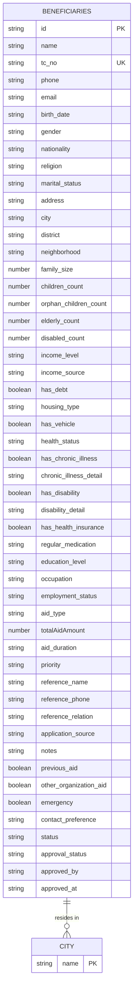

# Contact Information and Address

<cite>
**Referenced Files in This Document**   
- [beneficiaries.ts](file://convex/beneficiaries.ts)
- [schema.ts](file://convex/schema.ts)
- [beneficiary.ts](file://src/lib/validations/beneficiary.ts)
- [AddressInfoStep.tsx](file://src/components/forms/beneficiary-steps/AddressInfoStep.tsx)
- [beneficiary.ts](file://src/types/beneficiary.ts)
- [beneficiaries-extended.json](file://src/data/mock/beneficiaries-extended.json)
</cite>

## Table of Contents

1. [Introduction](#introduction)
2. [Contact Information Fields](#contact-information-fields)
3. [Address Fields](#address-fields)
4. [Data Validation and Constraints](#data-validation-and-constraints)
5. [Indexing Strategy](#indexing-strategy)
6. [Usage in Operations](#usage-in-operations)
7. [Conclusion](#conclusion)

## Introduction

This document provides comprehensive documentation for the contact information and address fields in the beneficiaries collection of the Kafkasder-panel system. The data model supports critical operations including communication with beneficiaries, field visits, and geographic analysis of beneficiary distribution. The fields are designed with specific data types, validation rules, and constraints to ensure data integrity and support operational planning. This documentation details the structure, validation, and usage of these fields, focusing on mobilePhone, landlinePhone, email, country, city, district, neighborhood, and address fields.

**Section sources**

- [schema.ts](file://convex/schema.ts#L47-L158)
- [beneficiary.ts](file://src/types/beneficiary.ts#L409-L426)

## Contact Information Fields

The contact information fields in the beneficiaries collection include mobilePhone, landlinePhone, and email. These fields are essential for communication with beneficiaries and are subject to specific validation rules to ensure accuracy and reliability.

- **mobilePhone**: A string field that stores the mobile phone number of the beneficiary. It is validated to ensure it follows the Turkish mobile phone format (E.164), starting with +90 or 5 followed by nine digits.
- **landlinePhone**: A string field that stores the landline phone number of the beneficiary. It is also validated using the same E.164 format as mobilePhone.
- **email**: A string field that stores the email address of the beneficiary. It is validated to ensure it is a properly formatted email address.

These fields are optional but recommended for active beneficiaries to facilitate communication. The validation ensures that if provided, the contact information is in a usable format.

**Section sources**

- [schema.ts](file://convex/schema.ts#L53-L55)
- [beneficiary.ts](file://src/lib/validations/beneficiary.ts#L169-L173)
- [beneficiaries-extended.json](file://src/data/mock/beneficiaries-extended.json#L15-L19)

## Address Fields

The address fields in the beneficiaries collection include country, city, district, neighborhood, and address. These fields are structured to support geographic analysis and field visits.

- **country**: A string field that stores the country of residence. It uses the Country enum, with TURKIYE as the primary value, but supports other countries for refugees and migrants.
- **city**: A string field that stores the city of residence. It uses the City enum, which includes all 81 provinces of Turkey, enabling location-based filtering.
- **district**: A string field that stores the district within the city. It is limited to 100 characters.
- **neighborhood**: A string field that stores the neighborhood or village. It is also limited to 100 characters.
- **address**: A string field that stores the full address, including street, building, and apartment details. It is limited to 500 characters to accommodate detailed address information.

These fields are designed to support hierarchical geographic filtering and reporting, with city being a key field for indexing.

**Section sources**

- [schema.ts](file://convex/schema.ts#L68-L74)
- [beneficiary.ts](file://src/types/beneficiary.ts#L421-L425)
- [AddressInfoStep.tsx](file://src/components/forms/beneficiary-steps/AddressInfoStep.tsx#L38-L89)
- [beneficiaries-extended.json](file://src/data/mock/beneficiaries-extended.json#L23-L27)

## Data Validation and Constraints

The contact and address fields are subject to strict validation rules to ensure data quality and consistency. These rules are implemented both at the schema level and in the form validation logic.

- **Phone Validation**: Both mobilePhone and landlinePhone are validated using a regex pattern that ensures they follow the Turkish E.164 format. The pattern /^(\+905\d{9}|5\d{9})$/ ensures the number starts with +905 or 5 followed by nine digits.
- **Email Validation**: The email field is validated using a standard email regex pattern to ensure it is a properly formatted email address.
- **Enum Constraints**: The country and city fields are constrained by the Country and City enums, respectively. This ensures that only valid, predefined values are entered.
- **String Length Constraints**: The district, neighborhood, and address fields have maximum length constraints of 100, 100, and 500 characters, respectively, to prevent overly long entries.

These validation rules are enforced in the beneficiarySchema in the validation library, ensuring that data entered through the user interface meets the required standards.

**Section sources**

- [beneficiary.ts](file://src/lib/validations/beneficiary.ts#L64-L74)
- [beneficiary.ts](file://src/lib/validations/beneficiary.ts#L185-L189)
- [beneficiary.ts](file://src/types/beneficiary.ts#L183-L323)

## Indexing Strategy

The beneficiaries collection uses an indexing strategy to optimize location-based filtering and reporting. The by_city index is specifically designed to support queries that filter beneficiaries by city.

- **by_city Index**: This index is created on the city field and is used in queries to efficiently retrieve beneficiaries residing in a specific city. It is utilized in the list query when the city parameter is provided, allowing for fast filtering and pagination of results.
- **Query Usage**: When a user requests a list of beneficiaries in a specific city, the system uses the withIndex('by_city') method to leverage this index, significantly improving query performance for location-based operations.

This indexing strategy is critical for generating reports on beneficiary distribution across different cities and for planning field visits based on geographic concentration.

**Diagram sources**

- [schema.ts](file://convex/schema.ts#L158)
- [beneficiaries.ts](file://convex/beneficiaries.ts#L34)

**Section sources**

- [schema.ts](file://convex/schema.ts#L158)
- [beneficiaries.ts](file://convex/beneficiaries.ts#L31-L38)

## Usage in Operations

The contact and address data is integral to the organization's operations, supporting communication, field visits, and geographic analysis.

- **Communication**: The mobilePhone, landlinePhone, and email fields are used to contact beneficiaries for updates, appointments, and emergency notifications. The contact_preference field indicates the preferred method of contact.
- **Field Visits**: The address fields (city, district, neighborhood, address) are used to plan and schedule field visits by staff. The geographic hierarchy allows for efficient routing and clustering of visits.
- **Geographic Analysis**: The city field, supported by the by_city index, enables reporting on the distribution of beneficiaries across different regions. This analysis helps in resource allocation and identifying areas with high concentrations of beneficiaries.
- **Operational Planning**: The combination of contact and address data supports comprehensive operational planning, from communication strategies to field operations and resource distribution.

This data is also used in conjunction with other fields, such as status and category, to prioritize and target aid delivery effectively.

**Section sources**

- [beneficiaries.ts](file://convex/beneficiaries.ts#L15-L59)
- [AddressInfoStep.tsx](file://src/components/forms/beneficiary-steps/AddressInfoStep.tsx)
- [beneficiaries-extended.json](file://src/data/mock/beneficiaries-extended.json)

## Conclusion

The contact information and address fields in the beneficiaries collection are well-structured to support the organization's operational needs. With robust validation, clear constraints, and an efficient indexing strategy, these fields ensure data quality and enable effective communication, field visits, and geographic analysis. The use of enums for country and city, combined with string length limits and format validation for contact fields, provides a solid foundation for reliable data management. The by_city index optimizes location-based queries, facilitating reporting and operational planning. This comprehensive data model supports the organization's mission to deliver aid efficiently and equitably.
