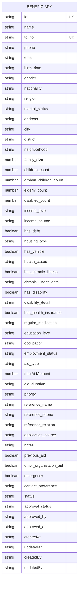
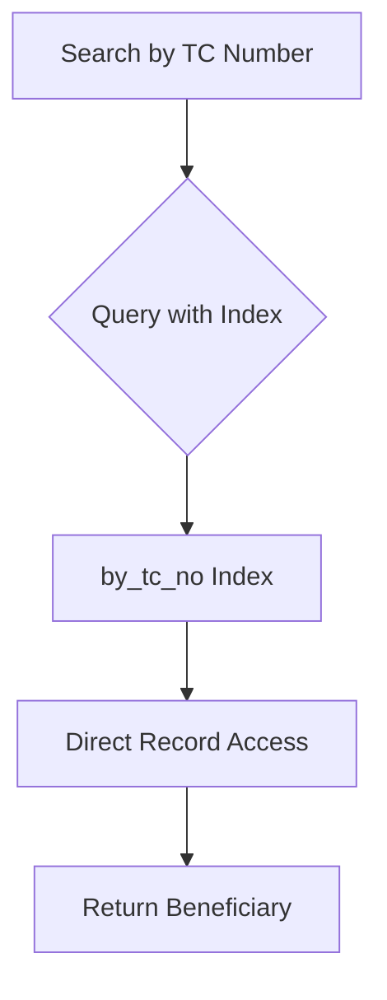
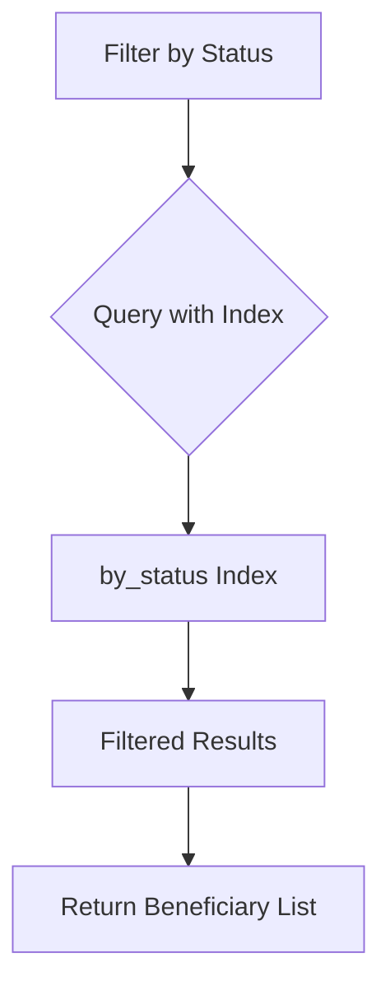
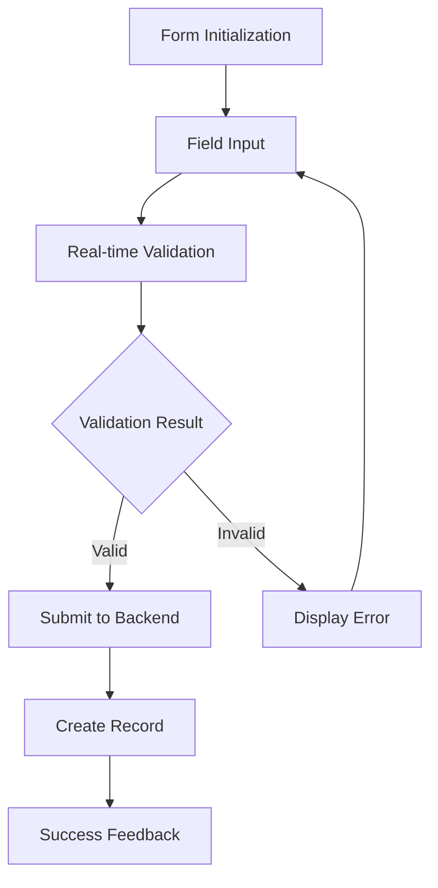
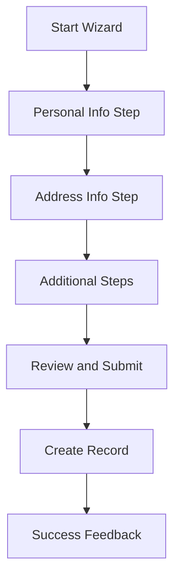

# Core Beneficiary Information

<cite>
**Referenced Files in This Document**   
- [beneficiaries.ts](file://convex/beneficiaries.ts)
- [schema.ts](file://convex/schema.ts)
- [beneficiary.ts](file://src/types/beneficiary.ts)
- [BeneficiaryForm.tsx](file://src/components/forms/BeneficiaryForm.tsx)
- [BeneficiaryFormWizard.tsx](file://src/components/forms/BeneficiaryFormWizard.tsx)
- [beneficiary.ts](file://src/lib/validations/beneficiary.ts)
</cite>

## Table of Contents

1. [Introduction](#introduction)
2. [Data Model Overview](#data-model-overview)
3. [Core Field Definitions](#core-field-definitions)
4. [Indexing Strategy](#indexing-strategy)
5. [Frontend-Backend Type Relationship](#frontend-backend-type-relationship)
6. [Data Entry and Validation](#data-entry-and-validation)
7. [Conclusion](#conclusion)

## Introduction

The Kafkasder-panel application manages beneficiary information through a well-defined data model that captures essential personal, contact, and status information. This documentation provides a comprehensive overview of the core beneficiary data structure, including field definitions, validation rules, indexing strategy, and the relationship between frontend and backend implementations. The system is designed to ensure data integrity, efficient querying, and a seamless user experience for data entry and management.

## Data Model Overview

The beneficiary data model in Kafkasder-panel is implemented using Convex, a backend-as-a-service platform that provides a type-safe API. The model is defined in the `schema.ts` file and includes comprehensive field definitions with appropriate data types and constraints. The frontend type definitions in `beneficiary.ts` mirror the backend schema, ensuring consistency across the application.

**Diagram sources**

- [schema.ts](file://convex/schema.ts#L47-L155)
- [beneficiary.ts](file://src/types/beneficiary.ts#L393-L507)

**Section sources**

- [schema.ts](file://convex/schema.ts#L47-L155)
- [beneficiary.ts](file://src/types/beneficiary.ts#L393-L507)

## Core Field Definitions

The beneficiary data model includes several categories of information, each with specific field definitions, data types, and validation rules.

### Personal Identifiers

The personal identifier fields form the primary means of identifying and distinguishing beneficiaries in the system.

**Section sources**

- [schema.ts](file://convex/schema.ts#L48-L51)
- [beneficiary.ts](file://src/types/beneficiary.ts#L395-L403)

#### id

- **Data Type**: string
- **Constraints**: Primary key, automatically generated by Convex
- **Description**: Unique identifier for the beneficiary record

#### firstName

- **Data Type**: string
- **Constraints**: Required, minimum 2 characters, maximum 50 characters, alphabetic characters only
- **Description**: First name of the beneficiary

#### lastName

- **Data Type**: string
- **Constraints**: Required, minimum 2 characters, maximum 50 characters, alphabetic characters only
- **Description**: Last name of the beneficiary

#### tc_no

- **Data Type**: string
- **Constraints**: Required, exactly 11 digits, unique across all beneficiaries, validated against Turkish TC identity algorithm
- **Description**: Turkish National Identity Number (TC Kimlik No), serving as a unique identifier for Turkish citizens

### Contact Information

The contact information fields enable communication with beneficiaries through various channels.

**Section sources**

- [schema.ts](file://convex/schema.ts#L53-L55)
- [beneficiary.ts](file://src/types/beneficiary.ts#L409-L413)

#### mobilePhone

- **Data Type**: string
- **Constraints**: Optional, must be a valid Turkish mobile phone number in E.164 format (e.g., +905XXXXXXXXX or 5XXXXXXXXX)
- **Description**: Mobile phone number for the beneficiary

#### email

- **Data Type**: string
- **Constraints**: Optional, must be a valid email address format
- **Description**: Email address of the beneficiary

### Status Tracking

The status tracking fields provide information about the beneficiary's record lifecycle and temporal metadata.

**Section sources**

- [schema.ts](file://convex/schema.ts#L140-L154)
- [beneficiary.ts](file://src/types/beneficiary.ts#L430-L507)

#### status

- **Data Type**: string (enum)
- **Constraints**: Required, must be one of: 'TASLAK' (Draft), 'AKTIF' (Active), 'PASIF' (Inactive), 'SILINDI' (Deleted)
- **Description**: Current status of the beneficiary record, indicating its lifecycle stage

#### createdAt

- **Data Type**: string (ISO 8601)
- **Constraints**: Required, automatically set on record creation
- **Description**: Timestamp when the beneficiary record was created

#### updatedAt

- **Data Type**: string (ISO 8601)
- **Constraints**: Required, automatically updated on any record modification
- **Description**: Timestamp when the beneficiary record was last modified

## Indexing Strategy

The Kafkasder-panel application implements a strategic indexing approach to optimize query performance for common access patterns. Two primary indexes are defined on the beneficiaries collection to support efficient lookups and filtering.

### by_tc_no Index

The `by_tc_no` index is designed for rapid lookups of beneficiaries by their Turkish National Identity Number (TC Kimlik No).

**Diagram sources**

- [schema.ts](file://convex/schema.ts#L156)
- [beneficiaries.ts](file://convex/beneficiaries.ts#L72-L87)

**Section sources**

- [schema.ts](file://convex/schema.ts#L156)
- [beneficiaries.ts](file://convex/beneficiaries.ts#L72-L87)

#### Purpose

The `by_tc_no` index enables efficient retrieval of beneficiary records using the TC number, which is a common access pattern in the application. This index is critical for identity verification and prevents duplicate entries.

#### Implementation

- **Indexed Field**: tc_no
- **Query Pattern**: Equality match (eq)
- **Use Cases**:
  - Verifying if a beneficiary with a specific TC number already exists
  - Retrieving a beneficiary's information using their TC number
  - Preventing duplicate registrations with the same TC number

#### Performance Characteristics

The index provides O(log n) lookup time, making it highly efficient even as the beneficiary database grows. The uniqueness constraint on TC numbers ensures that queries return at most one result, further optimizing performance.

### by_status Index

The `by_status` index facilitates efficient filtering of beneficiaries based on their current status.

**Diagram sources**

- [schema.ts](file://convex/schema.ts#L157)
- [beneficiaries.ts](file://convex/beneficiaries.ts#L24-L30)

**Section sources**

- [schema.ts](file://convex/schema.ts#L157)
- [beneficiaries.ts](file://convex/beneficiaries.ts#L24-L30)

#### Purpose

The `by_status` index optimizes queries that filter beneficiaries by their status (e.g., active, inactive, draft). This is essential for administrative workflows and reporting.

#### Implementation

- **Indexed Field**: status
- **Query Pattern**: Equality match (eq)
- **Use Cases**:
  - Displaying all active beneficiaries
  - Finding draft records for completion
  - Identifying inactive beneficiaries for follow-up
  - Generating status-based reports

#### Performance Characteristics

Like the `by_tc_no` index, this index provides O(log n) lookup time. It enables efficient pagination and sorting of filtered results, which is important for user interface performance when dealing with large datasets.

## Frontend-Backend Type Relationship

The Kafkasder-panel application maintains a consistent type system between the frontend and backend through carefully designed type definitions that mirror each other.

### Backend Schema Definition

The backend schema is defined in Convex using TypeScript types that are automatically generated and enforced.

**Section sources**

- [schema.ts](file://convex/schema.ts#L47-L155)

The backend schema uses Convex's type system (`v.string()`, `v.number()`, `v.boolean()`, etc.) to define the structure of beneficiary records. These types are used to validate data at the API level and generate TypeScript types for the frontend.

### Frontend Type Definition

The frontend type definition is implemented in the `Beneficiary` interface, which closely mirrors the backend schema.

**Section sources**

- [beneficiary.ts](file://src/types/beneficiary.ts#L393-L507)

The `Beneficiary` interface in `beneficiary.ts` includes all the fields defined in the backend schema, with matching names and data types. This ensures type safety when working with beneficiary data in the frontend application.

### Type Synchronization

The application maintains type consistency through the following mechanisms:

1. **Manual Synchronization**: Developers ensure that changes to the backend schema are reflected in the frontend type definition.
2. **Validation Alignment**: The Zod validation schema in `beneficiary.ts` enforces the same constraints as the backend, providing consistent validation on both sides.
3. **API Client**: The Convex API client automatically uses the generated types, ensuring that data passed between frontend and backend is type-safe.

This approach prevents type mismatches and ensures that the application behaves consistently across the full stack.

## Data Entry and Validation

The Kafkasder-panel application provides multiple interfaces for beneficiary data entry, each with comprehensive validation to ensure data quality.

### BeneficiaryForm Component

The `BeneficiaryForm` component provides a simple, single-page form for adding new beneficiaries.

**Diagram sources**

- [BeneficiaryForm.tsx](file://src/components/forms/BeneficiaryForm.tsx#L1-L480)

**Section sources**

- [BeneficiaryForm.tsx](file://src/components/forms/BeneficiaryForm.tsx#L1-L480)

#### Features

- Real-time field validation with visual feedback
- Form-level validation using Zod schema
- Loading state during submission
- Success and error notifications

#### Validation Rules

The form implements the following validation rules:

- Name: Minimum 2 characters
- TC Number: Exactly 11 digits, numeric only
- Phone: Valid Turkish mobile format
- Address: Minimum 10 characters
- Family Size: Minimum 1
- Income Level: Required selection

### BeneficiaryFormWizard Component

The `BeneficiaryFormWizard` component provides a multi-step form for comprehensive beneficiary data entry.

**Diagram sources**

- [BeneficiaryFormWizard.tsx](file://src/components/forms/BeneficiaryFormWizard.tsx#L1-L280)

**Section sources**

- [BeneficiaryFormWizard.tsx](file://src/components/forms/BeneficiaryFormWizard.tsx#L1-L280)

#### Features

- Step-by-step data entry with progress tracking
- Tab-based navigation between steps
- Conditional validation based on current step
- Support for future expansion with additional steps

#### Validation Strategy

The wizard implements a step-based validation approach:

- Each step has its own validation rules
- Users must complete and validate the current step before proceeding
- Comprehensive validation occurs before final submission
- Integration with the detailed Zod schema for thorough data validation

## Conclusion

The core beneficiary information model in Kafkasder-panel is a well-designed system that effectively balances data completeness, integrity, and usability. The model captures essential personal, contact, and status information with appropriate constraints and validation rules. Strategic indexing on TC number and status fields enables efficient querying for common use cases. The close alignment between frontend and backend type definitions ensures consistency across the application stack. Multiple data entry interfaces, from simple forms to multi-step wizards, provide flexibility for different user needs while maintaining data quality through comprehensive validation. This robust foundation supports the organization's mission of effectively managing beneficiary information for aid distribution and social services.
