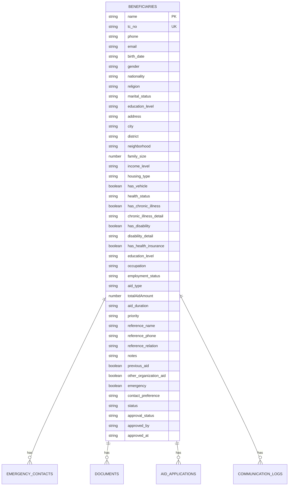
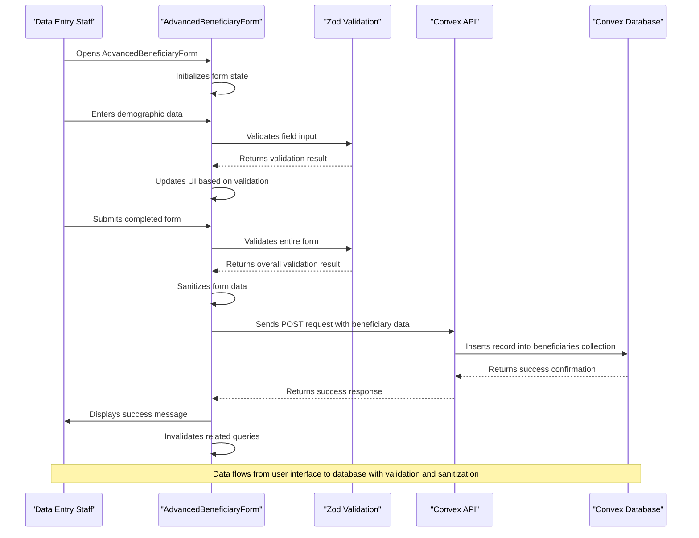
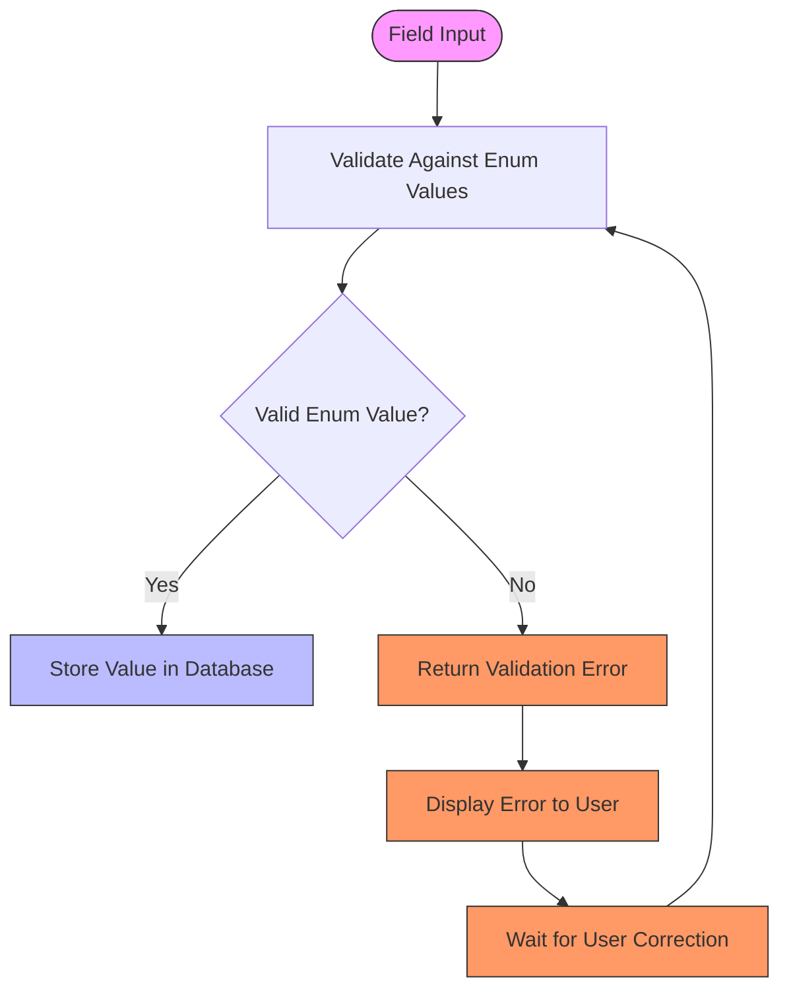

# Demographic and Personal Data

<cite>
**Referenced Files in This Document**   
- [beneficiaries.ts](file://convex/beneficiaries.ts)
- [schema.ts](file://convex/schema.ts)
- [AdvancedBeneficiaryForm.tsx](file://src/components/forms/AdvancedBeneficiaryForm.tsx)
- [beneficiary.ts](file://src/types/beneficiary.ts)
- [beneficiary.ts](file://src/lib/validations/beneficiary.ts)
</cite>

## Table of Contents

1. [Introduction](#introduction)
2. [Data Model Overview](#data-model-overview)
3. [Field Specifications](#field-specifications)
4. [Data Collection Process](#data-collection-process)
5. [Data Privacy Considerations](#data-privacy-considerations)
6. [Reporting and Analysis Usage](#reporting-and-analysis-usage)
7. [Validation Rules](#validation-rules)
8. [Conclusion](#conclusion)

## Introduction

This document provides comprehensive documentation for the demographic and personal data fields stored in the beneficiaries collection of the KafkasDer non-profit organization's system. The data model captures essential personal information about aid recipients, including gender, birth date, birth place, marital status, education status, religion, and nationality. This information is collected through the AdvancedBeneficiaryForm component and stored securely in the Convex database. The document details the data types, constraints, validation rules, and usage patterns for these fields, with a focus on data privacy and reporting capabilities.

**Section sources**

- [beneficiaries.ts](file://convex/beneficiaries.ts#L1-L229)
- [schema.ts](file://convex/schema.ts#L47-L155)

## Data Model Overview

The beneficiaries collection in the Convex database stores comprehensive personal and demographic information about aid recipients. The data model is designed to capture both basic identifying information and detailed socio-economic factors that inform aid decisions. The core demographic fields are implemented as optional string fields in the database schema, with specific validation rules enforced through application-level validation using Zod schemas.

The data model follows a structured approach where personal demographic data is separated from contact information, family details, economic status, health information, and aid-related data. This separation allows for targeted data collection and analysis while maintaining data integrity through consistent validation rules.

**Diagram sources**

- [schema.ts](file://convex/schema.ts#L47-L155)
- [beneficiaries.ts](file://convex/beneficiaries.ts#L96-L154)

## Field Specifications

The demographic and personal data fields in the beneficiaries collection are designed to capture essential information about aid recipients while maintaining flexibility for various beneficiary types. Each field has specific data types, constraints, and validation rules to ensure data quality and consistency.

### Gender

The gender field captures the beneficiary's gender identity using a predefined enumeration. This field is optional but recommended for demographic analysis and reporting purposes.

- **Data Type**: string
- **Constraints**: Must be one of the values from the Gender enum
- **Validation**: Client-side validation ensures only valid enum values are accepted
- **Possible Values**: "ERKEK" (Male), "KADIN" (Female)

**Section sources**

- [beneficiary.ts](file://src/types/beneficiary.ts#L43-L46)
- [schema.ts](file://convex/schema.ts#L58-L59)

### Birth Date

The birth_date field stores the beneficiary's date of birth in ISO 8601 string format. This field is used for age calculation, eligibility determination, and demographic reporting.

- **Data Type**: string (ISO 8601 date format)
- **Constraints**: Must be a valid date in the past
- **Validation**: Client-side validation ensures the date is in the past and properly formatted
- **Usage**: Age calculation, eligibility checks, demographic analysis

**Section sources**

- [schema.ts](file://convex/schema.ts#L56-L57)
- [beneficiary.ts](file://src/lib/validations/beneficiary.ts#L226)

### Birth Place

The birthPlace field captures the geographical location where the beneficiary was born. This information is useful for understanding migration patterns and regional needs.

- **Data Type**: string
- **Constraints**: Maximum length of 100 characters
- **Validation**: No specific format requirements, free text entry
- **Usage**: Regional analysis, migration pattern tracking

**Section sources**

- [beneficiary.ts](file://src/types/beneficiary.ts#L453)
- [schema.ts](file://convex/schema.ts#L58-L59)

### Marital Status

The marital_status field records the beneficiary's current marital status using a predefined enumeration. This information is important for family-based aid calculations and social support planning.

- **Data Type**: string
- **Constraints**: Must be one of the values from the MaritalStatus enum
- **Validation**: Client-side validation enforces enum value selection
- **Possible Values**: "BEKAR" (Single), "EVLI" (Married), "BOŞANMIŞ" (Divorced), "DUL" (Widowed)

**Section sources**

- [beneficiary.ts](file://src/types/beneficiary.ts#L48-L53)
- [schema.ts](file://convex/schema.ts#L64-L65)

### Education Status

The educationStatus field captures the highest level of education completed by the beneficiary using a predefined enumeration. This information helps in identifying educational needs and planning scholarship programs.

- **Data Type**: string
- **Constraints**: Must be one of the values from the EducationStatus enum
- **Validation**: Client-side validation ensures only valid enum values are accepted
- **Possible Values**: "OKUMA_YAZMA_BILMIYOR" (Illiterate), "OKUMA_YAZMA_BILIYOR" (Literate), "ILKOKUL" (Primary), "ORTAOKUL" (Middle), "LISE" (High School), "UNIVERSITE" (University), "YUKSEK_LISANS" (Masters), "DOKTORA" (Doctorate)

**Section sources**

- [beneficiary.ts](file://src/types/beneficiary.ts#L55-L64)
- [schema.ts](file://convex/schema.ts#L108-L109)

### Religion

The religion field records the beneficiary's religious affiliation using a predefined enumeration. This information is collected with sensitivity to cultural and religious diversity.

- **Data Type**: string
- **Constraints**: Must be one of the values from the Religion enum
- **Validation**: Client-side validation enforces enum value selection
- **Possible Values**: "MUSLUMAN" (Muslim), "HRISTIYAN" (Christian), "YAHUDI" (Jewish), "BUDIST" (Buddhist), "HINDU" (Hindu), "ATEIST" (Atheist), "DIGER" (Other)

**Section sources**

- [beneficiary.ts](file://src/types/beneficiary.ts#L66-L74)
- [schema.ts](file://convex/schema.ts#L62-L63)

### Nationality

The nationality field captures the beneficiary's citizenship or national affiliation. This information is important for understanding the demographic composition of beneficiaries and ensuring compliance with funding regulations.

- **Data Type**: string
- **Constraints**: No specific format, but typically matches country names
- **Validation**: Free text entry with no specific validation beyond basic string constraints
- **Usage**: Demographic reporting, compliance tracking, regional analysis

**Section sources**

- [schema.ts](file://convex/schema.ts#L60-L61)
- [beneficiary.ts](file://src/types/beneficiary.ts#L400)

## Data Collection Process

The demographic and personal data is collected through the AdvancedBeneficiaryForm component, a comprehensive React form that guides users through multiple steps of beneficiary registration. The form is designed to collect data in a structured manner while providing a user-friendly interface for data entry staff.

The form implementation uses React Hook Form for state management and Zod for validation, ensuring that data is validated both at the field level and across related fields. The form is organized into tabs that group related information, making it easier for data entry personnel to complete the registration process systematically.

**Diagram sources**

- [AdvancedBeneficiaryForm.tsx](file://src/components/forms/AdvancedBeneficiaryForm.tsx#L1-L800)
- [beneficiaries.ts](file://convex/beneficiaries.ts#L89-L169)

## Data Privacy Considerations

The demographic and personal data collected in the beneficiaries collection is considered sensitive personal information under data protection regulations. The system implements several measures to ensure data privacy and security:

1. **Access Control**: The data is protected by role-based access control, with only authorized personnel able to view or modify beneficiary records. The Convex backend enforces authentication and authorization rules for all database operations.

2. **Data Minimization**: The form collects only information that is necessary for the organization's aid programs, following the principle of data minimization. Optional fields are clearly marked, and users can choose not to provide certain information.

3. **Consent Management**: The system includes consent management features that record when and how beneficiaries have provided consent for data collection and usage. This is particularly important for sensitive personal data.

4. **Data Retention**: The system implements data retention policies that ensure personal data is not kept longer than necessary for the purposes for which it was collected.

5. **Encryption**: Data is encrypted both in transit and at rest, protecting it from unauthorized access.

6. **Audit Logging**: All access to and modifications of beneficiary records are logged for audit purposes, creating an accountability trail.

The organization follows strict data protection protocols to ensure compliance with relevant regulations and to maintain the trust of beneficiaries.

**Section sources**

- [beneficiaries.ts](file://convex/beneficiaries.ts#L71-L87)
- [AdvancedBeneficiaryForm.tsx](file://src/components/forms/AdvancedBeneficiaryForm.tsx#L48-L49)

## Reporting and Analysis Usage

The demographic and personal data fields are extensively used for reporting and analysis within the non-profit organization. This data enables the organization to:

1. **Identify Patterns**: Analyze demographic patterns among beneficiaries to understand who is being served and identify potential gaps in service coverage.

2. **Measure Impact**: Track changes in beneficiaries' circumstances over time, such as improvements in education status or changes in economic situation.

3. **Resource Allocation**: Inform decisions about resource allocation based on the demographic composition of beneficiaries and their specific needs.

4. **Program Evaluation**: Evaluate the effectiveness of aid programs by analyzing outcomes across different demographic groups.

5. **Compliance Reporting**: Generate reports for donors and regulatory bodies that demonstrate the organization's impact and compliance with funding requirements.

6. **Needs Assessment**: Identify emerging needs within the beneficiary population based on demographic trends and reported challenges.

The data is used to create various reports, including demographic summaries, program participation statistics, and impact assessments. These reports help the organization make data-driven decisions about program development and resource allocation.

**Section sources**

- [beneficiaries.ts](file://convex/beneficiaries.ts#L6-L60)
- [schema.ts](file://convex/schema.ts#L47-L155)

## Validation Rules

The demographic and personal data fields are subject to comprehensive validation rules to ensure data quality and consistency. These rules are implemented at both the client and server levels to provide robust data protection.

### Enum-based Validation

Fields that use predefined enumerations (Gender, MaritalStatus, EducationStatus, Religion) are validated to ensure only valid enum values are accepted. This prevents data entry errors and ensures consistency across records.

**Diagram sources**

- [beneficiary.ts](file://src/lib/validations/beneficiary.ts#L224-L231)
- [beneficiary.ts](file://src/lib/validations/beneficiary.ts#L448-L455)

### Cross-field Validation

The system implements cross-field validation rules that ensure logical consistency between related fields. For example, there is a validation rule that prevents beneficiaries under 18 years of age from being marked as married, which would be inconsistent with legal requirements.

Additional validation rules include:

- Ensuring that if a TC identification number is provided, a Mernis check must be performed
- Requiring detailed information when chronic illness or disability is indicated
- Validating that family size is consistent with the number of children and other dependents reported

These validation rules help maintain data integrity and prevent logical inconsistencies in the beneficiary records.

**Section sources**

- [beneficiary.ts](file://src/lib/validations/beneficiary.ts#L332-L393)
- [beneficiaries.ts](file://convex/beneficiaries.ts#L153-L164)

## Conclusion

The demographic and personal data model in the beneficiaries collection provides a comprehensive framework for capturing essential information about aid recipients. The fields for gender, birth date, birth place, marital status, education status, religion, and nationality are carefully designed with appropriate data types, constraints, and validation rules to ensure data quality and consistency.

The data collection process through the AdvancedBeneficiaryForm component ensures that information is gathered in a structured and user-friendly manner, while data privacy considerations are addressed through access controls, consent management, and security measures. The collected data is invaluable for reporting and analysis, enabling the organization to make data-driven decisions about aid programs and resource allocation.

By maintaining high standards for data quality and privacy, the organization can effectively serve its beneficiaries while ensuring compliance with regulatory requirements and maintaining the trust of all stakeholders.
