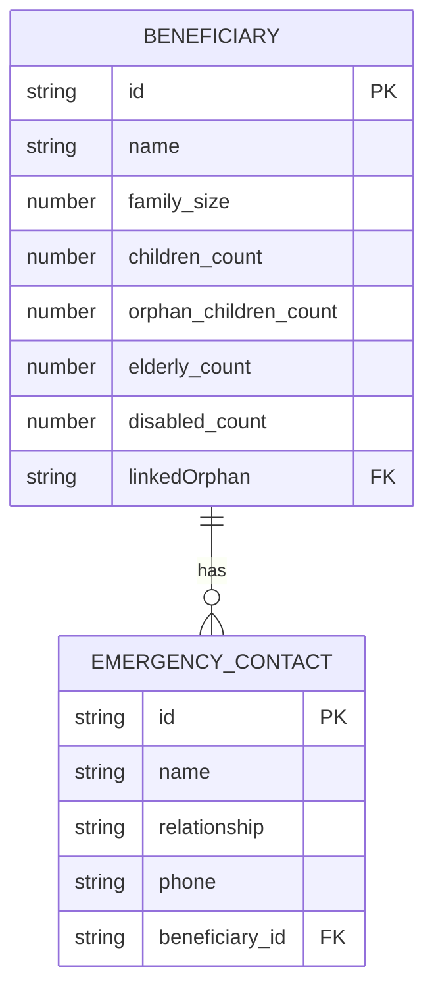
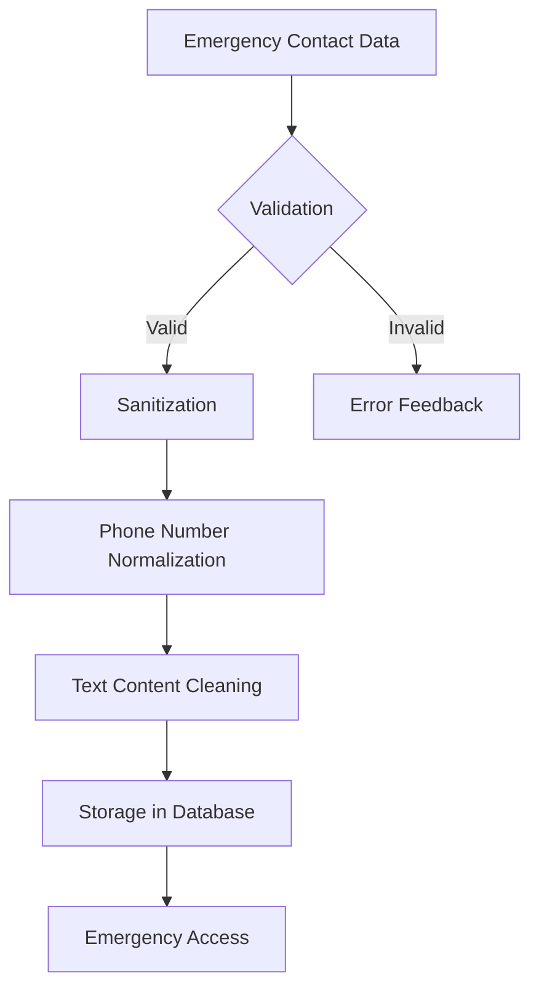
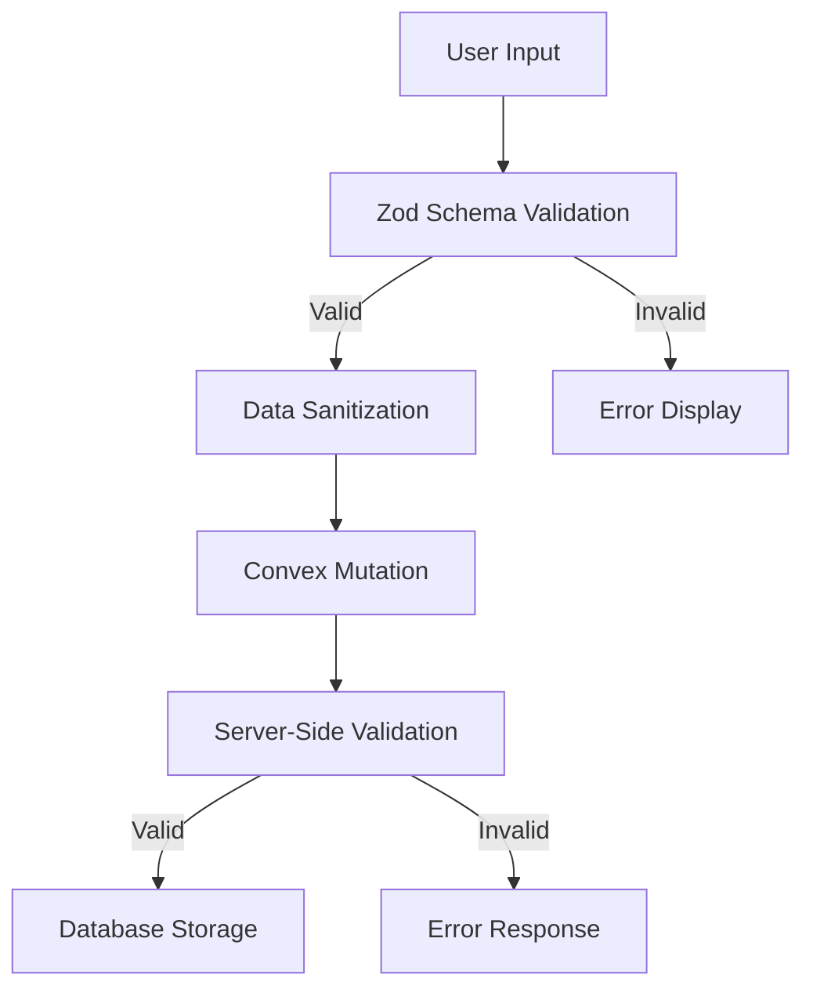
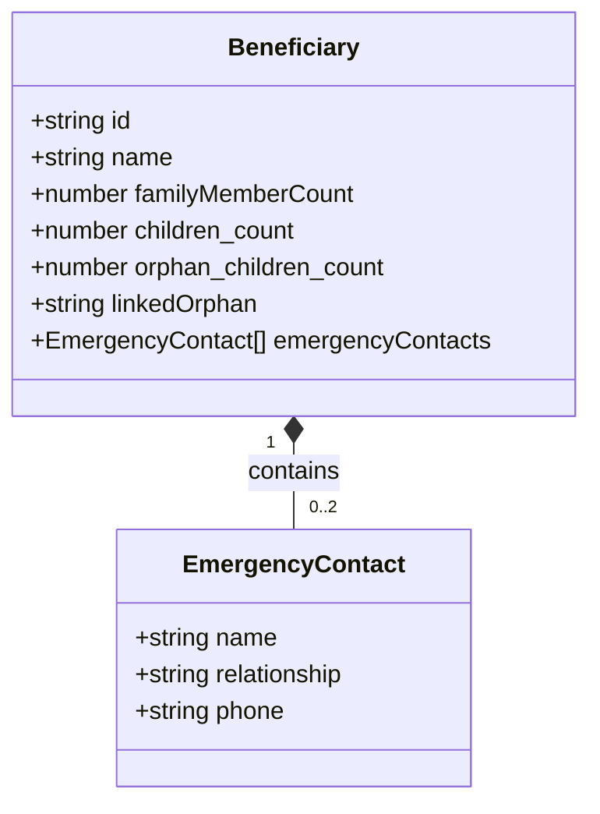

# Family and Household Composition

<cite>
**Referenced Files in This Document**   
- [beneficiaries.ts](file://convex/beneficiaries.ts)
- [schema.ts](file://convex/schema.ts)
- [beneficiary.ts](file://src/types/beneficiary.ts)
- [beneficiary.ts](file://src/lib/validations/beneficiary.ts)
- [beneficiaries-extended.json](file://src/data/mock/beneficiaries-extended.json)
</cite>

## Table of Contents

1. [Introduction](#introduction)
2. [Core Household Fields](#core-household-fields)
3. [Emergency Contacts Structure](#emergency-contacts-structure)
4. [Data Validation Rules](#data-validation-rules)
5. [Family Relationship Tracking](#family-relationship-tracking)
6. [Usage in Family-Centered Aid Delivery](#usage-in-family-centered-aid-delivery)
7. [Conclusion](#conclusion)

## Introduction

The Family and Household Composition data model is a critical component of the beneficiary management system, designed to capture comprehensive information about family units and household dynamics. This documentation details the key fields used to understand household composition, including familyMemberCount, emergencyContacts, linkedOrphan, and children_count. These fields enable the organization to assess family needs, coordinate support for dependents, and implement a family-centered approach to aid delivery. The data model supports both individual and household-level analysis, allowing for targeted interventions based on family size, composition, and specific vulnerabilities.

**Section sources**

- [schema.ts](file://convex/schema.ts#L47-L156)
- [beneficiary.ts](file://src/types/beneficiary.ts#L393-L507)

## Core Household Fields

The household composition fields are designed to capture essential demographic and structural information about beneficiary families. These fields enable comprehensive assessment of household needs and resource allocation.

### familyMemberCount

The `familyMemberCount` field represents the total number of individuals in the beneficiary's household. This numeric field is essential for understanding household size and resource requirements.

- **Data Type**: number
- **Constraints**:
  - Minimum value: 1 (household must contain at least one member)
  - Maximum value: 20 (practical limit for household size)
  - Required field in beneficiary records
- **Validation**: Enforced through Zod schema validation with range checking
- **Purpose**: Used to calculate per-capita resource allocation, assess housing needs, and determine eligibility for family-based aid programs

### children_count

The `children_count` field specifically tracks the number of children within the household. This field enables targeted support for families with dependents.

- **Data Type**: number (optional)
- **Constraints**:
  - Minimum value: 0 (households may have no children)
  - Maximum value: 50 (generous upper limit to accommodate extended families)
  - Default value: 0
- **Validation**: Numeric range validation with non-negative constraint
- **Purpose**: Used to determine eligibility for child-specific programs, education support, and nutritional assistance

### linkedOrphan

The `linkedOrphan` field establishes connections between beneficiaries and orphan records within the system, enabling coordinated care for vulnerable children.

- **Data Type**: string (optional)
- **Format**: Alphanumeric identifier (e.g., "ORP-001")
- **Purpose**: Creates a reference to orphan records, allowing case workers to track relationships between household members and orphaned children
- **Usage**: Facilitates monitoring of orphan support programs and ensures continuity of care

### orphan_children_count

The `orphan_children_count` field specifically tracks the number of orphaned children within the household.

- **Data Type**: number (optional)
- **Constraints**:
  - Minimum value: 0
  - Maximum value: 50
  - Default value: 0
- **Relationship**: This count should not exceed the total `children_count` for logical consistency
- **Purpose**: Identifies households caring for orphaned children, enabling targeted psychosocial support and educational assistance

### Additional Household Metrics

The data model includes several complementary fields that provide a comprehensive view of household composition:

- **elderly_count**: Number of elderly individuals (typically 65+) in the household
- **disabled_count**: Number of individuals with disabilities in the household
- **family_size**: Total household size (synonymous with familyMemberCount in the database schema)

These fields work together to create a detailed profile of household composition, enabling nuanced assessment of vulnerability and support needs.



**Diagram sources**

- [schema.ts](file://convex/schema.ts#L47-L156)
- [beneficiary.ts](file://src/types/beneficiary.ts#L393-L507)

**Section sources**

- [schema.ts](file://convex/schema.ts#L74-L83)
- [beneficiary.ts](file://src/lib/validations/beneficiary.ts#L179-L182)
- [beneficiary.ts](file://src/lib/validations/beneficiary.ts#L304-L307)

## Emergency Contacts Structure

The emergency contacts system is designed to ensure reliable communication channels for beneficiary families during critical situations.

### Data Structure

The emergency contacts are stored as an array of objects within the beneficiary record, with each contact containing three essential fields:

```typescript
interface EmergencyContact {
  name: string;
  relationship: string;
  phone: string;
}
```

- **name**: Full name of the emergency contact
- **relationship**: Nature of the relationship to the beneficiary (e.g., "Spouse", "Parent", "Sibling")
- **phone**: Contact telephone number in E.164 format

### Constraints and Validation

The emergency contacts array has specific constraints to ensure data quality and usability:

- **Array Size**: Maximum of 2 contacts allowed per beneficiary
- **Field Requirements**:
  - Name: 2-50 characters, alphabetic characters only
  - Relationship: 2-50 characters
  - Phone: Valid Turkish mobile number format (+905XXXXXXXXX or 5XXXXXXXXX)
- **Validation**: Implemented through Zod schema with comprehensive field validation

### Data Sanitization

Before storage, emergency contact data undergoes sanitization to ensure consistency:

- Phone numbers are normalized to E.164 format
- Text fields are cleaned of potentially harmful content
- Special characters are removed or encoded to prevent injection attacks

The system prioritizes data integrity while maintaining the usability of contact information for emergency response teams.



**Diagram sources**

- [beneficiary.ts](file://src/types/beneficiary.ts#L385-L389)
- [beneficiary.ts](file://src/lib/validations/beneficiary.ts#L276-L291)
- [AdvancedBeneficiaryForm.tsx](file://src/components/forms/AdvancedBeneficiaryForm.tsx#L264-L272)

**Section sources**

- [beneficiary.ts](file://src/types/beneficiary.ts#L385-L389)
- [beneficiary.ts](file://src/lib/validations/beneficiary.ts#L276-L291)
- [AdvancedBeneficiaryForm.tsx](file://src/components/forms/AdvancedBeneficiaryForm.tsx#L264-L272)

## Data Validation Rules

The household composition data is protected by comprehensive validation rules to ensure data quality and consistency across the system.

### Field-Level Validation

Each household composition field has specific validation rules:

#### familyMemberCount Validation

- Must be a positive integer
- Range: 1-20 members
- Required field in all beneficiary records
- Server-side validation in Convex mutation functions

#### children_count Validation

- Non-negative integer
- Range: 0-50 children
- Must not exceed familyMemberCount
- Default value of 0 if not specified

#### linkedOrphan Validation

- Alphanumeric format matching pattern: ORP-[0-9]{3}
- Must reference an existing orphan record in the system
- Format validation using regular expressions

### Cross-Field Validation

The system implements several cross-field validation rules to maintain data integrity:

- **Family Size Consistency**: The sum of specialized counts (children, elderly, disabled) should not exceed total familyMemberCount
- **Orphan Relationship**: If linkedOrphan is specified, orphan_children_count should be at least 1
- **Dependency Logic**: Households with children_count > 0 should have appropriate adult members

### Validation Implementation

Validation is implemented at multiple levels:

1. **Frontend Validation**: Using Zod schemas in React forms
2. **Sanitization Layer**: Data cleaning before submission
3. **Backend Validation**: Server-side checks in Convex functions
4. **Database Constraints**: Schema-level validation in Convex

This multi-layered approach ensures data quality while providing clear feedback to data entry personnel.



**Diagram sources**

- [beneficiary.ts](file://src/lib/validations/beneficiary.ts)
- [beneficiaries.ts](file://convex/beneficiaries.ts)
- [schema.ts](file://convex/schema.ts)

**Section sources**

- [beneficiary.ts](file://src/lib/validations/beneficiary.ts#L179-L182)
- [beneficiary.ts](file://src/lib/validations/beneficiary.ts#L304-L307)
- [beneficiaries.ts](file://convex/beneficiaries.ts#L105-L110)

## Family Relationship Tracking

The system employs a comprehensive approach to tracking family relationships and household dynamics.

### Relationship Mapping

The data model supports several methods of relationship tracking:

- **Direct Counting**: Quantitative metrics (children_count, elderly_count) provide immediate insight into household composition
- **Reference Linking**: The linkedOrphan field creates explicit connections between beneficiaries and orphan records
- **Contact Relationships**: Emergency contacts include relationship descriptors that map family connections

### Household Dynamics Analysis

The collected data enables sophisticated analysis of household dynamics:

- **Dependency Ratios**: Calculating the ratio of dependents (children, elderly) to working-age adults
- **Vulnerability Assessment**: Identifying households with multiple risk factors (e.g., single parents with multiple young children)
- **Support Network Mapping**: Using emergency contacts to understand the beneficiary's support system

### Data Integration

Family relationship data is integrated across multiple system components:

- **Case Management**: Social workers use household composition data to develop support plans
- **Resource Allocation**: Aid packages are sized according to household needs
- **Monitoring Systems**: Changes in household composition trigger case reviews

The system maintains data consistency through referential integrity and validation rules, ensuring that relationship data remains accurate and actionable.



**Diagram sources**

- [beneficiary.ts](file://src/types/beneficiary.ts#L393-L507)
- [beneficiary.ts](file://src/types/beneficiary.ts#L385-L389)

**Section sources**

- [beneficiary.ts](file://src/types/beneficiary.ts#L416-L419)
- [beneficiary.ts](file://src/types/beneficiary.ts#L488-L489)
- [schema.ts](file://convex/schema.ts#L74-L83)

## Usage in Family-Centered Aid Delivery

The household composition data plays a vital role in the organization's family-centered approach to aid delivery.

### Needs Assessment

Household composition data informs comprehensive needs assessments:

- **Resource Calculation**: Aid amounts are calculated based on household size and composition
- **Program Eligibility**: Specific programs target households with children, elderly members, or disabled individuals
- **Priority Scoring**: Households with multiple vulnerabilities receive higher priority

### Support Coordination

The data enables coordinated support for dependents:

- **Child Protection**: Households with orphaned children receive specialized monitoring
- **Education Support**: Children_count determines eligibility for educational assistance programs
- **Healthcare Access**: Household composition informs healthcare needs and referrals

### Case Management

Social workers use household composition data to:

- Develop individualized support plans
- Monitor changes in household circumstances
- Coordinate interventions across multiple family members
- Evaluate the impact of aid programs on household well-being

The system's comprehensive household data model supports a holistic approach to aid delivery, recognizing that supporting individuals often requires addressing the needs of their entire family unit.

**Section sources**

- [beneficiaries-extended.json](file://src/data/mock/beneficiaries-extended.json)
- [schema.ts](file://convex/schema.ts#L47-L156)
- [beneficiary.ts](file://src/types/beneficiary.ts#L393-L507)

## Conclusion

The Family and Household Composition data model provides a robust framework for understanding and supporting beneficiary families. By capturing detailed information about household size, composition, and relationships, the system enables a family-centered approach to aid delivery. The carefully designed fields—familyMemberCount, emergencyContacts, linkedOrphan, and children_count—work together to create comprehensive household profiles that inform needs assessment, resource allocation, and support coordination. Rigorous validation rules ensure data quality, while the integration of relationship tracking supports holistic case management. This data model is essential for delivering effective, targeted assistance that addresses the complex realities of beneficiary households.
