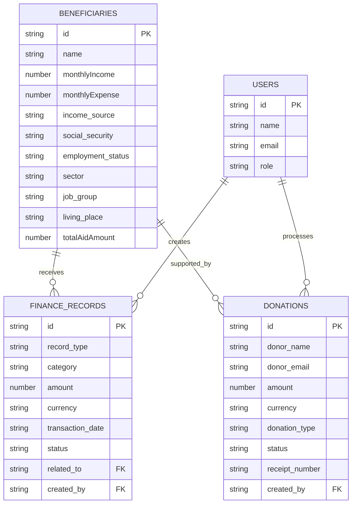

# Financial and Employment Status

<cite>
**Referenced Files in This Document**   
- [beneficiaries.ts](file://convex/beneficiaries.ts)
- [schema.ts](file://convex/schema.ts)
- [finance_records.ts](file://convex/finance_records.ts)
- [donations.ts](file://convex/donations.ts)
- [beneficiary.ts](file://src/types/beneficiary.ts)
</cite>

## Table of Contents

1. [Introduction](#introduction)
2. [Core Financial and Employment Fields](#core-financial-and-employment-fields)
3. [Data Types and Validation Rules](#data-types-and-validation-rules)
4. [Enum Definitions](#enum-definitions)
5. [Benefit Eligibility and Need Assessment](#benefit-eligibility-and-need-assessment)
6. [Financial Data Aggregation and Reporting](#financial-data-aggregation-and-reporting)
7. [Integration with Finance Records and Donations](#integration-with-finance-records-and-donations)
8. [Conclusion](#conclusion)

## Introduction

This document provides comprehensive documentation for the financial and employment status fields within the beneficiaries collection of the Kafkasder aid management system. The data model captures critical socioeconomic information used to assess beneficiary need, determine eligibility for various forms of aid, and monitor economic conditions over time. Key fields include monthly income and expenses, income sources, social security status, work status, sector, job group, and living place. These fields are supported by a robust set of enumerated types (enums) that standardize data entry and ensure consistency across the system. The financial data is integrated with the finance_records and donations collections to enable comprehensive financial analysis, reporting, and decision-making.

**Section sources**

- [schema.ts](file://convex/schema.ts#L43-L155)
- [beneficiary.ts](file://src/types/beneficiary.ts#L6-L147)

## Core Financial and Employment Fields

The beneficiaries collection includes several key fields that capture financial and employment information essential for assessing socioeconomic status and aid eligibility. These fields are designed to provide a comprehensive picture of a beneficiary's economic situation.

The `monthlyIncome` field stores the total monthly income of the beneficiary or household in Turkish Lira (TRY). This numeric value is used to calculate financial need and determine eligibility thresholds for various aid programs. Similarly, the `monthlyExpense` field captures the total monthly expenses, allowing for the calculation of disposable income and financial pressure.

The `incomeSources` field is an array that identifies all sources of income for the beneficiary. This multi-select field allows for the recognition of complex financial situations where income may come from multiple channels such as employment, social assistance, family support, or scholarships.

The `socialSecurity` field indicates whether the beneficiary has access to social security benefits, which significantly impacts their financial resilience and eligibility for certain types of aid. The `workStatus` field captures the current employment situation, including options for being employed, unemployed, retired, or a student.

Additional fields provide further context about employment: `sector` identifies the industry or economic sector in which the beneficiary works, `jobGroup` categorizes their occupation type, and `livingPlace` describes their housing situation, which serves as an indicator of economic stability.

**Section sources**

- [schema.ts](file://convex/schema.ts#L84-L113)
- [beneficiary.ts](file://src/types/beneficiary.ts#L461-L470)

## Data Types and Validation Rules

The financial and employment fields in the beneficiaries collection follow strict data typing and validation rules to ensure data quality and consistency across the system.

The `monthlyIncome` and `monthlyExpense` fields are defined as optional numeric values (`v.optional(v.number())`). These fields accept only positive numbers representing amounts in Turkish Lira. Input validation ensures that negative values cannot be entered, and the system may apply additional business rules to flag unusually high or low values for review.

The `incomeSources` field is an optional array of strings (`v.optional(v.array(v.string()))`) that references the `IncomeSource` enum. This field allows multiple selections, enabling a comprehensive view of all income streams. The system validates that each array element corresponds to a valid enum value.

The `socialSecurity`, `workStatus`, `sector`, `jobGroup`, and `livingPlace` fields are all defined as optional string fields (`v.optional(v.string())`) that reference their respective enum types. For `workStatus`, the field is specifically mapped to the `employment_status` property in the schema, ensuring consistency between the frontend interface and backend storage.

All string-based fields that reference enums are validated against their respective enum definitions to prevent invalid or misspelled entries. The system also enforces data integrity through Convex database indexes and search capabilities, particularly on fields like `income_level` and `employment_status` that are frequently used in filtering and reporting.

**Section sources**

- [schema.ts](file://convex/schema.ts#L84-L113)
- [beneficiaries.ts](file://convex/beneficiaries.ts#L110-L124)
- [beneficiary.ts](file://src/types/beneficiary.ts#L99-L147)

## Enum Definitions

The financial and employment data model relies on a set of standardized enums to ensure consistent data entry and facilitate reporting and analysis. These enums provide controlled vocabularies for key fields.

The `IncomeSource` enum defines the possible sources of income:

- `IS` (Employment)
- `SOSYAL_YARDIM` (Social Assistance)
- `AILE_DESTEGI` (Family Support)
- `BURS` (Scholarship)
- `DIGER` (Other)

The `SocialSecurityStatus` enum indicates access to social security:

- `VAR` (Has Social Security)
- `YOK` (No Social Security)

The `WorkStatus` enum captures employment status:

- `CALISMIYOR` (Not Working)
- `CALISIYOR` (Working)
- `EMEKLI` (Retired)
- `OGRENCI` (Student)

The `Sector` enum identifies the economic sector:

- `TARIM` (Agriculture)
- `SANAYI` (Industry)
- `HIZMET` (Services)
- `TICARET` (Trade)
- `EGITIM` (Education)
- `SAGLIK` (Healthcare)
- `DEVLET` (Government)
- `DIGER` (Other)

The `JobGroup` enum categorizes occupation types:

- `YONETICI` (Manager)
- `MEMUR` (Civil Servant)
- `ISCI` (Worker)
- `ESNAF` (Artisan)
- `CALISAN` (Employee)
- `SERBEST_MESLEK` (Freelance Professional)
- `DIGER` (Other)

The `LivingPlace` enum describes housing arrangements:

- `EV` (Owned Home)
- `KIRALIK` (Rented)
- `YURT` (Dormitory)
- `BARINMA_MERKEZI` (Shelter)
- `DIGER` (Other)

These enums are implemented as TypeScript enums in the frontend and validated against in the backend to maintain data consistency.

**Section sources**

- [beneficiary.ts](file://src/types/beneficiary.ts#L99-L147)
- [schema.ts](file://convex/schema.ts#L84-L113)

## Benefit Eligibility and Need Assessment

The financial and employment status data is central to the system's ability to assess beneficiary need and determine eligibility for various forms of aid. The data model supports a comprehensive needs assessment framework that considers multiple socioeconomic factors.

The system calculates financial need by analyzing the relationship between `monthlyIncome` and `monthlyExpense`, creating a disposable income metric that indicates financial pressure. Beneficiaries with a negative or minimal disposable income are prioritized for financial assistance programs. The `incomeSources` field helps identify beneficiaries who rely on unstable or single-source income, making them more vulnerable to economic shocks.

The `socialSecurity` status is a critical eligibility criterion, as beneficiaries without social security coverage may qualify for additional support to compensate for the lack of safety net. The `workStatus` field enables targeted programs—for example, unemployed beneficiaries may be eligible for job placement services, while students may qualify for educational support.

The combination of `sector` and `jobGroup` provides insight into employment quality and stability, allowing the system to identify beneficiaries in precarious or low-income occupations who may need vocational training or career advancement support. The `livingPlace` field serves as a proxy for housing security, with beneficiaries in shelters or rented accommodations potentially qualifying for housing assistance programs.

These fields are used in combination with other demographic and health data to create a holistic view of beneficiary need, enabling the organization to allocate resources effectively and prioritize the most vulnerable individuals and families.

**Section sources**

- [schema.ts](file://convex/schema.ts#L84-L113)
- [beneficiaries.ts](file://convex/beneficiaries.ts#L110-L124)

## Financial Data Aggregation and Reporting

The financial data from the beneficiaries collection is aggregated and analyzed to support organizational reporting, strategic planning, and donor accountability. The system provides comprehensive financial analysis capabilities by integrating beneficiary data with financial transaction records.

Monthly income and expense data from beneficiaries is aggregated by demographic categories such as city, family size, and employment status to identify regional economic trends and disparities. This aggregation helps the organization understand the socioeconomic landscape of the communities it serves and allocate resources accordingly.

The system generates reports that analyze the distribution of income levels across different beneficiary groups, track changes in employment status over time, and monitor the effectiveness of vocational training programs. These reports can be filtered by date ranges and other criteria to support both operational decision-making and long-term strategic planning.

Financial dashboards visualize key metrics such as average monthly income by region, employment rate among beneficiaries, and the proportion of beneficiaries without social security coverage. These visualizations help staff quickly identify areas of greatest need and measure the impact of interventions over time.

The data is also used to generate compliance reports that demonstrate adherence to funding requirements and eligibility criteria for various aid programs. These reports are essential for maintaining transparency with donors and regulatory bodies.

**Section sources**

- [finance_records.ts](file://convex/finance_records.ts#L132-L224)
- [schema.ts](file://convex/schema.ts#L544-L577)

## Integration with Finance Records and Donations

The financial and employment data in the beneficiaries collection is integrated with the finance_records and donations collections to enable comprehensive financial analysis and closed-loop accountability. This integration creates a complete picture of financial flows from donors to beneficiaries.

The finance_records collection tracks all financial transactions, including both income (donations, grants) and expenses (aid disbursements, operational costs). Each record includes a `related_to` field that can reference a beneficiary, allowing for direct linkage between financial transactions and individual beneficiaries. This enables the system to track the total aid amount provided to each beneficiary over time, which is stored in the `totalAidAmount` field of the beneficiaries collection.

When analyzing a beneficiary's financial situation, the system can correlate their reported `monthlyIncome` with actual aid disbursements recorded in finance_records. This allows staff to assess the impact of aid on the beneficiary's overall financial health and determine appropriate levels of ongoing support.

The donations collection captures information about incoming donations, including donor details, donation amounts, and purposes. By linking donation data with beneficiary financial data, the system can demonstrate how specific donations have been used to support beneficiaries with particular financial profiles (e.g., unemployed heads of household or families without social security).

This integrated data model supports sophisticated reporting that shows the flow of funds from donors through the organization to beneficiaries, enabling comprehensive financial analysis, impact assessment, and donor reporting. The system can generate reports that show how donations have improved beneficiaries' financial situations, reduced poverty levels, or increased employment rates.

**Diagram sources**

- [schema.ts](file://convex/schema.ts#L43-L155)
- [finance_records.ts](file://convex/finance_records.ts#L4-L323)
- [donations.ts](file://convex/donations.ts#L4-L149)

**Section sources**

- [schema.ts](file://convex/schema.ts#L43-L155)
- [finance_records.ts](file://convex/finance_records.ts#L4-L323)
- [donations.ts](file://convex/donations.ts#L4-L149)

## Conclusion

The financial and employment status data model in the beneficiaries collection provides a robust framework for assessing socioeconomic conditions, determining aid eligibility, and tracking economic outcomes. By capturing detailed information about income, expenses, employment, and living conditions through standardized fields and enums, the system enables consistent data collection and meaningful analysis. The integration of this data with financial transaction records creates a comprehensive financial management system that supports effective aid delivery, transparent reporting, and data-driven decision-making. This integrated approach ensures that resources are allocated to those with the greatest need and that the organization can demonstrate the impact of its interventions to stakeholders and donors.
