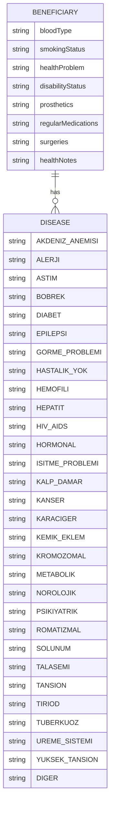
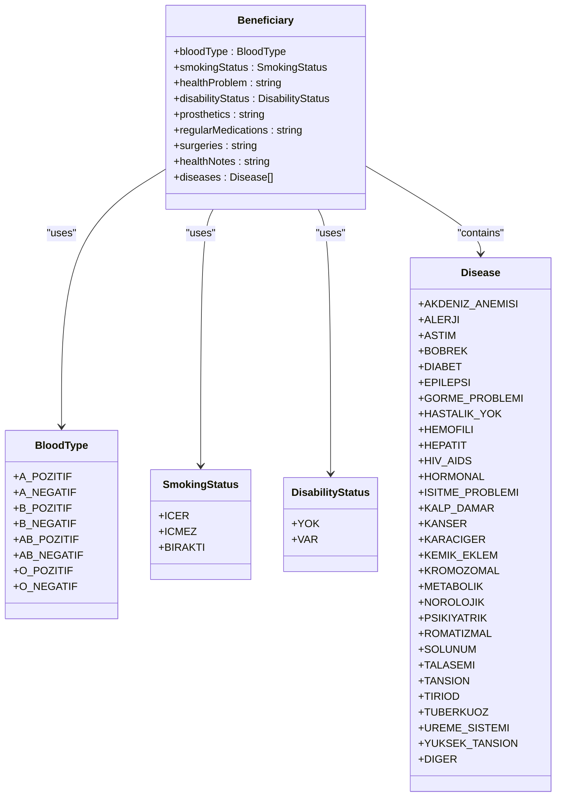
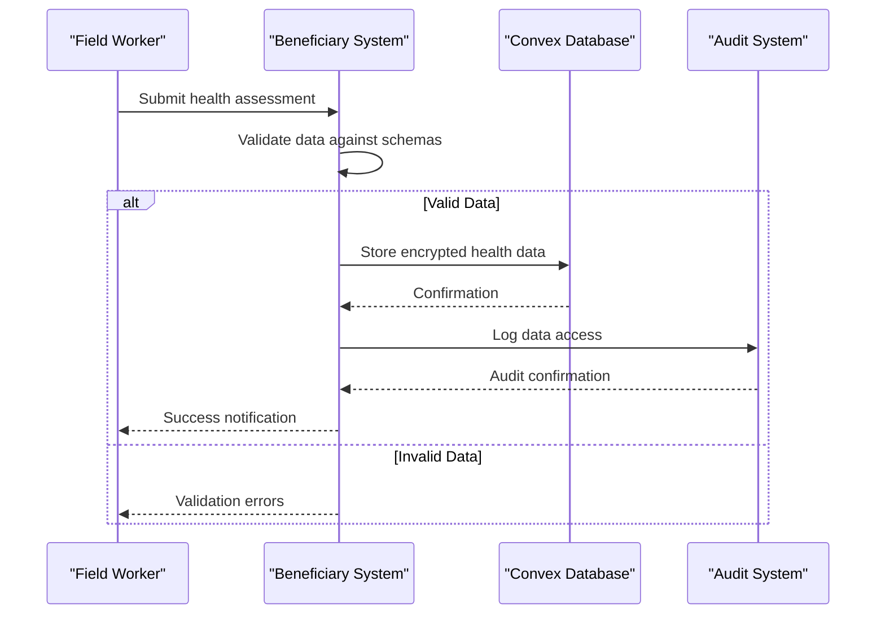
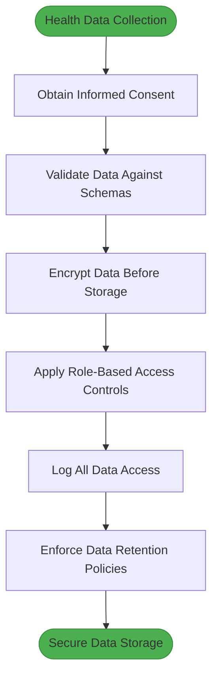
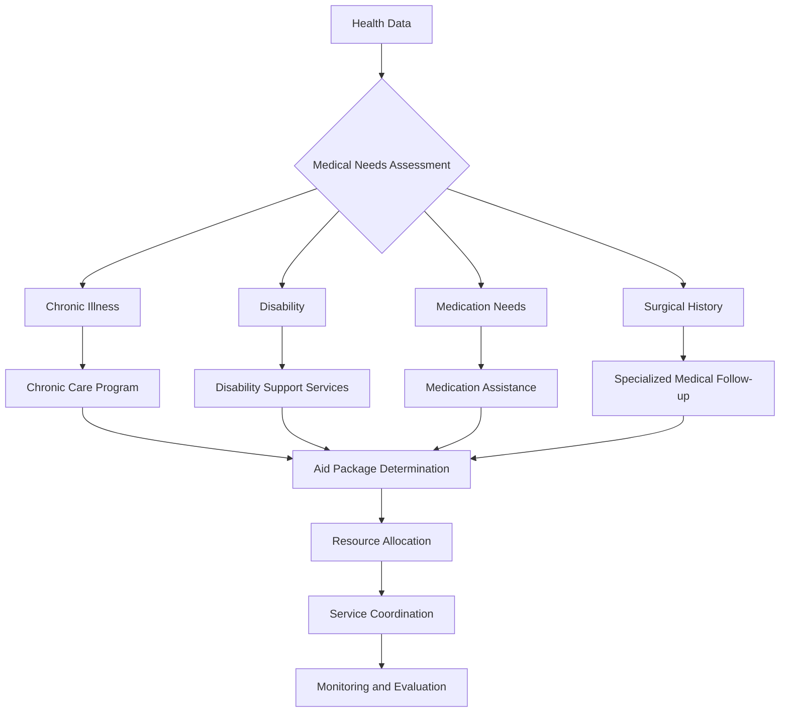

# Health and Medical Information

<cite>
**Referenced Files in This Document**   
- [beneficiaries.ts](file://convex/beneficiaries.ts)
- [schema.ts](file://convex/schema.ts)
- [beneficiary.ts](file://src/types/beneficiary.ts)
- [beneficiary.ts](file://src/lib/validations/beneficiary.ts)
- [beneficiaries-extended.json](file://src/data/mock/beneficiaries-extended.json)
</cite>

## Table of Contents

1. [Introduction](#introduction)
2. [Health and Medical Data Fields](#health-and-medical-data-fields)
3. [Data Types and Validation Rules](#data-types-and-validation-rules)
4. [Health Data Collection and Storage](#health-data-collection-and-storage)
5. [Data Privacy and Compliance](#data-privacy-and-compliance)
6. [Health Data Usage in Aid Decisions](#health-data-usage-in-aid-decisions)
7. [Conclusion](#conclusion)

## Introduction

This document provides comprehensive documentation for the health and medical information fields within the beneficiaries collection of the KafkasDer aid management system. The system collects sensitive health data to coordinate medical assistance, specialized support services, and inform aid decisions. This documentation details the structure, validation rules, security measures, and usage patterns for health-related fields including bloodType, smokingStatus, healthProblem, disabilityStatus, prosthetics, regularMedications, surgeries, healthNotes, and diseases. The data model is designed to support humanitarian aid operations while maintaining strict compliance with data privacy regulations.

**Section sources**

- [beneficiary.ts](file://src/types/beneficiary.ts#L392-L506)
- [schema.ts](file://convex/schema.ts#L47-L154)

## Health and Medical Data Fields

The beneficiaries collection contains a comprehensive set of health and medical information fields designed to capture the complete health profile of aid recipients. These fields are organized under the "SAĞLIK DURUMU" (Health Status) section of the Beneficiary interface and are used to assess medical needs, coordinate specialized services, and determine appropriate aid packages.

The health data fields include:

- **bloodType**: The beneficiary's blood group, stored as an enum value
- **smokingStatus**: Tobacco usage status of the beneficiary
- **healthProblem**: Text description of any health issues
- **disabilityStatus**: Whether the beneficiary has a disability
- **prosthetics**: Information about prosthetic devices used
- **regularMedications**: Medications taken regularly by the beneficiary
- **surgeries**: History of surgical procedures
- **healthNotes**: Additional medical notes and observations
- **diseases**: Array of diagnosed medical conditions using the Disease enum

These fields work together to create a comprehensive health profile that informs medical assistance coordination and specialized support services for beneficiaries.

**Diagram sources**

- [beneficiary.ts](file://src/types/beneficiary.ts#L77-L358)
- [beneficiary.ts](file://src/types/beneficiary.ts#L392-L506)

**Section sources**

- [beneficiary.ts](file://src/types/beneficiary.ts#L477-L486)

## Data Types and Validation Rules

The health and medical information fields follow strict data typing and validation rules to ensure data integrity and consistency across the system. These rules are implemented through TypeScript interfaces, Zod validation schemas, and Convex database schema definitions.

### Field Specifications and Constraints

| Field              | Data Type             | Constraints                  | Validation Rules                                                                                                                  |
| ------------------ | --------------------- | ---------------------------- | --------------------------------------------------------------------------------------------------------------------------------- |
| bloodType          | BloodType enum        | Optional                     | Must be one of the 8 blood type values (A_POZITIF, A_NEGATIF, B_POZITIF, B_NEGATIF, AB_POZITIF, AB_NEGATIF, O_POZITIF, O_NEGATIF) |
| smokingStatus      | SmokingStatus enum    | Optional                     | Must be one of: ICER (smokes), ICMEZ (does not smoke), BIRAKTI (quit smoking)                                                     |
| healthProblem      | string                | Optional, max 500 characters | Free text field for describing health issues                                                                                      |
| disabilityStatus   | DisabilityStatus enum | Optional                     | Must be either YOK (none) or VAR (exists)                                                                                         |
| prosthetics        | string                | Optional, max 200 characters | Description of any prosthetic devices used                                                                                        |
| regularMedications | string                | Optional, max 200 characters | List of medications taken regularly                                                                                               |
| surgeries          | string                | Optional, max 200 characters | History of surgical procedures                                                                                                    |
| healthNotes        | string                | Optional, max 500 characters | Additional medical observations and notes                                                                                         |
| diseases           | Disease[] array       | Optional                     | Array of Disease enum values                                                                                                      |

### Enum Definitions

The system uses specific enums to standardize health data:

**BloodType Enum:**

- A_POZITIF
- A_NEGATIF
- B_POZITIF
- B_NEGATIF
- AB_POZITIF
- AB_NEGATIF
- O_POZITIF
- O_NEGATIF

**SmokingStatus Enum:**

- ICER (Smokes)
- ICMEZ (Does not smoke)
- BIRAKTI (Quit smoking)

**DisabilityStatus Enum:**

- YOK (None)
- VAR (Exists)

**Disease Enum:**
The Disease enum includes 36 specific conditions including:

- AKDENIZ_ANEMISI (Mediterranean Anemia)
- ALERJI (Allergy)
- ASTIM (Asthma)
- BOBREK (Kidney)
- DIABET (Diabetes)
- EPILEPSI (Epilepsy)
- GORME_PROBLEMI (Vision Problem)
- HASTALIK_YOK (No Disease)
- HEMOFILI (Hemophilia)
- HEPATIT (Hepatitis)
- HIV_AIDS
- KALP_DAMAR (Cardiovascular)
- KANSER (Cancer)
- KARACIGER (Liver)
- KEMIK_EKLEM (Bone/Joint)
- PSIKIYATRIK (Psychiatric)
- SOLUNUM (Respiratory)
- TUBERKUOZ (Tuberculosis)
- YUKSEK_TANSION (High Blood Pressure)
- DIGER (Other)

The validation rules are implemented in the `healthInfoSchema` within the beneficiary validation file, which extends the base beneficiary schema with specific health-related validation constraints.

**Diagram sources**

- [beneficiary.ts](file://src/types/beneficiary.ts#L77-L92)
- [beneficiary.ts](file://src/types/beneficiary.ts#L94-L97)
- [beneficiary.ts](file://src/types/beneficiary.ts#L327-L358)
- [beneficiary.ts](file://src/types/beneficiary.ts#L392-L506)

**Section sources**

- [beneficiary.ts](file://src/types/beneficiary.ts#L77-L358)
- [beneficiary.ts](file://src/lib/validations/beneficiary.ts#L258-L266)
- [schema.ts](file://convex/schema.ts#L94-L107)

## Health Data Collection and Storage

Health and medical information is collected through a structured process that ensures data accuracy, consistency, and security. The collection process is integrated into the beneficiary registration workflow and follows strict protocols for sensitive data handling.

### Data Collection Process

Health data is collected through multiple channels:

- **Field assessments**: Social workers and medical professionals collect health information during home visits
- **Medical records**: Verified information from hospitals and clinics
- **Self-reporting**: Beneficiaries provide information through interviews and forms
- **Partner organizations**: Data shared from collaborating medical institutions

The collection process follows a standardized form with validation rules that prevent incomplete or inconsistent data entry. The system requires MERNIS (National Population Administration System) verification when a Turkish ID number is provided, ensuring identity accuracy for health records.

### Secure Data Storage

The health data is stored in the Convex database with the following security measures:

- **Encryption at rest**: All beneficiary records are encrypted in the database
- **Access controls**: Role-based access ensures only authorized personnel can view health data
- **Audit logging**: All access to health records is logged for compliance
- **Data minimization**: Only necessary health information is collected and retained

The beneficiaries collection in the Convex schema defines the structure for health data storage, with specific fields for each health parameter. The database schema includes indexes for efficient querying while maintaining data privacy.

**Diagram sources**

- [beneficiaries.ts](file://convex/beneficiaries.ts#L89-L169)
- [schema.ts](file://convex/schema.ts#L47-L154)
- [beneficiary.ts](file://src/lib/validations/beneficiary.ts#L131-L331)

**Section sources**

- [beneficiaries.ts](file://convex/beneficiaries.ts#L89-L169)
- [schema.ts](file://convex/schema.ts#L47-L154)
- [beneficiary.ts](file://src/lib/validations/beneficiary.ts#L131-L331)

## Data Privacy and Compliance

The handling of health and medical information follows strict privacy and compliance protocols to protect beneficiary rights and meet regulatory requirements. As sensitive personal data, health information is subject to enhanced protection measures.

### Privacy Principles

The system adheres to the following privacy principles:

- **Lawfulness, fairness, and transparency**: Data collection is transparent with informed consent
- **Purpose limitation**: Health data is only used for medical assistance and aid coordination
- **Data minimization**: Only necessary health information is collected
- **Accuracy**: Data is verified and updated regularly
- **Storage limitation**: Health records are retained only as long as necessary
- **Integrity and confidentiality**: Strong security measures protect data from unauthorized access

Beneficiaries provide explicit consent for the processing of their health data, documented in the consentStatement field. The system allows beneficiaries to request data deletion through the deleteRecord flag.

### Compliance Requirements

The health data management complies with relevant regulations including:

- **Turkish Data Protection Law (KVKK)**: Compliance with Turkey's personal data protection regulations
- **GDPR principles**: Adherence to General Data Protection Regulation standards for personal data
- **Health data specific regulations**: Compliance with medical data handling requirements

Access to health data is strictly controlled through role-based permissions. The system logs all access to health records in the audit_logs collection for compliance monitoring and accountability.

**Diagram sources**

- [beneficiary.ts](file://src/types/beneficiary.ts#L427-L429)
- [beneficiaries.ts](file://convex/beneficiaries.ts#L89-L169)
- [schema.ts](file://convex/schema.ts#L47-L154)

**Section sources**

- [beneficiary.ts](file://src/types/beneficiary.ts#L427-L429)
- [beneficiaries.ts](file://convex/beneficiaries.ts#L89-L169)
- [schema.ts](file://convex/schema.ts#L47-L154)

## Health Data Usage in Aid Decisions

Health and medical information plays a critical role in determining aid eligibility, resource allocation, and service coordination. The data informs decision-making processes that ensure appropriate support for beneficiaries with medical needs.

### Medical Assistance Coordination

Health data is used to coordinate specialized medical services:

- **Referrals to medical facilities**: Beneficiaries with specific conditions are referred to appropriate healthcare providers
- **Medication support**: Those requiring regular medications receive pharmaceutical assistance
- **Prosthetic services**: Beneficiaries with prosthetics needs are connected with specialized providers
- **Chronic disease management**: Those with chronic illnesses receive ongoing support
- **Emergency medical aid**: Critical health conditions trigger immediate assistance

The diseases array allows for targeted interventions based on specific medical conditions. For example, beneficiaries with DIABET (diabetes) receive specialized nutritional support and medication access.

### Specialized Support Services

The health profile determines eligibility for specialized support programs:

- **Disability support**: Those with disabilityStatus VAR receive adaptive equipment and accessibility modifications
- **Mental health services**: Beneficiaries with PSIKIYATRIK conditions are connected with counseling services
- **Chronic care programs**: Those with chronic illnesses receive regular check-ups and treatment support
- **Nutritional support**: Specific dietary needs are addressed based on medical conditions
- **Mobility assistance**: Those with mobility issues receive transportation support

### Resource Allocation

Health data informs resource allocation decisions by:

- **Prioritizing high-need cases**: Beneficiaries with serious medical conditions receive higher priority
- **Determining aid amounts**: Medical expenses are factored into financial assistance calculations
- **Allocating specialized resources**: Prosthetics, medications, and medical equipment are distributed based on documented needs
- **Planning service delivery**: Health profiles help plan mobile clinics and outreach programs

The system uses health data in combination with socioeconomic factors to create comprehensive aid packages that address both medical and financial needs.

**Diagram sources**

- [beneficiary.ts](file://src/types/beneficiary.ts#L477-L486)
- [beneficiaries.ts](file://convex/beneficiaries.ts#L96-L107)
- [schema.ts](file://convex/schema.ts#L94-L107)

**Section sources**

- [beneficiary.ts](file://src/types/beneficiary.ts#L477-L486)
- [beneficiaries.ts](file://convex/beneficiaries.ts#L96-L107)
- [schema.ts](file://convex/schema.ts#L94-L107)

## Conclusion

The health and medical information fields in the beneficiaries collection provide a comprehensive framework for collecting, storing, and utilizing sensitive health data to coordinate medical assistance and specialized support services. The data model, with its well-defined fields, enums, and validation rules, ensures data consistency and integrity across the system.

The implementation balances the need for detailed health information with strict privacy and security requirements. By using standardized enums for blood types, smoking status, disability status, and diseases, the system enables consistent data collection and meaningful analysis for aid decision-making.

Health data plays a crucial role in determining aid eligibility, prioritizing cases, and allocating resources appropriately. The integration of medical information with socioeconomic data allows for holistic support packages that address both health and financial needs of beneficiaries.

The system's adherence to data privacy principles and compliance requirements ensures that sensitive health information is protected while still enabling effective humanitarian assistance. Ongoing monitoring and evaluation of health data usage will continue to refine the system's ability to deliver targeted support to those with medical needs.

**Section sources**

- [beneficiary.ts](file://src/types/beneficiary.ts#L392-L506)
- [schema.ts](file://convex/schema.ts#L47-L154)
- [beneficiaries.ts](file://convex/beneficiaries.ts#L89-L169)
- [beneficiary.ts](file://src/lib/validations/beneficiary.ts#L131-L331)
