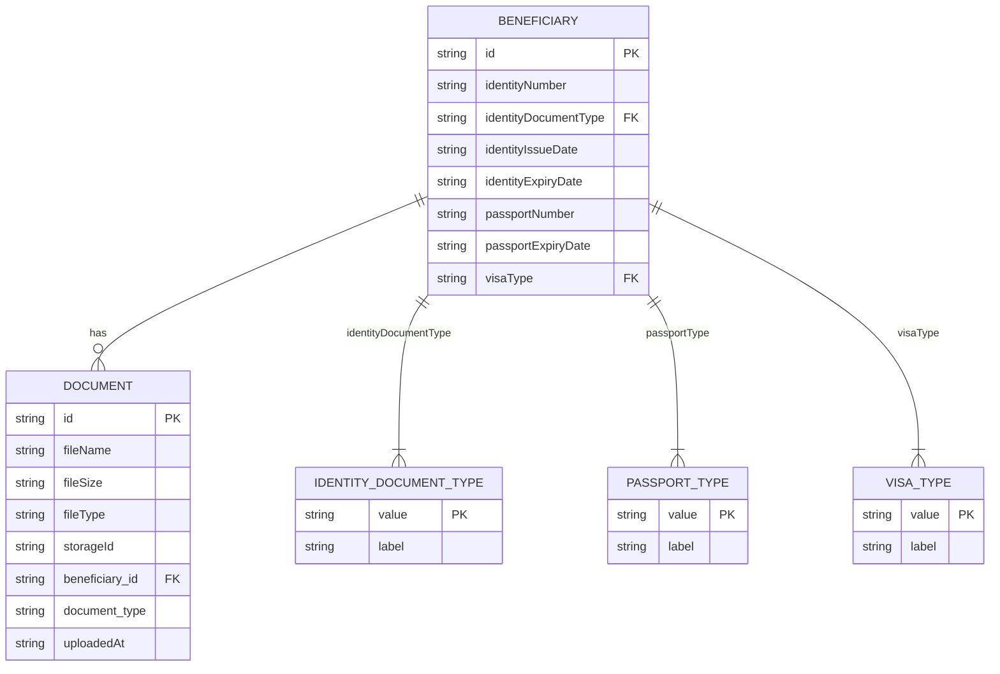
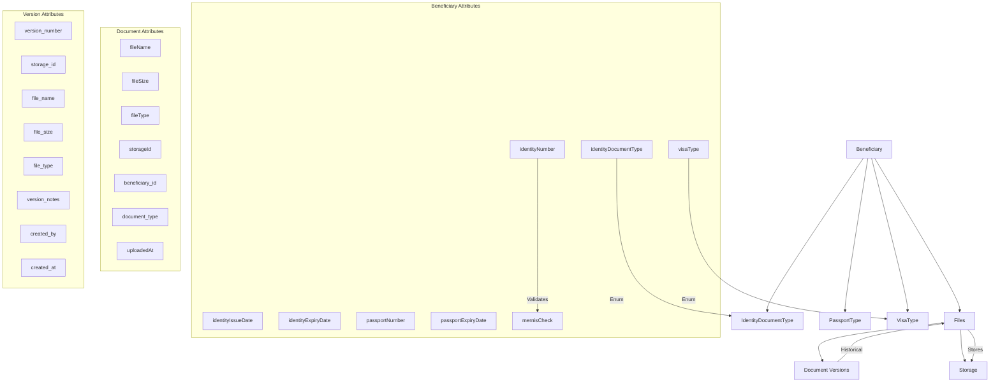

# Identification and Documentation

<cite>
**Referenced Files in This Document**   
- [beneficiaries.ts](file://convex/beneficiaries.ts)
- [documents.ts](file://convex/documents.ts)
- [beneficiary.ts](file://src/types/beneficiary.ts)
- [beneficiary.ts](file://src/lib/validations/beneficiary.ts)
</cite>

## Table of Contents

1. [Introduction](#introduction)
2. [Core Identification Fields](#core-identification-fields)
3. [Document Type Enumerations](#document-type-enumerations)
4. [Validation Rules and Constraints](#validation-rules-and-constraints)
5. [Mernis Verification System](#mernis-verification-system)
6. [Document Management and File Storage](#document-management-and-file-storage)
7. [Data Model Relationships](#data-model-relationships)

## Introduction

This document provides comprehensive documentation for the identification and documentation fields within the beneficiaries collection of the Kafkasder-panel system. The documentation details the data model structure, validation rules, and business logic surrounding identity verification and document management. The system is designed to support compliance with regulatory requirements through robust identity verification processes, including integration with Turkey's Mernis national database. The documentation covers core identification fields such as identityNumber, identityDocumentType, identityIssueDate, identityExpiryDate, passportNumber, passportExpiryDate, and visaType, along with their associated validation rules and enumeration types.

**Section sources**

- [beneficiary.ts](file://src/types/beneficiary.ts#L28-L154)
- [beneficiary.ts](file://src/lib/validations/beneficiary.ts#L37-L61)

## Core Identification Fields

The beneficiaries collection contains several key identification fields that are essential for verifying and documenting beneficiary information. These fields are structured to support comprehensive identity verification while maintaining data integrity through strict validation rules.

The primary identification field is `identityNumber`, which stores the beneficiary's national identification number. For Turkish citizens, this corresponds to the TC Kimlik No (Turkish Republic Identification Number), a unique 11-digit identifier. This field is validated to ensure it contains exactly 11 digits and passes the official TC Kimlik No algorithmic validation, which includes checks that the first digit cannot be zero and that the 10th and 11th digits conform to specific mathematical formulas based on the preceding digits.

Additional identification fields include `identityIssueDate` and `identityExpiryDate`, which track the validity period of the identification document. These date fields are stored as ISO 8601 strings in the Convex database and are used to monitor document validity and trigger renewal processes. The `passportNumber` field follows similar validation principles to the identityNumber but may have different format requirements depending on the country of issuance. The `passportExpiryDate` field is critical for monitoring the validity of travel documents, particularly for non-Turkish beneficiaries.

**Section sources**

- [beneficiary.ts](file://src/types/beneficiary.ts#L433-L448)
- [beneficiary.ts](file://src/lib/validations/beneficiary.ts#L208-L219)

## Document Type Enumerations

The system implements three key enumeration types to standardize the classification of identification documents: IdentityDocumentType, PassportType, and VisaType. These enumerations ensure data consistency and support reporting and compliance requirements.

The `IdentityDocumentType` enumeration defines the acceptable types of identification documents that can be associated with a beneficiary. The available options include:

- NUFUS_CUZDANI (Population Register)
- TC_KIMLIK_BELGESI (Turkish Identification Document)
- PASAPORT (Passport)
- SURUCU_BELGESI (Driver's License)
- DIGER (Other)

The `PassportType` enumeration categorizes different types of passports that beneficiaries may hold:

- DIPLOMATIK (Diplomatic)
- GECICI (Temporary)
- UMUMI (General)
- HIZMET (Service)

The `VisaType` enumeration specifies the purpose and category of visas held by beneficiaries:

- TURIST (Tourist)
- CALISMA (Work)
- EGITIM (Education)
- AILE_BIRLESIMI (Family Reunification)
- INSANI (Humanitarian)
- DIGER (Other)

These enumerations are implemented as TypeScript enums and are used throughout the application to ensure consistent data entry and facilitate filtering and reporting capabilities.

**Diagram sources**

- [beneficiary.ts](file://src/types/beneficiary.ts#L28-L41)
- [beneficiary.ts](file://src/types/beneficiary.ts#L147-L154)

**Section sources**

- [beneficiary.ts](file://src/types/beneficiary.ts#L28-L41)
- [beneficiary.ts](file://src/types/beneficiary.ts#L147-L154)

## Validation Rules and Constraints

The identification fields are subject to comprehensive validation rules implemented at both the frontend and backend levels to ensure data quality and compliance. These validation rules are defined using Zod schemas in the frontend and reinforced with server-side validation in the Convex functions.

The `identityNumber` field undergoes rigorous validation to ensure it conforms to the Turkish TC Kimlik No standard. The validation includes:

- Length check: Must be exactly 11 characters
- Format check: Must contain only numeric characters
- Algorithmic validation: Must pass the official TC Kimlik No validation algorithm
- Business rule: The first digit cannot be zero

Date fields such as `identityIssueDate`, `identityExpiryDate`, `passportExpiryDate`, and `visaExpiryDate` are validated to ensure they represent valid dates and that expiry dates are not in the past. The system also enforces logical relationships between dates, such as ensuring that the identity issue date precedes the expiry date.

Additional validation rules include:

- The `mernisCheck` flag must be set to true when a Turkish TC Kimlik No is provided
- Passport numbers must be alphanumeric and follow standard international formats
- Visa types must correspond to valid categories as defined in the VisaType enumeration
- Document type selections must be consistent with the provided identification information

These validation rules are implemented in the `beneficiarySchema` Zod schema and are applied during form submission to prevent invalid data from being stored in the database.

**Section sources**

- [beneficiary.ts](file://src/lib/validations/beneficiary.ts#L37-L61)
- [beneficiary.ts](file://src/lib/validations/beneficiary.ts#L332-L364)

## Mernis Verification System

The Mernis (Central Civil Registration System) verification system is a critical component of the identification process for Turkish beneficiaries. The `mernisCheck` boolean flag indicates whether a beneficiary's identity has been verified against Turkey's national population database.

When a user enters a Turkish TC Kimlik No in the identityNumber field, the system requires that the Mernis verification process be completed. This is enforced through a validation rule that prevents saving beneficiary records with a Turkish identity number unless the mernisCheck flag is set to true. The verification process involves calling the Mernis API with the provided identity number and validating the response against the beneficiary's recorded information, including name, date of birth, and nationality.

The Mernis verification process serves multiple compliance purposes:

- Confirms the authenticity of the provided identity number
- Validates that the identity number is active and belongs to a living person
- Cross-checks personal information against official government records
- Helps prevent identity fraud and duplicate registrations

The system provides a user interface for initiating the Mernis check, which displays appropriate success or error messages based on the verification outcome. Successful verification is logged in the system, creating an audit trail for compliance purposes.

**Section sources**

- [beneficiary.ts](file://src/types/beneficiary.ts#L550-L559)
- [beneficiary.ts](file://src/lib/validations/beneficiary.ts#L352-L364)

## Document Management and File Storage

Identification documents are managed through a dedicated document management system that links scanned copies of physical documents to beneficiary records. The system uses Convex's file storage capabilities to securely store document images and PDFs, with metadata stored in the files collection.

Each document is associated with a beneficiary through the `beneficiary_id` field in the files collection. The document metadata includes:

- fileName: Original name of the uploaded file
- fileSize: Size of the file in bytes
- fileType: MIME type of the file
- storageId: Unique identifier in Convex's storage system
- document_type: Category of the document (e.g., 'identity', 'passport', 'visa')
- uploadedAt: Timestamp of upload
- uploadedBy: Reference to the user who uploaded the document

The system supports document versioning, allowing updated versions of identification documents to be uploaded while preserving the history of previous versions. When a new version is uploaded, the system creates a version history entry in the document_versions collection, capturing the previous version's metadata and storage ID. This enables rollback to previous versions if needed and maintains a complete audit trail of document changes.

Access to documents is controlled through the `accessLevel` field, which can be set to 'public', 'private', or 'restricted', and the `sharedWith` array, which specifies which users have access to restricted documents.

**Section sources**

- [documents.ts](file://convex/documents.ts#L53-L77)
- [schema.ts](file://convex/schema.ts#L607-L634)

## Data Model Relationships

The identification and documentation system is built on a relational data model that connects beneficiaries with their supporting documents through well-defined relationships. The primary relationship is between the beneficiaries collection and the files collection, established through the `beneficiary_id` field in the files collection.

This one-to-many relationship allows each beneficiary to have multiple identification documents, such as a national ID card, passport, visa, and residence permit. The relationship is indexed for performance, enabling efficient retrieval of all documents for a specific beneficiary through the `by_beneficiary` index.

The system also maintains relationships between documents and their versions through the document_versions collection, which references the original document via the `document_id` field. This creates a version history chain that preserves document evolution over time.

The data model supports complex queries for document management, including:

- Retrieving all identification documents for a specific beneficiary
- Searching for documents by type, upload date, or uploader
- Finding documents that are approaching expiration
- Generating reports on document completeness and verification status

These relationships and query capabilities enable comprehensive document management and support the organization's compliance and verification processes.

**Diagram sources**

- [documents.ts](file://convex/documents.ts#L5-L24)
- [schema.ts](file://convex/schema.ts#L607-L634)

**Section sources**

- [documents.ts](file://convex/documents.ts#L5-L24)
- [schema.ts](file://convex/schema.ts#L607-L634)
