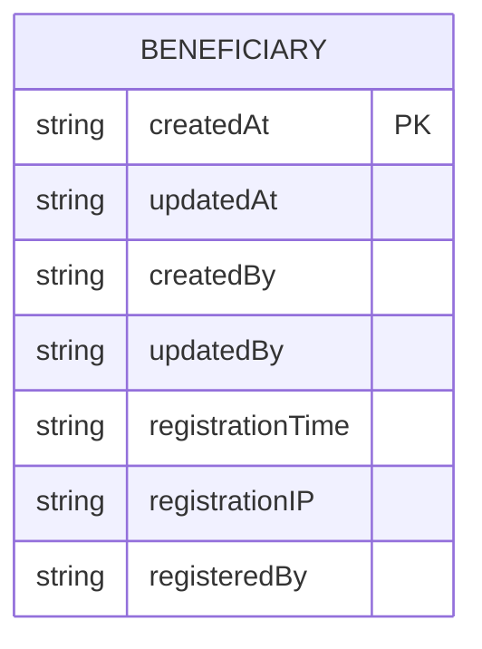
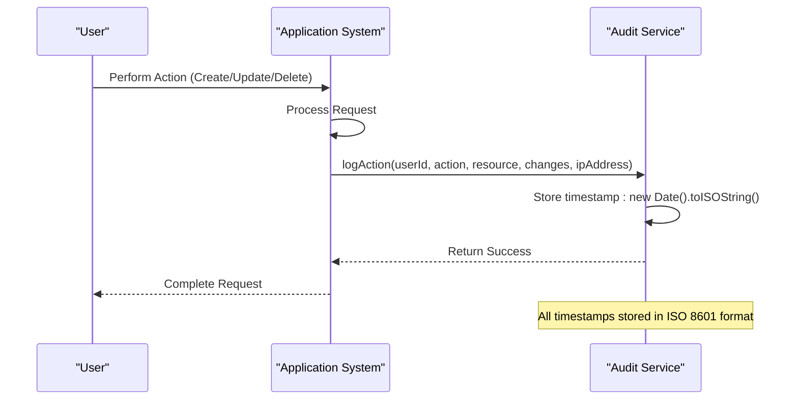
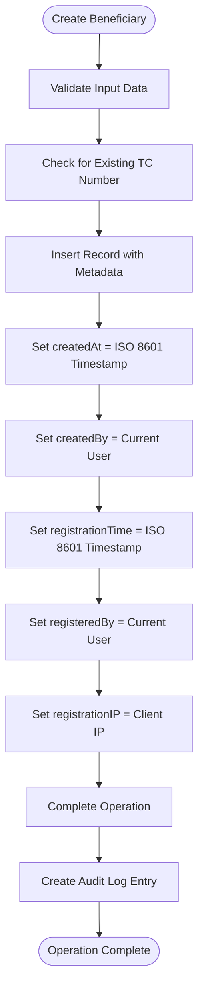

# Metadata and Audit Information

<cite>
**Referenced Files in This Document**   
- [schema.ts](file://convex/schema.ts)
- [beneficiaries.ts](file://convex/beneficiaries.ts)
- [audit_logs.ts](file://convex/audit_logs.ts)
- [beneficiary.ts](file://src/types/beneficiary.ts)
- [beneficiary.ts](file://src/lib/validations/beneficiary.ts)
- [data_import_export.ts](file://convex/data_import_export.ts)
</cite>

## Table of Contents

1. [Introduction](#introduction)
2. [Core Metadata Fields](#core-metadata-fields)
3. [Audit Trail Implementation](#audit-trail-implementation)
4. [Data Integrity and Compliance](#data-integrity-and-compliance)
5. [System Automation and Population](#system-automation-and-population)
6. [Usage for Issue Investigation](#usage-for-issue-investigation)
7. [Audit Reporting Capabilities](#audit-reporting-capabilities)

## Introduction

This document provides comprehensive documentation for the metadata and audit information fields within the beneficiaries collection of the non-profit organization's system. The metadata fields—including createdAt, updatedAt, createdBy, updatedBy, registrationTime, registrationIP, and registeredBy—play a critical role in maintaining data integrity, enabling audit trails, and ensuring compliance with regulatory requirements. These fields are automatically populated by the system to track changes, support investigations, and generate audit reports. The system utilizes Convex as the backend database, which stores timestamps in ISO 8601 format, ensuring standardized and consistent time representation across the application.

**Section sources**

- [schema.ts](file://convex/schema.ts#L47-L154)
- [beneficiary.ts](file://src/types/beneficiary.ts#L501-L506)

## Core Metadata Fields

The beneficiaries collection contains several critical metadata fields that provide essential context about record creation, modification, and registration. These fields are defined in the Convex schema and TypeScript interfaces, ensuring type safety and consistency across the application.

### Creation and Modification Metadata

The following fields track when records are created and modified:

- **createdAt**: String field storing the ISO 8601 timestamp when the beneficiary record was created. This field is automatically populated by the system upon record creation.
- **updatedAt**: String field storing the ISO 8601 timestamp when the beneficiary record was last modified. This field is automatically updated whenever any changes are made to the record.
- **createdBy**: String field containing the identifier of the user who created the beneficiary record. This provides accountability for record creation.
- **updatedBy**: String field containing the identifier of the user who last modified the beneficiary record. This enables tracking of all changes to the record.

These fields are implemented in both the Convex schema definition and the TypeScript interface, ensuring consistency between the database structure and application code.

### Registration Metadata

Additional fields capture information about the initial registration process:

- **registrationTime**: String field storing the ISO 8601 timestamp when the beneficiary was registered in the system.
- **registrationIP**: String field containing the IP address from which the beneficiary registration was made, providing geographical and network context.
- **registeredBy**: String field identifying the user or system component that registered the beneficiary.

These registration fields are particularly valuable for security audits and compliance reporting, as they establish the provenance of beneficiary records.

**Diagram sources**

- [schema.ts](file://convex/schema.ts#L47-L154)
- [beneficiary.ts](file://src/types/beneficiary.ts#L491-L499)

**Section sources**

- [schema.ts](file://convex/schema.ts#L47-L154)
- [beneficiary.ts](file://src/types/beneficiary.ts#L491-L506)
- [beneficiary.ts](file://src/lib/validations/beneficiary.ts#L293-L297)

## Audit Trail Implementation

The system implements a comprehensive audit trail mechanism through the audit_logs collection, which captures all critical operations performed within the application. This implementation ensures complete traceability of actions taken on beneficiary records and other system entities.

### Audit Log Structure

The audit_logs collection is designed to capture detailed information about each operation:

- **userId**: Reference to the user who performed the action
- **userName**: Display name of the user at the time of the action
- **action**: Type of action performed (CREATE, UPDATE, DELETE, VIEW)
- **resource**: Type of resource affected (e.g., 'beneficiary', 'user')
- **resourceId**: Identifier of the specific resource affected
- **changes**: Details of changes made, particularly for UPDATE operations
- **ipAddress**: IP address from which the action was performed
- **userAgent**: User agent string identifying the client application
- **timestamp**: ISO 8601 timestamp of when the action occurred
- **metadata**: Additional contextual information about the action

### Audit Logging Workflow

The audit logging process is implemented through the logAction mutation in the audit_logs module. When any critical operation occurs, the system automatically creates an audit log entry with the relevant details. For example, when a beneficiary record is created or updated, the system logs this action with the appropriate metadata.

The audit system also includes query functions to retrieve audit logs with various filters, such as by user, resource, action type, or date range. This enables targeted investigations and reporting.

**Diagram sources**

- [audit_logs.ts](file://convex/audit_logs.ts#L12-L34)
- [schema.ts](file://convex/schema.ts#L1179-L1220)

**Section sources**

- [audit_logs.ts](file://convex/audit_logs.ts#L12-L93)
- [schema.ts](file://convex/schema.ts#L1179-L1220)

## Data Integrity and Compliance

The metadata and audit information fields play a crucial role in maintaining data integrity and ensuring compliance with regulatory requirements for the non-profit organization.

### Data Integrity Mechanisms

The system employs several mechanisms to ensure data integrity:

- **Immutable Timestamps**: Creation timestamps (createdAt, registrationTime) are set once upon record creation and cannot be modified, establishing a reliable audit trail.
- **Automatic Updates**: Modification timestamps (updatedAt) are automatically updated by the system whenever changes occur, preventing tampering with modification history.
- **User Attribution**: All changes are attributed to specific users (createdBy, updatedBy, registeredBy), creating accountability for data modifications.
- **IP Tracking**: Registration and modification IP addresses are recorded, providing additional context for security investigations.

### Compliance Support

These metadata fields directly support compliance with various regulatory requirements:

- **Audit Requirements**: The comprehensive audit trail satisfies requirements for tracking changes to beneficiary records, demonstrating accountability and transparency.
- **Data Provenance**: The registration metadata establishes the origin of beneficiary records, which is essential for verifying data authenticity.
- **Change Tracking**: The ability to track all modifications to beneficiary records supports compliance with data governance policies.
- **Security Audits**: IP address tracking and user attribution enable effective security investigations and incident response.

The system's use of ISO 8601 timestamps ensures consistency and standardization, which is particularly important for compliance reporting that may need to correlate events across different systems or time zones.

**Section sources**

- [schema.ts](file://convex/schema.ts#L47-L154)
- [audit_logs.ts](file://convex/audit_logs.ts#L12-L93)
- [data_import_export.ts](file://convex/data_import_export.ts#L203-L276)

## System Automation and Population

The metadata fields are automatically populated by the system without requiring manual input, ensuring consistency and reliability of the audit trail.

### Automatic Field Population

The system implements automatic population of metadata fields through several mechanisms:

- **Creation Time**: The createdAt field is automatically set to the current ISO 8601 timestamp when a new beneficiary record is inserted into the database.
- **Registration Time**: The registrationTime field is set to the current timestamp when a beneficiary is registered, typically during the create operation.
- **User Attribution**: The createdBy and registeredBy fields are populated with the authenticated user's identifier from the request context.
- **IP Address**: The registrationIP field captures the client's IP address from the HTTP request headers.

### Mutation Handlers

The automatic population is implemented in the mutation handlers within the beneficiaries module. When a create operation is performed, the system automatically includes the metadata fields in the database insertion. Similarly, update operations automatically update the updatedAt field and updatedBy field with the current timestamp and user identifier.

The audit logging system also automatically captures timestamps using new Date().toISOString(), ensuring all audit entries use the standardized ISO 8601 format.

**Diagram sources**

- [beneficiaries.ts](file://convex/beneficiaries.ts#L89-L169)
- [audit_logs.ts](file://convex/audit_logs.ts#L12-L34)

**Section sources**

- [beneficiaries.ts](file://convex/beneficiaries.ts#L89-L169)
- [audit_logs.ts](file://convex/audit_logs.ts#L12-L34)
- [data_import_export.ts](file://convex/data_import_export.ts#L203-L276)

## Usage for Issue Investigation

The metadata and audit information fields are essential tools for investigating issues and understanding the history of beneficiary records.

### Investigation Capabilities

The comprehensive metadata enables several types of investigations:

- **Change History**: By examining createdAt, updatedAt, createdBy, and updatedBy fields, investigators can understand the complete history of a beneficiary record.
- **Timeline Reconstruction**: The ISO 8601 timestamps allow precise reconstruction of events, helping to establish sequences of actions.
- **User Activity Analysis**: The createdBy, updatedBy, and registeredBy fields enable analysis of user activity patterns and accountability.
- **Security Incident Response**: The registrationIP and audit log IP addresses help identify potential security incidents or unauthorized access.

### Audit Log Queries

The system provides query functions to facilitate investigations:

- **getResourceHistory**: Retrieves all audit log entries for a specific resource, showing the complete change history.
- **list with filters**: Allows filtering audit logs by user, action type, resource, or date range to focus investigations.
- **getStats**: Provides statistical analysis of audit events over a specified time period.

These capabilities enable the non-profit organization to quickly respond to data quality issues, security concerns, or compliance inquiries by providing a complete and verifiable record of all system activities.

**Section sources**

- [audit_logs.ts](file://convex/audit_logs.ts#L97-L156)
- [beneficiaries.ts](file://convex/beneficiaries.ts#L172-L214)

## Audit Reporting Capabilities

The metadata and audit trail system provides robust capabilities for generating compliance reports and operational insights for the non-profit organization.

### Report Generation

The system supports several types of audit reports:

- **Change Logs**: Comprehensive reports showing all modifications to beneficiary records over a specified period.
- **User Activity Reports**: Summaries of actions performed by specific users, useful for performance evaluation and security monitoring.
- **Compliance Reports**: Formal documentation of data handling practices, demonstrating adherence to regulatory requirements.
- **Operational Analytics**: Statistical reports on system usage patterns and workflow efficiency.

### Data Export and Analysis

The audit information can be exported and analyzed to support organizational decision-making:

- **Data Export**: Audit logs can be exported in standard formats (CSV, Excel) for external analysis.
- **Trend Analysis**: Longitudinal analysis of audit data can identify patterns in user behavior and system usage.
- **Compliance Verification**: Regular audit reports can verify ongoing compliance with data governance policies.
- **Process Improvement**: Analysis of audit data can identify bottlenecks and inefficiencies in workflows.

The use of standardized ISO 8601 timestamps ensures that audit reports maintain temporal accuracy and consistency, which is critical for regulatory compliance and cross-system integration.

**Section sources**

- [audit_logs.ts](file://convex/audit_logs.ts#L97-L156)
- [data_import_export.ts](file://convex/data_import_export.ts#L203-L276)
