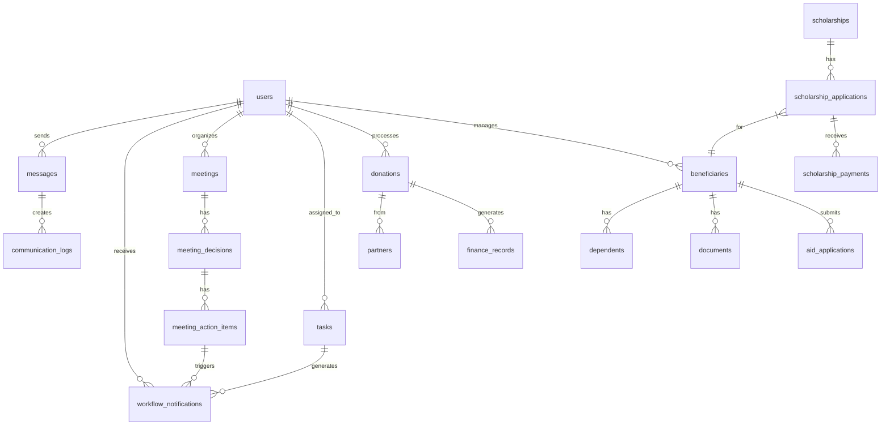

# Data Model

<cite>
**Referenced Files in This Document**   
- [schema.ts](file://convex/schema.ts)
- [beneficiaries.ts](file://convex/beneficiaries.ts)
- [donations.ts](file://convex/donations.ts)
- [users.ts](file://convex/users.ts)
- [tasks.ts](file://convex/tasks.ts)
- [meetings.ts](file://convex/meetings.ts)
- [scholarships.ts](file://convex/scholarships.ts)
- [aid_applications.ts](file://convex/aid_applications.ts)
- [meeting_action_items.ts](file://convex/meeting_action_items.ts)
- [meeting_decisions.ts](file://convex/meeting_decisions.ts)
- [workflow_notifications.ts](file://convex/workflow_notifications.ts)
- [messages.ts](file://convex/messages.ts)
- [partners.ts](file://convex/partners.ts)
</cite>

## Table of Contents

1. [Introduction](#introduction)
2. [Core Entity Relationships](#core-entity-relationships)
3. [Collection Field Definitions](#collection-field-definitions)
   - [Beneficiaries](#beneficiaries)
   - [Donations](#donations)
   - [Users](#users)
   - [Tasks](#tasks)
   - [Meetings](#meetings)
   - [Scholarships](#scholarships)
4. [Primary and Foreign Keys](#primary-and-foreign-keys)
5. [Indexes and Search Configuration](#indexes-and-search-configuration)
6. [Data Validation Rules](#data-validation-rules)
7. [Business Logic in Schema](#business-logic-in-schema)
8. [Data Access Patterns](#data-access-patterns)
9. [Caching Strategies](#caching-strategies)
10. [Performance Considerations](#performance-considerations)
11. [Data Lifecycle and Retention](#data-lifecycle-and-retention)

## Introduction

The Kafkasder-panel application manages humanitarian aid operations through a comprehensive data model built on Convex. This document details the core collections—beneficiaries, donations, users, tasks, meetings, and scholarships—along with their relationships, field definitions, constraints, and operational characteristics. The schema supports complex workflows including aid applications, scholarship management, meeting decisions, and task tracking, with robust validation, indexing, and business logic embedded directly in the data layer.

**Section sources**

- [schema.ts](file://convex/schema.ts#L1-L1446)

## Core Entity Relationships

The data model centers around beneficiaries who receive aid, supported by users who manage operations. Donations provide financial resources, while tasks and meetings coordinate activities. Scholarships represent a specialized form of aid with dedicated application and payment workflows. The relationships between these entities enable comprehensive tracking of humanitarian operations.

**Diagram sources**

- [schema.ts](file://convex/schema.ts#L1-L1446)

## Collection Field Definitions

### Beneficiaries

The beneficiaries collection stores detailed information about aid recipients, including personal details, family composition, socioeconomic status, health information, and aid history.

| Field                  | Type    | Description                      | Constraints                             |
| ---------------------- | ------- | -------------------------------- | --------------------------------------- |
| name                   | string  | Full name of the beneficiary     | Required                                |
| tc_no                  | string  | Turkish National Identity Number | Required, 11 digits, unique             |
| phone                  | string  | Contact phone number             | Required                                |
| email                  | string  | Email address                    | Optional                                |
| birth_date             | string  | Date of birth                    | Optional                                |
| gender                 | string  | Gender                           | Optional                                |
| nationality            | string  | Nationality                      | Optional                                |
| religion               | string  | Religious affiliation            | Optional                                |
| marital_status         | string  | Marital status                   | Optional                                |
| address                | string  | Full address                     | Required                                |
| city                   | string  | City of residence                | Required                                |
| district               | string  | District of residence            | Required                                |
| neighborhood           | string  | Neighborhood of residence        | Required                                |
| family_size            | number  | Total number of people in family | Required                                |
| children_count         | number  | Number of children               | Optional                                |
| orphan_children_count  | number  | Number of orphan children        | Optional                                |
| elderly_count          | number  | Number of elderly individuals    | Optional                                |
| disabled_count         | number  | Number of disabled individuals   | Optional                                |
| income_level           | string  | Household income level           | Optional                                |
| income_source          | string  | Source of income                 | Optional                                |
| has_debt               | boolean | Indicates significant debt       | Optional                                |
| housing_type           | string  | Type of housing                  | Optional                                |
| has_vehicle            | boolean | Indicates vehicle ownership      | Optional                                |
| health_status          | string  | General health status            | Optional                                |
| has_chronic_illness    | boolean | Indicates chronic illness        | Optional                                |
| chronic_illness_detail | string  | Details of chronic illness       | Optional                                |
| has_disability         | boolean | Indicates disability             | Optional                                |
| disability_detail      | string  | Details of disability            | Optional                                |
| has_health_insurance   | boolean | Indicates health insurance       | Optional                                |
| regular_medication     | string  | Regular medication details       | Optional                                |
| education_level        | string  | Highest education level          | Optional                                |
| occupation             | string  | Current/last occupation          | Optional                                |
| employment_status      | string  | Employment status                | Optional                                |
| aid_type               | string  | Type of aid received             | Optional                                |
| totalAidAmount         | number  | Total monetary aid received      | Optional                                |
| aid_duration           | string  | Duration of aid provision        | Optional                                |
| priority               | string  | Aid priority level               | Optional                                |
| reference_name         | string  | Referrer's name                  | Optional                                |
| reference_phone        | string  | Referrer's phone                 | Optional                                |
| reference_relation     | string  | Relationship to referrer         | Optional                                |
| application_source     | string  | How application was received     | Optional                                |
| notes                  | string  | General notes                    | Optional                                |
| previous_aid           | boolean | Previous aid from organization   | Optional                                |
| other_organization_aid | boolean | Aid from other organizations     | Optional                                |
| emergency              | boolean | Emergency situation flag         | Optional                                |
| contact_preference     | string  | Preferred contact method         | Optional                                |
| status                 | enum    | Record status                    | Required: TASLAK, AKTIF, PASIF, SILINDI |
| approval_status        | enum    | Application approval status      | Optional: pending, approved, rejected   |
| approved_by            | string  | ID of approving user             | Optional                                |
| approved_at            | string  | Timestamp of approval            | Optional                                |

**Section sources**

- [schema.ts](file://convex/schema.ts#L43-L155)
- [beneficiaries.ts](file://convex/beneficiaries.ts#L1-L229)

### Donations

The donations collection records all incoming donations, including standard donations and Kumbara (money box) collections, with detailed financial and logistical information.

| Field                | Type    | Description                          | Constraints                                   |
| -------------------- | ------- | ------------------------------------ | --------------------------------------------- |
| donor_name           | string  | Name of the donor                    | Required                                      |
| donor_phone          | string  | Donor's phone number                 | Required                                      |
| donor_email          | string  | Donor's email address                | Optional                                      |
| amount               | number  | Donation amount                      | Required                                      |
| currency             | enum    | Currency of donation                 | Required: TRY, USD, EUR                       |
| donation_type        | string  | Type of donation                     | Required                                      |
| payment_method       | string  | Payment method                       | Required                                      |
| donation_purpose     | string  | Purpose/campaign                     | Required                                      |
| notes                | string  | Additional notes                     | Optional                                      |
| receipt_number       | string  | Unique receipt number                | Required                                      |
| receipt_file_id      | string  | ID of stored receipt file            | Optional                                      |
| status               | enum    | Transaction status                   | Required: pending, completed, cancelled       |
| is_kumbara           | boolean | Indicates Kumbara donation           | Optional                                      |
| kumbara_location     | string  | Location of Kumbara                  | Optional                                      |
| collection_date      | string  | Date of Kumbara collection           | Optional                                      |
| kumbara_institution  | string  | Institution where Kumbara is located | Optional                                      |
| location_coordinates | object  | GPS coordinates of location          | Optional: {lat: number, lng: number}          |
| location_address     | string  | Address of location                  | Optional                                      |
| route_points         | array   | GPS points defining collection route | Optional: array of {lat: number, lng: number} |
| route_distance       | number  | Total route distance in meters       | Optional                                      |
| route_duration       | number  | Estimated route duration in seconds  | Optional                                      |

**Section sources**

- [schema.ts](file://convex/schema.ts#L164-L216)
- [donations.ts](file://convex/donations.ts#L1-L149)

### Users

The users collection stores user account information for system access and role-based permissions.

| Field              | Type    | Description                      | Constraints                  |
| ------------------ | ------- | -------------------------------- | ---------------------------- |
| name               | string  | Full name of the user            | Required                     |
| email              | string  | Unique email address             | Required, unique, normalized |
| role               | string  | User role                        | Required                     |
| permissions        | array   | Specific permissions             | Optional                     |
| phone              | string  | Phone number                     | Optional                     |
| avatar             | string  | URL of avatar image              | Optional                     |
| isActive           | boolean | Account active status            | Required                     |
| labels             | array   | Categorization tags              | Optional                     |
| createdAt          | string  | Account creation timestamp       | Optional                     |
| lastLogin          | string  | Last login timestamp             | Optional                     |
| passwordHash       | string  | Hashed password                  | Optional                     |
| two_factor_enabled | boolean | Two-factor authentication status | Optional                     |

**Section sources**

- [schema.ts](file://convex/schema.ts#L5-L37)
- [users.ts](file://convex/users.ts#L1-L220)

### Tasks

The tasks collection manages work assignments within the organization, with priority levels and status tracking.

| Field        | Type        | Description                  | Constraints                                          |
| ------------ | ----------- | ---------------------------- | ---------------------------------------------------- |
| title        | string      | Task title                   | Required                                             |
| description  | string      | Detailed description         | Optional                                             |
| assigned_to  | Id<'users'> | User assigned to task        | Optional                                             |
| created_by   | Id<'users'> | User who created task        | Required                                             |
| priority     | enum        | Task priority                | Required: low, normal, high, urgent                  |
| status       | enum        | Task status                  | Required: pending, in_progress, completed, cancelled |
| due_date     | string      | Due date                     | Optional                                             |
| completed_at | string      | Completion timestamp         | Optional                                             |
| category     | string      | Task category                | Optional                                             |
| tags         | array       | Organizational tags          | Optional                                             |
| is_read      | boolean     | Read status by assigned user | Required                                             |

**Section sources**

- [schema.ts](file://convex/schema.ts#L218-L258)
- [tasks.ts](file://convex/tasks.ts#L1-L140)

### Meetings

The meetings collection stores information about scheduled organizational meetings, including participants and agendas.

| Field        | Type        | Description                   | Constraints                                        |
| ------------ | ----------- | ----------------------------- | -------------------------------------------------- |
| title        | string      | Meeting title/subject         | Required                                           |
| description  | string      | Detailed description/agenda   | Optional                                           |
| meeting_date | string      | Date and time of meeting      | Required                                           |
| location     | string      | Physical or virtual location  | Optional                                           |
| organizer    | Id<'users'> | User who organized meeting    | Required                                           |
| participants | array       | Array of participant user IDs | Required                                           |
| status       | enum        | Meeting status                | Required: scheduled, ongoing, completed, cancelled |
| meeting_type | enum        | Type of meeting               | Required: general, committee, board, other         |
| agenda       | string      | Formal agenda                 | Optional                                           |
| notes        | string      | Meeting minutes/notes         | Optional                                           |

**Section sources**

- [schema.ts](file://convex/schema.ts#L260-L298)
- [meetings.ts](file://convex/meetings.ts#L1-L124)

### Scholarships

The scholarships collection manages scholarship programs, applications, and payments as a specialized form of aid.

**Scholarship Programs**

| Field                  | Type    | Description              | Constraints             |
| ---------------------- | ------- | ------------------------ | ----------------------- |
| title                  | string  | Scholarship title        | Required                |
| description            | string  | Program description      | Optional                |
| amount                 | number  | Scholarship amount       | Required                |
| currency               | enum    | Currency                 | Required: TRY, USD, EUR |
| duration_months        | number  | Duration in months       | Optional                |
| category               | string  | Scholarship category     | Required                |
| eligibility_criteria   | string  | Eligibility requirements | Optional                |
| requirements           | array   | Application requirements | Optional                |
| application_start_date | string  | Application period start | Required                |
| application_end_date   | string  | Application period end   | Required                |
| academic_year          | string  | Academic year            | Optional                |
| max_recipients         | number  | Maximum recipients       | Optional                |
| is_active              | boolean | Program active status    | Required                |

**Scholarship Applications**

| Field             | Type                | Description               | Constraints                                                              |
| ----------------- | ------------------- | ------------------------- | ------------------------------------------------------------------------ |
| scholarship_id    | Id<'scholarships'>  | Associated scholarship    | Required                                                                 |
| student_id        | Id<'beneficiaries'> | Associated beneficiary    | Optional                                                                 |
| applicant_name    | string              | Applicant's name          | Required                                                                 |
| applicant_tc_no   | string              | Applicant's TC number     | Required, 11 digits                                                      |
| applicant_phone   | string              | Applicant's phone         | Required                                                                 |
| applicant_email   | string              | Applicant's email         | Optional                                                                 |
| university        | string              | University name           | Optional                                                                 |
| department        | string              | Academic department       | Optional                                                                 |
| grade_level       | string              | Current grade level       | Optional                                                                 |
| gpa               | number              | Grade point average       | Optional                                                                 |
| academic_year     | string              | Academic year             | Optional                                                                 |
| monthly_income    | number              | Monthly income            | Optional                                                                 |
| family_income     | number              | Family income             | Optional                                                                 |
| father_occupation | string              | Father's occupation       | Optional                                                                 |
| mother_occupation | string              | Mother's occupation       | Optional                                                                 |
| sibling_count     | number              | Number of siblings        | Optional                                                                 |
| is_orphan         | boolean             | Orphan status             | Optional                                                                 |
| has_disability    | boolean             | Disability status         | Optional                                                                 |
| essay             | string              | Application essay         | Optional                                                                 |
| documents         | array               | Document IDs              | Optional                                                                 |
| priority_score    | number              | Calculated priority score | Required                                                                 |
| status            | enum                | Application status        | Required: draft, submitted, under_review, approved, rejected, waitlisted |
| created_at        | string              | Creation timestamp        | Required                                                                 |

**Scholarship Payments**

| Field             | Type                           | Description                | Constraints                                |
| ----------------- | ------------------------------ | -------------------------- | ------------------------------------------ |
| application_id    | Id<'scholarship_applications'> | Associated application     | Required                                   |
| payment_date      | string                         | Date of payment            | Required                                   |
| amount            | number                         | Payment amount             | Required                                   |
| currency          | enum                           | Currency                   | Required: TRY, USD, EUR                    |
| payment_method    | string                         | Payment method             | Required                                   |
| payment_reference | string                         | Payment reference          | Optional                                   |
| bank_account      | string                         | Bank account details       | Optional                                   |
| notes             | string                         | Payment notes              | Optional                                   |
| status            | enum                           | Payment status             | Required: pending, paid, failed, cancelled |
| created_at        | string                         | Creation timestamp         | Required                                   |
| processed_by      | Id<'users'>                    | User who processed payment | Optional                                   |
| receipt_file_id   | string                         | ID of receipt file         | Optional                                   |

**Section sources**

- [schema.ts](file://convex/schema.ts#L796-L800)
- [scholarships.ts](file://convex/scholarships.ts#L1-L468)

## Primary and Foreign Keys

The data model uses Convex's document ID system for primary keys, with foreign keys implemented as references to other collection documents.

**Primary Keys**

- All collections use Convex-generated document IDs as primary keys
- IDs are automatically generated on document creation
- Format: unique string identifiers managed by Convex

**Foreign Key Relationships**

- `beneficiaries.beneficiary_id` references `users._id` (approved_by)
- `donations.receipt_file_id` references `files._id`
- `tasks.assigned_to` references `users._id`
- `tasks.created_by` references `users._id`
- `meetings.organizer` references `users._id`
- `meetings.participants` array references `users._id`
- `meeting_decisions.meeting_id` references `meetings._id`
- `meeting_decisions.owner` references `users._id`
- `meeting_decisions.created_by` references `users._id`
- `meeting_action_items.meeting_id` references `meetings._id`
- `meeting_action_items.decision_id` references `meeting_decisions._id`
- `meeting_action_items.assigned_to` references `users._id`
- `meeting_action_items.created_by` references `users._id`
- `workflow_notifications.recipient` references `users._id`
- `workflow_notifications.triggered_by` references `users._id`
- `messages.sender` references `users._id`
- `messages.recipients` array references `users._id`
- `aid_applications.beneficiary_id` references `beneficiaries._id`
- `aid_applications.processed_by` references `users._id`
- `aid_applications.approved_by` references `users._id`
- `finance_records.created_by` references `users._id`
- `finance_records.approved_by` references `users._id`
- `scholarship_applications.scholarship_id` references `scholarships._id`
- `scholarship_applications.student_id` references `beneficiaries._id`
- `scholarship_applications.reviewed_by` references `users._id`
- `scholarship_payments.application_id` references `scholarship_applications._id`
- `scholarship_payments.processed_by` references `users._id`

**Section sources**

- [schema.ts](file://convex/schema.ts#L1-L1446)

## Indexes and Search Configuration

The data model includes comprehensive indexing for efficient querying and search capabilities.

**Database Indexes**

- `users.by_email`: Index on email field for fast user lookup
- `users.by_role`: Index on role field for role-based queries
- `users.by_is_active`: Index on isActive field for status filtering
- `beneficiaries.by_tc_no`: Index on tc_no field for TC number lookup
- `beneficiaries.by_status`: Index on status field for status filtering
- `beneficiaries.by_city`: Index on city field for geographic queries
- `donations.by_status`: Index on status field for transaction status filtering
- `donations.by_donor_email`: Index on donor_email field for donor lookup
- `donations.by_receipt_number`: Index on receipt_number field for receipt lookup
- `donations.by_is_kumbara`: Index on is_kumbara field for Kumbara donation filtering
- `donations.by_kumbara_location`: Index on kumbara_location field for location-based queries
- `tasks.by_assigned_to`: Index on assigned_to field for assignment queries
- `tasks.by_status`: Index on status field for task status filtering
- `tasks.by_created_by`: Index on created_by field for creator-based queries
- `meetings.by_organizer`: Index on organizer field for organizer-based queries
- `meetings.by_status`: Index on status field for meeting status filtering
- `meetings.by_meeting_date`: Index on meeting_date field for date-based queries
- `meeting_decisions.by_meeting`: Index on meeting_id field for meeting-based queries
- `meeting_decisions.by_owner`: Index on owner field for owner-based queries
- `meeting_decisions.by_status`: Index on status field for decision status filtering
- `meeting_action_items.by_meeting`: Index on meeting_id field for meeting-based queries
- `meeting_action_items.by_assigned_to`: Index on assigned_to field for assignment queries
- `meeting_action_items.by_status`: Index on status field for action item status filtering
- `workflow_notifications.by_recipient`: Index on recipient field for recipient-based queries
- `workflow_notifications.by_status`: Index on status field for notification status filtering
- `workflow_notifications.by_category`: Index on category field for category-based queries
- `messages.by_sender`: Index on sender field for sender-based queries
- `messages.by_status`: Index on status field for message status filtering
- `aid_applications.by_beneficiary`: Index on beneficiary_id field for beneficiary-based queries
- `aid_applications.by_stage`: Index on stage field for application stage filtering
- `aid_applications.by_status`: Index on status field for application status filtering
- `finance_records.by_record_type`: Index on record_type field for income/expense filtering
- `finance_records.by_status`: Index on status field for financial record status filtering
- `finance_records.by_created_by`: Index on created_by field for creator-based queries
- `files.by_storage_id`: Index on storageId field for file storage lookup
- `files.by_bucket`: Index on bucket field for storage bucket queries
- `files.by_uploaded_by`: Index on uploadedBy field for uploader-based queries
- `files.by_beneficiary`: Index on beneficiary_id field for beneficiary document queries
- `document_versions.by_document`: Index on document_id field for document version queries
- `report_configs.by_created_by`: Index on created_by field for creator-based queries
- `report_configs.by_active`: Index on is_active field for active configuration filtering
- `security_events.by_user`: Index on user_id field for user-based security queries
- `security_events.by_occurred_at`: Index on occurred_at field for date-based security queries
- `security_events.by_event_type`: Index on event_type field for event type filtering
- `user_sessions.by_user`: Index on user_id field for user session queries
- `user_sessions.by_active`: Index on is_active field for active session filtering
- `rate_limit_log.by_identifier_action`: Composite index on identifier, action, and timestamp fields
- `two_factor_settings.by_user`: Index on user_id field for user 2FA settings
- `trusted_devices.by_user`: Index on user_id field for user trusted devices
- `trusted_devices.by_fingerprint`: Index on device_fingerprint field for device lookup
- `partners.by_type`: Index on type field for partner type filtering
- `partners.by_status`: Index on status field for partner status filtering
- `partners.by_partnership_type`: Index on partnership_type field for partnership type filtering

**Search Indexes**

- `users.by_search`: Full-text search on name field with filter fields email and phone
- `beneficiaries.by_search`: Full-text search on name field with filter fields tc_no, phone, and email
- `messages.by_search`: Full-text search on subject field with filter field content

**Section sources**

- [schema.ts](file://convex/schema.ts#L1-L1446)

## Data Validation Rules

The data model enforces validation rules at both the schema and application levels to ensure data integrity.

**Field-Level Validation**

- `beneficiaries.tc_no`: Must be exactly 11 digits (regex: /^\d{11}$/)
- `users.email`: Normalized to lowercase and trimmed whitespace
- `scholarship_applications.applicant_tc_no`: Must be exactly 11 digits (regex: /^\d{11}$/)
- `donations.amount`: Must be a positive number
- `finance_records.amount`: Must be a positive number
- `tasks.priority`: Must be one of: low, normal, high, urgent
- `tasks.status`: Must be one of: pending, in_progress, completed, cancelled
- `meetings.status`: Must be one of: scheduled, ongoing, completed, cancelled
- `meeting_decisions.status`: Must be one of: acik, devam, kapatildi
- `meeting_action_items.status`: Must be one of: beklemede, devam, hazir, iptal
- `workflow_notifications.status`: Must be one of: beklemede, gonderildi, okundu
- `messages.status`: Must be one of: draft, sent, failed
- `aid_applications.stage`: Must be one of: draft, under_review, approved, ongoing, completed
- `aid_applications.status`: Must be one of: open, closed
- `scholarship_applications.status`: Must be one of: draft, submitted, under_review, approved, rejected, waitlisted
- `scholarship_payments.status`: Must be one of: pending, paid, failed, cancelled

**Business Rule Validation**

- Beneficiary TC numbers must be unique across the system
- User emails must be unique across the system
- Only draft scholarship applications can be submitted
- Task completion automatically sets the completed_at timestamp
- Aid application approval automatically sets the approved_at timestamp
- Message status change to "sent" automatically sets the sent_at timestamp
- Notification status change to "read" automatically sets the read_at timestamp
- Action item completion triggers notifications to administrators

**Section sources**

- [beneficiaries.ts](file://convex/beneficiaries.ts#L4-L229)
- [users.ts](file://convex/users.ts#L4-L220)
- [scholarships.ts](file://convex/scholarships.ts#L5-L468)
- [tasks.ts](file://convex/tasks.ts#L117-L120)
- [aid_applications.ts](file://convex/aid_applications.ts#L136-L142)
- [messages.ts](file://convex/messages.ts#L119-L122)
- [workflow_notifications.ts](file://convex/workflow_notifications.ts#L139-L144)

## Business Logic in Schema

The data model incorporates business logic directly in the schema definitions and mutation functions to ensure consistency and enforce organizational rules.

**Automated Timestamps**

- Task completion automatically sets the completed_at timestamp when status changes to "completed"
- Aid application approval automatically sets the approved_at timestamp when stage changes to "approved"
- Aid application completion automatically sets the completed_at timestamp when stage changes to "completed"
- Message sending automatically sets the sent_at timestamp when status changes to "sent"
- Notification reading automatically sets the read_at timestamp when status changes to "okundu"
- Scholarship application submission automatically sets the submitted_at timestamp when status changes to "submitted"

**Status Transitions**

- Tasks can only transition from draft to submitted status
- Only draft applications can be submitted
- Meeting action items trigger notifications when marked as "hazir" (ready/completed)
- Scholarship applications calculate a priority score based on socioeconomic factors upon creation

**Priority Scoring Algorithm**
The scholarship application system calculates a priority score using a weighted formula:

- GPA factor (30% weight): Higher GPA = higher score
- Income factors (40% weight): Lower income = higher score
- Special circumstances (30% weight): Orphan status (+15), disability (+10), large family (+5)

**Notification System**

- Completed meeting action items automatically generate workflow notifications to administrators
- System supports broadcast notifications to specific user groups
- Notifications include metadata about the triggering event
- Old read notifications are automatically cleaned up after 30 days

**Contribution Tracking**

- Partner contribution totals are calculated from associated donations rather than incremental updates to avoid race conditions
- Contribution counts are derived from donation records
- This approach prevents OCC (Optimistic Concurrency Control) conflicts during high-volume donation processing

**Section sources**

- [tasks.ts](file://convex/tasks.ts#L117-L120)
- [aid_applications.ts](file://convex/aid_applications.ts#L136-L142)
- [messages.ts](file://convex/messages.ts#L119-L122)
- [workflow_notifications.ts](file://convex/workflow_notifications.ts#L139-L144)
- [scholarships.ts](file://convex/scholarships.ts#L302-L338)
- [meeting_action_items.ts](file://convex/meeting_action_items.ts#L143-L259)
- [partners.ts](file://convex/partners.ts#L199-L217)

## Data Access Patterns

The data model supports various access patterns optimized for common use cases in humanitarian operations management.

**Query Patterns**

- List operations with pagination and filtering for all major collections
- Search by identifier (ID) for single record retrieval
- Search by unique identifiers (TC number, email, receipt number)
- Filter by status for workflow management
- Filter by date ranges for time-based analysis
- Filter by geographic location for regional operations
- Filter by user assignments for workload management

**Optimized Queries**

- Beneficiary lookup by TC number using by_tc_no index
- User lookup by email using by_email index
- Donation lookup by receipt number using by_receipt_number index
- Task filtering by assigned user using by_assigned_to index
- Meeting filtering by organizer using by_organizer index
- Aid application filtering by beneficiary using by_beneficiary index
- Scholarship application filtering by TC number using by_tc_no index

**Access Control**

- Sensitive operations require authentication and specific roles (ADMIN/MANAGER)
- TC number searches require elevated privileges
- Data access is role-based with different permission levels
- Audit logs track all security-relevant operations

**Section sources**

- [beneficiaries.ts](file://convex/beneficiaries.ts#L1-L229)
- [users.ts](file://convex/users.ts#L1-L220)
- [donations.ts](file://convex/donations.ts#L1-L149)
- [tasks.ts](file://convex/tasks.ts#L1-L140)
- [meetings.ts](file://convex/meetings.ts#L1-L124)
- [aid_applications.ts](file://convex/aid_applications.ts#L1-L162)
- [scholarships.ts](file://convex/scholarships.ts#L1-L468)

## Caching Strategies

The application implements multiple caching strategies to optimize performance and reduce database load.

**Client-Side Caching**

- API responses are cached using convex-api-client with configurable TTL
- Persistent caching stores frequently accessed data locally
- Cache invalidation occurs on data mutations
- Stale-while-revalidate pattern ensures responsive UI

**HTTP Caching**

- HTTP responses include appropriate cache headers
- ETag-based validation for conditional requests
- Cache-Control headers specify caching directives
- Browser caching for static assets and infrequently changing data

**Query Optimization**

- Convex query caching stores results of identical queries
- Index usage ensures efficient data retrieval
- Pagination limits result set sizes
- Selective field retrieval reduces payload sizes

**Cache Configuration**

- Configuration defined in lib/cache-config.ts
- Different TTL values for different data types
- Cache warming for commonly accessed data
- Cache monitoring and performance tracking

**Section sources**

- [lib/cache-config.ts](file://src/lib/cache-config.ts)
- [lib/persistent-cache.ts](file://src/lib/persistent-cache.ts)
- [lib/http-cache.ts](file://src/lib/http-cache.ts)

## Performance Considerations

The data model and application architecture incorporate several performance optimizations to handle the scale and complexity of humanitarian operations.

**Database Performance**

- Comprehensive indexing on frequently queried fields
- Search indexes for full-text search capabilities
- Properly sized result sets with pagination
- Efficient query patterns that leverage indexes
- Avoidance of N+1 query problems through batch operations

**Query Optimization**

- Use of Convex indexes for all filter operations
- Search indexes for text-based queries
- Composite indexes for multi-field queries
- Proper pagination to limit result set sizes
- Selective field retrieval to minimize data transfer

**Scalability Features**

- Convex backend handles scaling automatically
- Rate limiting prevents abusive behavior
- Connection pooling for database efficiency
- Batch operations for bulk data processing
- Asynchronous processing for long-running operations

**Monitoring and Optimization**

- Performance monitoring tracks API response times
- Web vitals tracking for user experience metrics
- Rate limit monitoring detects potential abuse
- Error tracking identifies performance bottlenecks
- Regular performance audits and optimization

**Section sources**

- [schema.ts](file://convex/schema.ts#L1-L1446)
- [lib/performance-monitor.tsx](file://src/lib/performance-monitor.tsx)
- [lib/rate-limit.ts](file://src/lib/rate-limit.ts)
- [lib/rate-limit-monitor.ts](file://src/lib/rate-limit-monitor.ts)

## Data Lifecycle and Retention

The data model includes policies for data lifecycle management and retention to ensure compliance and efficient storage usage.

**Data Retention Policies**

- Active records are retained indefinitely while operationally relevant
- Inactive beneficiary records are archived after 5 years of inactivity
- Completed tasks are retained for 3 years before archival
- Closed aid applications are retained for 5 years
- Scholarship records are retained for 7 years after program completion
- Financial records are retained for 7 years to comply with accounting regulations
- Audit logs are retained for 7 years for compliance purposes
- Security events are retained for 5 years for security analysis

**Archival Rules**

- Records are marked with appropriate status (PASIF, SILINDI) before archival
- Archival process preserves data integrity and relationships
- Archived data is moved to cold storage
- Archival metadata tracks retention periods and disposition
- Legal holds can prevent archival of specific records

**Data Deletion**

- User-initiated deletion marks records for archival rather than immediate removal
- Hard deletion occurs only after retention period expiration
- Deletion cascades appropriately through related entities
- Audit trail is maintained for all deletion operations
- GDPR compliance for personal data removal requests

**Cleanup Operations**

- Old read notifications are automatically deleted after 30 days
- Temporary files are cleaned up according to retention policies
- Session data is expired based on inactivity
- Cache entries are invalidated based on TTL
- Regular maintenance tasks optimize database performance

**Section sources**

- [workflow_notifications.ts](file://convex/workflow_notifications.ts#L224-L250)
- [schema.ts](file://convex/schema.ts#L140-L145)
- [schema.ts](file://convex/schema.ts#L192-L193)
- [schema.ts](file://convex/schema.ts#L239-L243)
