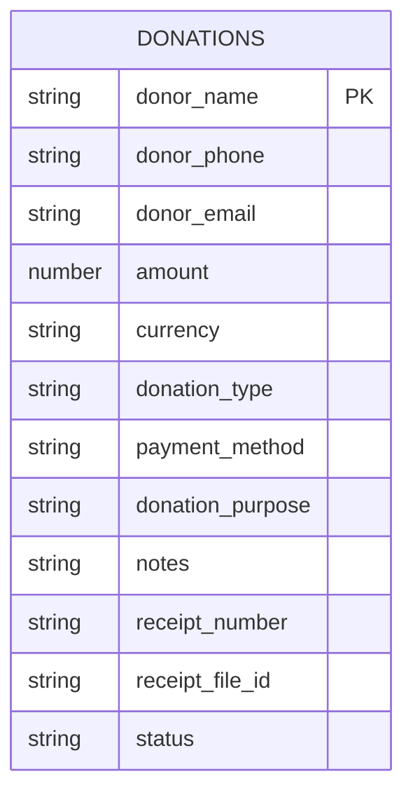
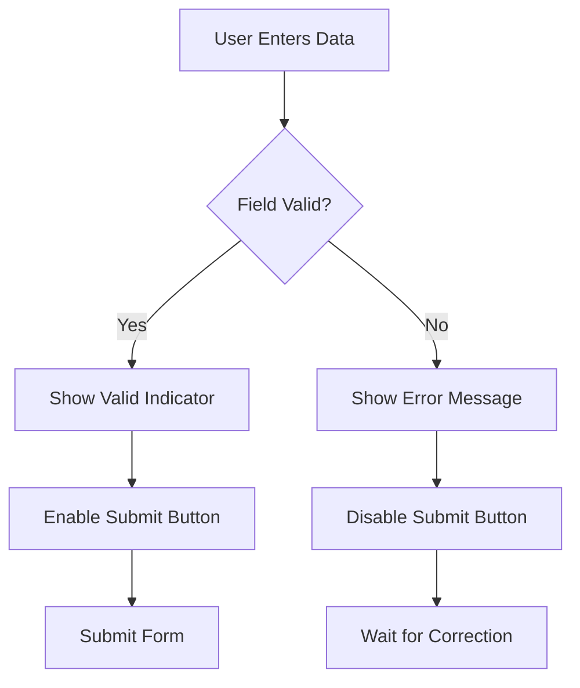
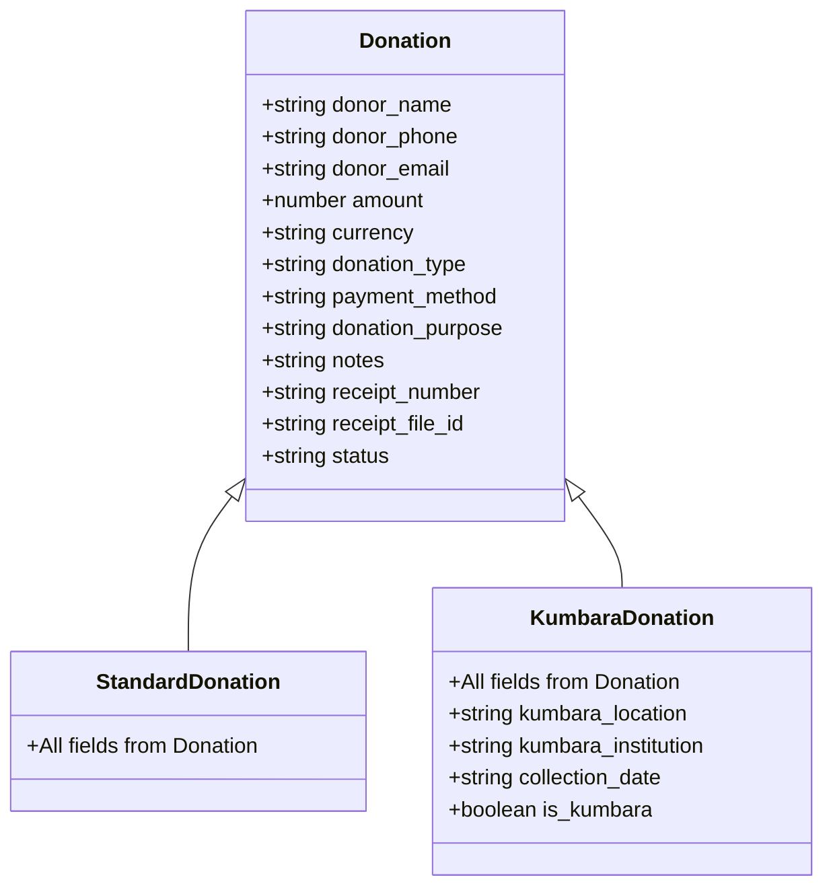

# Core Donation Fields

<cite>
**Referenced Files in This Document**   
- [schema.ts](file://convex/schema.ts)
- [database.ts](file://src/types/database.ts)
- [donations/route.ts](file://src/app/api/donations/route.ts)
- [kumbara/route.ts](file://src/app/api/kumbara/route.ts)
- [DonationForm.tsx](file://src/components/forms/DonationForm.tsx)
- [KumbaraForm.tsx](file://src/components/kumbara/KumbaraForm.tsx)
</cite>

## Table of Contents

1. [Introduction](#introduction)
2. [Core Donation Fields](#core-donation-fields)
3. [Field Validation and Business Logic](#field-validation-and-business-logic)
4. [Usage in Standard Donations and Kumbara Collections](#usage-in-standard-donations-and-kumbara-collections)
5. [Data Integrity and Required Fields](#data-integrity-and-required-fields)
6. [Conclusion](#conclusion)

## Introduction

This document provides comprehensive documentation for the core donation fields in the Kafkasder-panel application. These fields represent the fundamental data structure for all donation records, ensuring consistency across different donation types including standard donations and Kumbara (money box) collections. The documentation details each field's purpose, constraints, validation rules, and business logic, with examples from actual implementation. The core donation fields are designed to capture essential information about donors, donation amounts, payment methods, and transaction status, while maintaining data integrity and supporting reporting requirements.

**Section sources**

- [schema.ts](file://convex/schema.ts#L168-L216)
- [database.ts](file://src/types/database.ts#L149-L172)

## Core Donation Fields

The Kafkasder-panel application utilizes a standardized set of core fields for all donation records. These fields are defined in the Convex schema and TypeScript types, ensuring consistency across the application. The following fields are fundamental to every donation record:

### donor_name

**Purpose**: Stores the full name of the donor making the contribution.  
**Constraints**: Must be a string with a minimum length of 2 characters. This field is required for all donations.  
**Example**: "Ahmet Yılmaz"  
**Data Type**: string  
**Required**: Yes

### donor_phone

**Purpose**: Captures the donor's contact phone number for communication and verification purposes.  
**Constraints**: Must be a string with a minimum of 10 characters, following a valid phone number pattern. The application validates this field using a regular expression that accepts numbers, spaces, hyphens, plus signs, and parentheses.  
**Example**: "0555 123 45 67"  
**Data Type**: string  
**Required**: Yes

### donor_email

**Purpose**: Records the donor's email address for digital communication, receipts, and follow-up.  
**Constraints**: Optional field that must be a valid email format if provided. The application validates this using a standard email regular expression pattern.  
**Example**: "ahmet@example.com"  
**Data Type**: string (optional)  
**Required**: No

### amount

**Purpose**: Represents the monetary value of the donation.  
**Constraints**: Must be a positive number greater than zero. The application enforces this constraint during validation.  
**Example**: 1500.50  
**Data Type**: number  
**Required**: Yes

### currency

**Purpose**: Specifies the currency denomination of the donation.  
**Constraints**: Must be one of the supported currencies: 'TRY', 'USD', or 'EUR'. This field has a default value of 'TRY' if not specified.  
**Example**: "TRY"  
**Data Type**: 'TRY' | 'USD' | 'EUR'  
**Required**: Yes

### donation_type

**Purpose**: Categorizes the nature of the donation (e.g., zakat, fitra, general donation).  
**Constraints**: Must be a string with a minimum length of 2 characters. This field is required for all donations.  
**Example**: "Ramazan Bağışı"  
**Data Type**: string  
**Required**: Yes

### payment_method

**Purpose**: Indicates how the donation was made (e.g., cash, credit card, bank transfer).  
**Constraints**: Must be a string with a minimum length of 2 characters. This field is required for all donations.  
**Example**: "Nakit"  
**Data Type**: string  
**Required**: Yes

### donation_purpose

**Purpose**: Specifies the specific campaign or purpose for which the donation is intended.  
**Constraints**: Must be a string with a minimum length of 2 characters. This field is required for all donations.  
**Example**: "Eğitim Yardımı"  
**Data Type**: string  
**Required**: Yes

### notes

**Purpose**: Provides a free-text field for additional information or special instructions related to the donation.  
**Constraints**: Optional string field with no specific length requirements.  
**Example**: "Aileye özel teşekkür edilmiştir."  
**Data Type**: string (optional)  
**Required**: No

### receipt_number

**Purpose**: Stores the unique identifier for the donation receipt, used for tracking and reconciliation.  
**Constraints**: Must be a non-empty string. This field is required for all donations.  
**Example**: "MB2024001"  
**Data Type**: string  
**Required**: Yes

### receipt_file_id

**Purpose**: Contains the identifier for the stored digital receipt file (e.g., scanned document or PDF).  
**Constraints**: Optional string field that references a file stored in the application's file storage system.  
**Example**: "file_abc123xyz"  
**Data Type**: string (optional)  
**Required**: No

### status

**Purpose**: Tracks the current state of the donation transaction.  
**Constraints**: Must be one of the following values: 'pending', 'completed', or 'cancelled'. This field has a default value of 'pending' if not specified.  
**Example**: "completed"  
**Data Type**: 'pending' | 'completed' | 'cancelled'  
**Required**: Yes

**Section sources**

- [schema.ts](file://convex/schema.ts#L170-L192)
- [database.ts](file://src/types/database.ts#L150-L161)

## Field Validation and Business Logic

The application implements comprehensive validation rules and business logic to ensure data integrity and consistency across all donation records. These rules are enforced at multiple levels: schema definition, API endpoints, and form components.

### Schema-Level Validation

The Convex schema defines the structure and basic constraints for donation records. The schema enforces data types and required fields at the database level:

**Diagram sources**

- [schema.ts](file://convex/schema.ts#L168-L216)

### API-Level Validation

The application implements detailed validation logic in the API routes that handle donation creation and updates. The validation functions check for:

- **Required fields**: donor_name, donor_phone, amount, currency, donation_type, payment_method, donation_purpose, and receipt_number must be present and non-empty.
- **Data format**: donor_email must match a valid email pattern, and donor_phone must match a valid phone number pattern.
- **Value constraints**: amount must be positive, currency must be one of the supported values, and status must be one of the allowed states.
- **Default values**: If not provided, currency defaults to 'TRY' and status defaults to 'pending'.

The validation logic is implemented in both the standard donations API and the Kumbara-specific API, with additional validation for Kumbara-specific fields.

### Form-Level Validation

The frontend forms implement real-time validation to provide immediate feedback to users. The DonationForm component uses React Hook Form with Zod for schema validation, providing instant feedback as users fill out the form. The validation includes:

- Real-time field validation as users type
- Visual indicators for valid, invalid, and pending validation states
- Error messages displayed below each field
- Form submission disabled until all required fields are valid

**Diagram sources**

- [DonationForm.tsx](file://src/components/forms/DonationForm.tsx#L27-L40)
- [donations/route.ts](file://src/app/api/donations/route.ts#L14-L48)

**Section sources**

- [donations/route.ts](file://src/app/api/donations/route.ts#L14-L48)
- [kumbara/route.ts](file://src/app/api/kumbara/route.ts#L69-L158)
- [DonationForm.tsx](file://src/components/forms/DonationForm.tsx#L27-L40)

## Usage in Standard Donations and Kumbara Collections

The core donation fields are designed to be universally applicable across different donation types, particularly standard donations and Kumbara collections. This unified data model ensures consistency while accommodating the specific requirements of each donation type.

### Standard Donations

For standard donations, all core fields are used as defined. The DonationForm component provides a comprehensive interface for entering donation details, with all fields available for input. The form supports file upload for receipt documents and provides real-time validation for all required fields.

### Kumbara Collections

Kumbara collections extend the core donation model with additional fields while maintaining the same core structure. The KumbaraForm component uses the same core fields but with some differences:

- **Default values**: donation_type defaults to 'Kumbara' and donation_purpose defaults to 'Kumbara Bağışı'.
- **Additional validation**: The Kumbara-specific API validates additional fields like kumbara_location and kumbara_institution.
- **Special handling**: The system automatically sets is_kumbara to true for all Kumbara donations.
- **QR code generation**: After creating a Kumbara donation, the system generates a QR code that includes the donation details.

Despite these differences, the core donation fields remain consistent between standard donations and Kumbara collections, allowing for unified reporting and analysis.

**Diagram sources**

- [schema.ts](file://convex/schema.ts#L168-L216)
- [KumbaraForm.tsx](file://src/components/kumbara/KumbaraForm.tsx#L41-L82)
- [kumbara/route.ts](file://src/app/api/kumbara/route.ts#L140-L156)

**Section sources**

- [KumbaraForm.tsx](file://src/components/kumbara/KumbaraForm.tsx#L41-L82)
- [kumbara/route.ts](file://src/app/api/kumbara/route.ts#L140-L156)

## Data Integrity and Required Fields

The application enforces strict data integrity rules to ensure the reliability and consistency of donation records. These rules are implemented through a combination of schema definitions, API validation, and form-level constraints.

### Required Fields

The following fields are required for all donation records:

- donor_name
- donor_phone
- amount
- currency
- donation_type
- payment_method
- donation_purpose
- receipt_number
- status

These fields must have valid values before a donation record can be created. The application prevents submission of incomplete records through both client-side and server-side validation.

### Data Validation Rules

The application implements the following validation rules:

- **Length constraints**: Text fields have minimum length requirements (typically 2 characters) to prevent empty or meaningless entries.
- **Format validation**: Email and phone fields are validated against standard patterns to ensure they contain valid data.
- **Value constraints**: Numeric fields like amount must be positive, and enumerated fields like currency and status must have valid values from the allowed set.
- **Default values**: Fields like currency and status have default values to ensure consistency when not explicitly specified.

### Error Handling

When validation fails, the application provides detailed error messages to help users correct their input. The API returns specific error messages for each validation failure, which are displayed in the user interface. This approach helps maintain data quality while providing a good user experience.

**Section sources**

- [donations/route.ts](file://src/app/api/donations/route.ts#L21-L35)
- [kumbara/route.ts](file://src/app/api/kumbara/route.ts#L73-L92)
- [DonationForm.tsx](file://src/components/forms/DonationForm.tsx#L208-L270)

## Conclusion

The core donation fields in the Kafkasder-panel application provide a robust and consistent data model for capturing donation information. These fields are designed to be universally applicable across different donation types, ensuring data integrity and supporting comprehensive reporting. The implementation includes multiple layers of validation to maintain data quality, from schema definitions to API endpoints to user interface components. The unified approach to standard donations and Kumbara collections allows for consistent data management while accommodating the specific requirements of each donation type. This standardized data model supports the organization's mission by ensuring accurate, reliable, and actionable donation records.

**Section sources**

- [schema.ts](file://convex/schema.ts#L168-L216)
- [database.ts](file://src/types/database.ts#L149-L172)
- [donations/route.ts](file://src/app/api/donations/route.ts)
- [kumbara/route.ts](file://src/app/api/kumbara/route.ts)
