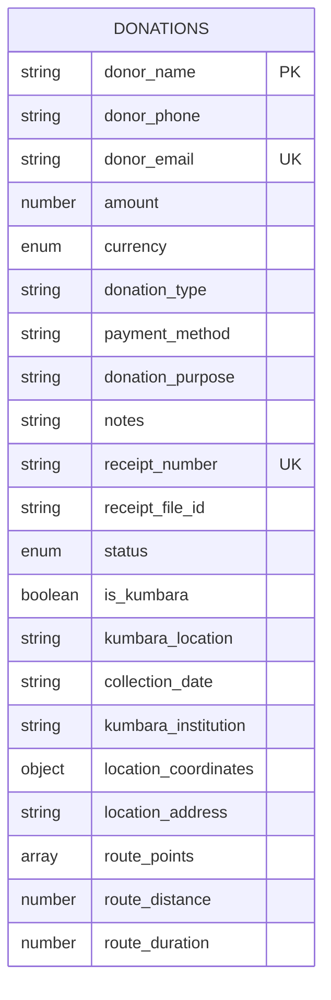
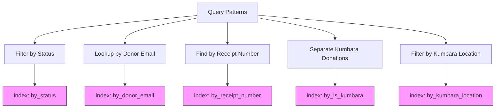
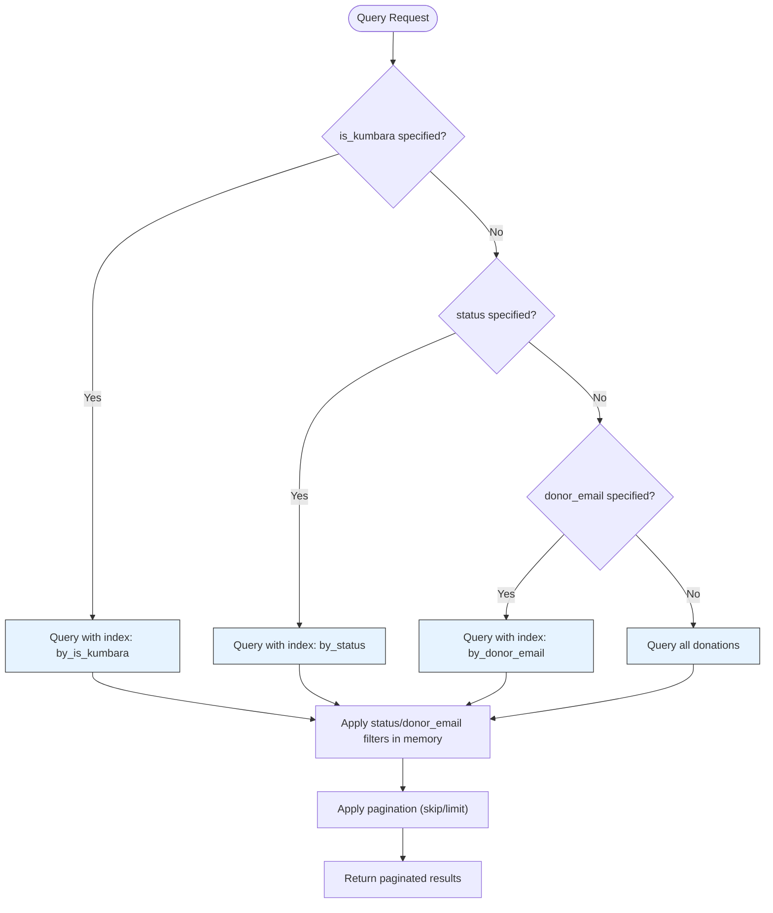

# Donations Data Model

<cite>
**Referenced Files in This Document**   
- [schema.ts](file://convex/schema.ts)
- [donations.ts](file://convex/donations.ts)
- [database.ts](file://src/types/database.ts)
- [route.ts](file://src/app/api/donations/route.ts)
</cite>

## Table of Contents

1. [Introduction](#introduction)
2. [Data Model Overview](#data-model-overview)
3. [Field Definitions](#field-definitions)
4. [Indexing Strategy](#indexing-strategy)
5. [Query Patterns and Complexity](#query-patterns-and-complexity)
6. [Performance Considerations](#performance-considerations)
7. [Best Practices](#best-practices)
8. [Conclusion](#conclusion)

## Introduction

The donations collection in the Kafkasder-panel application serves as a unified data store for both standard donations and Kumbara (money box) collections. This dual-purpose design allows the system to manage diverse donation types within a single table while maintaining flexibility through optional fields. The data model is implemented using Convex, a serverless database platform that provides real-time capabilities and seamless integration with the application.

The collection captures comprehensive information about each donation, including donor details, transaction metadata, and specific fields for Kumbara collections such as location coordinates and route points. This documentation provides a detailed analysis of the data model, its indexing strategy, query patterns, and performance considerations to guide developers and system administrators in effectively utilizing and optimizing this critical component of the application.

**Section sources**

- [schema.ts](file://convex/schema.ts#L168-L216)
- [donations.ts](file://convex/donations.ts#L77-L105)

## Data Model Overview

The donations collection is designed with a flexible schema that accommodates both standard donations and Kumbara collections. The model uses optional fields to handle the varying requirements between these donation types, avoiding the need for separate tables or complex inheritance patterns. This approach simplifies data management while maintaining data integrity through proper indexing and validation.

The collection is defined in the Convex schema with explicit field types and documentation comments that describe the purpose of each field. The schema includes both required fields that apply to all donations and optional fields specific to Kumbara collections. This design enables efficient querying and filtering while supporting the application's business requirements for tracking both immediate donations and periodic money box collections.

**Diagram sources**

- [schema.ts](file://convex/schema.ts#L168-L216)
- [database.ts](file://src/types/database.ts#L148-L171)

## Field Definitions

The donations collection contains a comprehensive set of fields that capture all necessary information for both standard donations and Kumbara collections. The fields are organized into logical groups based on their purpose and usage patterns.

### Donor Information

These fields capture essential information about the donor, enabling identification and communication:

- **donor_name**: The full name of the donor (required)
- **donor_phone**: Contact phone number for the donor (required)
- **donor_email**: Email address for the donor (optional)

### Donation Metadata

These fields provide context about the donation itself:

- **amount**: The monetary value of the donation (required)
- **currency**: The currency of the donation (TRY, USD, or EUR) (required)
- **donation_type**: The category of donation (e.g., 'zakat', 'fitra', 'general') (required)
- **payment_method**: How the donation was made (e.g., 'credit_card', 'bank_transfer') (required)
- **donation_purpose**: The specific campaign or purpose for the donation (required)
- **notes**: Additional information about the donation (optional)

### Transaction Details

These fields track the administrative aspects of the donation:

- **receipt_number**: Unique identifier for the transaction receipt (required)
- **receipt_file_id**: Reference to the stored receipt file in the system (optional)
- **status**: Current state of the donation (pending, completed, or cancelled) (required)

### Kumbara-Specific Fields

These optional fields are used exclusively for Kumbara (money box) collections:

- **is_kumbara**: Flag indicating if the donation originated from a money box (optional)
- **kumbara_location**: Physical location where the money box was placed or collected (optional)
- **collection_date**: Date when the money box was collected (optional)
- **kumbara_institution**: Organization or establishment where the money box is located (optional)
- **location_coordinates**: GPS coordinates (latitude and longitude) of the money box location (optional)
- **location_address**: Full address of the money box location (optional)
- **route_points**: Array of GPS coordinates defining the collection route (optional)
- **route_distance**: Total distance of the collection route in meters (optional)
- **route_duration**: Estimated duration of the collection route in seconds (optional)

**Section sources**

- [schema.ts](file://convex/schema.ts#L168-L216)
- [database.ts](file://src/types/database.ts#L148-L171)

## Indexing Strategy

The donations collection employs a strategic indexing approach to optimize query performance for common access patterns. Five indexes have been created to support efficient filtering and retrieval operations:

- **by_status**: Index on the status field to quickly retrieve donations by their current state (pending, completed, cancelled)
- **by_donor_email**: Index on the donor_email field to enable fast lookups by donor email address
- **by_receipt_number**: Index on the receipt_number field to support unique transaction identification and retrieval
- **by_is_kumbara**: Index on the is_kumbara boolean flag to efficiently separate standard donations from Kumbara collections
- **by_kumbara_location**: Index on the kumbara_location field to facilitate queries based on money box locations

The indexing strategy prioritizes the most common query patterns in the application. The by_status index supports workflow management by allowing quick identification of donations that require processing. The by_donor_email index enables donor-centric operations such as viewing a donor's donation history. The by_receipt_number index ensures transaction integrity by supporting unique receipt lookups. The Kumbara-specific indexes optimize operations related to money box management and route planning.

**Diagram sources**

- [schema.ts](file://convex/schema.ts#L212-L216)
- [donations.ts](file://convex/donations.ts#L1-L40)

## Query Patterns and Complexity

The application implements several query patterns to retrieve donation records, each with different performance characteristics and use cases. The primary query handler in the donations module follows a conditional approach based on the provided filter parameters.

When querying donations, the system first checks for the presence of the is_kumbara parameter. If specified, it uses the by_is_kumbara index to retrieve all donations of the requested type, then applies additional filters (status, donor_email) in memory. This approach optimizes for the common case where Kumbara donations need to be separated from standard donations.

For queries filtered by status, the system uses the by_status index to efficiently retrieve matching records. Similarly, queries by donor_email leverage the by_donor_email index for fast lookups. When no specific filters are provided, the system retrieves all donations, which can be resource-intensive for large datasets.

The query complexity varies significantly based on the filter combination:

- Single-field queries (status, donor_email, is_kumbara) have O(log n) complexity due to index usage
- Combined queries with is_kumbara as the primary filter have O(k + m) complexity, where k is the number of records matching the is_kumbara condition and m is the number of additional filters
- Unfiltered queries have O(n) complexity as they require scanning all records

The current implementation has a potential performance issue when combining multiple filters, as secondary filters are applied in memory after the primary indexed query. This could lead to increased memory usage and processing time for large result sets.

**Diagram sources**

- [donations.ts](file://convex/donations.ts#L14-L47)
- [route.ts](file://src/app/api/donations/route.ts#L54-L70)

## Performance Considerations

The donations collection presents several performance considerations that must be addressed to ensure optimal system operation as the dataset grows. The current implementation has both strengths and potential bottlenecks that require attention.

### Current Strengths

- **Efficient Single-Field Queries**: The indexing strategy provides excellent performance for queries filtering on a single field (status, donor_email, is_kumbara, receipt_number).
- **Memory-Efficient Pagination**: The implementation applies pagination after filtering, minimizing the amount of data transferred to clients.
- **Type Safety**: The TypeScript interfaces ensure data consistency and prevent runtime errors related to field access.

### Potential Bottlenecks

- **In-Memory Filtering**: When using is_kumbara as a primary filter, additional filters are applied in memory rather than through compound indexes, which could impact performance with large datasets.
- **Full Collection Scans**: Queries without filters retrieve all donations, which could become problematic as the collection grows.
- **Lack of Compound Indexes**: The absence of compound indexes (e.g., on is_kumbara + status) prevents optimal performance for common multi-field queries.

### Optimization Recommendations

1. **Implement Compound Indexes**: Create compound indexes for common filter combinations, particularly (is_kumbara, status) and (is_kumbara, donor_email), to eliminate in-memory filtering.
2. **Add Date-Based Indexing**: Implement indexing on creation time or collection date to support time-range queries, which are common for reporting purposes.
3. **Query Optimization**: Modify the query handler to use the most selective index first, rather than prioritizing is_kumbara, to minimize the initial result set size.
4. **Caching Strategy**: Implement server-side caching for frequently accessed queries, particularly for donor histories and Kumbara location statistics.
5. **Data Partitioning**: Consider partitioning the collection by is_kumbara if the performance difference between standard and Kumbara donations becomes significant.

**Section sources**

- [donations.ts](file://convex/donations.ts#L14-L47)
- [schema.ts](file://convex/schema.ts#L212-L216)

## Best Practices

To effectively work with the donations collection and avoid common pitfalls, follow these best practices:

### Querying Donations

- **Use Specific Filters**: Always include at least one indexed field in your queries to leverage the database indexes and avoid full collection scans.
- **Prioritize Indexed Fields**: When combining multiple filters, structure your queries to use the most selective indexed field first.
- **Limit Result Sets**: Use pagination parameters (limit, skip) to control the size of returned data, especially for unfiltered queries.
- **Leverage Unique Indexes**: Use the by_receipt_number index for transaction lookups to ensure data integrity and optimal performance.

### Creating and Updating Donations

- **Validate Kumbara Data**: When creating Kumbara donations, ensure all location and route data is complete and accurate.
- **Maintain Consistent Status Transitions**: Follow the defined status workflow (pending → completed/cancelled) to maintain data consistency.
- **Use Proper Currency Codes**: Always specify currency using the supported values (TRY, USD, EUR) to ensure compatibility with financial reporting.

### Working with Kumbara Collections

- **Complete Location Information**: Populate both kumbara_location and location_coordinates fields to support both human-readable and programmatic location access.
- **Accurate Route Data**: Ensure route_points, route_distance, and route_duration are updated together to maintain route integrity.
- **Regular Collection Date Updates**: Keep the collection_date field current to support accurate reporting and scheduling.

### Performance Optimization

- **Monitor Query Patterns**: Regularly review query performance and adjust indexes based on actual usage patterns.
- **Implement Caching**: Use appropriate caching strategies for frequently accessed donation data, particularly for reporting and dashboard displays.
- **Consider Data Archiving**: For very large datasets, consider archiving completed donations beyond a certain age to maintain optimal query performance.

**Section sources**

- [donations.ts](file://convex/donations.ts#L77-L105)
- [route.ts](file://src/app/api/donations/route.ts#L89-L128)

## Conclusion

The donations collection in the Kafkasder-panel application provides a flexible and comprehensive data model for managing both standard donations and Kumbara collections within a single table. The dual-purpose design effectively balances simplicity with functionality, allowing the system to handle diverse donation types without requiring complex schema changes.

The indexing strategy supports the most common query patterns, enabling efficient retrieval of donations by status, donor email, receipt number, and Kumbara status. However, the current implementation has opportunities for optimization, particularly in handling combined filters and preventing full collection scans.

By following the best practices outlined in this documentation and considering the recommended performance optimizations, developers can ensure the donations collection continues to perform efficiently as the application scales. The model's flexibility and comprehensive field set make it well-suited to support the organization's donation management needs both now and in the future.

**Section sources**

- [schema.ts](file://convex/schema.ts#L168-L216)
- [donations.ts](file://convex/donations.ts#L1-L149)
